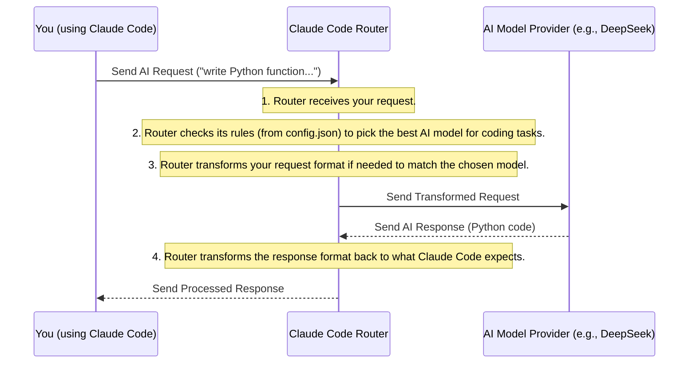

# Chapter 1: Claude Code Router (System Overview)

Welcome to the exciting world of `claude-code-router`! In this first chapter, we'll get a bird's-eye view of what this project is all about and why it's so useful. Don't worry if you're new to coding or AI; we'll explain everything in simple terms.

## Your Personal AI Travel Agent

Imagine you want to go on a trip. You could try to book every flight, hotel, and rental car yourself, directly with different companies. Or, you could hire a "travel agent" who knows all the best deals, can book across many airlines, and even handles currency exchange.

The `claude-code-router` is exactly like that **travel agent**, but for your AI requests!

### The Problem It Solves

When you use AI models like Claude, DeepSeek, Ollama, or others, they each have their own way of doing things. They might use different "languages" (API formats) or be better at certain tasks (like writing code, brainstorming, or handling long documents).

This can get complicated if you want to:
1.  **Switch between models:** Use a cheaper model for quick questions and a more powerful one for complex tasks.
2.  **Use models from different companies:** DeepSeek for some tasks, OpenRouter for others, and your local Ollama for background work.
3.  **Ensure compatibility:** Make sure your requests are formatted correctly for each specific AI model.

Trying to manage all of this directly can be a headache!

### Enter Claude Code Router

Instead of you talking directly to various AI models, you talk to the `claude-code-router`. It sits in the middle, acting as a **smart proxy** or **central hub** for all your AI requests.

Here's what it does, like a super-efficient travel agent:

*   **Smart Routing (Picking the Best Airline):** You tell the router your request, and it intelligently decides which AI model (or "airline") is best suited for that specific task. For example, it can send a simple background task to a smaller, cheaper local model and a complex problem-solving task to a powerful cloud model.
*   **Multi-Provider Support (Booking Across Many Airlines):** It knows how to communicate with many different AI model providers, such as OpenRouter, DeepSeek, Ollama, Gemini, and more. You don't have to worry about the details!
*   **Request/Response Transformation (Handling Your Luggage):** Different AI models might expect requests in slightly different formats or send responses back in unique ways. The router automatically translates your requests into the correct format for the chosen AI model and then translates the AI's response back into a format your application (like Claude Code) understands. This is like ensuring your "luggage" (request format) is compatible with different airlines.

## How You Use It (The Big Picture)

Using the Claude Code Router is surprisingly simple.

First, you install it on your computer:

```bash
npm install -g @musistudio/claude-code-router
```
This command adds the router to your system, just like installing any other program.

Next, you create a special configuration file (`~/.claude-code-router/config.json`). This file tells the router about your "airlines" (AI model providers) and your "travel rules" (which model to use for different types of requests). We'll cover this file in detail in the next chapter.

Finally, when you want to use Claude Code with the router, you simply start it like this:

```bash
ccr code
```

When you run `ccr code`, the router starts a small local server that Claude Code talks to. So, instead of Claude Code trying to reach Anthropic's servers directly, it sends all its requests to your local `claude-code-router`. The router then takes over, applying its smart routing and transformation magic!

## What Happens Under the Hood?

Let's trace what happens when you make an AI request through the router.

Imagine you're using Claude Code and ask it to "write a Python function to sort a list."

Here's the journey your request takes:



As you can see, the `Claude Code Router` is always in the middle, making sure your request goes to the right place and in the right format.

### A Peek at the Code

So, how does the router manage to sit in the middle and do all these clever things? It runs a small web server on your computer that listens for requests.

Let's look at a simplified snippet from the `src/index.ts` file, which is where the router starts up:

```typescript
// From src/index.ts (simplified for clarity)
import { createServer } from "./server"; // This sets up the web server
import { router } from "./utils/router"; // This contains the logic for choosing models
import { apiKeyAuth } from "./middleware/auth"; // For security, if you set an API key

async function run() {
  // ... (setup and configuration code) ...

  const server = createServer({
    // ... server configuration details ...
  });

  // This line adds a security check that happens BEFORE requests are processed
  server.addHook("preHandler", apiKeyAuth(config));

  // This is where the magic happens!
  // It tells the server to run our 'router' logic for every incoming request.
  server.addHook("preHandler", async (req, reply) =>
    router(req, reply, config) // The 'router' function decides where to send the AI request
  );

  server.start(); // Start listening for AI requests on a specific port!
}
```

In this code:
*   `createServer` gets the web server ready to accept incoming AI requests.
*   `server.addHook("preHandler", ...)` means "before handling each incoming AI request, do these extra steps."
*   `apiKeyAuth` is an optional security step.
*   The second `server.addHook` calls our main `router` function. This `router` function is the brain that decides which AI model to use and how to format the requests and responses.

This setup, powered by `express` (as mentioned in `CLAUDE.md`), allows the router to intercept all AI requests from Claude Code and manage them according to your preferences.

## Conclusion

In this chapter, we've learned that the `claude-code-router` acts as your personal "AI travel agent." It simplifies using various AI models by intelligently routing your requests, supporting different providers, and transforming data formats—all from a central hub. You send your AI requests to the router, and it handles the complexities of choosing the right model and ensuring compatibility.

In the [Next Chapter: Router Configuration](02_router_configuration_.md), we'll dive into how you tell this "travel agent" *what rules to follow* – how to configure the router to work exactly as you need!

---

<sub><sup>Generated by [AI Codebase Knowledge Builder](https://github.com/The-Pocket/Tutorial-Codebase-Knowledge).</sup></sub> <sub><sup>**References**: [[1]](https://github.com/musistudio/claude-code-router/blob/2fc79dcf377ade7c4fc8883c94a6779fce830a5a/CLAUDE.md), [[2]](https://github.com/musistudio/claude-code-router/blob/2fc79dcf377ade7c4fc8883c94a6779fce830a5a/README.md), [[3]](https://github.com/musistudio/claude-code-router/blob/2fc79dcf377ade7c4fc8883c94a6779fce830a5a/README_zh.md), [[4]](https://github.com/musistudio/claude-code-router/blob/2fc79dcf377ade7c4fc8883c94a6779fce830a5a/blog/en/project-motivation-and-how-it-works.md), [[5]](https://github.com/musistudio/claude-code-router/blob/2fc79dcf377ade7c4fc8883c94a6779fce830a5a/blog/zh/项目初衷及原理.md), [[6]](https://github.com/musistudio/claude-code-router/blob/2fc79dcf377ade7c4fc8883c94a6779fce830a5a/src/index.ts)</sup></sub>
````