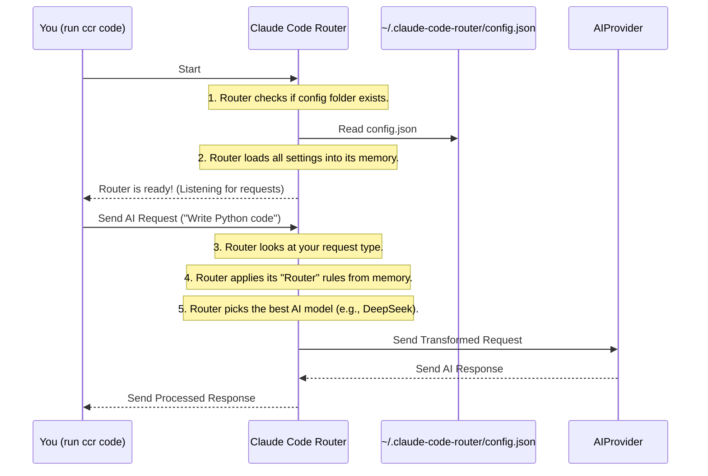

# Chapter 2: Router Configuration

Welcome back! In [Chapter 1: Claude Code Router (System Overview)](01_claude_code_router__system_overview__.md), we learned that the `claude-code-router` acts like your personal AI travel agent, helping you manage requests to different AI models. But how does this travel agent know *your preferences*? How does it know which AI models you have, their secret keys, and when to use a powerful model versus a cheaper, local one?

This is where **Router Configuration** comes in!

## Your Router's "Master Plan"

Imagine you're preparing for a trip and want to give very specific instructions to your travel agent:
*   "For short, quick trips, use the budget airline."
*   "For long, complex international journeys, use the premium airline."
*   "Here are my loyalty program numbers for each airline."

The `claude-code-router` needs similar instructions, and it gets them from a special file called `config.json`. This `config.json` file is the router's "master plan" or "settings file." It tells the router everything it needs to know to do its job.

The goal of this chapter is to help you understand and set up this `config.json` file to make the router work just how you want!

### Where is the `config.json` file?

This important file lives in a hidden folder inside your computer's home directory. It's usually found at:

`~/.claude-code-router/config.json`

*   The `~` (tilde) symbol is a shortcut for your home directory (e.g., `/Users/yourusername` on macOS/Linux, or `C:\Users\yourusername` on Windows).
*   `.claude-code-router` is a hidden folder where the router keeps its settings.

If you've installed the router and run `ccr code` for the first time, it might even help you create a basic version of this file.

## Inside the Master Plan: What's in `config.json`?

The `config.json` file is written in a format called **JSON** (JavaScript Object Notation). It's a way of organizing information using curly braces `{}` for "objects" (like categories) and square brackets `[]` for "lists" of things.

Let's look at the main parts you'll find in this file:

### 1. General Settings (The Basics)

At the top, you might see some general settings for the router itself:

```json
{
  "APIKEY": "your-secret-key",
  "PROXY_URL": "http://127.0.0.1:7890",
  "LOG": true,
  "HOST": "0.0.0.0",
  "Providers": [
    // ... more settings here ...
  ],
  "Router": {
    // ... more settings here ...
  }
}
```

*   **`APIKEY` (Optional):** This is like setting a password for your router. If you set it, any program (like Claude Code) talking to your router must provide this secret key to prove it's allowed. If you don't set it, the router will only listen for requests from your own computer (`127.0.0.1`) for security.
*   **`PROXY_URL` (Optional):** If you use a proxy server to access the internet, you can tell the router to use it here.
*   **`LOG` (Optional):** Setting this to `true` tells the router to save a log of its activities in a file (`$HOME/.claude-code-router.log`). This is useful for troubleshooting!
*   **`HOST` (Optional):** This decides which network address the router listens on. Usually, `127.0.0.1` (your computer only) is fine. Setting it to `0.0.0.0` means it will listen on all network interfaces, which can be useful for advanced setups but also less secure if `APIKEY` is not set.

### 2. `Providers`: Your List of AI Models (The Airlines)

This is a very important section. The `Providers` section is a **list** (that's why it uses `[]`) of all the different AI model "airlines" you want your router to know about. For each airline (or provider), you need to give the router its details.

Here's an example of how you might set up three different AI model providers:

```json
{
  "Providers": [
    {
      "name": "deepseek",
      "api_base_url": "https://api.deepseek.com/chat/completions",
      "api_key": "sk-...",
      "models": ["deepseek-chat", "deepseek-reasoner"]
    },
    {
      "name": "ollama",
      "api_base_url": "http://localhost:11434/v1/chat/completions",
      "api_key": "ollama",
      "models": ["llama2", "phi3"]
    },
    {
      "name": "openrouter",
      "api_base_url": "https://openrouter.ai/api/v1/chat/completions",
      "api_key": "sk-or-...",
      "models": ["google/gemini-pro", "anthropic/claude-3-haiku"]
    }
  ],
  "Router": { /* ... */ }
}
```

Let's break down one of these `Provider` entries:

*   **`name`**: A simple name you choose for this provider (e.g., "deepseek", "ollama", "openrouter"). This is how you'll refer to it later in your routing rules.
*   **`api_base_url`**: The specific web address (URL) where the router should send requests for this AI model provider. Each provider has its own unique URL.
*   **`api_key`**: Your secret key (or token) that grants you access to use models from this provider. **Keep this secret!**
*   **`models`**: A list of the specific model names available from *this provider*. For example, DeepSeek offers `deepseek-chat` and `deepseek-reasoner`. Ollama lets you run local models like `llama2` or `phi3`. OpenRouter offers many models, including `google/gemini-pro`.

You can add as many `Provider` entries as you like, one for each AI service you want to use!

(There's also an optional `transformer` setting for `Providers`, which helps the router "translate" requests for different models. We'll dive into that in [Chapter 4: Model Providers & Transformers](04_model_providers___transformers__.md).)

### 3. `Router`: Your Travel Rules (The Traffic Cop)

Now that the router knows *which* AI models you have, it needs to know *when to use which one*. This is handled by the `Router` section, which acts like a traffic cop directing your AI requests.

This section uses special keywords to define rules for different types of tasks:

```json
{
  "Providers": [ /* ... */ ],
  "Router": {
    "default": "deepseek,deepseek-chat",
    "background": "ollama,llama2",
    "think": "deepseek,deepseek-reasoner",
    "longContext": "openrouter,google/gemini-pro"
  }
}
```

Each rule in the `Router` section specifies a **provider name** and a **model name**, separated by a comma (`,`). For example, `"deepseek,deepseek-chat"` means "use the `deepseek` provider, and specifically their `deepseek-chat` model."

Here are the common rules you can set:

*   **`default`**: This is the model the router will use for most general requests if no other specific rule applies.
*   **`background`**: You might use this for less urgent or simpler tasks, perhaps routing them to a smaller, cheaper local model (like one running on Ollama) to save costs.
*   **`think`**: For tasks that require more "brainpower" or complex reasoning (like Claude Code's "Plan Mode"), you might want to use a more powerful model here.
*   **`longContext`**: If you have very long conversations or documents, you'll need an AI model that can handle a lot of text (a "long context window"). This rule lets you send those specific requests to a model designed for it.

These rules allow `claude-code-router` to intelligently pick the right AI model for the job, based on the *type* of request coming from Claude Code. We'll explore how these rules are used dynamically in [Chapter 3: Dynamic Request Routing Logic](03_dynamic_request_routing_logic_.md).

## Putting it Together: A Practical Example

Let's revisit our central use case:
"I want to use DeepSeek for general tasks, Ollama for background tasks, and OpenRouter for 'long context' tasks."

Based on what we've learned, here's how your `~/.claude-code-router/config.json` file would look to achieve this:

```json
{
  "APIKEY": "your-secret-router-key", // Remember to keep this secret!
  "LOG": true,
  "Providers": [
    {
      "name": "deepseek",
      "api_base_url": "https://api.deepseek.com/chat/completions",
      "api_key": "sk-YOUR_DEEPSEEK_API_KEY",
      "models": ["deepseek-chat", "deepseek-reasoner"]
    },
    {
      "name": "ollama",
      "api_base_url": "http://localhost:11434/v1/chat/completions",
      "api_key": "ollama", // Ollama often uses a placeholder key
      "models": ["llama2", "phi3"] // Make sure you have these models pulled in Ollama
    },
    {
      "name": "openrouter",
      "api_base_url": "https://openrouter.ai/api/v1/chat/completions",
      "api_key": "sk-or-YOUR_OPENROUTER_API_KEY",
      "models": ["google/gemini-pro", "anthropic/claude-3-haiku"]
    }
  ],
  "Router": {
    "default": "deepseek,deepseek-chat",      // General tasks go to DeepSeek Chat
    "background": "ollama,llama2",          // Background tasks go to local Ollama Llama2
    "think": "deepseek,deepseek-reasoner",  // Complex thinking goes to DeepSeek Reasoner
    "longContext": "openrouter,google/gemini-pro" // Long conversations go to OpenRouter's Gemini Pro
  }
}
```

**Important:** Remember to replace placeholder API keys like `sk-YOUR_DEEPSEEK_API_KEY` with your actual, secret keys from those providers!

Once you save this `config.json` file, the next time you start the router with `ccr code`, it will load these settings and use them to direct your AI requests. For example:

*   If you ask Claude Code a quick question, the router sends it to `deepseek-chat`.
*   If Claude Code initiates a "plan" or complex thinking process, the router routes it to `deepseek-reasoner`.
*   If you have a large file for Claude Code to summarize in the background, the router might send it to `ollama,llama2`.

You can even switch models on the fly within Claude Code using a special command: `/model provider_name,model_name`. For example, `/model openrouter,anthropic/claude-3-haiku` would tell Claude Code to temporarily use that specific model through the router.

## Under the Hood: How the Router Reads Your Plan

How does the router actually use this `config.json` file? Let's take a quick peek at what happens inside.

### The Router's Setup Process

When you run `ccr code`, the `claude-code-router` performs a few important steps:



1.  **Setting up the folder:** The router first makes sure the `~/.claude-code-router` folder exists. If not, it creates it.
2.  **Reading the plan:** It then reads your `config.json` file. If the file doesn't exist yet, the router might ask you some questions (like your API key) to create a basic one for you automatically.
3.  **Loading into memory:** All the settings from `config.json` (your providers, API keys, and routing rules) are loaded into the router's active memory. This means it doesn't need to read the file every time a request comes in, making it very fast!
4.  **Ready to serve:** Once loaded, the router is ready to receive and process your AI requests based on your "master plan."

### Simplified Code Snippets

Let's look at tiny, simplified pieces of code that handle this in the `claude-code-router` project.

First, to make sure the folder exists and to read the configuration:

```typescript
// From src/utils/index.ts (simplified for clarity)
import fs from "node:fs/promises";
import { HOME_DIR, CONFIG_FILE, DEFAULT_CONFIG } from "../constants";

// This function makes sure the ~/.claude-code-router folder is there
const ensureDir = async (dir_path: string) => {
  try {
    await fs.access(dir_path); // Try to see if it exists
  } catch {
    await fs.mkdir(dir_path, { recursive: true }); // If not, create it!
  }
};

// This function reads your config.json file
export const readConfigFile = async () => {
  try {
    const config = await fs.readFile(CONFIG_FILE, "utf-8"); // Read the file
    return JSON.parse(config); // Turn the text into a JavaScript object
  } catch {
    // If config.json doesn't exist, create a default one (simplified)
    const defaultConfig = {
      // ... basic settings like a default provider/model ...
    };
    await fs.writeFile(CONFIG_FILE, JSON.stringify(defaultConfig, null, 2));
    return defaultConfig;
  }
};

// This function puts it all together when the router starts
export const initConfig = async () => {
  await ensureDir(HOME_DIR); // Make sure the folder exists
  const config = await readConfigFile(); // Read the config file
  // Now, the 'config' object holds all your settings for the router to use!
  return config;
};
```

When the router starts (in `src/index.ts`), it calls `initConfig()` to get all your settings:

```typescript
// From src/index.ts (simplified for clarity)
import { initConfig } from "./utils"; // Our helper to get config
import { createServer } from "./server"; // Sets up the web server
import { router } from "./utils/router"; // The "brain" that uses the config

async function run() {
  const config = await initConfig(); // Load your router's "master plan"

  const server = createServer({
    // ... server setup uses parts of the 'config' ...
  });

  // This line tells the server: "For every incoming AI request,
  // pass it to the 'router' function, and give it the 'config' too!"
  server.addHook("preHandler", async (req, reply) =>
    router(req, reply, config)
  );

  server.start(); // Start listening for AI requests!
}
```

As you can see, the `config` object, which contains all your settings from `config.json`, is passed directly to the `router` function. This `router` function (the "brain") then uses these settings to intelligently decide which AI model to use for each request.

## Conclusion

In this chapter, we've explored the `config.json` file, the "master plan" that tells your `claude-code-router` how to behave. You've learned about its key sections: general settings, `Providers` (your AI model "airlines" with their details), and `Router` (your "travel rules" for different types of tasks). By customizing this file, you gain powerful control over which AI models are used for various purposes.

In the [Next Chapter: Dynamic Request Routing Logic](03_dynamic_request_routing_logic_.md), we'll dive deeper into how the router actively uses these rules to make smart decisions for every incoming AI request!

---

<sub><sup>Generated by [AI Codebase Knowledge Builder](https://github.com/The-Pocket/Tutorial-Codebase-Knowledge).</sup></sub> <sub><sup>**References**: [[1]](https://github.com/musistudio/claude-code-router/blob/2fc79dcf377ade7c4fc8883c94a6779fce830a5a/README.md), [[2]](https://github.com/musistudio/claude-code-router/blob/2fc79dcf377ade7c4fc8883c94a6779fce830a5a/README_zh.md), [[3]](https://github.com/musistudio/claude-code-router/blob/2fc79dcf377ade7c4fc8883c94a6779fce830a5a/src/constants.ts), [[4]](https://github.com/musistudio/claude-code-router/blob/2fc79dcf377ade7c4fc8883c94a6779fce830a5a/src/index.ts), [[5]](https://github.com/musistudio/claude-code-router/blob/2fc79dcf377ade7c4fc8883c94a6779fce830a5a/src/utils/index.ts)</sup></sub>
````