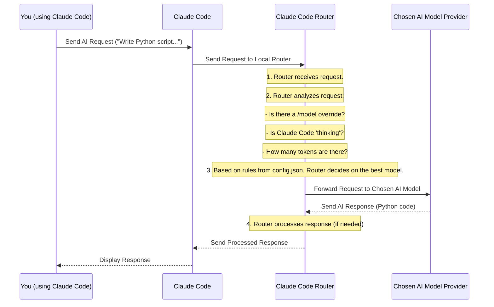

# Chapter 3: Dynamic Request Routing Logic

Welcome back, AI adventurer! In [Chapter 2: Router Configuration](02_router_configuration_.md), we laid out the "master plan" for our `claude-code-router` in the `config.json` file. We told it *which* AI models we have and *what general rules* to follow for different types of tasks (like `default`, `background`, `think`, `longContext`).

But how does the router actually *use* those rules? When a new request from Claude Code arrives, how does it dynamically decide which specific AI model to pick from your carefully configured list? This is where **Dynamic Request Routing Logic** comes into play!

## Your AI Traffic Controller

Imagine the `claude-code-router` as a very smart **traffic controller** for your AI requests. Every time Claude Code sends out an AI request, it's like a car arriving at a busy intersection. The router's job is to quickly look at the "car" (the request) and decide which "road" (AI model and provider) it should take to reach its destination efficiently.

### The Problem It Solves

Without this dynamic routing logic, your `claude-code-router` would just be a simple forwarder. You'd have to manually change settings every time you wanted to use a different model for a different task, which is exactly what we wanted to avoid!

This chapter will show you how the router's internal "brain" quickly examines incoming requests and applies your `config.json` rules to route them to the best possible AI model.

## How the Router Makes Decisions

When a request comes in from Claude Code, the routing logic performs a series of quick checks, like a detective gathering clues:

1.  **Is there a special command? (`/model`)**: The router first checks if you've explicitly told it which model to use directly in Claude Code, using a command like `/model openrouter,anthropic/claude-3.5-sonnet`. If so, this command *overrides* all other rules. It's like telling the traffic controller, "I want to go *this specific way*, ignore your usual rules!"
2.  **What's the *type* of request?**: Claude Code often sends hints about what kind of task it's doing.
    *   Is it a `thinking` request (e.g., Claude Code planning its next steps)?
    *   Is it a `claude-3-5-haiku` request (which the router might be configured to treat as a background task)?
3.  **How much "stuff" is in the request? (Token Count)**: The router quickly counts the "tokens" (think of them as words or pieces of words) in your request. If the request is very long (like a big document), it might need a special model that can handle "long context."
4.  **What's the default?**: If none of the above conditions are met, the router simply uses the `default` model you set in your `config.json`.

Let's look at how these checks relate to your `config.json` file.

### Your Routing Rules in Action

Recall the `Router` section from your `config.json`:

```json
{
  "Router": {
    "default": "deepseek,deepseek-chat",
    "background": "ollama,llama2",
    "think": "deepseek,deepseek-reasoner",
    "longContext": "openrouter,google/gemini-pro"
  }
}
```

Here's how the router uses these rules dynamically for different scenarios:

| Scenario                                | Router's Decision Process                                                                                                              | Example Model Chosen (from above config) |
| :-------------------------------------- | :------------------------------------------------------------------------------------------------------------------------------------- | :--------------------------------------- |
| **You use `/model` command**            | "User explicitly asked for this model, I'll use it directly." (Highest priority)                                                       | `openrouter,anthropic/claude-3-haiku`    |
| **Claude Code is 'thinking'**           | "This is a complex thinking task, use the `think` model." (Check for `thinking` flag in request)                                         | `deepseek,deepseek-reasoner`             |
| **Request has many tokens**             | "This request is very long, use the `longContext` model." (Check `tokenCount` against a threshold, e.g., 60,000 tokens)                 | `openrouter,google/gemini-pro`           |
| **Request is `claude-3-5-haiku` model** | "This model is often for lighter, background tasks, use the `background` model." (Checks model name if configured to be a background task) | `ollama,llama2`                          |
| **Any other request**                   | "No special conditions, use the `default` model." (Lowest priority, catches everything else)                                           | `deepseek,deepseek-chat`                 |

This priority system ensures that specific, important requests (like `/model` or `thinking`) get the dedicated models you've assigned, while general tasks fall back to your default.

## Under the Hood: The Router's Brain at Work

Let's trace a typical AI request through the `claude-code-router` to see its dynamic routing logic in action.

### The Request's Journey

When you type a prompt into Claude Code (e.g., "Write a Python script for me."), here's what generally happens:



As you can see, the `Claude Code Router` is at the heart of this decision-making process. It doesn't just blindly forward requests; it intelligently routes them based on the rules you've set up!

### A Closer Look at the Code

The core of this dynamic routing logic lives within the `src/utils/router.ts` file. This file contains the "brain" that analyzes your request and picks the right model.

Let's simplify the key function that makes this decision, `getUseModel`:

```typescript
// From src/utils/router.ts (simplified for clarity)

// This function decides which AI model to use based on the request and your config
const getUseModel = (req: any, tokenCount: number, config: any) => {
  // First, check if the user specified a model directly with a command (e.g., /model)
  if (req.body.model.includes(",")) {
    return req.body.model; // If it contains a comma, it's a direct command like "provider,model"
  }

  // Second, check for long context requests (if many tokens)
  if (tokenCount > 1000 * 60 && config.Router.longContext) {
    // 1000 * 60 is a placeholder for 60,000 tokens
    return config.Router.longContext; // Use the model configured for long contexts
  }

  // Third, check if the request is for a specific model treated as background
  if (req.body.model?.startsWith("claude-3-5-haiku") && config.Router.background) {
    return config.Router.background; // Use the background model
  }

  // Fourth, check if Claude Code is in a 'thinking' phase
  if (req.body.thinking && config.Router.think) {
    return config.Router.think; // Use the model configured for thinking
  }

  // Finally, if no special conditions apply, use the default model
  return config.Router!.default;
};
```

This `getUseModel` function gets three important pieces of information:
*   `req`: The incoming request from Claude Code.
*   `tokenCount`: The number of tokens in the request (calculated by another part of the router).
*   `config`: Your loaded `config.json` file, which contains all your `Router` rules.

It then goes through the rules in order of priority: explicit `/model` commands, then `longContext`, `background` (for specific models), `think`, and finally `default`. Whichever rule matches first, that's the model it chooses!

And where does this `getUseModel` function get called? It's used by the main `router` function, which is the entry point for every incoming AI request:

```typescript
// From src/utils/router.ts (simplified for clarity)
import { get_encoding } from "tiktoken"; // A library to count tokens

const enc = get_encoding("cl100k_base"); // Initialize token counter for Claude models

export const router = async (req: any, res: any, config: any) => {
  // ... (code to extract messages, system prompts, tools from req.body) ...

  let tokenCount = 0;
  // This part calculates the tokenCount from the request content
  // Example: tokenCount += enc.encode(message.content).length;
  // ... (more code to calculate tokenCount from different parts of the request) ...

  try {
    // Now, call our decision-making function!
    const model = getUseModel(req, tokenCount, config);

    // IMPORTANT: We modify the original request body
    // to include the *chosen* model for forwarding.
    req.body.model = model;

  } catch (error: any) {
    // If anything goes wrong, fall back to the default model
    req.body.model = config.Router!.default;
  }
  return; // The request is now ready to be sent to the chosen AI provider
};
```

This `router` function is what the `claude-code-router` calls for *every single incoming request*. It first calculates the `tokenCount` (which is important for the `longContext` rule), and then it passes all the necessary information to `getUseModel` to make the routing decision. Once `getUseModel` returns the chosen `provider,model` string, the `router` function updates `req.body.model` so that when the request is actually sent to the external AI provider, it uses the correct, intelligently selected model!

## Conclusion

You've now seen how the `claude-code-router` acts as a sophisticated AI traffic controller, dynamically routing your requests based on their content, type, and your predefined rules in `config.json`. This powerful logic allows you to effortlessly use different AI models for different tasks without manual intervention, making your AI workflow much more efficient and cost-effective.

In the [Next Chapter: Model Providers & Transformers](04_model_providers___transformers_.md), we'll go even deeper into how the router communicates with various AI model providers and how it "transforms" requests and responses to ensure everything speaks the same language!

---

<sub><sup>Generated by [AI Codebase Knowledge Builder](https://github.com/The-Pocket/Tutorial-Codebase-Knowledge).</sup></sub> <sub><sup>**References**: [[1]](https://github.com/musistudio/claude-code-router/blob/2fc79dcf377ade7c4fc8883c94a6779fce830a5a/README.md), [[2]](https://github.com/musistudio/claude-code-router/blob/2fc79dcf377ade7c4fc8883c94a6779fce830a5a/README_zh.md), [[3]](https://github.com/musistudio/claude-code-router/blob/2fc79dcf377ade7c4fc8883c94a6779fce830a5a/src/index.ts), [[4]](https://github.com/musistudio/claude-code-router/blob/2fc79dcf377ade7c4fc8883c94a6779fce830a5a/src/utils/router.ts)</sup></sub>