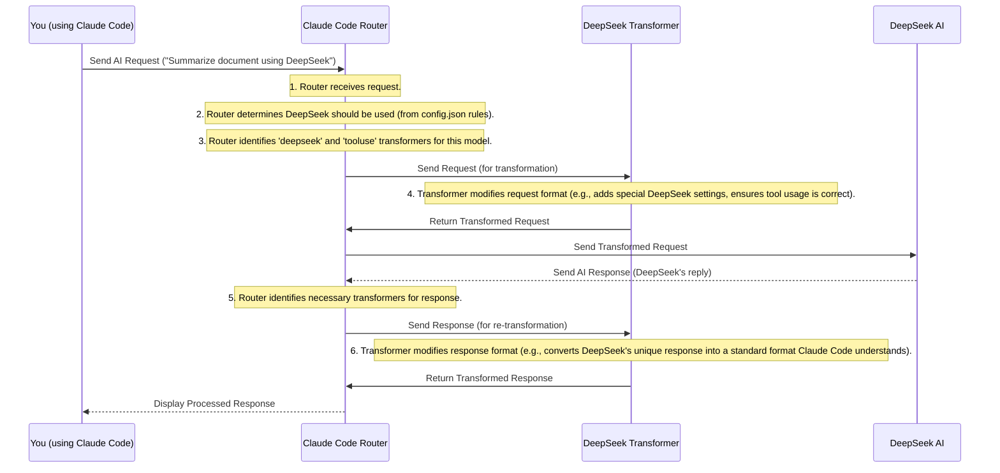

# Chapter 4: Model Providers & Transformers

Welcome back! In [Chapter 3: Dynamic Request Routing Logic](03_dynamic_request_routing_logic_.md), we learned how your `claude-code-router` intelligently decides *which* AI model to use for each request, acting like a smart traffic controller. But once the router picks a destination (an AI model), how does it actually *talk* to that model? What if different AI companies speak different "languages"?

This is where **Model Providers** and **Transformers** come in. They are crucial for `claude-code-router` to smoothly communicate with various AI services.

## Your AI's "Universal Translator"

Imagine you're a world traveler, and you want to talk to people from different countries. Each country speaks a different language. You could learn all of them, or you could hire a **universal translator** who can understand what you say and translate it for the local people, and then translate their replies back to you.

In the world of AI, **Model Providers** are like those different countries or "AI companies" (e.g., OpenRouter, DeepSeek, Ollama). Each one offers various large language models, but they often have slightly different ways of understanding your requests (their "API requirements" or "language").

**Transformers** are like your **universal translators**. They are small, clever tools inside the `claude-code-router` that sit between your request and the AI provider. Their job is to modify your requests (and the AI's responses) to ensure they speak the correct "language" for that specific provider. This handles subtle differences, like how to ask for tools, or how to set maximum token limits, ensuring everything works perfectly.

### The Problem It Solves

Even though many AI providers *say* they use a similar "language" (like the OpenAI API format), they often have tiny, important differences. If `claude-code-router` didn't have transformers, it would be like trying to talk to someone using the wrong dialect – sometimes it works, sometimes it causes misunderstandings or just breaks!

Transformers solve this by acting as adaptors, making sure your `claude-code-router` can talk to *any* supported AI provider without you needing to worry about their specific quirks.

## Model Providers in Your Configuration

You've already seen **Model Providers** briefly in [Chapter 2: Router Configuration](02_router_configuration_.md). They are defined in the `Providers` section of your `config.json` file. Each provider entry tells the router about an AI company you want to use.

Here's a reminder of a `Provider` entry:

```json
{
  "name": "deepseek",
  "api_base_url": "https://api.deepseek.com/chat/completions",
  "api_key": "sk-...",
  "models": ["deepseek-chat", "deepseek-reasoner"]
}
```

This tells the router:
*   You're setting up a provider named "deepseek".
*   Its main communication address is `https://api.deepseek.com/chat/completions`.
*   Here's your secret `api_key` for DeepSeek.
*   These are the `models` you can use from DeepSeek.

## Introducing Transformers

Now, let's add the "universal translators" to our `Provider` setup. This is done using the optional `"transformer"` field within a provider's configuration.

The `transformer` field tells the `claude-code-router` which "translators" to use for a specific AI provider or even a specific model from that provider.

There are two main ways to use transformers:

1.  **Global Transformer**: Applies to *all* models from a provider.
2.  **Model-Specific Transformer**: Applies only to a *particular* model from a provider.

Let's look at an example from `config.json` (as seen in `README.md`):

```json
{
  "Providers": [
    {
      "name": "openrouter",
      "api_base_url": "https://openrouter.ai/api/v1/chat/completions",
      "api_key": "sk-xxx",
      "models": ["google/gemini-2.5-pro-preview"],
      "transformer": { "use": ["openrouter"] } // Global transformer
    },
    {
      "name": "deepseek",
      "api_base_url": "https://api.deepseek.com/chat/completions",
      "api_key": "sk-xxx",
      "models": ["deepseek-chat", "deepseek-reasoner"],
      "transformer": {
        "use": ["deepseek"],                  // Global transformer for DeepSeek
        "deepseek-chat": { "use": ["tooluse"] } // Model-specific transformer for deepseek-chat
      }
    }
  ]
}
```

In this example:
*   For the `openrouter` provider, the `openrouter` transformer is used. This transformer knows the specific language requirements for OpenRouter, handling things like `cache_control` parameters.
*   For the `deepseek` provider, the `deepseek` transformer is always used. This handles DeepSeek's general language.
*   Additionally, for the `deepseek-chat` model (and *only* for `deepseek-chat`), the `tooluse` transformer is *also* applied. This `tooluse` transformer helps improve how DeepSeek handles "tools" (special functions AI can call), by making sure the request strongly suggests tool use when needed.

This flexible setup allows you to apply general translation rules for a provider and then add more specific rules for individual models, ensuring maximum compatibility and performance.

### Passing Options to Transformers

Some transformers can be customized with options. For example, the `maxtoken` transformer allows you to set a specific maximum token limit for a model, overriding its default.

To pass options, you use a nested array:

```json
{
  "Providers": [
    {
      "name": "siliconflow",
      "api_base_url": "https://api.siliconflow.cn/v1/chat/completions",
      "api_key": "sk-xxx",
      "models": ["moonshotai/Kimi-K2-Instruct"],
      "transformer": {
        "use": [
          [
            "maxtoken",
            {
              "max_tokens": 16384 // Here we pass the option
            }
          ]
        ]
      }
    }
  ]
}
```

Here, the `maxtoken` transformer is used, and it's given an option `max_tokens` set to `16384`. This tells the router to ensure that any request sent to `moonshotai/Kimi-K2-Instruct` through SiliconFlow will have its maximum tokens limited to 16384, regardless of Claude Code's initial request.

## How Transformers Work: A Walkthrough

When `claude-code-router` needs to talk to an AI model after making a routing decision (from [Chapter 3](03_dynamic_request_routing_logic_.md)), the transformers spring into action.

Let's trace how a request flows through the router, including transformers:



As you can see, the transformers act as vital intermediaries, ensuring both your outgoing requests and the incoming AI responses are perfectly tailored for each specific provider.

## Under the Hood: Transformer Code

The magic of transformers is primarily handled by the `@musistudio/llms` library, which `claude-code-router` uses. This library provides a standard way for transformers to work.

Each transformer needs to have two main methods:
*   `transformRequestIn`: Changes the request *before* it's sent to the AI provider.
*   `transformResponseOut`: Changes the response *after* it's received from the AI provider.

Let's look at a highly simplified example of a `TooluseTransformer` (inspired by the actual implementation details from `blog/en/maybe-we-can-do-more-with-the-route.md`), focusing just on the modification parts:

```typescript
// Simplified example of a Transformer (similar to TooluseTransformer)
class TooluseTransformer {
  // This function changes the request before sending it to the AI
  transformRequestIn(request: any): any {
    if (request.tools?.length) { // If the request has tools
      // Add a special message to guide the AI
      request.messages.push({
        role: "system",
        content: "<system-reminder>Tool mode is active. Use tools proactively.</system-reminder>",
      });
      // Force the AI to use a tool if available
      request.tool_choice = "required";
    }
    return request; // Return the modified request
  }

  // This function changes the response after receiving it from the AI
  async transformResponseOut(response: any): Promise<any> {
    // Imagine some logic here to clean up or adjust the AI's response
    // For example, if the AI calls an "ExitTool", we might process its arguments.
    // ... (logic to parse response and modify) ...
    return response; // Return the modified response
  }
}
```

This simplified code shows the core idea:
*   `transformRequestIn` takes the incoming request (from Claude Code, after routing) and can add/remove/change parts of it (like adding a system reminder or forcing `tool_choice`).
*   `transformResponseOut` takes the raw response from the AI and can process it, for example, by extracting specific information or reformatting it, before it's sent back to Claude Code.

The `claude-code-router` is designed to apply these transformations automatically. When it prepares to send a request, it calls `transformRequestIn` for each configured transformer for that model. When it receives a response, it calls `transformResponseOut` for those same transformers (in reverse order), ensuring that by the time the response reaches Claude Code, it's in the expected format.

The actual logic for using these transformers is handled by the `Server` class from `@musistudio/llms` that the router imports:

```typescript
// From src/server.ts (simplified)
import Server from "@musistudio/llms";

export const createServer = (config: any): Server => {
  // The 'Server' from @musistudio/llms knows how to load
  // and apply transformers based on the 'config'.
  const server = new Server(config);
  return server;
};
```

This means the `claude-code-router` doesn't need to re-implement all the transformer logic itself; it relies on the powerful `Server` from the `@musistudio/llms` library to handle the intricate details of applying transformations.

## Conclusion

In this chapter, we've explored how `claude-code-router` manages to communicate with a diverse range of AI models from different companies. **Model Providers** are the entries in your `config.json` that define each AI service, including its API details. **Transformers** act as "universal translators" or "adaptors," modifying requests and responses to ensure compatibility with each provider's unique "language." By skillfully combining dynamic routing with these powerful transformers, `claude-code-router` provides a seamless and efficient experience for all your AI needs.

In the [Next Chapter: Command Line Interface (CLI)](05_command_line_interface__cli__.md), we'll learn how to interact with `claude-code-router` using simple commands from your terminal!

---

<sub><sup>Generated by [AI Codebase Knowledge Builder](https://github.com/The-Pocket/Tutorial-Codebase-Knowledge).</sup></sub> <sub><sup>**References**: [[1]](https://github.com/musistudio/claude-code-router/blob/2fc79dcf377ade7c4fc8883c94a6779fce830a5a/README.md), [[2]](https://github.com/musistudio/claude-code-router/blob/2fc79dcf377ade7c4fc8883c94a6779fce830a5a/README_zh.md), [[3]](https://github.com/musistudio/claude-code-router/blob/2fc79dcf377ade7c4fc8883c94a6779fce830a5a/blog/en/maybe-we-can-do-more-with-the-route.md), [[4]](https://github.com/musistudio/claude-code-router/blob/2fc79dcf377ade7c4fc8883c94a6779fce830a5a/blog/zh/或许我们能在Router中做更多事情.md), [[5]](https://github.com/musistudio/claude-code-router/blob/2fc79dcf377ade7c4fc8883c94a6779fce830a5a/pnpm-lock.yaml), [[6]](https://github.com/musistudio/claude-code-router/blob/2fc79dcf377ade7c4fc8883c94a6779fce830a5a/src/server.ts)</sup></sub>