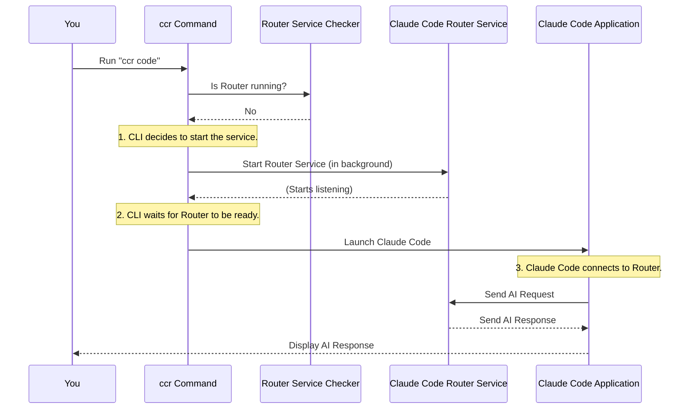

# Chapter 5: Command Line Interface (CLI)

Welcome back, future AI master! In [Chapter 4: Model Providers & Transformers](04_model_providers___transformers_.md), we explored how `claude-code-router` intelligently handles communication with various AI models. But how do *you*, the user, tell the router what to do? How do you start it, stop it, or tell it to begin an AI coding session?

This is where the **Command Line Interface (CLI)** comes in!

## Your Router's Control Panel

Imagine your `claude-code-router` as a powerful, smart engine that sits quietly in the background, ready to process your AI requests. To control this engine, you need a **dashboard** with simple buttons. That dashboard is the Command Line Interface (CLI).

The CLI allows you to interact with the `claude-code-router` by typing simple commands into your computer's terminal (also known as the command prompt, console, or shell). It's the main way you'll manage the router's "life" – starting it up, shutting it down, checking its status, and most importantly, using it to power your Claude Code sessions.

### The Problem It Solves

Without a CLI, managing a background service like `claude-code-router` would be much harder. You'd have to manually run complex scripts or dig into system settings. The CLI provides simple, easy-to-remember commands that do all the heavy lifting for you, making the router very user-friendly.

This chapter will guide you through the essential `ccr` commands and show you how they make interacting with the router a breeze.

## Essential `ccr` Commands

All your interactions with the `claude-code-router` begin with the `ccr` command. Think of `ccr` as the name of your router's "control panel." After `ccr`, you'll add another word to tell it what to do (like "start" or "stop").

Let's look at the main commands you'll use:

### 1. `ccr start` - Starting the Engine

This command launches the `claude-code-router` service in the background. Once started, the router runs silently, waiting for Claude Code to send it AI requests.

**When to use it:** When you want the router to be actively running and ready to handle AI requests.

**Example:**

```bash
ccr start
```

**What happens:** The router starts up. You won't see much output unless there's an error, because it's designed to run in the background. It will likely say something like "Claude Code Router service started successfully."

### 2. `ccr stop` - Shutting Down the Engine

This command gracefully shuts down the `claude-code-router` service if it's running.

**When to use it:** When you're done using the router and want to free up computer resources, or if you need to restart it after making changes to your `config.json`.

**Example:**

```bash
ccr stop
```

**What happens:** The router service will attempt to close. You'll see a message confirming its shutdown, like "claude code router service has been successfully stopped."

### 3. `ccr status` - Checking the Dashboard Lights

This command checks if the `claude-code-router` service is currently running and provides some useful information about its status.

**When to use it:** If you're unsure whether the router is active, or if you're troubleshooting.

**Example:**

```bash
ccr status
```

**What happens:** You'll see a clear report:

```
📊 Claude Code Router Status
════════════════════════════════════════
✅ Status: Running
🆔 Process ID: 12345
🌐 Port: 3456
📡 API Endpoint: http://127.0.0.1:3456
📄 PID File: /Users/yourusername/.claude-code-router/.claude-code-router.pid

🚀 Ready to use! Run the following commands:
   ccr code    # Start coding with Claude
   ccr stop   # Stop the service
```

(Or, if it's not running, it will tell you "Status: Not Running".)

### 4. `ccr code` - Drive with Auto-Start!

This is probably the most important and convenient command. When you want to use Claude Code *with* your router, you simply use `ccr code`.

The clever part? If the `claude-code-router` service is *not* already running, `ccr code` will **automatically start it for you first**, and *then* launch Claude Code, ensuring everything is connected seamlessly!

**When to use it:** Almost every time you want to start a Claude Code session and have it use your router's smart routing and transformation capabilities.

**Example:**

```bash
ccr code
```

You can also pass arguments directly to Claude Code through `ccr code`:

```bash
ccr code "Write a Python function to check if a number is prime."
```

**What happens:**
*   **If the router is not running:** You'll see "Service not running, starting service..." then a pause as the router starts, and finally Claude Code will launch, connected to your router.
*   **If the router is already running:** Claude Code will launch immediately, connected to the existing router service.
*   Once Claude Code is running, it will send all its AI requests to your local `claude-code-router` (running on `http://127.0.0.1:3456`), which then applies your configuration rules (from [Chapter 2: Router Configuration](02_router_configuration_.md)) and uses the appropriate [Model Providers & Transformers](04_model_providers___transformers__.md) to fulfill your request.

This `ccr code` command is designed to make your workflow super smooth!

### Other Useful Commands

*   `ccr -v` or `ccr version`: Shows the installed version of `claude-code-router`.
*   `ccr -h` or `ccr help`: Displays a summary of all available commands (similar to the `HELP_TEXT` below).

## Under the Hood: How the CLI Works

When you type `ccr` followed by a command, your computer looks for the `claude-code-router` program and tells it what to do. Let's peek at how `ccr code` (the most interesting one!) handles its auto-start magic.

### The `ccr code` Auto-Start Journey

Here's what happens step-by-step when you type `ccr code` and the router service isn't yet running:



### Simplified Code Walkthrough (`src/cli.ts`)

The `src/cli.ts` file is the "brain" behind the `ccr` commands. It reads what you typed and decides which action to perform.

When you run `ccr code`, the program essentially has a big `switch` statement (like a branching path) that checks the command you entered:

```typescript
// From src/cli.ts (simplified for clarity)
const command = process.argv[2]; // This captures 'start', 'stop', 'code', etc.

async function main() {
  switch (command) {
    case "start":
      // ... code to start the router ...
      break;
    case "stop":
      // ... code to stop the router ...
      break;
    case "status":
      // ... code to show status ...
      break;
    case "code":
      // This is the interesting part for 'ccr code'
      if (!isServiceRunning()) { // Check if the router is already running
        console.log("Service not running, starting service...");
        // Start the router service in the background
        const startProcess = spawn("node", [join(__dirname, "cli.js"), "start"], {
          detached: true, // Don't block the current terminal
          stdio: "ignore", // Don't show its output
        });
        startProcess.unref(); // Allow the parent process to exit independently

        // Wait for the router service to fully start up
        if (await waitForService()) {
          executeCodeCommand(process.argv.slice(3)); // Then execute Claude Code
        } else {
          console.error("Service startup timeout...");
          process.exit(1);
        }
      } else {
        executeCodeCommand(process.argv.slice(3)); // Router already running, just execute Claude Code
      }
      break;
    // ... other cases for '-v', 'help', etc. ...
    default:
      console.log(HELP_TEXT); // Show help if command is unknown
      process.exit(1);
  }
}
```

In this simplified `main` function:
*   `process.argv[2]` grabs the second part of your command (e.g., if you type `ccr code`, `process.argv[2]` will be `"code"`).
*   For the `"code"` command, it first calls `isServiceRunning()` to check the router's status.
*   If `!isServiceRunning()` (meaning it's *not* running), it uses `spawn` to run the `ccr start` command in the background (`node` is used to run the `cli.js` file with the `start` argument).
*   `waitForService()` makes the `ccr code` command pause briefly, giving the router enough time to fully start before Claude Code tries to connect.
*   Finally, `executeCodeCommand()` is called, which is responsible for launching the actual Claude Code application.

### Connecting Claude Code to the Router (`src/utils/codeCommand.ts`)

The `executeCodeCommand` function is called after the router is confirmed to be running (or already was running). Its main job is to set up Claude Code to talk to your local router:

```typescript
// From src/utils/codeCommand.ts (simplified for clarity)
import { spawn } from "child_process";

export async function executeCodeCommand(args: string[] = []) {
  // Read your router's configuration (like API key)
  const config = await readConfigFile();

  // Set up environment variables for Claude Code
  const env = {
    ...process.env, // Keep existing environment variables
    ANTHROPIC_AUTH_TOKEN: "test", // Placeholder, router handles real auth
    ANTHROPIC_BASE_URL: `http://127.0.0.1:3456`, // IMPORTANT: Tell Claude Code to talk to *our router*
    API_TIMEOUT_MS: "600000",
  };

  if (config?.APIKEY) { // If you set an API key in config.json
    env.ANTHROPIC_API_KEY = config.APIKEY; // Pass it to Claude Code
    // delete env.ANTHROPIC_AUTH_TOKEN; // No longer needed
  }

  // Launch the actual 'claude' command (the Claude Code application)
  const claudePath = process.env.CLAUDE_PATH || "claude"; // Find 'claude' command
  const claudeProcess = spawn(claudePath, args, {
    env, // Use our special environment variables
    stdio: "inherit", // Show Claude Code's output directly in this terminal
    shell: true,
  });

  // ... (code to handle when Claude Code closes) ...
}
```

The most crucial part here is `ANTHROPIC_BASE_URL: `http://127.0.0.1:3456``. This tells the Claude Code application, "Hey, instead of trying to talk directly to Anthropic's servers, send all your AI requests to *this address* (your local router) instead!"

Because the `claude-code-router` is listening on `http://127.0.0.1:3456`, it perfectly intercepts all Claude Code's requests and applies all your smart routing, provider, and transformer rules.

## Conclusion

The Command Line Interface (CLI) is your primary tool for interacting with the `claude-code-router`. With simple commands like `ccr start`, `ccr stop`, `ccr status`, and especially the powerful `ccr code`, you can effortlessly manage the router service and ensure Claude Code uses your configured AI models. The `ccr code` command's auto-start feature simplifies your workflow, allowing you to jump straight into coding without worrying if the router is running.

In the [Next Chapter: Background Service Management](06_background_service_management_.md), we'll dive deeper into how the `claude-code-router` runs as a background service and how these CLI commands interact with that underlying process.

---

<sub><sup>Generated by [AI Codebase Knowledge Builder](https://github.com/The-Pocket/Tutorial-Codebase-Knowledge).</sup></sub> <sub><sup>**References**: [[1]](https://github.com/musistudio/claude-code-router/blob/2fc79dcf377ade7c4fc8883c94a6779fce830a5a/README.md), [[2]](https://github.com/musistudio/claude-code-router/blob/2fc79dcf377ade7c4fc8883c94a6779fce830a5a/src/cli.ts), [[3]](https://github.com/musistudio/claude-code-router/blob/2fc79dcf377ade7c4fc8883c94a6779fce830a5a/src/utils/close.ts), [[4]](https://github.com/musistudio/claude-code-router/blob/2fc79dcf377ade7c4fc8883c94a6779fce830a5a/src/utils/codeCommand.ts), [[5]](https://github.com/musistudio/claude-code-router/blob/2fc79dcf377ade7c4fc8883c94a6779fce830a5a/src/utils/status.ts)</sup></sub>