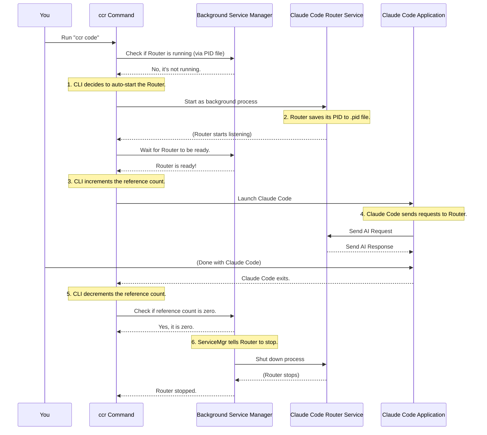

# Chapter 6: Background Service Management

Welcome back! In [Chapter 5: Command Line Interface (CLI)](05_command_line_interface__cli__.md), we learned how to use simple `ccr` commands to start, stop, and interact with the `claude-code-router`. We saw that when you type `ccr code`, the router might even start itself automatically in the background.

But what does it mean for a program to run "in the background"? And how does the `claude-code-router` ensure it's always ready when you need it, but also knows when to gracefully shut down? This is where **Background Service Management** comes in!

## Your Router's "Life Manager"

Imagine the `claude-code-router` as a helpful, quiet assistant working behind the scenes. You don't see it actively working on your screen, but it's always there, ready to route your AI requests. To manage this assistant's "life" – making sure it starts properly, stays active only when needed, and eventually goes to sleep – we need a "Life Manager."

This "Life Manager" is the **Background Service Management** abstraction. It handles the full lifecycle of the `claude-code-router` as a background process.

### The Problems It Solves

If the `claude-code-router` didn't have this "Life Manager," you might run into problems like:

1.  **Multiple instances:** Accidentally starting the router multiple times, causing confusion or errors.
2.  **Unnecessary resource use:** The router staying active even when you're done using Claude Code, wasting your computer's power.
3.  **Hard to stop:** Not knowing how to properly shut down the router.

This chapter will show you how the router's "Life Manager" solves these issues by tracking its process, ensuring only one copy runs, and using a "reference count" to know when it's truly finished its work.

## Key Concepts of Background Service Management

To effectively manage the router in the background, two main concepts are used:

### 1. Process ID (PID)

Every program running on your computer gets a unique identification number called a **Process ID**, or **PID**. Think of it like a unique ID card or a social security number for that specific running program.

The `claude-code-router` uses this PID:
*   **To ensure only one instance:** When you try to start the router, it first checks if a PID file exists. If it does, and the PID in that file corresponds to a running program, the router knows it's already active and won't start another copy.
*   **To stop itself:** When you run `ccr stop`, the command reads the PID from a special file and uses it to tell that specific running router program to shut down.

The `claude-code-router` stores this PID in a small, hidden file usually named `.claude-code-router.pid` inside your `~/.claude-code-router` folder.

### 2. Reference Count

Imagine the `claude-code-router` is a shared tool in a workshop. When someone starts using the tool (like opening Claude Code through the router), they "check it out," and a counter goes up. When they finish using it, they "check it in," and the counter goes down. The tool only gets put away (the router shuts down) when the counter reaches zero, meaning no one is actively using it anymore.

This counter is the **Reference Count**.
*   Every time you run `ccr code` and a Claude Code session starts using the router, the reference count **increments** (goes up by one).
*   When that Claude Code session closes, the reference count **decrements** (goes down by one).
*   The `claude-code-router` service will stay alive as long as this count is above zero. Only when the count drops to zero does the router gracefully shut itself down.

This ensures the router only runs when it's actually needed and automatically cleans up after all related tasks are complete, saving your computer's resources. The reference count is stored in another hidden file, `.claude-code-router.refcount`.

## How the CLI Commands Use This Management

The commands you learned in [Chapter 5: Command Line Interface (CLI)](05_command_line_interface__cli__.md) directly interact with this background service management system:

*   **`ccr start`**: This command initiates the `claude-code-router` as a background process. It writes the router's new PID into the `.pid` file.
*   **`ccr stop`**: This command reads the PID from the `.pid` file and sends a signal to that specific process to stop. It also cleans up the `.pid` and `.refcount` files.
*   **`ccr status`**: This command checks if the PID file exists, reads the PID, and verifies if a process with that PID is still running. It also displays the current reference count.
*   **`ccr code`**: This is the smartest command!
    1.  It first checks if the router service is running (using the PID). If not, it automatically starts the router service in the background.
    2.  Once the router is running, it **increments the reference count**.
    3.  It then launches Claude Code, configured to use your local router.
    4.  When Claude Code exits, it **decrements the reference count**.
    5.  If the reference count drops to zero after decrementing, it triggers the router service to automatically stop.

This intelligent orchestration allows `ccr code` to provide a seamless user experience, acting like a smart "power button" for your AI travel agent.

## Under the Hood: The Life Manager at Work

Let's trace how the `ccr code` command (the most common way you'll interact with the router's background service management) works internally.

### `ccr code`'s Auto-Start and Auto-Stop Journey

Here's a step-by-step look at what happens when you run `ccr code`, especially when the router service isn't already running:



This sequence shows how the CLI, the `Background Service Manager` (which includes PID and reference count logic), and the Router service all work together to provide a seamless experience.

### A Closer Look at the Code

The core logic for background service management is spread across a few files, mainly `src/utils/processCheck.ts`, `src/cli.ts`, `src/index.ts`, `src/utils/codeCommand.ts`, and `src/utils/close.ts`.

#### 1. Checking and Saving the PID (`src/utils/processCheck.ts`)

This file contains functions to manage the PID file and check if the service is running.

```typescript
// From src/utils/processCheck.ts (simplified)
import { existsSync, readFileSync, writeFileSync } from 'fs';
import { PID_FILE } from '../constants'; // PID_FILE is the path to .claude-code-router.pid

export function isServiceRunning(): boolean {
    if (!existsSync(PID_FILE)) {
        return false; // No PID file means no service running
    }
    try {
        const pid = parseInt(readFileSync(PID_FILE, 'utf-8'));
        // Check if a process with this PID is actually running
        process.kill(pid, 0); // Sending signal 0 checks if process exists
        return true;
    } catch (e) {
        // If an error occurs, the process is not running, so clean up the old PID file
        cleanupPidFile();
        return false;
    }
}

export function savePid(pid: number) {
    writeFileSync(PID_FILE, pid.toString()); // Write the current process's PID to file
}

export function cleanupPidFile() {
    if (existsSync(PID_FILE)) {
        require('fs').unlinkSync(PID_FILE); // Delete the PID file
    }
}
```

*   `isServiceRunning()`: Checks the `.pid` file and verifies if the process is active.
*   `savePid()`: Writes the current `claude-code-router`'s process ID to the `.pid` file when it starts.
*   `cleanupPidFile()`: Deletes the `.pid` file when the service stops or is detected as not running.

#### 2. Managing the Reference Count (`src/utils/processCheck.ts`)

This same file also handles the reference count.

```typescript
// From src/utils/processCheck.ts (simplified)
import { existsSync, readFileSync, writeFileSync } from 'fs';
import { REFERENCE_COUNT_FILE } from '../constants'; // Path to .claude-code-router.refcount

export function incrementReferenceCount() {
    let count = 0;
    if (existsSync(REFERENCE_COUNT_FILE)) {
        count = parseInt(readFileSync(REFERENCE_COUNT_FILE, 'utf-8')) || 0;
    }
    count++; // Increase the count
    writeFileSync(REFERENCE_COUNT_FILE, count.toString());
}

export function decrementReferenceCount() {
    let count = 0;
    if (existsSync(REFERENCE_COUNT_FILE)) {
        count = parseInt(readFileSync(REFERENCE_COUNT_FILE, 'utf-8')) || 0;
    }
    count = Math.max(0, count - 1); // Decrease the count, but not below zero
    writeFileSync(REFERENCE_COUNT_FILE, count.toString());
}

export function getReferenceCount(): number {
    if (!existsSync(REFERENCE_COUNT_FILE)) {
        return 0;
    }
    return parseInt(readFileSync(REFERENCE_COUNT_FILE, 'utf-8')) || 0;
}
```

*   `incrementReferenceCount()`: Reads the current count, adds one, and saves it back.
*   `decrementReferenceCount()`: Reads the current count, subtracts one (making sure it doesn't go below zero), and saves it.
*   `getReferenceCount()`: Simply reads and returns the current count.

#### 3. Starting the Router (`src/index.ts`)

When `ccr start` is run (or `ccr code` auto-starts it), the `run` function in `src/index.ts` is called.

```typescript
// From src/index.ts (simplified)
import { savePid, isServiceRunning } from "./utils/processCheck";

async function run(options: any = {}) {
  // 1. Check if service is already running
  if (isServiceRunning()) {
    console.log("✅ Service is already running in the background.");
    return;
  }

  // 2. Save the PID of this new background process
  savePid(process.pid); // 'process.pid' is the current program's PID

  // 3. Set up event listeners to clean up PID file on exit
  process.on("SIGINT", () => { cleanupPidFile(); process.exit(0); });
  process.on("SIGTERM", () => { cleanupPidFile(); process.exit(0); });

  // ... (rest of the server setup from Chapter 1) ...
  server.start(); // Start listening for AI requests!
}
```

This ensures that only one `claude-code-router` instance can be active at a time, and it cleans up its PID file if the process unexpectedly stops.

#### 4. Auto-Start, Reference Count, and Auto-Stop with `ccr code` (`src/cli.ts` & `src/utils/codeCommand.ts`)

The `ccr code` command orchestrates the auto-start, reference count updates, and auto-stop.

```typescript
// From src/cli.ts (simplified for 'code' command)
import { isServiceRunning } from "./utils/processCheck";
import { executeCodeCommand } from "./utils/codeCommand";
import { spawn } from "child_process";
import { join } from "path";

async function main() {
  const command = process.argv[2];
  if (command === "code") {
    if (!isServiceRunning()) { // Check if router is already running
      console.log("Service not running, starting service...");
      // Spawn 'ccr start' as a detached background process
      const startProcess = spawn("node", [join(__dirname, "cli.js"), "start"], {
        detached: true, // This makes it run in the background
        stdio: "ignore", // Don't show its output in this terminal
      });
      startProcess.unref(); // Allow the main 'ccr code' process to exit later

      // Wait for the new service to fully start up
      if (await waitForService()) { // waitForService checks isServiceRunning periodically
        executeCodeCommand(process.argv.slice(3)); // Then launch Claude Code
      } else {
        console.error("Service startup timeout...");
        process.exit(1);
      }
    } else {
      executeCodeCommand(process.argv.slice(3)); // Router already running, just launch Claude Code
    }
  }
  // ... other CLI commands ...
}
```

And the `executeCodeCommand` is where the reference count magic happens:

```typescript
// From src/utils/codeCommand.ts (simplified)
import { spawn } from "child_process";
import {
  incrementReferenceCount,
  decrementReferenceCount,
} from "./processCheck";
import { closeService } from "./close"; // Function to decide if router should stop

export async function executeCodeCommand(args: string[] = []) {
  // 1. Increment reference count when Claude Code session starts
  incrementReferenceCount();

  // 2. Launch the actual 'claude' command
  const claudeProcess = spawn("claude", args, {
    // ... environment variables to connect Claude Code to our router ...
    stdio: "inherit",
    shell: true,
  });

  // 3. When Claude Code closes, decrement count and potentially stop router
  claudeProcess.on("close", (code) => {
    decrementReferenceCount(); // Decrease the counter
    closeService(); // Check if the router should now stop
    process.exit(code || 0);
  });

  claudeProcess.on("error", (error) => {
    // If Claude Code failed to start, decrement immediately
    decrementReferenceCount();
    process.exit(1);
  });
}
```

Finally, the `closeService` function decides if the router should truly stop:

```typescript
// From src/utils/close.ts (simplified)
import { isServiceRunning, cleanupPidFile, getReferenceCount } from './processCheck';

export async function closeService() {
    if (!isServiceRunning()) {
        console.log("No service is currently running.");
        return;
    }

    // Only stop the service if no one is using it anymore
    if (getReferenceCount() > 0) {
        return; // Don't stop yet, other sessions are active
    }

    try {
        // Read PID from file and kill the process
        const pid = parseInt(require('fs').readFileSync(require('path').join(require('os').homedir(), '.claude-code-router.pid'), 'utf-8'));
        process.kill(pid);
        cleanupPidFile(); // Remove PID file
        // Also remove the reference count file if it exists
        if (require('fs').existsSync(require('path').join(require('os').homedir(), '.claude-code-router.refcount'))) {
            require('fs').unlinkSync(require('path').join(require('os').homedir(), '.claude-code-router.refcount'));
        }
        console.log("claude code router service has been successfully stopped.");
    } catch (e) {
        console.log("Failed to stop the service. It may have already been stopped.");
        cleanupPidFile(); // Ensure cleanup even on error
    }
}
```

As you can see, the `closeService()` function checks `getReferenceCount() > 0`. If other `ccr code` sessions are still active (the count is above zero), the router will stay running, only shutting down when the very last session closes.

## Conclusion

The **Background Service Management** system is the silent guardian of your `claude-code-router`. By using Process IDs (PIDs) and a clever "reference count," it ensures that only one instance of the router runs at a time, that it stays active as long as you're using Claude Code sessions, and that it automatically shuts down to save resources when all your tasks are complete. This makes the `claude-code-router` a truly robust and user-friendly tool, seamlessly integrating into your AI development workflow.

---

<sub><sup>Generated by [AI Codebase Knowledge Builder](https://github.com/The-Pocket/Tutorial-Codebase-Knowledge).</sup></sub> <sub><sup>**References**: [[1]](https://github.com/musistudio/claude-code-router/blob/2fc79dcf377ade7c4fc8883c94a6779fce830a5a/src/cli.ts), [[2]](https://github.com/musistudio/claude-code-router/blob/2fc79dcf377ade7c4fc8883c94a6779fce830a5a/src/index.ts), [[3]](https://github.com/musistudio/claude-code-router/blob/2fc79dcf377ade7c4fc8883c94a6779fce830a5a/src/utils/close.ts), [[4]](https://github.com/musistudio/claude-code-router/blob/2fc79dcf377ade7c4fc8883c94a6779fce830a5a/src/utils/codeCommand.ts), [[5]](https://github.com/musistudio/claude-code-router/blob/2fc79dcf377ade7c4fc8883c94a6779fce830a5a/src/utils/processCheck.ts)</sup></sub>