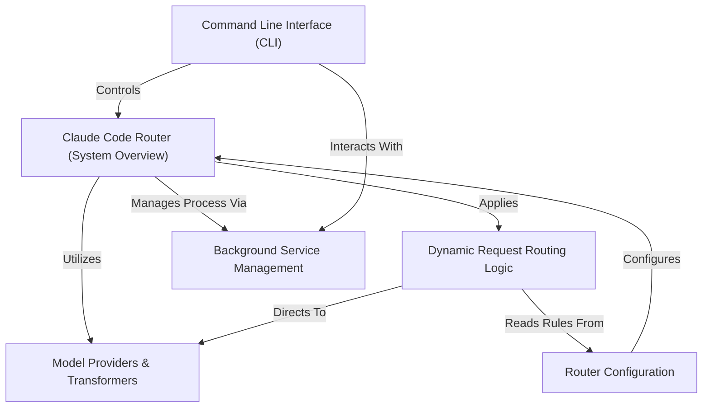

# Tutorial: claude-code-router

The `claude-code-router` is a **smart proxy** that acts as a *central hub* for Claude Code AI requests. It intelligently **routes** these requests to different *AI models and providers* based on user-defined **configuration rules**, also *transforming* requests and responses to ensure compatibility across various APIs. It simplifies managing and optimizing AI interactions and can run as a **background service**.

## Visual Overview

## Chapters

1. [Claude Code Router (System Overview)
](01_claude_code_router__system_overview__.md)
2. [Router Configuration
](02_router_configuration_.md)
3. [Dynamic Request Routing Logic
](03_dynamic_request_routing_logic_.md)
4. [Model Providers & Transformers
](04_model_providers___transformers_.md)
5. [Command Line Interface (CLI)
](05_command_line_interface__cli__.md)
6. [Background Service Management
](06_background_service_management_.md)

---

Generated by [AI Codebase Knowledge Builder](https://github.com/The-Pocket/Tutorial-Codebase-Knowledge).