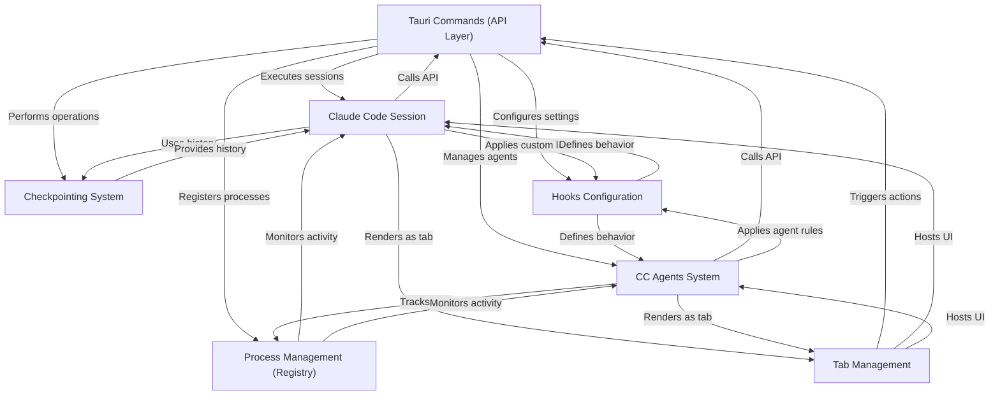

# Tutorial: claudia

Claudia is a **desktop application** designed to enhance the *developer experience* with **Claude Code**, an AI-powered coding assistant. It provides an intuitive **graphical user interface** to manage coding projects, interact with Claude through intelligent "chat" sessions, define and run **custom AI agents** for automated tasks, and use a unique **checkpointing system** for "time-travel" through code changes and conversation history. The application integrates tightly with the underlying Claude Code CLI, offering advanced features like real-time output streaming, configurable hooks, and persistent session management, all within a familiar **multi-tabbed environment**.


## Visual Overview



## Chapters

1. [Tab Management
](01_tab_management_.md)
2. [Claude Code Session
](02_claude_code_session_.md)
3. [CC Agents System
](03_cc_agents_system_.md)
4. [Checkpointing System
](04_checkpointing_system_.md)
5. [Hooks Configuration
](05_hooks_configuration_.md)
6. [Tauri Commands (API Layer)
](06_tauri_commands__api_layer__.md)
7. [Process Management (Registry)
](07_process_management__registry__.md)

---

<sub><sup>Generated by [AI Codebase Knowledge Builder](https://github.com/The-Pocket/Tutorial-Codebase-Knowledge).</sup></sub>
````