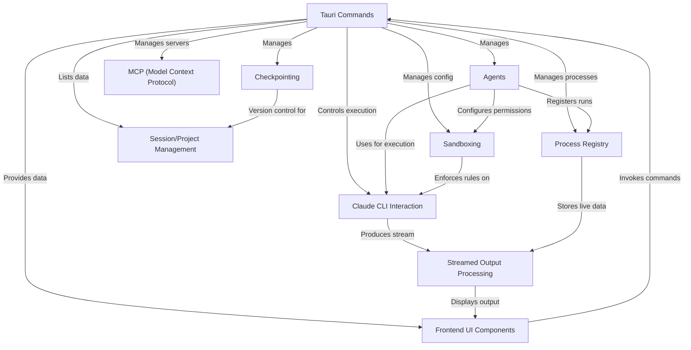

# Tutorial: claudia

Claudia is a desktop application that **interacts** with the `claude` command-line interface (CLI) to help you manage AI-assisted projects. It allows you to create custom **Agents** with specific instructions and security **Sandboxing** rules, browse your project **Sessions**, track changes with **Checkpointing**, and connect to external AI model servers using **MCP**. The app provides a user-friendly **Frontend UI** built using **Tauri Commands** to bridge the frontend and backend logic, processing **Streamed Output** from Claude and managing running tasks via a **Process Registry**.

## Visual Overview

## Chapters

1. [Session/Project Management
](01_session_project_management_.md)
2. [Agents
](02_agents_.md)
3. [Frontend UI Components
](03_frontend_ui_components_.md)
4. [Tauri Commands
](04_tauri_commands_.md)
5. [Claude CLI Interaction
](05_claude_cli_interaction_.md)
6. [Sandboxing
](06_sandboxing_.md)
7. [Streamed Output Processing
](07_streamed_output_processing_.md)
8. [Process Registry
](08_process_registry_.md)
9. [Checkpointing
](09_checkpointing_.md)
10. [MCP (Model Context Protocol)
](10_mcp__model_context_protocol__.md)

---

Generated by [AI Codebase Knowledge Builder](https://github.com/The-Pocket/Tutorial-Codebase-Knowledge).
