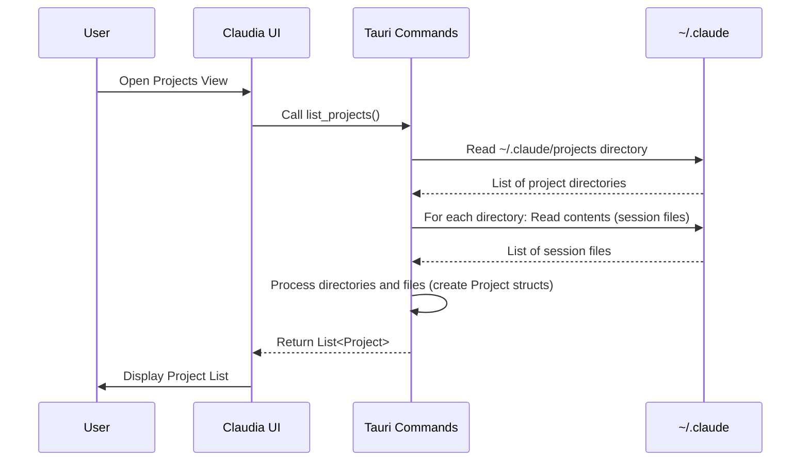
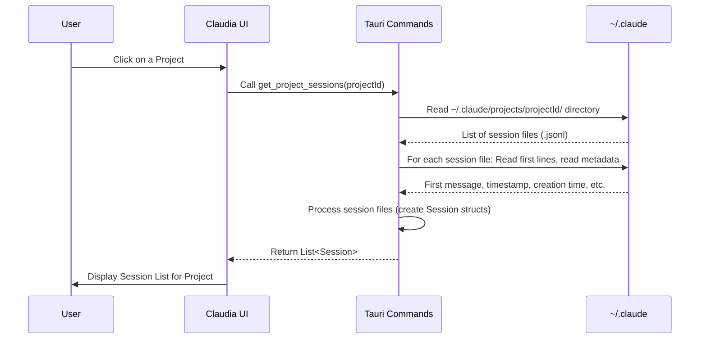

# Chapter 1: Session/Project Management

Welcome to the first chapter of the `claudia` tutorial! In this chapter, we'll explore how `claudia` helps you keep track of your work with Claude Code using its Session/Project Management feature.

Imagine you're using Claude Code to help you build a new feature in a software project. You spend hours talking to Claude, asking it to write code, explain concepts, and debug issues. This interaction is a "session". Your feature development is happening within a specific folder on your computer – that's your "project".

As you work on different projects, you'll have many sessions. How do you find that helpful conversation you had last week about a bug fix in your "website-redesign" project? How do you pick up where you left off? This is exactly what the Session/Project Management part of `claudia` solves!

It's like having a digital filing cabinet for all your Claude Code conversations, organized by the project you were working on.

## What are Projects and Sessions in `claudia`?

At its core, Session/Project Management deals with two main ideas:

1.  **Projects:** A "Project" in `claudia` (and the underlying Claude Code CLI) corresponds to a directory on your computer where you were running Claude Code. When you start Claude Code in a folder, it recognizes that as a project.
2.  **Sessions:** A "Session" is a single, continuous conversation you had with Claude Code within a specific project. Every time you run the `claude` command (or `claude --resume`, `claude --continue`), you're starting or continuing a session.

The Claude Code CLI automatically saves your conversation history. `claudia` reads this saved history to show you what you've done.

## Where is the Data Stored?

The Claude Code CLI stores everything it needs inside a special directory in your home folder: `~/.claude`.

Inside `~/.claude`, you'll find:

*   A `projects` directory: This is where information about your projects and their sessions is kept.
*   Other files like `settings.json` or `CLAUDE.md` (we'll talk about settings and `CLAUDE.md` later).

Each project you've worked on will have a subdirectory inside `~/.claude/projects`. The name of this subdirectory is a special encoded version of the project's file path.

Inside a project's directory (`~/.claude/projects/your-project-id/`), you'll find files ending in `.jsonl`. Each `.jsonl` file is a single **session**. The name of the file (before `.jsonl`) is the unique ID for that session. These files contain a history of messages, commands, and tool outputs for that specific conversation.

## How Does `claudia` Show You Your History?

Let's look at the user interface of `claudia`. When you open it, you'll likely see a list of your recent projects. Clicking on a project takes you to a list of sessions within that project. You can then click on a session to view its history or resume it.

Here's a simplified look at how the frontend components display this information:

```typescript
// src/components/ProjectList.tsx - Simplified structure
import { Card, CardContent } from "@/components/ui/card";
import type { Project } from "@/lib/api";

interface ProjectListProps {
  projects: Project[]; // This array comes from the backend
  onProjectClick: (project: Project) => void;
}

export const ProjectList: React.FC<ProjectListProps> = ({ projects, onProjectClick }) => {
  return (
    <div className="space-y-4">
      {/* Loop through the projects array */}
      {projects.map((project) => (
        <Card key={project.id} onClick={() => onProjectClick(project)}>
          <CardContent className="p-3">
            <div>
              <p>{project.path}</p> {/* Display the project path */}
              <p>{project.sessions.length} sessions</p> {/* Show session count */}
              {/* ... other project info like creation date */}
            </div>
            {/* ... click handler */}
          </CardContent>
        </Card>
      ))}
      {/* ... Pagination */}
    </div>
  );
};
```

This component (`ProjectList.tsx`) takes a list of `Project` objects (fetched from the backend) and renders a card for each one, showing basic info like the project path and how many sessions it contains. When you click a card, it calls the `onProjectClick` function, typically navigating you to the sessions list for that project.

Next, let's look at how the sessions for a selected project are displayed:

```typescript
// src/components/SessionList.tsx - Simplified structure
import { Card, CardContent } from "@/components/ui/card";
import type { Session } from "@/lib/api";

interface SessionListProps {
  sessions: Session[]; // This array comes from the backend for the selected project
  projectPath: string;
  onSessionClick?: (session: Session) => void;
  onBack: () => void; // Button to go back to project list
}

export const SessionList: React.FC<SessionListProps> = ({ sessions, projectPath, onSessionClick, onBack }) => {
  return (
    <div className="space-y-4">
      <button onClick={onBack}>Back to Projects</button> {/* Back button */}
      <h2>{projectPath}</h2> {/* Display the current project path */}
      <div className="space-y-2">
        {/* Loop through the sessions array */}
        {sessions.map((session) => (
          <Card key={session.id} onClick={() => onSessionClick?.(session)}>
            <CardContent className="p-3">
              <div>
                <p>Session ID: {session.id.slice(0, 8)}...</p> {/* Display truncated session ID */}
                {/* Display the first message preview if available */}
                {session.first_message && <p>First msg: {session.first_message}</p>}
                {/* ... other session info like timestamps */}
              </div>
              {/* ... click handler */}
            </CardContent>
          </Card>
        ))}
      </div>
      {/* ... Pagination */}
    </div>
  );
};
```

The `SessionList.tsx` component receives the list of sessions for a *single* project (again, fetched from the backend). It shows you the project path you're currently viewing and lists each session, often including its ID, creation time, and a preview of the first message. Clicking a session calls `onSessionClick`, which will lead to the conversation view (`ClaudeCodeSession.tsx`).

## How it Works: Under the Hood

The frontend components we just saw need data to display. This data is provided by the backend code, which runs in Rust using the Tauri framework. The backend's job for Session/Project Management is to read the files in the `~/.claude` directory and structure that information for the frontend.

Here's a simplified step-by-step of what happens when the frontend asks for the list of projects:

1.  The frontend calls a backend command, specifically `list_projects`.
2.  The backend code starts by finding the `~/.claude` directory on your computer.
3.  It then looks inside the `~/.claude/projects` directory.
4.  For each directory found inside `projects`, it treats it as a potential project.
5.  It reads the name of the project directory (which is an encoded path) and tries to find the actual project path by looking at the session files inside.
6.  It also counts the number of `.jsonl` files (sessions) inside that project directory.
7.  It gets the creation timestamp of the project directory.
8.  It gathers this information (project ID, path, sessions list, creation time) into a `Project` struct.
9.  It repeats this for all project directories.
10. Finally, it sends a list of these `Project` structs back to the frontend.

Fetching sessions for a specific project follows a similar pattern:

1.  The frontend calls the `get_project_sessions` command, providing the `project_id`.
2.  The backend finds the specific project directory inside `~/.claude/projects` using the provided `project_id`.
3.  It looks inside that project directory for all `.jsonl` files.
4.  For each `.jsonl` file (session), it extracts the session ID from the filename.
5.  It gets the file's creation timestamp.
6.  It reads the *first few lines* of the `.jsonl` file to find the first user message and its timestamp, for display as a preview in the UI.
7.  It might also check for related files like todo data (`.json` files in `~/.claude/todos` linked by session ID).
8.  It gathers this info into a `Session` struct.
9.  It repeats this for all session files in the project directory.
10. Finally, it sends a list of `Session` structs back to the frontend.

Here's a sequence diagram illustrating the `list_projects` flow:



And the `get_project_sessions` flow:



## Diving into the Code

Let's look at some specific parts of the Rust code in `src-tauri/src/commands/claude.rs` that handle this logic.

First, the data structures that represent a project and a session:

```rust
// src-tauri/src/commands/claude.rs
#[derive(Debug, Clone, Serialize, Deserialize)]
pub struct Project {
    pub id: String, // The encoded directory name
    pub path: String, // The decoded or detected real path
    pub sessions: Vec<String>, // List of session file names (IDs)
    pub created_at: u64, // Timestamp
}

#[derive(Debug, Clone, Serialize, Deserialize)]
pub struct Session {
    pub id: String, // The session file name (UUID)
    pub project_id: String, // Link back to the project
    pub project_path: String, // The project's real path
    pub todo_data: Option<serde_json::Value>, // Optional associated data
    pub created_at: u64, // Timestamp
    pub first_message: Option<String>, // Preview of the first user message
    pub message_timestamp: Option<String>, // Timestamp of the first message
}
// ... rest of the file
```

These `struct` definitions tell us what information the backend collects and sends to the frontend for projects and sessions. Notice the `Serialize` and `Deserialize` derives; this is what allows Tauri to easily pass these structures between the Rust backend and the JavaScript/TypeScript frontend.

Here's the function that finds the base `~/.claude` directory:

```rust
// src-tauri/src/commands/claude.rs
fn get_claude_dir() -> Result<PathBuf> {
    dirs::home_dir() // Find the user's home directory
        .context("Could not find home directory")? // Handle potential error
        .join(".claude") // Append the .claude directory name
        .canonicalize() // Resolve symbolic links, etc.
        .context("Could not find ~/.claude directory") // Handle potential error
}
// ... rest of the file
```

This simple function is crucial as all project and session data is located relative to `~/.claude`.

Now, a look at the `list_projects` function. We'll skip some error handling and logging for brevity here:

```rust
// src-tauri/src/commands/claude.rs
#[tauri::command]
pub async fn list_projects() -> Result<Vec<Project>, String> {
    let claude_dir = get_claude_dir().map_err(|e| e.to_string())?;
    let projects_dir = claude_dir.join("projects"); // Path to ~/.claude/projects

    if !projects_dir.exists() {
        return Ok(Vec::new()); // Return empty list if directory doesn't exist
    }

    let mut projects = Vec::new();

    // Iterate over entries inside ~/.claude/projects
    let entries = fs::read_dir(&projects_dir).map_err(|e| format!("..."))?;

    for entry in entries {
        let entry = entry.map_err(|e| format!("..."))?;
        let path = entry.path();

        if path.is_dir() { // Only process directories
            let dir_name = path.file_name().and_then(|n| n.to_str()).ok_or_else(|| "...").unwrap();

            // Get creation/modification timestamp
            let metadata = fs::metadata(&path).map_err(|e| format!("..."))?;
            let created_at = metadata.created().or_else(|_| metadata.modified()).unwrap_or(SystemTime::UNIX_EPOCH).duration_since(SystemTime::UNIX_EPOCH).unwrap_or_default().as_secs();

            // Determine the actual project path (explained next)
            let project_path = match get_project_path_from_sessions(&path) {
                Ok(p) => p,
                Err(_) => decode_project_path(dir_name) // Fallback if session files don't exist
            };

            // Find all session files (.jsonl) in this project directory
            let mut sessions = Vec::new();
            if let Ok(session_entries) = fs::read_dir(&path) {
                for session_entry in session_entries.flatten() {
                    let session_path = session_entry.path();
                    if session_path.is_file() && session_path.extension().and_then(|s| s.to_str()) == Some("jsonl") {
                        if let Some(session_id) = session_path.file_stem().and_then(|s| s.to_str()) {
                            sessions.push(session_id.to_string()); // Store session ID (filename)
                        }
                    }
                }
            }

            // Add the project to the list
            projects.push(Project {
                id: dir_name.to_string(),
                path: project_path,
                sessions,
                created_at,
            });
        }
    }

    projects.sort_by(|a, b| b.created_at.cmp(&a.created_at)); // Sort newest first
    Ok(projects)
}
// ... rest of the file
```

This code reads the `projects` directory, identifies subdirectories as projects, and collects basic information for each. A key part is determining the *actual* project path, as the directory name is an encoded version of the path where Claude Code was run. The `get_project_path_from_sessions` function handles this:

```rust
// src-tauri/src/commands/claude.rs
fn get_project_path_from_sessions(project_dir: &PathBuf) -> Result<String, String> {
    // Try to read any JSONL file in the directory
    let entries = fs::read_dir(project_dir)
        .map_err(|e| format!("..."))?;

    for entry in entries {
        if let Ok(entry) = entry {
            let path = entry.path();
            if path.is_file() && path.extension().and_then(|s| s.to_str()) == Some("jsonl") {
                // Read the first line of the JSONL file
                if let Ok(file) = fs::File::open(&path) {
                    let reader = BufReader::new(file);
                    if let Some(Ok(first_line)) = reader.lines().next() {
                        // Parse the JSON and extract "cwd" (current working directory)
                        if let Ok(json) = serde_json::from_str::<serde_json::Value>(&first_line) {
                            if let Some(cwd) = json.get("cwd").and_then(|v| v.as_str()) {
                                return Ok(cwd.to_string()); // Found the project path!
                            }
                        }
                    }
                }
            }
        }
    }

    Err("Could not determine project path from session files".to_string()) // Failed to find it
}
// ... rest of the file
```

This function is smarter than just decoding the directory name. It opens the first session file it finds within a project directory, reads the very first line (which usually contains metadata including the `cwd` - current working directory - where Claude Code was launched), and uses that `cwd` as the definitive project path. This is more reliable than trying to decode the directory name.

Finally, let's look at `get_project_sessions`:

```rust
// src-tauri/src/commands/claude.rs
#[tauri::command]
pub async fn get_project_sessions(project_id: String) -> Result<Vec<Session>, String> {
    let claude_dir = get_claude_dir().map_err(|e| e.to_string())?;
    let project_dir = claude_dir.join("projects").join(&project_id); // Path to specific project dir
    let todos_dir = claude_dir.join("todos"); // Path to todo data

    if !project_dir.exists() {
        return Err(format!("Project directory not found: {}", project_id));
    }

    // Determine the actual project path
    let project_path = match get_project_path_from_sessions(&project_dir) {
        Ok(p) => p,
        Err(_) => decode_project_path(&project_id) // Fallback
    };

    let mut sessions = Vec::new();

    // Read all files in the project directory
    let entries = fs::read_dir(&project_dir).map_err(|e| format!("..."))?;

    for entry in entries {
        let entry = entry.map_err(|e| format!("..."))?;
        let path = entry.path();

        // Process only .jsonl files
        if path.is_file() && path.extension().and_then(|s| s.to_str()) == Some("jsonl") {
            if let Some(session_id) = path.file_stem().and_then(|s| s.to_str()) { // Get filename as session ID
                // Get file creation timestamp
                let metadata = fs::metadata(&path).map_err(|e| format!("..."))?;
                let created_at = metadata.created().or_else(|_| metadata.modified()).unwrap_or(SystemTime::UNIX_EPOCH).duration_since(SystemTime::UNIX_EPOCH).unwrap_or_default().as_secs();

                // Extract first user message for preview (explained next)
                let (first_message, message_timestamp) = extract_first_user_message(&path);

                // Check for associated todo data file
                let todo_path = todos_dir.join(format!("{}.json", session_id));
                let todo_data = if todo_path.exists() {
                     // ... read and parse todo.json ...
                     None // Simplified: just show if it exists, not the data
                } else {
                    None
                };

                // Add the session to the list
                sessions.push(Session {
                    id: session_id.to_string(),
                    project_id: project_id.clone(),
                    project_path: project_path.clone(),
                    todo_data,
                    created_at,
                    first_message,
                    message_timestamp,
                });
            }
        }
    }

    sessions.sort_by(|a, b| b.created_at.cmp(&a.created_at)); // Sort newest first
    Ok(sessions)
}
// ... rest of the file
```

This function is similar to `list_projects` but focuses on one project directory. It iterates through the files, identifies the `.jsonl` session files, extracts metadata like ID and timestamp, and importantly, calls `extract_first_user_message` to get a quick preview of the conversation's start for the UI.

The `extract_first_user_message` function reads the session's `.jsonl` file line by line, parses each line as JSON, and looks for the first entry that represents a message from the "user" role, making sure to skip certain types of messages (like the initial system caveat or command outputs) to find the actual user prompt.

## Putting it Together

So, the Session/Project Management feature in `claudia` works by:

1.  Reading the file structure created by the Claude Code CLI in `~/.claude`.
2.  Identifying directories in `~/.claude/projects` as projects and `.jsonl` files within them as sessions.
3.  Extracting key metadata (IDs, paths, timestamps, first message previews).
4.  Providing this structured data to the frontend UI via Tauri commands (`list_projects`, `get_project_sessions`).
5.  Allowing the frontend (`ProjectList.tsx`, `SessionList.tsx`) to display this information in an organized, browsable way.
6.  Enabling the user to select a session, triggering navigation to the main session view (`ClaudeCodeSession.tsx`) where they can see the full history (loaded using `load_session_history`) and potentially resume the conversation.

This abstraction provides the essential foundation for interacting with your past Claude Code work, allowing you to manage your conversation history effectively.

## Conclusion

In this chapter, we learned how `claudia` discovers, lists, and displays your Claude Code projects and sessions by reading files from the `~/.claude` directory. We saw how the frontend components like `ProjectList` and `SessionList` use data provided by backend commands like `list_projects` and `get_project_sessions` to build the navigation interface. We also briefly touched upon how session data (`.jsonl` files) is parsed to show previews.

Understanding how `claudia` manages sessions and projects is the first step in seeing how it builds a rich user interface on top of the command-line tool. In the next chapter, we'll dive into the concept of [Agents](02_agents_.md), which are central to how Claude Code and `claudia` understand the context of your work.

[Next Chapter: Agents](02_agents_.md)

---

<sub><sup>Generated by [AI Codebase Knowledge Builder](https://github.com/The-Pocket/Tutorial-Codebase-Knowledge).</sup></sub> <sub><sup>**References**: [[1]](https://github.com/getAsterisk/claudia/blob/abe0891b0b6e0f5516343bd86ed590bdc8e479b3/src-tauri/src/commands/claude.rs), [[2]](https://github.com/getAsterisk/claudia/blob/abe0891b0b6e0f5516343bd86ed590bdc8e479b3/src/components/ClaudeCodeSession.tsx), [[3]](https://github.com/getAsterisk/claudia/blob/abe0891b0b6e0f5516343bd86ed590bdc8e479b3/src/components/ProjectList.tsx), [[4]](https://github.com/getAsterisk/claudia/blob/abe0891b0b6e0f5516343bd86ed590bdc8e479b3/src/components/SessionList.tsx)</sup></sub>
