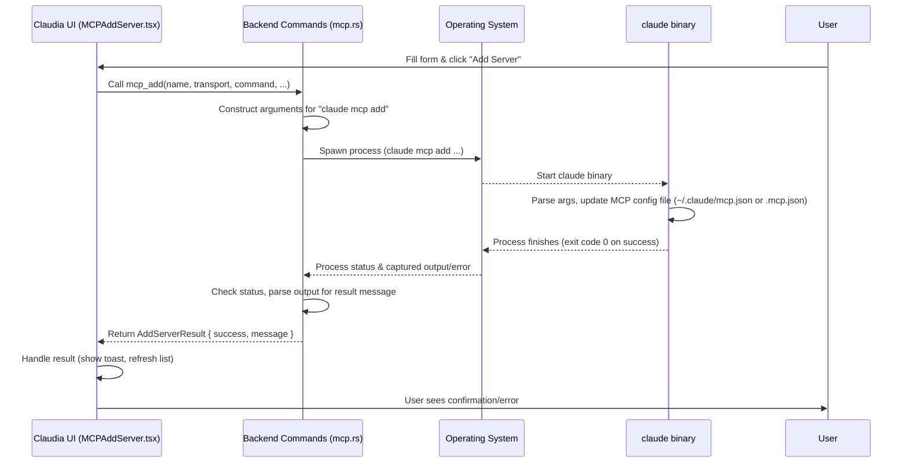

# Chapter 10: MCP (Model Context Protocol)

Welcome to the final chapter of the `claudia` tutorial! We've covered a lot, from managing your work with [Session/Project Management](01_session_project_management_.md) and defining specialized [Agents](02_agents_.md), to understanding how the [Frontend UI Components](03_frontend_ui_components_.md) are built and how they talk to the backend using [Tauri Commands](04_tauri_commands_.md). We've seen how `claudia` interacts with the core [Claude CLI Interaction](05_claude_cli_interaction_.md), how [Sandboxing](06_sandboxing_.md) keeps your environment secure, how [Streamed Output Processing](07_streamed_output_processing_.md) provides real-time feedback, and how the [Process Registry](08_process_registry_.md) tracks running tasks. Finally, we explored [Checkpointing](09_checkpointing_.md) for versioning your sessions.

Now, let's look at a feature that allows `claudia` (specifically, the `claude` CLI it controls) to go beyond just interacting with Anthropic's standard Claude API: **MCP (Model Context Protocol)**.

## The Problem: Connecting to Different AI Sources

By default, the `claude` CLI is primarily designed to connect to Anthropic's Claude API endpoints (like the ones that power Sonnet, Opus, etc.). But what if you want to use a different AI model? Perhaps a smaller model running locally on your machine, a specialized AI tool you built, or an internal AI service within your company?

These other AI sources might have different ways of communicating. You need a standard way for `claudia` (or rather, the `claude` CLI it manages) to talk to *any* AI service that can process prompts, use tools, and respond, regardless of who built it or how it runs.

This is the problem MCP solves. It provides a standardized "language" or "interface" that allows `claude` to communicate with any external program or service that "speaks" MCP.

Imagine `claudia` is a smart home hub. It needs to talk to various devices – lights, thermostats, speakers – made by different companies. Instead of needing a unique connection method for every single brand, they all agree to use a standard protocol (like Wi-Fi and a common API). MCP is that standard protocol for AI model servers.

## What is MCP (Model Context Protocol)?

MCP stands for **Model Context Protocol**. It's a standard protocol used by the `claude` CLI to exchange information with external programs or services that act as AI models or tools.

When you configure an "MCP Server" in `claude` (and thus in `claudia`), you're telling `claude` about an external AI source that it can connect to using the MCP standard.

This abstraction layer manages:

1.  **Defining Servers:** Telling `claude` about external MCP sources by giving them a name and specifying how to connect (e.g., run a specific command, connect to a URL).
2.  **Listing Servers:** Seeing which MCP servers are configured.
3.  **Interacting:** When a session or Agent is configured to use a specific MCP server, the `claude` CLI connects to that server (instead of the default Anthropic API) and uses the MCP to send prompts and receive responses.

This capability extends `claudia`'s potential far beyond just Anthropic's hosted models, enabling connections to a variety of AI models or services that implement the MCP standard.

## Key Concepts

Here are the main ideas behind MCP in `claudia` (and `claude`):

| Concept           | Description                                                                                                  | Analogy                                                 |
| :---------------- | :----------------------------------------------------------------------------------------------------------- | :------------------------------------------------------ |
| **MCP Server**    | An external program or service that speaks the MCP standard and can act as an AI model or provide tools.       | A smart device (light, speaker) in a smart home system. |
| **Transport**     | How `claude` connects to the MCP Server. Common types are `stdio` (running the server as a command-line process) or `sse` (connecting to a network URL via Server-Sent Events). | How the hub talks to the device (e.g., Wi-Fi, Bluetooth). |
| **Scope**         | Where the MCP server configuration is stored. Affects who can see/use it: `user` (all projects), `project` (via `.mcp.json` in the project directory), `local` (only this `claudia` instance's settings, usually linked to a project). | Where you save the device setup (e.g., globally in the app, specific to one room setup). |
| **MCP Configuration** | The details needed to connect to a server: name, transport type, command/URL, environment variables, scope. | The device's settings (name, type, how to connect, what room it's in). |

## Using MCP in the UI

`claudia` provides a dedicated section to manage MCP servers. You'll typically find this under "Settings" or a similar menu item.

The `MCPManager.tsx` component is the main view for this:

```typescript
// src/components/MCPManager.tsx (Simplified)
import React, { useState, useEffect } from "react";
import { Button } from "@/components/ui/button";
import { Tabs, TabsList, TabsTrigger, TabsContent } from "@/components/ui/tabs";
import { Card } from "@/components/ui/card";
// ... other imports like api, MCPServerList, MCPAddServer, MCPImportExport ...

export const MCPManager: React.FC<MCPManagerProps> = ({ onBack, className }) => {
  const [activeTab, setActiveTab] = useState("servers"); // State for the active tab
  const [servers, setServers] = useState<MCPServer[]>([]); // State for the list of servers
  const [loading, setLoading] = useState(true);
  // ... error/toast state ...

  // Load servers when the component mounts
  useEffect(() => {
    loadServers();
  }, []);

  // Function to load servers from the backend
  const loadServers = async () => {
    try {
      setLoading(true);
      // Call the backend command to list servers
      const serverList = await api.mcpList(); 
      setServers(serverList); // Update state
    } catch (err) {
      console.error("Failed to load MCP servers:", err);
      // ... set error state ...
    } finally {
      setLoading(false);
    }
  };

  // Callbacks for child components (Add, List, Import)
  const handleServerAdded = () => {
    loadServers(); // Refresh the list after adding
    setActiveTab("servers"); // Switch back to the list view
    // ... show success toast ...
  };

  const handleServerRemoved = (name: string) => {
    setServers(prev => prev.filter(s => s.name !== name)); // Remove server from state
    // ... show success toast ...
  };

  const handleImportCompleted = (imported: number, failed: number) => {
    loadServers(); // Refresh after import
    // ... show import result toast ...
  };

  return (
    <div className="..."> {/* Layout container */}
      {/* Header with Back button */}
      <div className="flex items-center justify-between p-4 border-b">
        <Button onClick={onBack}>← Back</Button>
        <h2>MCP Servers</h2>
      </div>

      {/* Tabs for navigating sections */}
      <Tabs value={activeTab} onValueChange={setActiveTab} className="p-4">
        <TabsList className="grid w-full max-w-md grid-cols-3">
          <TabsTrigger value="servers">Servers</TabsTrigger>
          <TabsTrigger value="add">Add Server</TabsTrigger>
          <TabsTrigger value="import">Import/Export</TabsTrigger>
        </TabsList>

        {/* Server List Tab Content */}
        <TabsContent value="servers">
          <Card> {/* Using a Card component */}
            <MCPServerList // Child component to display the list
              servers={servers} // Pass the loaded servers
              loading={loading}
              onServerRemoved={handleServerRemoved} // Pass callback for removal
              onRefresh={loadServers} // Pass callback to refresh
            />
          </Card>
        </TabsContent>

        {/* Add Server Tab Content */}
        <TabsContent value="add">
          <Card> {/* Using a Card component */}
            <MCPAddServer // Child component for adding servers
              onServerAdded={handleServerAdded} // Pass callback when added
              onError={/* ... */} // Pass callback for errors
            />
          </Card>
        </TabsContent>

        {/* Import/Export Tab Content */}
        <TabsContent value="import">
          <Card> {/* Using a Card component */}
             <MCPImportExport // Child component for import/export
                onImportCompleted={handleImportCompleted} // Pass callback
                onError={/* ... */} // Pass callback for errors
             />
          </Card>
        </TabsContent>
      </Tabs>

      {/* ... Toast notifications ... */}
    </div>
  );
};
```

This main component uses tabs to organize the different MCP management tasks:
*   **Servers:** Shows a list of configured servers using the `MCPServerList` component.
*   **Add Server:** Provides a form to manually add a new server using the `MCPAddServer` component.
*   **Import/Export:** Contains options to import servers (e.g., from a JSON file or Claude Desktop config) or potentially export them, using the `MCPImportExport` component.

The `MCPServerList.tsx` component simply takes the list of `MCPServer` objects and displays them, grouped by scope (User, Project, Local). It provides buttons to remove or test the connection for each server, calling the relevant `onServerRemoved` or backend test command.

The `MCPAddServer.tsx` component presents a form where you can enter the details of a new server: name, select the transport type (Stdio or SSE), provide the command or URL, add environment variables, and choose the scope. When you click "Add", it calls the backend `api.mcpAdd` command.

```typescript
// src/components/MCPAddServer.tsx (Simplified)
import React, { useState } from "react";
import { Button } from "@/components/ui/button";
import { Input } from "@/components/ui/input";
import { Label } from "@/components/ui/label";
import { Tabs, TabsList, TabsTrigger, TabsContent } from "@/components/ui/tabs";
import { SelectComponent } from "@/components/ui/select";
// ... other imports like api ...

export const MCPAddServer: React.FC<MCPAddServerProps> = ({ onServerAdded, onError }) => {
  const [transport, setTransport] = useState<"stdio" | "sse">("stdio");
  const [serverName, setServerName] = useState("");
  const [commandOrUrl, setCommandOrUrl] = useState("");
  const [scope, setScope] = useState("local");
  // ... state for args, env vars, saving indicator ...

  const handleAddServer = async () => {
    if (!serverName.trim() || !commandOrUrl.trim()) {
      onError("Name and Command/URL are required");
      return;
    }

    try {
      // ... set saving state ...

      // Prepare arguments based on transport type
      const command = transport === "stdio" ? commandOrUrl : undefined;
      const url = transport === "sse" ? commandOrUrl : undefined;
      const args = transport === "stdio" ? commandOrUrl.split(/\s+/).slice(1) : []; // Simplified arg parsing
      const env = {}; // Simplified env vars

      // Call the backend API command
      const result = await api.mcpAdd(
        serverName,
        transport,
        command,
        args,
        env,
        url,
        scope
      );

      if (result.success) {
        // Reset form and notify parent
        setServerName("");
        setCommandOrUrl("");
        setScope("local");
        // ... reset args/env ...
        onServerAdded();
      } else {
        onError(result.message); // Show error from backend
      }
    } catch (error) {
      onError("Failed to add server");
      console.error("Failed to add MCP server:", error);
    } finally {
      // ... unset saving state ...
    }
  };

  return (
    <div className="p-6 space-y-6">
      <h3>Add MCP Server</h3>
      <Tabs value={transport} onValueChange={(v) => setTransport(v as "stdio" | "sse")}>
        <TabsList className="grid w-full grid-cols-2">
          <TabsTrigger value="stdio">Stdio</TabsTrigger>
          <TabsTrigger value="sse">SSE</TabsTrigger>
        </TabsList>
        {/* ... Form fields based on transport type (Name, Command/URL, Scope, Env) ... */}
      </Tabs>
       <Button onClick={handleAddServer} disabled={/* ... */}>
          Add Server
       </Button>
    </div>
  );
};
```

This component collects user input and passes it to the `api.mcpAdd` function, which is a wrapper around the backend Tauri command.

Once an MCP server is configured, it can potentially be selected as the "model" for an Agent run or an interactive session, although the integration point for selecting MCP servers specifically during session execution might be evolving or limited in the current `claudia` UI compared to standard Anthropic models. The core mechanism is that the `claude` CLI itself is told *which* configured MCP server to use for a task via command-line arguments, rather than connecting directly to Anthropic.

## How it Works: Under the Hood (Backend)

The MCP management in `claudia`'s backend (Rust) doesn't re-implement the MCP standard or manage external processes/connections directly for all servers. Instead, it primarily acts as a wrapper around the **`claude mcp`** subcommand provided by the `claude` CLI itself.

When you use the MCP management features in `claudia`'s UI:

1.  **Frontend Calls Command:** The frontend calls a Tauri command like `mcp_add`, `mcp_list`, or `mcp_remove` ([Chapter 4: Tauri Commands]).
2.  **Backend Calls `claude mcp`:** The backend command receives the request and constructs the appropriate command-line arguments for the `claude mcp` subcommand (e.g., `claude mcp add`, `claude mcp list`, `claude mcp remove`).
3.  **Backend Spawns Process:** The backend spawns the `claude` binary as a child process, executing it with the prepared `mcp` arguments ([Chapter 5: Claude CLI Interaction]).
4.  **`claude` CLI Handles Logic:** The `claude` CLI process receives the `mcp` command and performs the requested action:
    *   `claude mcp add`: Parses the provided configuration (name, transport, command/URL, scope) and saves it to its own configuration file (usually `~/.claude/mcp.json` for user/local scope, or writes to `.mcp.json` in the project path for project scope).
    *   `claude mcp list`: Reads its configuration files and prints the list of configured servers to standard output in a specific text format.
    *   `claude mcp remove`: Removes the specified server from its configuration files.
5.  **Backend Captures Output/Status:** `claudia`'s backend captures the standard output and standard error of the `claude mcp` process ([Chapter 7: Streamed Output Processing], though for simple `mcp` commands it's usually just capturing the final output).
6.  **Backend Returns Result:** The backend processes the captured output (e.g., parses the list for `mcp list`, checks for success/failure messages for `mcp add`/`remove`) and returns the result back to the frontend.

For managing project-scoped servers via `.mcp.json`, the backend also contains specific commands (`mcp_read_project_config`, `mcp_save_project_config`) that read and write the `.mcp.json` file directly using Rust's filesystem functions and JSON parsing. This is an alternative way to manage project-specific MCP configurations that doesn't strictly go through the `claude mcp` CLI commands.

Here's a sequence diagram showing the flow for adding an MCP server using the `mcp_add` command:



This diagram shows that for server *management* operations (add, list, remove), `claudia` acts as a GUI frontend to the `claude mcp` command-line interface.

When a session or Agent is configured to *use* one of these registered MCP servers for its AI interactions, the `claude` binary (launched by `claudia` as described in [Chapter 5: Claude CLI Interaction]) is invoked with arguments telling it *which* server to connect to (e.g., `--model mcp:my-server`). The `claude` binary then uses the configuration it previously saved to establish communication with the specified external MCP server using the correct transport (stdio or sse) and protocol. `claudia`'s role during this phase is primarily launching and monitoring the `claude` process, and streaming its output, as covered in previous chapters.

## Diving into the Backend Code

Let's look at some snippets from `src-tauri/src/commands/mcp.rs`.

The helper function `execute_claude_mcp_command` is central to wrapping the CLI calls:

```rust
// src-tauri/src/commands/mcp.rs (Simplified)
// ... imports ...
use tauri::AppHandle;
use anyhow::{Context, Result};
use std::process::Command;
use log::info;

/// Executes a claude mcp command
fn execute_claude_mcp_command(app_handle: &AppHandle, args: Vec<&str>) -> Result<String> {
    info!("Executing claude mcp command with args: {:?}", args);
    
    // Find the claude binary path (logic from Chapter 5)
    let claude_path = super::claude::find_claude_binary(app_handle)?; 
    
    // Create a command with inherited environment (helper from Chapter 5)
    let mut cmd = super::claude::create_command_with_env(&claude_path);
    
    cmd.arg("mcp"); // Add the 'mcp' subcommand
    for arg in args {
        cmd.arg(arg); // Add specific arguments (add, list, remove, get, serve, test-connection, etc.)
    }
    
    // Run the command and capture output
    let output = cmd.output()
        .context("Failed to execute claude mcp command")?;
    
    if output.status.success() {
        Ok(String::from_utf8_lossy(&output.stdout).to_string()) // Return stdout on success
    } else {
        let stderr = String::from_utf8_lossy(&output.stderr).to_string();
        Err(anyhow::anyhow!("Command failed: {}", stderr)) // Return stderr as error
    }
}
```

This function simply prepares and runs the `claude mcp ...` command and handles returning the result or error message based on the exit status.

Now, let's see how `mcp_add` uses this helper:

```rust
// src-tauri/src/commands/mcp.rs (Simplified)
// ... imports ...

/// Adds a new MCP server
#[tauri::command]
pub async fn mcp_add(
    app: AppHandle,
    name: String,
    transport: String,
    command: Option<String>,
    args: Vec<String>,
    env: HashMap<String, String>,
    url: Option<String>,
    scope: String,
) -> Result<AddServerResult, String> {
    info!("Adding MCP server: {} with transport: {}", name, transport);
    
    let mut cmd_args = vec!["add"]; // The 'add' subcommand argument
    
    // Add arguments for scope, transport, env, name, command/url
    // These match the expected arguments for 'claude mcp add'
    cmd_args.push("-s");
    cmd_args.push(&scope);
    
    if transport == "sse" {
        cmd_args.push("--transport");
        cmd_args.push("sse");
    }
    
    for (key, value) in env.iter() {
        cmd_args.push("-e");
        cmd_args.push(&format!("{}={}", key, value)); // Format env vars correctly
    }
    
    cmd_args.push(&name); // The server name

    if transport == "stdio" {
        if let Some(cmd_str) = &command {
            // Handle commands with spaces/args by adding "--" separator if needed
             cmd_args.push("--"); 
             cmd_args.push(cmd_str);
             for arg in &args {
                cmd_args.push(arg);
             }
        } else { /* ... error handling ... */ }
    } else if transport == "sse" {
        if let Some(url_str) = &url {
            cmd_args.push(url_str); // The URL for SSE
        } else { /* ... error handling ... */ }
    } else { /* ... error handling ... */ }
    
    // Execute the command using the helper
    match execute_claude_mcp_command(&app, cmd_args) {
        Ok(output) => {
            // Parse the output message from claude mcp add
            Ok(AddServerResult {
                success: true,
                message: output.trim().to_string(),
                server_name: Some(name),
            })
        }
        Err(e) => {
            // Handle errors from the command execution
            Ok(AddServerResult {
                success: false,
                message: e.to_string(),
                server_name: None,
            })
        }
    }
}
```

This command function demonstrates how it builds the `cmd_args` vector, carefully adding the correct flags and values expected by the `claude mcp add` command. It then passes these arguments to `execute_claude_mcp_command` and formats the result into the `AddServerResult` struct for the frontend.

The `mcp_list` command is similar, executing `claude mcp list` and then parsing the text output (which can be complex, as noted in the code comments) to build the `Vec<MCPServer>` structure returned to the frontend.

Direct file access for `.mcp.json` (project scope) looks like this:

```rust
// src-tauri/src/commands/mcp.rs (Simplified)
// ... imports ...
use std::path::PathBuf;
use std::fs;
use serde::{Serialize, Deserialize};

// Structs mirroring the .mcp.json structure
#[derive(Debug, Clone, Serialize, Deserialize)]
pub struct MCPProjectConfig {
    #[serde(rename = "mcpServers")]
    pub mcp_servers: HashMap<String, MCPServerConfig>,
}

#[derive(Debug, Clone, Serialize, Deserialize)]
pub struct MCPServerConfig {
    pub command: String,
    #[serde(default)]
    pub args: Vec<String>,
    #[serde(default)]
    pub env: HashMap<String, String>,
}


/// Reads .mcp.json from the current project
#[tauri::command]
pub async fn mcp_read_project_config(project_path: String) -> Result<MCPProjectConfig, String> {
    log::info!("Reading .mcp.json from project: {}", project_path);
    
    let mcp_json_path = PathBuf::from(&project_path).join(".mcp.json");
    
    if !mcp_json_path.exists() {
        // Return empty config if file doesn't exist
        return Ok(MCPProjectConfig { mcp_servers: HashMap::new() });
    }
    
    match fs::read_to_string(&mcp_json_path) { // Read the file content
        Ok(content) => {
            match serde_json::from_str::<MCPProjectConfig>(&content) { // Parse JSON
                Ok(config) => Ok(config),
                Err(e) => {
                    log::error!("Failed to parse .mcp.json: {}", e);
                    Err(format!("Failed to parse .mcp.json: {}", e))
                }
            }
        }
        Err(e) => {
            log::error!("Failed to read .mcp.json: {}", e);
            Err(format!("Failed to read .mcp.json: {}", e))
        }
    }
}

/// Saves .mcp.json to the current project
#[tauri::command]
pub async fn mcp_save_project_config(
    project_path: String,
    config: MCPProjectConfig,
) -> Result<String, String> {
    log::info!("Saving .mcp.json to project: {}", project_path);
    
    let mcp_json_path = PathBuf::from(&project_path).join(".mcp.json");
    
    let json_content = serde_json::to_string_pretty(&config) // Serialize config to JSON
        .map_err(|e| format!("Failed to serialize config: {}", e))?;
    
    fs::write(&mcp_json_path, json_content) // Write to the file
        .map_err(|e| format!("Failed to write .mcp.json: {}", e))?;
    
    Ok("Project MCP configuration saved".to_string())
}
```

These commands directly interact with the `.mcp.json` file in the project directory, allowing the UI to edit project-specific configurations without necessarily going through the `claude mcp` command for every change, although `claude` itself will still read this file when run within that project.

## Conclusion

In this final chapter, we explored **MCP (Model Context Protocol)**, the standard that allows the `claude` CLI to communicate with external AI model servers running outside the main Claude API. We learned that `claudia` leverages the `claude mcp` subcommand to manage configurations for these external servers, supporting different transport methods (stdio, sse) and scopes (user, project, local).

We saw how the `claudia` UI provides dedicated sections to list, add, and import MCP servers, and how these actions map to backend Tauri commands. We then looked under the hood to understand that `claudia`'s backend primarily acts as a wrapper, executing `claude mcp` commands to let the `claude` CLI handle the actual configuration management and, during session execution, the communication with the external MCP servers. `claudia` also provides direct file-based management for project-scoped `.mcp.json` configurations.

Understanding MCP highlights how `claudia` builds a flexible interface on top of `claude`, enabling connections to a potentially diverse ecosystem of AI tools and models that implement this protocol. This extends `claudia`'s capabilities beyond simply interacting with Anthropic's hosted services.

This concludes our tutorial on the core concepts behind the `claudia` project. We hope this journey through its various components has provided you with a solid understanding of how this application works!

---

<sub><sup>Generated by [AI Codebase Knowledge Builder](https://github.com/The-Pocket/Tutorial-Codebase-Knowledge).</sup></sub> <sub><sup>**References**: [[1]](https://github.com/getAsterisk/claudia/blob/abe0891b0b6e0f5516343bd86ed590bdc8e479b3/src-tauri/src/commands/mcp.rs), [[2]](https://github.com/getAsterisk/claudia/blob/abe0891b0b6e0f5516343bd86ed590bdc8e479b3/src/components/MCPAddServer.tsx), [[3]](https://github.com/getAsterisk/claudia/blob/abe0891b0b6e0f5516343bd86ed590bdc8e479b3/src/components/MCPImportExport.tsx), [[4]](https://github.com/getAsterisk/claudia/blob/abe0891b0b6e0f5516343bd86ed590bdc8e479b3/src/components/MCPManager.tsx), [[5]](https://github.com/getAsterisk/claudia/blob/abe0891b0b6e0f5516343bd86ed590bdc8e479b3/src/components/MCPServerList.tsx)</sup></sub>
````