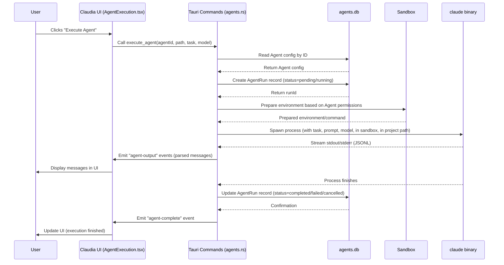

# Chapter 2: Agents

Welcome back to the `claudia` tutorial! In [Chapter 1: Session/Project Management](01_session_project_management_.md), we learned how `claudia` helps you keep track of your conversations with Claude Code by organizing them into projects and sessions stored in the `~/.claude` directory.

Now that you know how to find your past work, let's talk about the next key concept in `claudia`: **Agents**.

## What is an Agent?

Imagine you use Claude Code for different kinds of tasks. Sometimes you need it to act as a strict code reviewer, sometimes as a creative brainstorming partner, and other times as a focused debugger. Each task might require Claude to have a different "personality" or set of instructions.

Instead of typing out the same long system prompt (the initial instructions you give to Claude) every time, `claudia` lets you save these configurations as **Agents**.

Think of an Agent as a pre-packaged, specialized assistant you create within `claudia`. Each Agent is designed for a specific purpose, with its own instructions and capabilities already defined.

**In simpler terms:**

*   An Agent is like a saved profile for how you want Claude Code to behave.
*   You give it a name (like "Bug Hunter" or "Documentation Writer").
*   You give it an icon to easily spot it.
*   You give it a "System Prompt" - this is the set of rules or instructions that tell Claude how to act for this specific Agent. For example, a "Bug Hunter" agent might have a system prompt like, "You are an expert Python debugger. Analyze the provided code snippets for potential bugs, common errors, and suggest fixes."
*   You can set what permissions it has (like if it's allowed to read or write files).
*   You choose which Claude model it should use (like Sonnet or Opus).

Once an Agent is created, you can select it, give it a specific task (like "debug the function in `main.py`"), choose a project directory, and hit "Execute". `claudia` then runs the Claude Code CLI using *that Agent's* configuration.

This is much more efficient than manually setting options every time you use Claude Code for a particular job!

## Key Parts of an Agent

Let's break down the core components that make up an Agent in `claudia`. You'll configure these when you create or edit an Agent:

| Part            | Description                                                                 | Why it's important                                  |
| :-------------- | :-------------------------------------------------------------------------- | :-------------------------------------------------- |
| **Name**        | A human-readable label (e.g., "Code Reviewer", "Creative Writer").        | Helps you identify the Agent.                       |
| **Icon**        | A visual symbol (e.g., 🤖, ✨, 🛠️).                                         | Makes it easy to find the right Agent at a glance.  |
| **System Prompt** | The core instructions given to Claude at the start of the conversation.     | Defines the Agent's role, personality, and rules. |
| **Model**       | Which Claude model (e.g., Sonnet, Opus) the Agent should use.               | Affects performance, capabilities, and cost.        |
| **Permissions** | Controls what the Agent is allowed to do (file read/write, network).        | **Crucial for security** when running code or tools. |
| **Default Task**| Optional pre-filled text for the task input field when running the Agent. | Saves time for common tasks with this Agent.        |

## Creating and Managing Agents

`claudia` provides a friendly user interface for managing your Agents. You'll typically find this in the main menu under something like "CC Agents".

### The Agents List

When you go to the Agents section, you'll see a list (or grid) of all the Agents you've created.

You can see their name, icon, and options to:

*   **Execute:** Run the Agent with a new task.
*   **Edit:** Change the Agent's configuration.
*   **Delete:** Remove the Agent.
*   **Create:** Add a brand new Agent.

Let's look at a simplified frontend component (`CCAgents.tsx`) that displays this list:

```typescript
// src/components/CCAgents.tsx (Simplified)
// ... imports ...
export const CCAgents: React.FC<CCAgentsProps> = ({ onBack, className }) => {
  const [agents, setAgents] = useState<Agent[]>([]);
  // ... state for loading, view mode, etc. ...

  useEffect(() => {
    // Fetch agents from the backend when the component loads
    const loadAgents = async () => {
      try {
        const agentsList = await api.listAgents(); // Call backend API
        setAgents(agentsList);
      } catch (err) {
        console.error("Failed to load agents:", err);
      }
    };
    loadAgents();
  }, []);

  // ... handleDeleteAgent, handleEditAgent, handleExecuteAgent functions ...
  // ... state for pagination ...

  return (
    // ... layout code ...
    {/* Agents Grid */}
    <div className="grid grid-cols-1 sm:grid-cols-2 lg:grid-cols-3 gap-4">
      {/* Loop through the fetched agents */}
      {agents.map((agent) => (
        <Card key={agent.id} /* ... styling ... */>
          <CardContent className="p-6 flex flex-col items-center text-center">
            <div className="mb-4">{/* Render agent icon */}</div>
            <h3 className="text-lg font-semibold mb-2">{agent.name}</h3>
            {/* ... other agent info ... */}
          </CardContent>
          <CardFooter className="p-4 pt-0 flex justify-center gap-2">
            {/* Buttons to Execute, Edit, Delete */}
            <Button size="sm" onClick={() => handleExecuteAgent(agent)}>Execute</Button>
            <Button size="sm" onClick={() => handleEditAgent(agent)}>Edit</Button>
            <Button size="sm" onClick={() => handleDeleteAgent(agent.id!)}>Delete</Button>
          </CardFooter>
        </Card>
      ))}
    </div>
    // ... pagination and other UI elements ...
  );
};
// ... AGENT_ICONS and other types ...
```

This simplified code shows how the `CCAgents` component fetches a list of `Agent` objects from the backend using `api.listAgents()` and then displays them in cards, providing buttons for common actions.

### Creating or Editing an Agent

Clicking "Create" or "Edit" takes you to a different view (`CreateAgent.tsx`). Here, you'll find a form where you can fill in the details of the Agent: name, choose an icon, write the system prompt, select the model, set permissions, and add an optional default task.

A snippet from the `CreateAgent.tsx` component:

```typescript
// src/components/CreateAgent.tsx (Simplified)
// ... imports ...
export const CreateAgent: React.FC<CreateAgentProps> = ({
  agent, // If provided, we are editing
  onBack,
  onAgentCreated,
  className,
}) => {
  const [name, setName] = useState(agent?.name || "");
  const [systemPrompt, setSystemPrompt] = useState(agent?.system_prompt || "");
  // ... state for icon, model, permissions, etc. ...

  const isEditMode = !!agent;

  const handleSave = async () => {
    // ... validation ...
    try {
      // ... set saving state ...
      if (isEditMode && agent.id) {
        // Call backend API to update agent
        await api.updateAgent(agent.id, name, /* ... other fields ... */ systemPrompt, /* ... */);
      } else {
        // Call backend API to create new agent
        await api.createAgent(name, /* ... other fields ... */ systemPrompt, /* ... */);
      }
      onAgentCreated(); // Notify parent component
    } catch (err) {
      console.error("Failed to save agent:", err);
      // ... show error ...
    } finally {
      // ... unset saving state ...
    }
  };

  // ... handleBack function with confirmation ...

  return (
    // ... layout code ...
    <div className="flex flex-col h-full">
      {/* Header with Back and Save buttons */}
      <div className="flex items-center justify-between p-4 border-b">
        <Button onClick={handleBack}>Back</Button>
        <h2>{isEditMode ? "Edit CC Agent" : "Create CC Agent"}</h2>
        <Button onClick={handleSave}>Save</Button>
      </div>
      
      {/* Form fields */}
      <div className="flex-1 p-4 overflow-y-auto space-y-6">
        {/* Name Input */}
        <div className="space-y-2">
          <Label htmlFor="agent-name">Agent Name</Label>
          <Input id="agent-name" value={name} onChange={(e) => setName(e.target.value)} />
        </div>

        {/* Icon Picker */}
        {/* ... component for selecting icon ... */}

        {/* Model Selection */}
        {/* ... buttons/radios for model selection ... */}

        {/* Default Task Input */}
        {/* ... input for default task ... */}

        {/* Sandbox Settings (Separate Component) */}
        <AgentSandboxSettings /* ... props passing permission states ... */ />

        {/* System Prompt Editor */}
        <div className="space-y-2">
          <Label>System Prompt</Label>
          {/* ... MDEditor component for system prompt ... */}
        </div>
      </div>
    </div>
    // ... Toast Notification ...
  );
};
// ... AGENT_ICONS and other types ...
```

This component manages the state for the agent's properties and calls either `api.createAgent` or `api.updateAgent` from the backend API layer when the "Save" button is clicked.

Notice the inclusion of `AgentSandboxSettings`. This is a smaller component (`AgentSandboxSettings.tsx`) specifically for managing the permission toggles:

```typescript
// src/components/AgentSandboxSettings.tsx (Simplified)
// ... imports ...
export const AgentSandboxSettings: React.FC<AgentSandboxSettingsProps> = ({ 
  agent, // Receives the current agent state
  onUpdate, // Callback to notify parent of changes
  className 
}) => {
  // ... handleToggle function ...

  return (
    <Card className={cn("p-4 space-y-4", className)}>
      {/* ... Header with Shield icon ... */}
      <div className="space-y-3">
        {/* Master sandbox toggle */}
        <div className="flex items-center justify-between p-3 rounded-lg border bg-muted/30">
          <Label className="text-sm font-medium">Enable Sandbox</Label>
          <Switch 
            checked={agent.sandbox_enabled} 
            onCheckedChange={(checked) => handleToggle('sandbox_enabled', checked)} // Update parent state
          />
        </div>

        {/* Permission toggles - conditional render */}
        {agent.sandbox_enabled && (
          <div className="space-y-3 pl-4 border-l-2 border-amber-200">
            {/* File Read Toggle */}
            <div className="flex items-center justify-between">
              <Label className="text-sm font-medium">File Read Access</Label>
              <Switch 
                checked={agent.enable_file_read} 
                onCheckedChange={(checked) => handleToggle('enable_file_read', checked)} // Update parent state
              />
            </div>
            {/* File Write Toggle */}
            <div className="flex items-center justify-between">
              <Label className="text-sm font-medium">File Write Access</Label>
              <Switch 
                checked={agent.enable_file_write} 
                onCheckedChange={(checked) => handleToggle('enable_file_write', checked)} // Update parent state
              />
            </div>
            {/* Network Toggle */}
            <div className="flex items-center justify-between">
              <Label className="text-sm font-medium">Network Access</Label>
              <Switch 
                checked={agent.enable_network} 
                onCheckedChange={(checked) => handleToggle('enable_network', checked)} // Update parent state
              />
            </div>
          </div>
        )}
        {/* ... Warning when sandbox disabled ... */}
      </div>
    </Card>
  );
};
```

This component simply displays the current sandbox settings for the agent and provides switches to toggle them. When a switch is toggled, it calls the `onUpdate` prop to inform the parent (`CreateAgent`) component, which manages the overall agent state.

## Executing an Agent

Once you have agents created, the main purpose is to *run* them. Selecting an agent from the list and clicking "Execute" (or the Play button) takes you to the Agent Execution view (`AgentExecution.tsx`).

Here's where you:

1.  Select a **Project Path**: This is the directory where the agent will run and where it can potentially read/write files (subject to its permissions). This ties back to the projects we discussed in [Chapter 1: Session/Project Management](01_session_project_management_.md).
2.  Enter the **Task**: This is the specific request you have for the agent *for this particular run*.
3.  (Optional) Override the **Model**: Choose a different model (Sonnet/Opus) just for this run if needed.
4.  Click **Execute**.

The `AgentExecution.tsx` component handles this:

```typescript
// src/components/AgentExecution.tsx (Simplified)
// ... imports ...
export const AgentExecution: React.FC<AgentExecutionProps> = ({
  agent, // The agent being executed
  onBack,
  className,
}) => {
  const [projectPath, setProjectPath] = useState("");
  const [task, setTask] = useState("");
  const [model, setModel] = useState(agent.model || "sonnet"); // Default to agent's model
  const [isRunning, setIsRunning] = useState(false);
  const [messages, setMessages] = useState<ClaudeStreamMessage[]>([]); // Output messages
  // ... state for stats, errors, etc. ...

  // ... useEffect for listeners and timers ...

  const handleSelectPath = async () => {
    // Use Tauri dialog to select a directory
    const selected = await open({ directory: true, multiple: false });
    if (selected) {
      setProjectPath(selected as string);
    }
  };

  const handleExecute = async () => {
    if (!projectPath || !task.trim()) return; // Basic validation

    try {
      setIsRunning(true);
      setMessages([]); // Clear previous output
      // ... reset stats, setup listeners ...

      // Call backend API to execute the agent
      await api.executeAgent(agent.id!, projectPath, task, model);

    } catch (err) {
      console.error("Failed to execute agent:", err);
      // ... show error, update state ...
    }
  };

  // ... handleStop, handleBackWithConfirmation functions ...

  return (
    // ... layout code ...
    <div className={cn("flex flex-col h-full", className)}>
      {/* Header with Back button and Agent Name */}
      <div className="flex items-center justify-between p-4 border-b">
        <Button onClick={handleBackWithConfirmation}>Back</Button>
        <h2>{agent.name}</h2>
        {/* ... Running status indicator ... */}
      </div>

      {/* Configuration Section */}
      <div className="p-4 border-b space-y-4">
        {/* ... Error display ... */}
        {/* Project Path Input with Select Button */}
        <div className="space-y-2">
          <Label>Project Path</Label>
          <Input value={projectPath} onChange={(e) => setProjectPath(e.target.value)} disabled={isRunning} />
          <Button onClick={handleSelectPath} disabled={isRunning}>Select Path</Button>
        </div>
        {/* Model Selection Buttons */}
        {/* ... buttons for Sonnet/Opus selection ... */}
        {/* Task Input with Execute/Stop Button */}
        <div className="space-y-2">
          <Label>Task</Label>
          <Input value={task} onChange={(e) => setTask(e.target.value)} disabled={isRunning} />
          <Button onClick={isRunning ? handleStop : handleExecute} disabled={!projectPath || !task.trim()}>
            {isRunning ? "Stop" : "Execute"}
          </Button>
        </div>
      </div>

      {/* Output Display Section */}
      <div className="flex-1 flex flex-col min-h-0 overflow-y-auto">
        {/* Messages are displayed here, streaming as they arrive */}
        {/* ... Rendering messages using StreamMessage component ... */}
      </div>
      
      {/* Floating Execution Control Bar */}
      {/* ... Component showing elapsed time, tokens, etc. ... */}
    </div>
    // ... Fullscreen Modal ...
  );
};
// ... AGENT_ICONS and other types ...
```

This component uses the `api.executeAgent` Tauri command to start the agent's run. It also sets up event listeners (`agent-output`, `agent-error`, `agent-complete`) to receive data and status updates from the backend *while* the agent is running. This streaming output is then displayed to the user, which we'll cover in more detail in [Chapter 7: Streamed Output Processing](07_streamed_output_processing_.md).

## How it Works: Under the Hood

Let's peek behind the curtain to understand how `claudia` handles Agents in the backend (Rust code).

### Agent Storage

Unlike projects and sessions which are managed by the Claude Code CLI itself in the filesystem (`~/.claude`), `claudia` stores its Agent definitions in a local SQLite database file, typically located within `claudia`'s application data directory (e.g., `~/.config/claudia/agents.db` on Linux, or similar paths on macOS/Windows).

The `Agent` struct in the Rust backend corresponds to the data stored for each agent:

```rust
// src-tauri/src/commands/agents.rs (Simplified)
#[derive(Debug, Serialize, Deserialize, Clone)]
pub struct Agent {
    pub id: Option<i64>, // Database ID
    pub name: String,
    pub icon: String,
    pub system_prompt: String,
    pub default_task: Option<String>,
    pub model: String, // e.g., "sonnet", "opus"
    // Permissions managed directly on the agent struct
    pub sandbox_enabled: bool,
    pub enable_file_read: bool,
    pub enable_file_write: bool,
    pub enable_network: bool,
    pub created_at: String,
    pub updated_at: String,
}
// ... rest of the file
```

The database initialization (`init_database` function) creates the `agents` table to store this information. Backend functions like `list_agents`, `create_agent`, `update_agent`, and `delete_agent` interact with this SQLite database to perform the requested actions. They simply execute standard SQL commands (SELECT, INSERT, UPDATE, DELETE) to manage the `Agent` records.

Here's a tiny snippet showing a database interaction (listing agents):

```rust
// src-tauri/src/commands/agents.rs (Simplified)
#[tauri::command]
pub async fn list_agents(db: State<'_, AgentDb>) -> Result<Vec<Agent>, String> {
    let conn = db.0.lock().map_err(|e| e.to_string())?; // Get database connection
    
    let mut stmt = conn
        .prepare("SELECT id, name, icon, system_prompt, default_task, model, sandbox_enabled, enable_file_read, enable_file_write, enable_network, created_at, updated_at FROM agents ORDER BY created_at DESC")
        .map_err(|e| e.to_string())?; // Prepare SQL query
    
    let agents = stmt
        .query_map([], |row| { // Map database rows to Agent structs
            Ok(Agent {
                id: Some(row.get(0)?),
                name: row.get(1)?,
                // ... map other fields ...
                system_prompt: row.get(3)?,
                model: row.get::<_, String>(5).unwrap_or_else(|_| "sonnet".to_string()),
                sandbox_enabled: row.get::<_, bool>(6).unwrap_or(true),
                enable_file_read: row.get::<_, bool>(7).unwrap_or(true),
                enable_file_write: row.get::<_, bool>(8).unwrap_or(true),
                enable_network: row.get::<_, bool>(9).unwrap_or(false),
                created_at: row.get(10)?,
                updated_at: row.get(11)?,
            })
        })
        .map_err(|e| e.to_string())?
        .collect::<Result<Vec<_>, _>>()
        .map_err(|e| e.to_string())?;
    
    Ok(agents) // Return the list of Agent structs
}
```

This snippet shows how `list_agents` connects to the database, prepares a simple `SELECT` statement, and then uses `query_map` to convert each row returned by the database into an `Agent` struct, which is then sent back to the frontend.

### Agent Execution Flow

When you click "Execute" for an Agent:

1.  The frontend (`AgentExecution.tsx`) calls the backend command `execute_agent` ([Chapter 4: Tauri Commands](04_tauri_commands_.md)), passing the agent's ID, the selected project path, and the entered task.
2.  The backend receives the call and retrieves the full details of the selected Agent from the database.
3.  It creates a record in the `agent_runs` database table. This table keeps track of each individual execution run of an agent, including which agent was run, the task given, the project path, and its current status (pending, running, completed, failed, cancelled). This links back to the run history shown in the `CCAgents.tsx` component and managed by the `AgentRun` struct:
    ```rust
    // src-tauri/src/commands/agents.rs (Simplified)
    #[derive(Debug, Serialize, Deserialize, Clone)]
    pub struct AgentRun {
        pub id: Option<i64>, // Database ID for this run
        pub agent_id: i64, // Foreign key linking to the Agent
        pub agent_name: String, // Stored for convenience
        pub agent_icon: String, // Stored for convenience
        pub task: String, // The task given for this run
        pub model: String, // The model used for this run
        pub project_path: String, // The directory where it was executed
        pub session_id: String, // The UUID from the Claude Code CLI session
        pub status: String, // 'pending', 'running', 'completed', 'failed', 'cancelled'
        pub pid: Option<u32>, // Process ID if running
        pub process_started_at: Option<String>,
        pub created_at: String,
        pub completed_at: Option<String>,
    }
    ```
    When the run starts, the status is set to 'running', and the Process ID (PID) is recorded.
4.  Based on the Agent's configured permissions (`enable_file_read`, `enable_file_write`, `enable_network`), the backend constructs a sandbox profile. This process involves defining rules that the operating system will enforce to limit what the `claude` process can access or do. This is a core part of the [Sandboxing](06_sandboxing_.md) concept.
5.  The backend prepares the command to launch the `claude` binary ([Chapter 5: Claude CLI Interaction](05_claude_cli_interaction_.md)). It includes arguments like:
    *   `-p "the task"`
    *   `--system-prompt "the agent's system prompt"`
    *   `--model "the selected model"`
    *   `--output-format stream-json` (to get structured output)
    *   `--dangerously-skip-permissions` (since `claudia` manages permissions via the sandbox, it tells `claude` not to ask the user).
    *   The command is also set to run in the specified project directory.
6.  The backend then *spawns* the `claude` process within the sandbox environment.
7.  As the `claude` process runs, its standard output (stdout) and standard error (stderr) streams are captured by the backend ([Chapter 7: Streamed Output Processing](07_streamed_output_processing_.md)).
8.  The backend processes this output. For JSONL output from Claude Code, it extracts information like message content and session IDs.
9.  It emits events back to the frontend (`agent-output`, `agent-error`) using the Tauri event system.
10. The frontend (`AgentExecution.tsx`) listens for these events and updates the displayed messages in real-time.
11. The backend also detects when the `claude` process finishes (either successfully, with an error, or if killed).
12. When the process finishes, the backend updates the `agent_runs` record in the database, setting the status to 'completed', 'failed', or 'cancelled' and recording the completion timestamp.

Here's a simplified sequence diagram for Agent execution:



This diagram illustrates how the frontend initiates the run, the backend fetches the agent's configuration, prepares the environment (including sandbox rules), launches the `claude` process, captures its output, and updates the UI and database based on the process's progress and completion.

## Conclusion

In this chapter, we introduced the concept of **Agents** in `claudia`. We learned that Agents are customizable configurations for the Claude Code CLI, allowing you to define specific roles, instructions (System Prompt), models, and crucially, permissions for different types of tasks.

We saw how the `claudia` UI allows you to easily create, edit, list, and execute these Agents, and how the backend stores Agent definitions in a local database. We also got a high-level view of the execution process, understanding that `claudia` launches the `claude` binary with the Agent's settings and captures its output. A key part of this is the preparation of a secure execution environment based on the Agent's defined permissions, which introduces the idea of sandboxing.

Understanding Agents is fundamental, as they are the primary way you'll interact with Claude Code through `claudia` for structured tasks. In the next chapter, we'll zoom out and look at how the different visual parts of the `claudia` application you've seen connect together – diving into [Frontend UI Components](03_frontend_ui_components_.md).

[Next Chapter: Frontend UI Components](03_frontend_ui_components_.md)

---

<sub><sup>Generated by [AI Codebase Knowledge Builder](https://github.com/The-Pocket/Tutorial-Codebase-Knowledge).</sup></sub> <sub><sup>**References**: [[1]](https://github.com/getAsterisk/claudia/blob/abe0891b0b6e0f5516343bd86ed590bdc8e479b3/src-tauri/src/commands/agents.rs), [[2]](https://github.com/getAsterisk/claudia/blob/abe0891b0b6e0f5516343bd86ed590bdc8e479b3/src/components/AgentExecution.tsx), [[3]]
```
(https://github.com/getAsterisk/claudia/blob/abe0891b0b6e0f5516343bd86ed590bdc8e479b3/src/components/AgentSandboxSettings.tsx), [[4]](https://github.com/getAsterisk/claudia/blob/abe0891b0b6e0f5516343bd86ed590bdc8e479b3/src/components/CCAgents.tsx), [[5]](https://github.com/getAsterisk/claudia/blob/abe0891b0b6e0f5516343bd86ed590bdc8e479b3/src/components/CreateAgent.tsx)</sup></sub>
