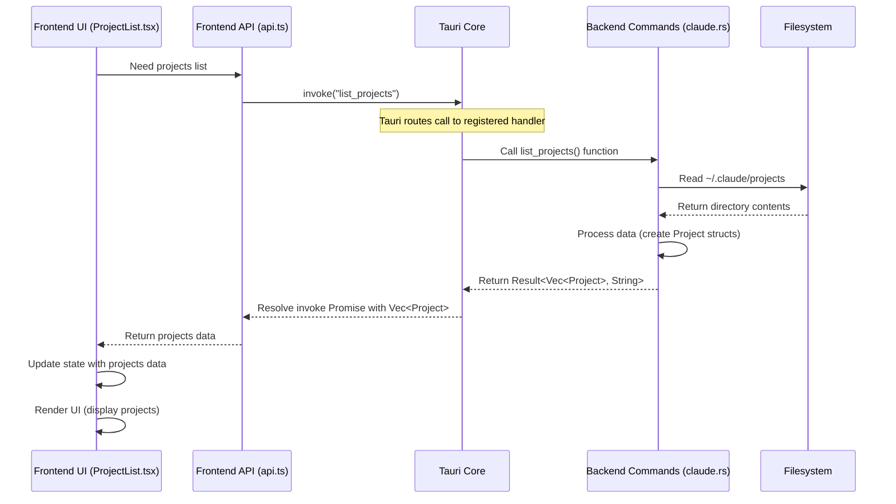

# Chapter 4: Tauri Commands

Welcome back to the `claudia` tutorial! In [Chapter 3: Frontend UI Components](03_frontend_ui_components_.md), we explored the visual building blocks that make up `claudia`'s interface, like Buttons and Cards, and how they communicate with each other using props and callbacks.

But those frontend components, written in TypeScript/JavaScript, can't directly talk to your operating system. They can't read files, launch other programs, or perform heavy computations safely and efficiently. This is where the backend, written in Rust, comes in.

We need a way for the frontend UI (your browser-like window) to ask the powerful native backend to do things for it. That communication bridge is what **Tauri Commands** are all about.

## What are Tauri Commands?

Think of Tauri Commands as a special "phone line" or "API" that connects the frontend world (where the user clicks buttons and sees things) to the backend world (where the native code runs).

When the user clicks a button in `claudia`'s UI, and that button needs to do something like:

*   List your projects (which requires reading the file system).
*   Create a new Agent (which requires saving to a database).
*   Execute a Claude Code session (which requires launching a separate process).

...the frontend can't do this itself. Instead, it calls a specific **Tauri Command** that lives in the Rust backend. The backend command performs the requested action and then sends the result back to the frontend.

**In simple terms:**

*   Tauri Commands are functions in the Rust backend.
*   They are specifically marked so that Tauri knows they can be called from the frontend.
*   The frontend calls these functions using a special `invoke` mechanism provided by Tauri.
*   This allows the frontend to trigger native actions and get data from the backend.

This separation keeps the UI responsive and safe, while the backend handles the heavy lifting and privileged operations.

## How to Call a Tauri Command from the Frontend

In `claudia`'s frontend (written in TypeScript), you call a backend command using the `invoke` function from the `@tauri-apps/api/core` library.

The `invoke` function is straightforward:

```typescript
import { invoke } from "@tauri-apps/api/core";

// ... later in your component or API helper ...

async function exampleCall() {
  try {
    // Call the command named 'list_projects'
    // If the command takes arguments, pass them as the second parameter (an object)
    const result = await invoke<any>("list_projects"); 
    
    console.log("Projects received:", result); // Handle the result
    // result will be the value returned by the Rust function
    
  } catch (error) {
    console.error("Error calling list_projects:", error); // Handle errors
  }
}

// To actually trigger it, you might call exampleCall() in response to a button click or when a page loads.
```

Let's look at the `src/lib/api.ts` file, which we briefly mentioned in previous chapters. This file provides a cleaner way to call backend commands instead of using `invoke` directly everywhere. It defines functions like `listProjects`, `getProjectSessions`, `listAgents`, `createAgent`, `executeAgent`, etc., which wrap the `invoke` calls.

Here's how the `listProjects` function is defined in `src/lib/api.ts`:

```typescript
// src/lib/api.ts (Simplified)
import { invoke } from "@tauri-apps/api/core";
// ... other imports and type definitions ...

/**
 * Represents a project in the ~/.claude/projects directory
 */
export interface Project {
  // ... project fields ...
}

/**
 * API client for interacting with the Rust backend
 */
export const api = {
  /**
   * Lists all projects in the ~/.claude/projects directory
   * @returns Promise resolving to an array of projects
   */
  async listProjects(): Promise<Project[]> { // Defines a friendly TypeScript function
    try {
      // Calls the actual Tauri command named "list_projects"
      return await invoke<Project[]>("list_projects"); 
    } catch (error) {
      console.error("Failed to list projects:", error);
      throw error; // Re-throw the error for the caller to handle
    }
  },

  // ... other API functions like getProjectSessions, listAgents, etc.
};
```

Now, in a frontend component like `ProjectList.tsx` or its parent view, instead of `invoke`, you'll see code calling `api.listProjects()`:

```typescript
// src/components/ProjectList.tsx (Simplified - from Chapter 1)
import React, { useEffect, useState } from 'react';
// ... other imports ...
import { api, type Project } from "@/lib/api"; // Import the api client and types

// ... component definition ...

export const ProjectList: React.FC<ProjectListProps> = ({ onProjectClick }) => {
  const [projects, setProjects] = useState<Project[]>([]);
  // ... other state ...

  useEffect(() => {
    // Fetch projects from the backend when the component loads
    const loadProjects = async () => {
      try {
        // Call the backend command via the api helper
        const projectsList = await api.listProjects(); 
        setProjects(projectsList); // Update the component's state with the data
      } catch (err) {
        console.error("Failed to load projects:", err);
      }
    };
    loadProjects(); // Call the function to load data
  }, []); // Empty dependency array means this runs once after initial render

  // ... render function using the 'projects' state ...
  // Uses projects.map to display each project (as shown in Chapter 1)
};
```

This shows the typical pattern: A frontend component needs data, so it calls a function in `src/lib/api.ts` (like `api.listProjects`), which in turn uses `invoke` to call the corresponding backend command. The component then uses the received data (`projectsList`) to update its state and render the UI.

## How to Define a Tauri Command in the Backend (Rust)

Now, let's look at the other side: how the backend tells Tauri that a specific Rust function can be called as a command.

This is done using the `#[tauri::command]` attribute right above the function definition. These command functions typically live in modules within the `src-tauri/src/commands/` directory (like `claude.rs` or `agents.rs`).

Here's the simplified Rust code for the `list_projects` command, located in `src-tauri/src/commands/claude.rs`:

```rust
// src-tauri/src/commands/claude.rs (Simplified)
use tauri::command;
use serde::{Serialize, Deserialize}; // Needed for sending data back

// Define the structure that will be sent back to the frontend
#[derive(Debug, Clone, Serialize, Deserialize)]
pub struct Project {
    pub id: String, 
    pub path: String,
    pub sessions: Vec<String>,
    pub created_at: u64,
}

// Mark this function as a Tauri command
#[command]
pub async fn list_projects() -> Result<Vec<Project>, String> {
    // ... Code to find ~/.claude and read project directories ...
    // This is where the file system access happens (backend logic)
    
    let mut projects = Vec::new();
    
    // Simplified: Imagine we found some projects and populated the 'projects' vector
    // For a real implementation, see the detailed code snippet in Chapter 1
    
    // Example placeholder data:
    projects.push(Project {
        id: "encoded-path-1".to_string(),
        path: "/path/to/my/project1".to_string(),
        sessions: vec!["session1_id".to_string(), "session2_id".to_string()],
        created_at: 1678886400, // Example timestamp
    });
     projects.push(Project {
        id: "encoded-path-2".to_string(),
        path: "/path/to/my/project2".to_string(),
        sessions: vec!["session3_id".to_string()],
        created_at: 1678972800, // Example timestamp
    });


    // Return the vector of Project structs.
    // Result<T, E> is often used for commands that might fail.
    // Tauri automatically serializes Vec<Project> into JSON for the frontend.
    Ok(projects) 
}

// ... other commands defined in this file ...
```

Key points here:

1.  `#[tauri::command]`: This attribute is essential. It tells Tauri to generate the necessary code to make this Rust function callable from the frontend JavaScript.
2.  `pub async fn`: Commands are typically `async` functions because they often perform non-blocking operations (like reading files, launching processes) that shouldn't block the main UI thread. They must also be `pub` (public) so Tauri can access them.
3.  `Result<Vec<Project>, String>`: This is the return type. `Result` is a standard Rust type for handling operations that can either succeed (`Ok`) or fail (`Err`). Here, on success, it returns a `Vec<Project>` (a list of `Project` structs); on failure, it returns a `String` error message. Tauri handles converting this Rust `Result` into a JavaScript Promise that resolves on `Ok` and rejects on `Err`.
4.  `#[derive(Serialize, Deserialize)]`: Any custom data structures (like `Project` here) that you want to send between the frontend and backend must be able to be converted to/from a common format like JSON. `serde` is a Rust library for this, and deriving `Serialize` and `Deserialize` (for data going back and forth) makes this automatic.

## Registering Commands

Finally, for Tauri to know about your command functions, they need to be registered in the main application entry point, `src-tauri/src/main.rs`.

In `src-tauri/src/main.rs`, there's a section using `tauri::generate_handler!` that lists all the command functions that the frontend is allowed to call:

```rust
// src-tauri/src/main.rs (Simplified)
// ... imports ...

mod commands; // Import your commands module

use commands::claude::{
    list_projects, // Import the specific command functions
    get_project_sessions,
    // ... import other claude commands ...
};
use commands::agents::{
    list_agents, // Import agent commands
    create_agent,
    execute_agent,
    // ... import other agent commands ...
};
// ... import commands from other modules like sandbox, usage, mcp ...

fn main() {
    // ... setup code ...

    tauri::Builder::default()
        // ... plugins and setup ...
        .invoke_handler(tauri::generate_handler![ // **This is where commands are registered!**
            list_projects, // List the name of each command function
            get_project_sessions,
            list_agents,
            create_agent,
            execute_agent,
            // ... list all other commands you want to expose ...
        ])
        .run(tauri::generate_context!())
        .expect("error while running tauri application");
}
```

The `tauri::generate_handler! macro` takes a list of function names that are marked with `#[tauri::command]`. It generates the code needed for Tauri's core to receive `invoke` calls from the frontend and route them to the correct Rust function. If a command isn't listed here, the frontend can't call it.

## How it Works: Under the Hood

Let's visualize the flow when the frontend calls a Tauri Command.

Imagine the user is on the Projects screen, and the `ProjectList` component needs the list of projects:



1.  The `ProjectList` component (Frontend UI) decides it needs the list of projects, perhaps in a `useEffect` hook when it mounts.
2.  It calls `api.listProjects()` (Frontend API wrapper).
3.  `api.listProjects()` calls `invoke("list_projects")`, which sends a message to the Tauri Core.
4.  The Tauri Core receives the message "call command 'list\_projects'" and looks up the corresponding registered Rust function.
5.  The Tauri Core executes the `list_projects()` function in the Backend Commands module.
6.  The Rust function performs its logic, which involves interacting with the Filesystem (reading directories and files).
7.  The Filesystem returns the necessary data to the Rust function.
8.  The Rust function processes this data and constructs the `Vec<Project>` result.
9.  The Rust function returns the `Result<Vec<Project>, String>`. Tauri automatically serializes the `Vec<Project>` into JSON.
10. The Tauri Core receives the result and sends it back to the frontend process.
11. The Promise returned by the initial `invoke` call in `api.ts` resolves with the JSON data, which Tauri automatically deserializes back into a TypeScript `Project[]` array.
12. `api.listProjects()` returns this array to the `ProjectList` component.
13. The `ProjectList` component updates its internal state, triggering React to re-render the component, displaying the list of projects on the screen.

This same pattern is used for almost all interactions where the frontend needs to get information or trigger actions in the backend. For example, when you click "Execute" for an Agent (as seen in Chapter 2), the `AgentExecution.tsx` component calls `api.executeAgent()`, which calls the backend `execute_agent` command, which then launches the `claude` binary (as we'll see in [Chapter 5: Claude CLI Interaction](05_claude_cli_interaction_.md)).

## Conclusion

In this chapter, we learned about **Tauri Commands**, the essential communication layer that bridges the gap between the frontend UI (built with React/TypeScript) and the native backend logic (written in Rust).

We saw how the frontend uses `invoke` (often wrapped by helpful functions in `src/lib/api.ts`) to call named backend commands, passing arguments and receiving results via Promises. We also saw how backend Rust functions are defined using `#[tauri::command]`, must be `pub async fn`, return a `Result`, and how data is serialized using `serde`. Finally, we looked at how these commands are registered in `src-tauri/src/main.rs` using `tauri::generate_handler!`.

Understanding Tauri Commands is crucial because they are the fundamental way `claudia`'s UI interacts with the powerful, native capabilities provided by the Rust backend. This mechanism allows the frontend to stay focused on presentation while relying on the backend for tasks like file system access, process management, and database interaction.

In the next chapter, we'll delve into the very core of `claudia`'s function: how it interacts with the command-line `claude` binary to run sessions and execute tasks.

[Next Chapter: Claude CLI Interaction](05_claude_cli_interaction_.md)

---

<sub><sup>Generated by [AI Codebase Knowledge Builder](https://github.com/The-Pocket/Tutorial-Codebase-Knowledge).</sup></sub> <sub><sup>**References**: [[1]](https://github.com/getAsterisk/claudia/blob/abe0891b0b6e0f5516343bd86ed590bdc8e479b3/src-tauri/src/commands/mod.rs), [[2]](https://github.com/getAsterisk/claudia/blob/abe0891b0b6e0f5516343bd86ed590bdc8e479b3/src-tauri/src/lib.rs), [[3]](https://github.com/getAsterisk/claudia/blob/abe0891b0b6e0f5516343bd86ed590bdc8e479b3/src-tauri/src/main.rs), [[4]](https://github.com/getAsterisk/claudia/blob/abe0891b0b6e0f5516343bd86ed590bdc8e479b3/src/lib/api.ts)</sup></sub>
````