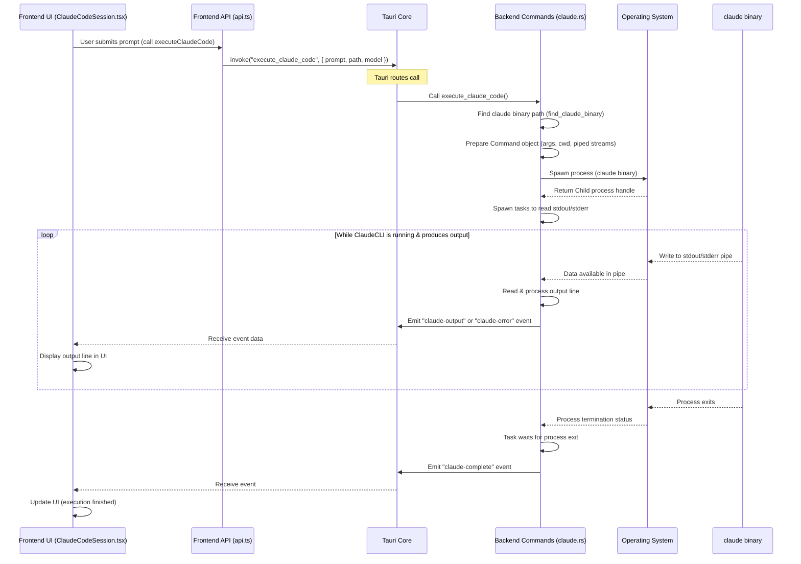

# Chapter 5: Claude CLI Interaction

Welcome back to the `claudia` tutorial! In our previous chapters, we learned about managing your work with Claude Code through [Session/Project Management](01_session_project_management_.md), creating specialized [Agents](02_agents_.md) to define how Claude should behave, how the [Frontend UI Components](03_frontend_ui_components_.md) like buttons and lists build the interface, and how [Tauri Commands](04_tauri_commands_.md) allow the frontend (TypeScript/React) to talk to the backend (Rust).

Now, let's dive into the core action: how `claudia` actually makes the powerful `claude` command-line tool run and communicate with it. This chapter is all about the **Claude CLI Interaction** layer.

## The Problem: GUI Needs to Talk to CLI

You're using `claudia`, which is a beautiful graphical application. You click buttons, type in text boxes, and see output in a nice interface. But the actual intelligence, the part that runs your requests and generates code or text, is the `claude` command-line interface (CLI) tool that you installed separately.

So, how does `claudia`'s backend, written in Rust, tell the `claude` CLI, which is a separate program running on your computer, what to do? How does it get the response back in real-time to show you?

This is exactly what the Claude CLI Interaction part of `claudia` handles. It's the bridge between the graphical application and the underlying CLI tool.

Imagine you're the director of an orchestra (`claudia`). You have a conductor's stand (the UI), but the music is played by the musicians (`claude`). You need a way to signal to the musicians what piece to play, at what tempo, and capture their performance to share with the audience. `claudia`'s CLI Interaction is your way of signaling to the `claude` process and listening to its "music" (the output).

## What the Claude CLI Interaction Does

The core function of this layer in `claudia`'s backend is to:

1.  **Find the `claude` binary:** Figure out where the `claude` executable is located on your system.
2.  **Prepare the command:** Build the command line that needs to be run, including the `claude` binary path and all the necessary arguments (like the prompt, model, system prompt, etc.).
3.  **Spawn the process:** Start the `claude` binary as a separate process.
4.  **Control the environment:** Set the working directory for the `claude` process (the project path) and potentially adjust its environment variables (like the PATH).
5.  **Manage sandboxing (Optional but important):** If sandboxing is enabled, ensure the `claude` process runs within the defined security restrictions (more on this in [Chapter 6: Sandboxing](06_sandboxing_.md)).
6.  **Capture output:** Get the standard output (stdout) and standard error (stderr) streams from the running `claude` process in real-time.
7.  **Process output:** Take the raw output (which is in a special JSONL format for Claude Code) and process it.
8.  **Report status/output:** Send the processed output and status updates (running, complete, failed) back to the frontend so the user interface can update.
9.  **Manage process lifecycle:** Keep track of the running process and handle requests to stop or kill it.

## Triggering a Claude Code Run from the Frontend

You've already seen in Chapter 4 how frontend components use `api` functions to call backend commands. This is how you initiate a Claude Code run.

Whether you're executing an Agent (from `AgentExecution.tsx`) or starting/continuing a direct session (from `ClaudeCodeSession.tsx`), the frontend makes a call to a specific backend command responsible for launching `claude`.

Here's a simplified look at how `AgentExecution.tsx` initiates a run:

```typescript
// src/components/AgentExecution.tsx (Simplified)
// ... imports ...
import { api, type Agent } from "@/lib/api";
import { listen, type UnlistenFn } from "@tauri-apps/api/event";

// ... component definition ...

const handleExecute = async () => {
  // ... validation and state updates (isLoading, etc.) ...

  try {
    // Set up event listeners first (covered in Chapter 7)
    // These listeners will receive output and status updates from the backend
    const outputUnlisten = await listen<string>("agent-output", (event) => {
      // Process received output line (JSONL)
      // ... update messages state ...
    });
    const completeUnlisten = await listen<boolean>("agent-complete", (event) => {
      // Process completion status
      // ... update isRunning state ...
    });
    // ... store unlisten functions ...

    // Call the backend command to execute the agent
    // This command prepares and spawns the 'claude' process
    await api.executeAgent(agent.id!, projectPath, task, model);

  } catch (err) {
    console.error("Failed to execute agent:", err);
    // ... handle error ...
  }
};

// ... render function with button calling handleExecute ...
```

And here's a similar pattern from `ClaudeCodeSession.tsx` for starting a new session:

```typescript
// src/components/ClaudeCodeSession.tsx (Simplified)
// ... imports ...
import { api, type Session } from "@/lib/api";
import { listen, type UnlistenFn } from "@tauri-apps/api/event";

// ... component definition ...

const handleSendPrompt = async (prompt: string, model: "sonnet" | "opus") => {
  // ... validation and state updates (isLoading, etc.) ...

  try {
    // Add the user message to the UI immediately
    // ... update messages state ...

    // Clean up old listeners, set up new ones (for "claude-output", "claude-complete")
    // ... setup listeners (covered in Chapter 7) ...

    // Call the appropriate backend command
    // This command prepares and spawns the 'claude' process
    if (isFirstPrompt && !session) {
        await api.executeClaudeCode(projectPath, prompt, model); // New session
    } else if (session && isFirstPrompt) {
        await api.resumeClaudeCode(projectPath, session.id, prompt, model); // Resume session
    } else {
        await api.continueClaudeCode(projectPath, prompt, model); // Continue conversation
    }

  } catch (err) {
    console.error("Failed to send prompt:", err);
    // ... handle error ...
  }
};

// ... render function with FloatingPromptInput component calling handleSendPrompt ...
```

These snippets show that from the frontend's perspective, starting a Claude Code interaction is simply calling a backend API function (a Tauri Command wrapper) and then listening for events that the backend sends back as the process runs and finishes.

## How it Works: Under the Hood (Backend)

When the backend receives a Tauri command like `execute_agent` or `execute_claude_code`, it performs a series of steps to launch and manage the `claude` process.

Here's a simplified step-by-step flow:

1.  **Find the `claude` executable:** The backend needs the full path to the `claude` binary. It looks in common installation locations and potentially a path saved in `claudia`'s settings.
2.  **Determine process parameters:** It gathers the necessary information for the command: the prompt (`-p`), the system prompt (`--system-prompt`, from the Agent config or CLAUDE.md), the model (`--model`), the output format (`--output-format stream-json` is crucial for real-time processing), flags like `--verbose` and `--dangerously-skip-permissions` (since `claudia` handles permissions via sandboxing), and the working directory (`--current-dir` or set via `Command`).
3.  **Prepare Sandbox (if enabled):** Based on Agent permissions or global settings, the backend constructs sandbox rules using the `gaol` library. This involves defining what file paths (`file_read_all`, `file_write_all`) and network connections (`network_outbound`) the `claude` process is allowed to make. This is tightly linked to the actual command execution.
4.  **Build the Command object:** Rust's standard library (and the `tokio` library for asynchronous operations) provides a `Command` struct to build process commands. The backend creates a `Command` instance, sets the `claude` binary path, adds all the arguments, sets the working directory (`current_dir`), and configures standard input/output (`stdin`, `stdout`, `stderr`) to be piped so the backend can capture them.
5.  **Spawn the child process:** The `Command` object is executed using a method like `spawn()`. This starts the `claude` process and gives the backend a handle to it (a `Child` object).
6.  **Capture Output Streams:** The `stdout` and `stderr` streams of the child process, which were configured to be piped, are now available as asynchronous readers. The backend spawns separate asynchronous tasks (using `tokio::spawn`) to continuously read lines from these streams.
7.  **Process and Emit:** As each line of output (usually a JSON object in the JSONL format) or error arrives, the reading tasks process it (e.g., parse JSON, extract relevant data) and immediately emit it as a Tauri event back to the frontend (`agent-output`, `claude-output`, `agent-error`, `claude-error`). This provides the real-time streaming experience.
8.  **Monitor Completion:** The backend also has a task that waits for the `claude` process to finish (`child.wait().await`). When it exits, the task notifies the frontend (e.g., via `agent-complete`, `claude-complete`) and potentially updates internal state or a database record (like the `agent_runs` table for Agents).
9.  **Handle Cancellation:** If the user requests to stop the process (e.g., clicking a "Stop" button for an Agent run), the backend uses the process ID (PID) to send a termination signal (`kill`).

Here's a sequence diagram showing the flow for a standard `execute_claude_code` call:



This diagram visually outlines how the request flows from the frontend to the backend, how the backend launches the separate `claude` process via the OS, how output streams back through the backend and Tauri, and finally how the frontend is updated in real-time.

## Diving into the Backend Code

Let's look at some key parts of the Rust code in `src-tauri/src/commands/claude.rs` and `src-tauri/src/commands/agents.rs` that handle this process interaction.

First, finding the binary and setting up the environment:

```rust
// src-tauri/src/commands/claude.rs (Simplified)
// ... imports ...
use tokio::process::Command;
use std::process::Stdio;
use tauri::{AppHandle, Emitter, Manager};

// This function tries to locate the 'claude' executable
fn find_claude_binary(app_handle: &AppHandle) -> Result<String, String> {
    // ... logic to check settings, common paths, 'which' command ...
    // Returns the found path or an error
    Ok("path/to/claude".to_string()) // Simplified
}

// This function creates a Tokio Command object, setting environment variables
fn create_command_with_env(program: &str) -> Command {
    let mut cmd = Command::new(program);
    
    // Inherit essential environment variables like PATH, HOME, etc.
    // This helps the 'claude' binary find Node.js and other dependencies
    for (key, value) in std::env::vars() {
       // ... filtering for safe/necessary variables ...
       cmd.env(&key, &value);
    }
    
    cmd // Return the Command object
}

// ... rest of the file ...
```

`find_claude_binary` is crucial to ensure `claudia` can actually find the executable regardless of how it was installed. `create_command_with_env` is a helper to build the base command object and ensure it inherits essential environment variables, which is often necessary for `claude` to run correctly, especially on macOS GUI launches where the default PATH is minimal.

Next, the core logic for spawning the process and handling its output streams. This is extracted into a helper function `spawn_claude_process` used by `execute_claude_code`, `continue_claude_code`, and `resume_claude_code`. A similar pattern exists within `execute_agent`.

```rust
// src-tauri/src/commands/claude.rs (Simplified)
// ... imports ...
use tokio::io::{AsyncBufReadExt, BufReader};

/// Helper function to spawn Claude process and handle streaming
async fn spawn_claude_process(app: AppHandle, mut cmd: Command) -> Result<(), String> {
    log::info!("Spawning Claude process...");
    
    // Configure stdout and stderr to be piped
    cmd.stdout(Stdio::piped()).stderr(Stdio::piped());
    
    // Spawn the process asynchronously
    let mut child = cmd.spawn().map_err(|e| format!("Failed to spawn Claude: {}", e))?;
    
    log::info!("Claude process spawned successfully with PID: {:?}", child.id());

    // Take the piped stdout and stderr handles
    let stdout = child.stdout.take().ok_or("Failed to get stdout")?;
    let stderr = child.stderr.take().ok_or("Failed to get stderr")?;
    
    // Create asynchronous buffered readers for the streams
    let stdout_reader = BufReader::new(stdout);
    let stderr_reader = BufReader::new(stderr);
    
    // Spawn a separate task to read and process stdout lines
    let app_handle_stdout = app.clone();
    tokio::spawn(async move {
        let mut lines = stdout_reader.lines();
        while let Ok(Some(line)) = lines.next_line().await {
            log::debug!("Claude stdout: {}", line);
            // Emit the line as an event to the frontend
            // Frontend listens for "claude-output"
            let _ = app_handle_stdout.emit("claude-output", &line); 
        }
        log::info!("Finished reading Claude stdout.");
    });
    
    // Spawn a separate task to read and process stderr lines
    let app_handle_stderr = app.clone();
    tokio::spawn(async move {
        let mut lines = stderr_reader.lines();
        while let Ok(Some(line)) = lines.next_line().await {
            log::error!("Claude stderr: {}", line);
            // Emit error lines as an event to the frontend
            // Frontend listens for "claude-error"
            let _ = app_handle_stderr.emit("claude-error", &line);
        }
         log::info!("Finished reading Claude stderr.");
    });
    
    // Spawn a task to wait for the process to finish
    let app_handle_complete = app.clone();
    tokio::spawn(async move {
        match child.wait().await { // Wait for the process to exit
            Ok(status) => {
                log::info!("Claude process exited with status: {}", status);
                // Emit a completion event to the frontend
                // Frontend listens for "claude-complete"
                 tokio::time::sleep(std::time::Duration::from_millis(100)).await; // Small delay
                let _ = app_handle_complete.emit("claude-complete", status.success());
            }
            Err(e) => {
                log::error!("Failed to wait for Claude process: {}", e);
                 tokio::time::sleep(std::time::Duration::from_millis(100)).await; // Small delay
                let _ = app_handle_complete.emit("claude-complete", false); // Indicate failure
            }
        }
    });
    
    Ok(())
}

// ... rest of the file with commands like execute_claude_code calling spawn_claude_process ...
```

This `spawn_claude_process` function is the heart of the interaction. It sets up the communication channels (`stdout`, `stderr` pipes), starts the `claude` process, and then uses `tokio::spawn` to run multiple things concurrently: reading output, reading errors, and waiting for the process to finish. Each piece of output or status change triggers an `app.emit` call, sending the information via Tauri's event system back to the frontend.

Finally, handling cancellation for Agent runs involves finding the process ID (PID) and sending a signal.

```rust
// src-tauri/src/commands/agents.rs (Simplified)
// ... imports ...
use rusqlite::{params, Connection, Result as SqliteResult}; // For database access

/// Kill a running agent session
#[tauri::command]
pub async fn kill_agent_session(
    db: State<'_, AgentDb>, // Access to the database state
    run_id: i64,
) -> Result<bool, String> {
    log::info!("Attempting to kill agent session run: {}", run_id);

    let pid_result = {
        let conn = db.0.lock().map_err(|e| e.to_string())?;
        // Retrieve the PID from the database for the specific run
        conn.query_row(
            "SELECT pid FROM agent_runs WHERE id = ?1 AND status = 'running'",
            params![run_id],
            |row| row.get::<_, Option<i64>>(0)
        )
        .map_err(|e| e.to_string())?
    };
    
    if let Some(pid) = pid_result {
        log::info!("Found PID {} for run {}", pid, run_id);
        // Use the standard library to send a kill signal
        // Behavior differs slightly on Windows vs Unix-like systems
        let kill_result = if cfg!(target_os = "windows") {
            std::process::Command::new("taskkill")
                .args(["/F", "/PID", &pid.to_string()]) // Force kill by PID
                .output()
        } else {
            std::process::Command::new("kill")
                .args(["-TERM", &pid.to_string()]) // Send termination signal
                .output()
        };
        
        match kill_result {
            Ok(output) if output.status.success() => {
                log::info!("Successfully sent kill signal to process {}", pid);
            }
            Ok(_) => {
                log::warn!("Kill command failed for PID {}", pid);
            }
            Err(e) => {
                log::warn!("Failed to execute kill command for PID {}: {}", pid, e);
            }
        }
    } else {
         log::warn!("No running PID found for run {}", run_id);
    }
    
    // Update the database to mark the run as cancelled, regardless of kill success
    let conn = db.0.lock().map_err(|e| e.to_string())?;
    let updated = conn.execute(
        "UPDATE agent_runs SET status = 'cancelled', completed_at = CURRENT_TIMESTAMP WHERE id = ?1 AND status = 'running'",
        params![run_id],
    ).map_err(|e| e.to_string())?;
    
    Ok(updated > 0) // Return true if a record was updated
}

// ... rest of the file ...
```

This `kill_agent_session` command looks up the process ID associated with the agent run in the database, then attempts to terminate that process using system commands (`kill` or `taskkill`). Finally, it updates the database record for the run to mark it as "cancelled".

## Conclusion

In this chapter, we explored the **Claude CLI Interaction** layer, which is fundamental to how `claudia` functions. We learned that this part of the backend is responsible for finding the `claude` binary, preparing the command with all necessary arguments, spawning the `claude` process, setting its environment (including sandboxing), capturing its output and errors in real-time, and managing its lifecycle until completion or cancellation.

We saw how frontend calls to Tauri Commands trigger this process, how the backend uses Rust's `Command` features and `tokio` for asynchronous stream handling, and how output and status updates are sent back to the frontend via Tauri events, enabling the real-time display of results. This interaction layer effectively turns the `claude` CLI into a powerful engine driven by the user-friendly `claudia` graphical interface.

Next, we'll take a closer look at a critical aspect touched upon in this chapter: **Sandboxing**. We'll see how `claudia` uses operating system features to limit the permissions of the `claude` process, enhancing security when running code or interacting with your file system.

[Next Chapter: Sandboxing](06_sandboxing_.md)

---

<sub><sup>Generated by [AI Codebase Knowledge Builder](https://github.com/The-Pocket/Tutorial-Codebase-Knowledge).</sup></sub> <sub><sup>**References**: [[1]](https://github.com/getAsterisk/claudia/blob/abe0891b0b6e0f5516343bd86ed590bdc8e479b3/src-tauri/src/commands/agents.rs), [[2]](https://github.com/getAsterisk/claudia/blob/abe0891b0b6e0f5516343bd86ed590bdc8e479b3/src-tauri/src/commands/claude.rs), [[3]](https://github.com/getAsterisk/claudia/blob/abe0891b0b6e0f5516343bd86ed590bdc8e479b3/src-tauri/src/sandbox/executor.rs), [[4]](https://github.com/getAsterisk/claudia/blob/abe0891b0b6e0f5516343bd86ed590bdc8e479b3/src/components/AgentExecution.tsx), [[5]](https://github.com/getAsterisk/claudia/blob/abe0891b0b6e0f5516343bd86ed590bdc8e479b3/src/components/ClaudeCodeSession.tsx)</sup></sub>
````