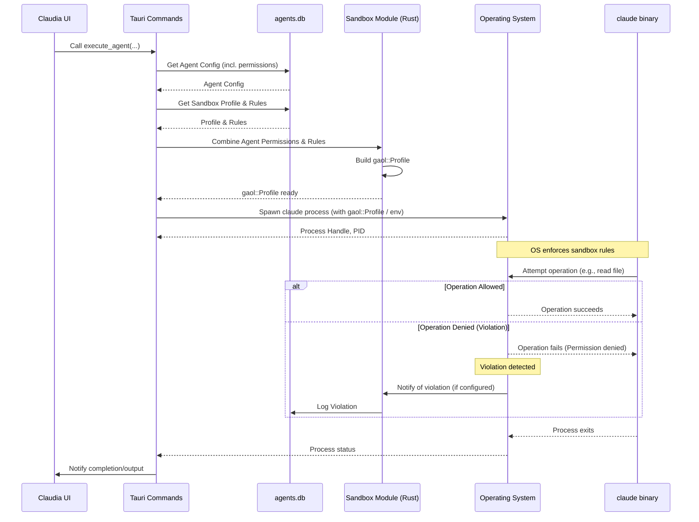

# Chapter 6: Sandboxing

Welcome back to the `claudia` tutorial! In our previous chapters, we've learned about organizing your work with [Session/Project Management](01_session_project_management_.md), defining specialized assistants with [Agents](02_agents_.md), how the [Frontend UI Components](03_frontend_ui_components_.md) create the user interface, how [Tauri Commands](04_tauri_commands_.md) connect the frontend and backend, and how `claudia` interacts with the `claude` command-line tool in [Claude CLI Interaction](05_claude_cli_interaction_.md).

Now, let's talk about a crucial aspect of security: **Sandboxing**.

## The Problem: Running Untrusted Code

When you use `claudia` to run an Agent or a direct Claude Code session, you are essentially asking the application to launch the separate `claude` binary on your computer. This `claude` binary can then execute code or perform actions based on the instructions it receives from Claude (and indirectly, from you).

Imagine you ask Claude to "write a script to delete all files in `/tmp`". While this is a harmless directory, what if you accidentally asked it to delete files in your `/Users/yourname/Documents` folder, or worse, system files? Or what if a malicious instruction somehow slipped into the context?

Running external processes, especially ones that might execute code or interact with your file system and network, introduces a security risk. By default, any program you run has the same permissions as you do. It could potentially read your sensitive files, delete important data, or connect to unwanted places on the internet.

This is where **Sandboxing** comes in.

## What is Sandboxing?

Sandboxing is like putting a protective barrier around the process that `claudia` launches (the `claude` binary). It creates a restricted environment that limits what that process can see and do on your computer, based on a predefined set of rules.

Think of it like giving the AI a restricted workspace. You give it access only to the specific tools and areas it needs to do its job for this particular task, and nothing more.

In `claudia`, sandboxing is primarily used to control the `claude` process's access to:

1.  **File System:** Prevent reading or writing files outside of specific allowed directories (like your project folder).
2.  **Network:** Prevent making unwanted connections to the internet or local network.
3.  **System Information:** Limit access to potentially sensitive system details.

By default, `claudia` aims to run Agents and sessions within a sandbox, giving you control over their permissions.

## Sandboxing with Agents

The primary way you interact with sandboxing settings in `claudia` is through the **Agent configuration**. As you saw in [Chapter 2: Agents](02_agents_.md), each Agent has specific permission toggles.

Let's revisit the simplified `AgentSandboxSettings.tsx` component from Chapter 2:

```typescript
// src/components/AgentSandboxSettings.tsx (Simplified)
// ... imports ...
import { Switch } from "@/components/ui/switch";
// ... other components ...

export const AgentSandboxSettings: React.FC<AgentSandboxSettingsProps> = ({ 
  agent, 
  onUpdate, 
  className 
}) => {
  // ... handleToggle function ...

  return (
    // ... Card and layout ...
      {/* Master sandbox toggle */}
      <div className="flex items-center justify-between">
        <Label>Enable Sandbox</Label>
        <Switch 
          checked={agent.sandbox_enabled} 
          onCheckedChange={(checked) => handleToggle('sandbox_enabled', checked)}
        />
      </div>

      {/* Permission toggles - conditional render */}
      {agent.sandbox_enabled && (
        <div className="space-y-3 pl-4 border-l-2">
          {/* File Read Toggle */}
          <div className="flex items-center justify-between">
            <Label>File Read Access</Label>
            <Switch 
              checked={agent.enable_file_read} 
              onCheckedChange={(checked) => handleToggle('enable_file_read', checked)}
            />
          </div>
          {/* File Write Toggle */}
          <div className="flex items-center justify-between">
            <Label>File Write Access</Label>
            <Switch 
              checked={agent.enable_file_write} 
              onCheckedChange={(checked) => handleToggle('enable_file_write', checked)}
            />
          </div>
          {/* Network Toggle */}
          <div className="flex items-center justify-between">
            <Label>Network Access</Label>
            <Switch 
              checked={agent.enable_network} 
              onCheckedChange={(checked) => handleToggle('enable_network', checked)}
            />
          </div>
        </div>
      )}
      {/* ... Warning when sandbox disabled ... */}
    // ... end Card ...
  );
};
```

These switches directly control whether the `claude` process launched *by this specific Agent* will be sandboxed and what high-level permissions it will have:

*   **Enable Sandbox:** The main switch. If off, sandboxing is disabled for this Agent, and the process runs with full permissions (like running `claude` directly in your terminal). This should be used with caution.
*   **File Read Access:** If enabled, the sandboxed process can read files. Without this, it might not even be able to read the source files in your project directory.
*   **File Write Access:** If enabled, the sandboxed process can create or modify files.
*   **Network Access:** If enabled, the sandboxed process can make outbound network connections (e.g., accessing APIs, cloning repositories).

These Agent-specific toggles allow you to quickly define a security posture tailored to the Agent's purpose. A "Code Reader" Agent might only need File Read. A "Code Fixer" might need File Read and Write. A "Web API Helper" might need Network Access.

## How it Works: Under the Hood

When you click "Execute" for an Agent or start a session, `claudia`'s backend takes the Agent's sandbox settings (or default settings for direct sessions) and translates them into concrete rules that the operating system can enforce.

`claudia` uses system-level sandboxing mechanisms through a library called `gaol`. `gaol` provides a way for the parent process (`claudia`'s backend) to define restrictions for a child process (`claude`).

Here's a simplified look at the steps when `claudia` launches a sandboxed `claude` process:

1.  **Get Agent Permissions:** The backend fetches the selected Agent's configuration from the database, including the `sandbox_enabled`, `enable_file_read`, `enable_file_write`, and `enable_network` fields.
2.  **Load Sandbox Profile & Rules:** `claudia` stores more detailed, reusable sandbox configurations called "Profiles" and "Rules" in its database ([Chapter 2: Agents](02_agents_.md)). The Agent might be linked to a specific Profile, or a default Profile is used. The backend loads the rules associated with this Profile.
3.  **Combine Agent Permissions and Rules:** The backend logic combines the high-level Agent toggles with the detailed Profile rules. For example, if the Agent has `enable_file_read: false`, any "file read" rules from the loaded Profile are ignored for this run. If `enable_file_read: true`, the specific paths defined in the Profile rules (like "allow reading subpaths of the project directory") are used. The project path itself (from [Chapter 1: Session/Project Management](01_session_project_management_.md)) is crucial here, as file access is often restricted to this directory.
4.  **Build `gaol` Profile:** The combined set of effective rules is used to build a `gaol::profile::Profile` object in memory. This object contains the precise operations the child process will be allowed or denied.
5.  **Prepare & Spawn Command:** The backend prepares the command to launch the `claude` binary ([Chapter 5: Claude CLI Interaction](05_claude_cli_interaction_.md)). It configures the command to run within the sandbox environment defined by the `gaol` Profile. This might involve setting special environment variables or using `gaol`'s API to spawn the child process with the restrictions already applied by the parent.
6.  **OS Enforces Sandbox:** When the `claude` process starts, the operating system, guided by the `gaol` library and the configured profile, actively monitors the process. If the `claude` process attempts an action that is *not* allowed by the sandbox rules (like trying to read a file outside the permitted paths when file read is enabled, or any file if file read is disabled), the operating system blocks the action immediately.
7.  **Violation Logging:** If a sandboxed process attempts a forbidden action, `claudia` can detect this violation and log it to its database. This helps you understand if an Agent is trying to do something unexpected.

Here's a simplified sequence diagram illustrating the sandboxing flow during execution:



This diagram shows how the Agent's settings propagate through the backend to influence the creation of the sandbox profile, which is then enforced by the operating system when the `claude` process is launched.

## Diving into the Backend Code

Let's look at snippets from the Rust code related to sandboxing, found primarily in the `src-tauri/src/sandbox/` module and `src-tauri/src/commands/sandbox.rs`.

The `Agent` struct (from `src-tauri/src/commands/agents.rs`) holds the basic toggles:

```rust
// src-tauri/src/commands/agents.rs (Simplified)
#[derive(Debug, Serialize, Deserialize, Clone)]
pub struct Agent {
    // ... other fields ...
    pub sandbox_enabled: bool,
    pub enable_file_read: bool,
    pub enable_file_write: bool, // Note: This permission is often difficult to enforce precisely via sandboxing alone and might require manual user confirmation or is inherently less secure.
    pub enable_network: bool,
    // ... other fields ...
}
```

The `src-tauri/src/commands/sandbox.rs` file contains Tauri commands for managing sandbox profiles and rules stored in the database, and for viewing violations:

```rust
// src-tauri/src/commands/sandbox.rs (Simplified)
// ... imports ...

// Represents a detailed rule in a sandbox profile
#[derive(Debug, Clone, Serialize, Deserialize)]
pub struct SandboxRule {
    pub id: Option<i64>,
    pub profile_id: i64, // Links to a profile
    pub operation_type: String, // e.g., "file_read_all", "network_outbound"
    pub pattern_type: String, // e.g., "subpath", "literal"
    pub pattern_value: String, // e.g., "{{PROJECT_PATH}}", "/home/user/.config"
    pub enabled: bool,
    pub platform_support: Option<String>, // e.g., "[\"macos\", \"linux\"]"
    pub created_at: String,
}

// Represents a log entry for a denied operation
#[derive(Debug, Clone, Serialize, Deserialize)]
pub struct SandboxViolation {
    pub id: Option<i64>,
    pub profile_id: Option<i64>, // What profile was active?
    pub agent_id: Option<i64>, // What agent was running?
    pub agent_run_id: Option<i64>, // What specific run?
    pub operation_type: String, // What was attempted?
    pub pattern_value: Option<String>, // What path/address was involved?
    pub process_name: Option<String>, // Which binary?
    pub pid: Option<i32>, // Which process ID?
    pub denied_at: String, // When did it happen?
}

// Tauri command to list sandbox profiles
#[tauri::command]
pub async fn list_sandbox_profiles(/* ... */) -> Result<Vec<SandboxProfile>, String> { /* ... */ }

// Tauri command to list rules for a profile
#[tauri::command]
pub async fn list_sandbox_rules(/* ... */) -> Result<Vec<SandboxRule>, String> { /* ... */ }

// Tauri command to view recorded violations
#[tauri::command]
pub async fn list_sandbox_violations(/* ... */) -> Result<Vec<SandboxViolation>, String> { /* ... */ }

// ... other commands for creating/updating/deleting profiles and rules ...
```

These commands allow the frontend to manage the detailed sandbox configurations that underpin the Agent's simpler toggles. For example, when you enable "File Read Access" on an Agent, the backend loads rules of `operation_type: "file_read_all"` from the selected profile.

The logic to combine Agent permissions, Profile rules, and build the `gaol::profile::Profile` happens in the `src-tauri/src/sandbox/profile.rs` and `src-tauri/src/sandbox/executor.rs` modules.

The `ProfileBuilder` is used to translate `SandboxRule` database entries into `gaol::profile::Operation` objects:

```rust
// src-tauri/src/sandbox/profile.rs (Simplified)
// ... imports ...
use gaol::profile::{Operation, PathPattern, AddressPattern, Profile};
// ... SandboxRule struct ...

pub struct ProfileBuilder {
    project_path: PathBuf, // The current project directory
    home_dir: PathBuf,     // The user's home directory
}

impl ProfileBuilder {
    // ... constructor ...

    /// Build a gaol Profile from database rules, filtered by agent permissions
    pub fn build_agent_profile(&self, rules: Vec<SandboxRule>, sandbox_enabled: bool, enable_file_read: bool, enable_file_write: bool, enable_network: bool) -> Result<ProfileBuildResult> {
        // If sandbox is disabled, return empty profile (no restrictions)
        if !sandbox_enabled {
            // ... create and return empty profile ...
        }

        let mut effective_rules = Vec::new();

        for rule in rules {
            if !rule.enabled { continue; }

            // Filter rules based on Agent permissions:
            let include_rule = match rule.operation_type.as_str() {
                "file_read_all" | "file_read_metadata" => enable_file_read,
                "network_outbound" => enable_network,
                "system_info_read" => true, // System info often needed, allow if sandbox is ON
                _ => true // Default to include if unknown
            };

            if include_rule {
                effective_rules.push(rule);
            }
        }
        
        // Always ensure project path access is included if file read is ON
        if enable_file_read {
           // ... add rule for project path if not already present ...
        }

        // Now build the actual gaol Profile from the effective rules
        self.build_profile_with_serialization(effective_rules) // This translates rules into gaol::Operation
    }

    /// Translates SandboxRules into gaol::Operation and serialized form
    fn build_operation_with_serialization(&self, rule: &SandboxRule) -> Result<Option<(Operation, SerializedOperation)>> {
        match rule.operation_type.as_str() {
            "file_read_all" => {
                 let (pattern, path, is_subpath) = self.build_path_pattern_with_info(&rule.pattern_type, &rule.pattern_value)?;
                 Ok(Some((Operation::FileReadAll(pattern), SerializedOperation::FileReadAll { path, is_subpath })))
            },
            "network_outbound" => {
                 let (pattern, serialized) = self.build_address_pattern_with_serialization(&rule.pattern_type, &rule.pattern_value)?;
                 Ok(Some((Operation::NetworkOutbound(pattern), serialized)))
            },
            // ... handle other operation types ...
            _ => Ok(None)
        }
    }

    // ... helper functions to build path/address patterns ...
}
```

The `build_agent_profile` function is key. It takes the raw rules from the database and the Agent's simple boolean toggles, then filters the rules. It also ensures essential access (like reading the project directory) is granted if file read is enabled. Finally, it calls `build_profile_with_serialization` to create the actual `gaol::Profile` object and a simplified, serializable representation of the rules (`SerializedProfile`).

This `SerializedProfile` is then passed to the `SandboxExecutor`:

```rust
// src-tauri/src/sandbox/executor.rs (Simplified)
// ... imports ...
use gaol::sandbox::Sandbox;
use tokio::process::Command;
use std::path::Path;

pub struct SandboxExecutor {
    profile: gaol::profile::Profile, // The gaol profile object
    project_path: PathBuf,
    serialized_profile: Option<SerializedProfile>, // Serialized rules for child process
}

impl SandboxExecutor {
    // ... constructor ...

    /// Prepare a tokio Command for sandboxed execution
    /// The sandbox will be activated in the child process by reading environment variables
    pub fn prepare_sandboxed_command(&self, command: &str, args: &[&str], cwd: &Path) -> Command {
        let mut cmd = Command::new(command);
        cmd.args(args).current_dir(cwd);

        // ... inherit environment variables like PATH, HOME ...

        // Serialize the sandbox rules and set environment variables
        if let Some(ref serialized) = self.serialized_profile {
             let rules_json = serde_json::to_string(serialized).expect("Failed to serialize rules");
             // NOTE: These environment variables are currently commented out in the actual code
             // for debugging and compatibility reasons.
             // In a fully enabled child-side sandboxing model, these would be set:
             // cmd.env("GAOL_SANDBOX_ACTIVE", "1");
             // cmd.env("GAOL_PROJECT_PATH", self.project_path.to_string_lossy().as_ref());
             // cmd.env("GAOL_SANDBOX_RULES", &rules_json);
             log::warn!("🚨 Sandboxing environment variables for child process are currently disabled!");
        } else {
             log::warn!("🚨 No serialized profile - running without sandbox environment!");
        }
        
        cmd.stdin(Stdio::null()).stdout(Stdio::piped()).stderr(Stdio::piped())
    }
    
    // ... Other execution methods ...
}
```

The `prepare_sandboxed_command` function takes the `gaol::profile::Profile` and the `SerializedProfile`. Although the environment variable mechanism shown above is temporarily disabled in the provided code snippets, the *intention* is for the parent process (`claudia`'s backend) to set up the environment for the child process (`claude`). The child process, if it supports this model (like `gaol`'s `ChildSandbox::activate()`), would read these environment variables upon startup and activate the sandbox *within itself* before executing the main task.

Alternatively, `gaol` also supports launching the child process directly from the sandboxed parent using `Sandbox::start()`. The provided code attempts this first but falls back due to current `gaol` library limitations regarding getting the child process handle back.

The `src-tauri/src/sandbox/platform.rs` file defines what kind of sandboxing capabilities are available and supported on the current operating system (Linux, macOS, FreeBSD have some support).

```rust
// src-tauri/src/sandbox/platform.rs (Simplified)
// ... imports ...

#[derive(Debug, Clone, Serialize, Deserialize)]
pub struct PlatformCapabilities {
    pub os: String,
    pub sandboxing_supported: bool, // Is sandboxing generally possible?
    // ... details about specific operation support ...
}

pub fn get_platform_capabilities() -> PlatformCapabilities { /* ... detects OS and returns capabilities ... */ }
pub fn is_sandboxing_available() -> bool { /* ... checks if OS is supported ... */ }
```

This is used by the UI (via the `get_platform_capabilities` command) to inform the user if sandboxing is fully supported or if there are limitations on their platform.

In summary, sandboxing in `claudia` works by:
1.  Allowing users to set high-level permissions (read/write/network) on Agents via the UI.
2.  Storing detailed, reusable sandbox Profiles and Rules in the backend database.
3.  Combining Agent permissions with Profile rules in the backend to create a specific set of restrictions for a given process run.
4.  Using system-level sandboxing features (via the `gaol` library and potentially environment variables) to apply these restrictions when launching the `claude` process.
5.  Logging any attempts by the sandboxed process to violate these rules.

This multi-layered approach provides both ease of use (Agent toggles) and flexibility (detailed rules in Profiles), significantly improving security when running AI-generated instructions or code.

## Conclusion

In this chapter, we explored **Sandboxing**, `claudia`'s security system. We learned why running external processes requires security measures and how sandboxing provides a protective barrier to limit what the `claude` process can access or do.

We saw how you control sandboxing primarily through Agent permissions in the UI, enabling or disabling file read, file write, and network access. We then dived into the backend to understand how these simple toggles are combined with detailed Sandbox Profile rules to build a concrete `gaol::profile::Profile`. This profile is then used to launch the `claude` binary within a restricted environment enforced by the operating system, with potential violations being logged.

Understanding sandboxing is key to securely leveraging the power of Claude Code, especially when it interacts with your local file system.

In the next chapter, we'll learn how `claudia` handles the continuous stream of output from the `claude` binary to update the UI in real-time: [Streamed Output Processing](07_streamed_output_processing_.md).

[Next Chapter: Streamed Output Processing](07_streamed_output_processing_.md)

---

<sub><sup>Generated by [AI Codebase Knowledge Builder](https://github.com/The-Pocket/Tutorial-Codebase-Knowledge).</sup></sub> <sub><sup>**References**: [[1]](https://github.com/getAsterisk/claudia/blob/abe0891b0b6e0f5516343bd86ed590bdc8e479b3/src-tauri/src/commands/sandbox.rs), [[2]](https://github.com/getAsterisk/claudia/blob/abe0891b0b6e0f5516343bd86ed590bdc8e479b3/src-tauri/src/sandbox/executor.rs), [[3]](https://github.com/getAsterisk/claudia/blob/abe0891b0b6e0f5516343bd86ed590bdc8e479b3/src-tauri/src/sandbox/mod.rs), [[4]](https://github.com/getAsterisk/claudia/blob/abe0891b0b6e0f5516343bd86ed590bdc8e479b3/src-tauri/src/sandbox/platform.rs), [[5]](https://github.com/getAsterisk/claudia/blob/abe0891b0b6e0f5516343bd86ed590bdc8e479b3/src-tauri/src/sandbox/profile.rs), [[6]](https://github.com/getAsterisk/claudia/blob/abe0891b0b6e0f5516343bd86ed590bdc8e479b3/src/components/AgentSandboxSettings.tsx)</sup></sub>
````