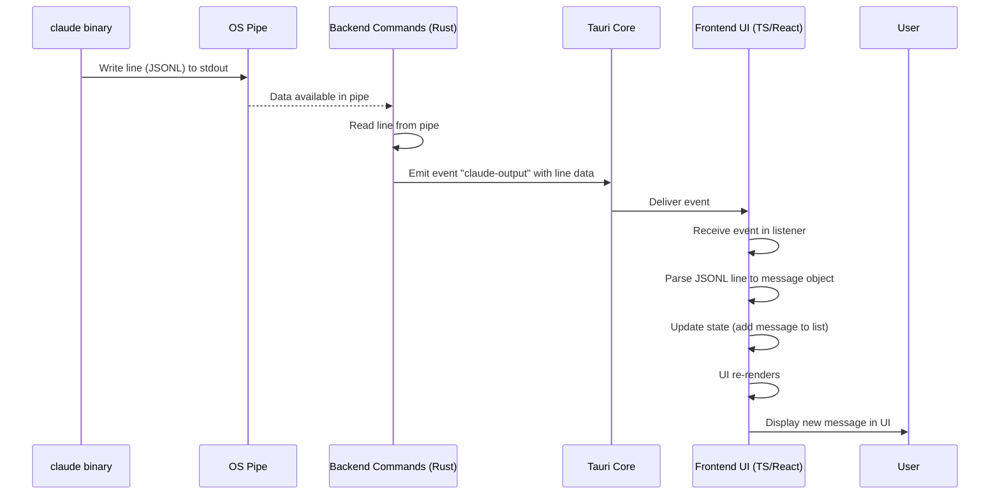

# Chapter 7: Streamed Output Processing

Welcome back to the `claudia` tutorial! In our previous chapters, we've learned about organizing your work with [Session/Project Management](01_session_project_management_.md), defining specialized assistants with [Agents](02_agents_.md), how the [Frontend UI Components](03_frontend_ui_components_.md) create the user interface, how [Tauri Commands](04_tauri_commands_.md) connect the frontend and backend, how `claudia` interacts with the `claude` command-line tool in [Claude CLI Interaction](05_claude_cli_interaction_.md), and how [Sandboxing](06_sandboxing_.md) keeps things secure.

Now, let's look at how `claudia` handles the constant flow of information coming *from* the `claude` binary while it's running. This is the concept of **Streamed Output Processing**.

## The Problem: Real-time Updates

Imagine you ask Claude Code to perform a complex task, like analyzing your codebase or generating a long piece of documentation. This process can take time. The `claude` command-line tool doesn't just wait until it's completely finished and then dump all the results at once. Instead, it often sends its output piece by piece: a thought process here, a tool call there, a chunk of generated text, and finally, a result message.

As a user of `claudia`'s graphical interface, you don't want to stare at a frozen screen waiting for everything to finish. You want to see what Claude is doing *right now*, as it's happening. You want a live view of its progress.

This is the problem that Streamed Output Processing solves. `claudia` needs to capture this real-time, piece-by-piece output from the `claude` process and display it to you instantly.

Think of it like watching a live news feed or a chat application. Messages appear as they are sent, not all bundled up and delivered at the very end.

## What is Streamed Output Processing?

Streamed Output Processing in `claudia` refers to the entire system that:

1.  **Captures** the output from the running `claude` process *as it is generated*.
2.  **Receives** this output in the backend, often as a stream of data.
3.  **Parses** this data (which is typically in a specific format called JSONL) line by line.
4.  **Transforms** each parsed piece into a structured message that the frontend understands.
5.  **Sends** these structured messages from the backend to the frontend immediately.
6.  **Displays** these messages in the user interface as they arrive, providing a live, dynamic view.

The core idea is that the output is treated as a *stream* – a continuous flow of data arriving over time – rather than a single large block of data at the end.

## How it Looks in the UI

When you execute an Agent or run an interactive session in `claudia`, the main part of the screen fills up with messages as they come in.

You'll see different types of messages appear:

*   Initial system messages (showing session info, tools available).
*   Assistant messages (Claude's thoughts, text, tool calls).
*   User messages (your prompts, tool results sent back to Claude).
*   Result messages (indicating the overall success or failure of a step).

Each of these appears in the UI as soon as `claudia` receives the corresponding piece of output from the `claude` process.

In the frontend code (like `src/components/AgentExecution.tsx` or `src/components/ClaudeCodeSession.tsx`), there's a state variable, typically an array, that holds all the messages displayed. When a new piece of output arrives, this array is updated, and React automatically re-renders the list to include the new message.

For example, in `AgentExecution.tsx`, you'll find code like this managing the displayed messages:

```typescript
// src/components/AgentExecution.tsx (Simplified)
// ... imports ...

interface AgentExecutionProps {
  // ... props ...
}

export interface ClaudeStreamMessage {
  type: "system" | "assistant" | "user" | "result";
  // ... other fields based on the JSONL structure ...
}

export const AgentExecution: React.FC<AgentExecutionProps> = ({
  agent,
  onBack,
  className,
}) => {
  // State to hold the list of messages displayed in the UI
  const [messages, setMessages] = useState<ClaudeStreamMessage[]>([]);
  // ... other state variables ...

  // ... handleExecute function ...
  
  // When a new message arrives (handled by an event listener, shown below):
  const handleNewMessage = (newMessage: ClaudeStreamMessage) => {
      setMessages(prev => [...prev, newMessage]); // Add the new message to the array
  };

  // ... render function ...
  // The rendering logic maps over the `messages` array to display each one
  // using the StreamMessage component
  /*
  return (
    // ... layout ...
    <div className="flex-1 overflow-y-auto">
      {messages.map((message, index) => (
        <StreamMessage key={index} message={message} /> // Render each message
      ))}
    </div>
    // ... rest of component ...
  );
  */
};
// ... rest of file ...
```

This state update (`setMessages`) is the frontend's way of saying, "Hey React, something new arrived, please update the list!"

## How it Works: The Data Flow

The communication happens in several steps, involving the `claude` binary, the operating system's pipes, the `claudia` backend (Rust), the Tauri framework, and the `claudia` frontend (TypeScript/React).

1.  **`claude` writes output:** The `claude` process executes your request. When it has a piece of output to share (like a tool call or a chunk of text), it writes it to its standard output (stdout).
2.  **OS captures output:** Because `claudia`'s backend spawned `claude` with piped stdout ([Chapter 5: Claude CLI Interaction](05_claude_cli_interaction_.md)), the operating system redirects `claude`'s stdout into a temporary buffer or pipe that the `claudia` backend can read from.
3.  **Backend reads line by line:** The `claudia` backend continuously reads from this pipe. It's specifically looking for newline characters to know when a complete line (a complete JSONL entry) has arrived.
4.  **Backend emits event:** As soon as the backend reads a complete line, it takes the raw string data and emits it as a Tauri event. These events have a specific name (like `"agent-output"` or `"claude-output"`) that the frontend is listening for.
5.  **Tauri delivers event:** The Tauri framework acts as the messenger, efficiently delivering the event and its data payload from the backend Rust process to the frontend JavaScript process.
6.  **Frontend receives event:** The frontend has registered event listeners using Tauri's event API. When an event with the matching name arrives, the registered callback function is executed.
7.  **Frontend processes and updates:** The callback function receives the raw output line. It parses the JSONL string into a JavaScript object and updates the component's state (`messages` array).
8.  **UI re-renders:** React detects the state change and updates only the necessary parts of the UI to display the new message.

Here is a simplified sequence diagram for this process:



This flow repeats every time `claude` outputs a new line, providing the smooth, real-time updates you see in the `claudia` interface.

## Diving into the Code

Let's look at the relevant code snippets from both the backend (Rust) and the frontend (TypeScript).

### Backend: Reading and Emitting

As seen in [Chapter 5: Claude CLI Interaction](05_claude_cli_interaction_.md), the backend uses `tokio` to handle the asynchronous reading of the process's standard output. It spawns a task that reads line by line and emits events.

Here's a simplified look at the part of `src-tauri/src/commands/claude.rs` (or similar module) that does this:

```rust
// src-tauri/src/commands/claude.rs (Simplified)
// ... imports ...
use tokio::io::{AsyncBufReadExt, BufReader};
use tauri::{AppHandle, Manager};
use tokio::process::Command; // Assuming command is already built

/// Helper function to spawn Claude process and handle streaming
async fn spawn_claude_process(app: AppHandle, mut cmd: Command) -> Result<(), String> {
    // ... Configure stdout/stderr pipes ...
    cmd.stdout(std::process::Stdio::piped()).stderr(std::process::Stdio::piped());

    let mut child = cmd.spawn().map_err(|e| format!("Failed to spawn Claude: {}", e))?;

    let stdout = child.stdout.take().ok_or("Failed to get stdout")?;
    let stdout_reader = BufReader::new(stdout);

    // Spawn a task to read stdout line by line and emit events
    let app_handle_stdout = app.clone(); // Clone handle for the async task
    tokio::spawn(async move {
        let mut lines = stdout_reader.lines();
        while let Ok(Some(line)) = lines.next_line().await {
            // Log or process the raw line
            log::debug!("Claude stdout line: {}", line);
            // Emit the line as an event to the frontend
            let _ = app_handle_stdout.emit("claude-output", &line); // <-- Emitting the event!
        }
         log::info!("Finished reading Claude stdout.");
    });

    // ... Similar task for stderr ...
    // ... Task to wait for process exit and emit completion event ...

    Ok(())
}

// Example Tauri command calling the helper
/*
#[tauri::command]
pub async fn execute_claude_code(app: AppHandle, project_path: String, prompt: String, model: String) -> Result<(), String> {
    // ... build the Command object 'cmd' ...
    spawn_claude_process(app, cmd).await // Calls the streaming helper
}
*/
```

The crucial part here is the `tokio::spawn` block that reads lines (`lines.next_line().await`) and, for each line, calls `app_handle_stdout.emit("claude-output", &line)`. This sends the raw JSONL line string to the frontend via the Tauri event system. The `"claude-output"` string is the event name.

### Frontend: Listening and Processing

In the frontend (TypeScript), the component that displays the output (like `AgentExecution.tsx` or `ClaudeCodeSession.tsx`) needs to set up listeners for these events when it loads and clean them up when it unmounts.

Here's a simplified look at the event listener setup in `AgentExecution.tsx`:

```typescript
// src/components/AgentExecution.tsx (Simplified)
// ... imports ...
import { listen, type UnlistenFn } from "@tauri-apps/api/event";
// ... ClaudeStreamMessage type ...

export const AgentExecution: React.FC<AgentExecutionProps> = ({
  agent,
  onBack,
  className,
}) => {
  const [messages, setMessages] = useState<ClaudeStreamMessage[]>([]);
  const [rawJsonlOutput, setRawJsonlOutput] = useState<string[]>([]); // Keep raw output too
  // ... other state variables ...

  const unlistenRefs = useRef<UnlistenFn[]>([]); // Ref to store unlisten functions

  useEffect(() => {
    // Set up event listeners when the component mounts or execution starts
    let outputUnlisten: UnlistenFn | undefined;
    let errorUnlisten: UnlistenFn | undefined;
    let completeUnlisten: UnlistenFn | undefined;

    const setupListeners = async () => {
       try {
            // Listen for lines from stdout
           outputUnlisten = await listen<string>("agent-output", (event) => { // <-- Listening for the event!
               try {
                   // The event payload is the raw JSONL line string
                   const rawLine = event.payload;
                   setRawJsonlOutput(prev => [...prev, rawLine]); // Store raw line

                   // Parse the JSONL string into a JavaScript object
                   const message = JSON.parse(rawLine) as ClaudeStreamMessage;

                   // Update the messages state, triggering a UI re-render
                   setMessages(prev => [...prev, message]); // <-- Updating state!

               } catch (err) {
                   console.error("Failed to process Claude output line:", err, event.payload);
                   // Handle parsing errors if necessary
               }
           });

           // Listen for stderr lines (errors)
           errorUnlisten = await listen<string>("agent-error", (event) => {
               console.error("Claude stderr:", event.payload);
               // You might want to display these errors in the UI too
           });

           // Listen for the process completion event
           completeUnlisten = await listen<boolean>("agent-complete", (event) => {
               console.log("Claude process complete:", event.payload);
               // Update UI state (e.g., hide loading indicator)
               // ... update isRunning state ...
           });

           // Store unlisten functions so we can clean them up later
           unlistenRefs.current = [outputUnlisten, errorUnlisten, completeUnlisten];

       } catch (err) {
           console.error("Failed to set up event listeners:", err);
           // Handle listener setup errors
       }
    };

    setupListeners();

    // Clean up listeners when the component unmounts
    return () => {
      unlistenRefs.current.forEach(unlisten => unlisten());
    };
  }, []); // Empty dependency array means setup runs once on mount

  // ... render function ...
};
// ... rest of file ...
```

This `useEffect` hook sets up the listener using `listen("agent-output", ...)`. The callback function receives the event, accesses the raw JSONL string via `event.payload`, parses it with `JSON.parse`, and then updates the `messages` state using `setMessages`. This sequence is the core of the streamed output processing on the frontend. The `useRef` and the cleanup function in the `useEffect` are standard React patterns for managing resources (like event listeners) that persist across renders but need to be cleaned up when the component is no longer needed.

The parsed `message` object is then passed down to the `StreamMessage` component (referenced in the provided code snippet for `src/components/StreamMessage.tsx`) which knows how to interpret the different `type` and `subtype` fields (like "assistant", "tool_use", "tool_result", "result") and render them with appropriate icons, formatting, and potentially syntax highlighting (using libraries like `react-markdown` and `react-syntax-highlighter`) or custom widgets ([ToolWidgets.tsx]).

## Conclusion

In this chapter, we explored **Streamed Output Processing**, understanding how `claudia` handles the real-time flow of information from the running `claude` command-line tool. We learned that `claude` sends output piece by piece in JSONL format, and that `claudia`'s backend captures this stream, reads it line by line, and immediately emits each line as a Tauri event to the frontend.

On the frontend, we saw how components use `listen` to subscribe to these events, parse the JSONL payload into structured message objects, and update their state to display the new information dynamically. This entire process ensures that the `claudia` UI provides a responsive, live view of the AI's progress and actions during interactive sessions and Agent runs.

Understanding streamed output is key to seeing how `claudia` provides its core real-time chat and execution experience on top of a command-line binary.

In the next chapter, we'll look at how `claudia` keeps track of multiple potentially running processes, like Agent runs or direct sessions: [Process Registry](08_process_registry_.md).

[Next Chapter: Process Registry](08_process_registry_.md)

---

<sub><sup>Generated by [AI Codebase Knowledge Builder](https://github.com/The-Pocket/Tutorial-Codebase-Knowledge).</sup></sub> <sub><sup>**References**: [[1]](https://github.com/getAsterisk/claudia/blob/abe0891b0b6e0f5516343bd86ed590bdc8e479b3/src/components/AgentExecution.tsx), [[2]](https://github.com/getAsterisk/claudia/blob/abe0891b0b6e0f5516343bd86ed590bdc8e479b3/src/components/ClaudeCodeSession.tsx), [[3]](https://github.com/getAsterisk/claudia/blob/abe0891b0b6e0f5516343bd86ed590bdc8e479b3/src/components/StreamMessage.tsx), [[4]](https://github.com/getAsterisk/claudia/blob/abe0891b0b6e0f5516343bd86ed590bdc8e479b3/src/components/ToolWidgets.tsx), [[5]](https://github.com/getAsterisk/claudia/blob/abe0891b0b6e0f5516343bd86ed590bdc8e479b3/src/types/enhanced-messages.ts)</sup></sub>
````