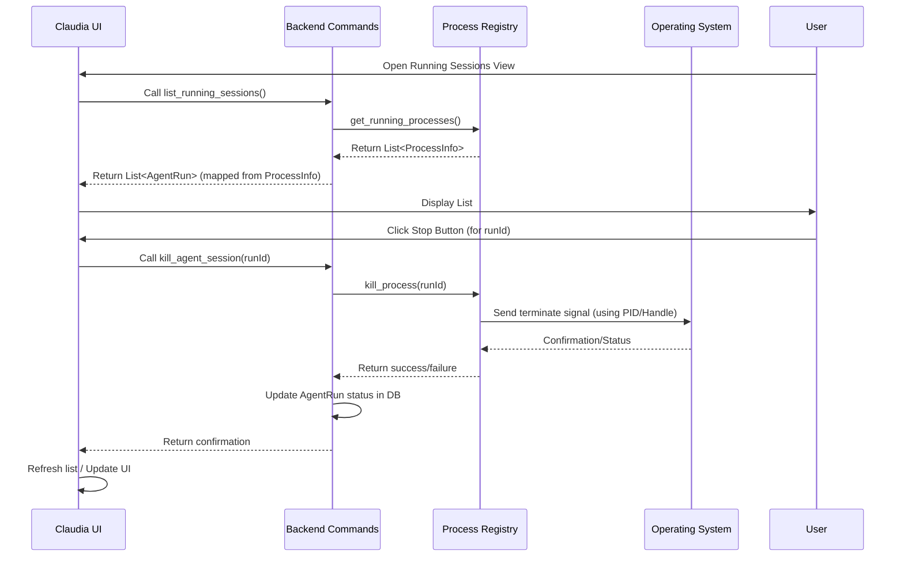

# Chapter 8: Process Registry

Welcome back to the `claudia` tutorial! In our last chapter, [Chapter 7: Streamed Output Processing](07_streamed_output_processing_.md), we learned how `claudia` captures and displays the output from the `claude` command-line tool in real-time as it's running.

Now, let's talk about something that happens just *before* that output starts streaming: launching the `claude` tool itself. When you click "Execute" for an Agent or start a new session, `claudia` doesn't just run the command and wait; it starts the `claude` binary as a separate **process** that runs in the background.

What if you run multiple agents? What if you start a session and then switch to look at something else while it's running? How does `claudia` keep track of all these separate `claude` processes? How does it know which process is which? And how can it show you their status or let you stop them if needed?

This is where the **Process Registry** comes in.

## What is the Process Registry?

Think of the Process Registry as `claudia`'s internal "Task Manager" specifically for the `claude` processes it starts. It's a system within the `claudia` backend (the Rust code) that keeps a list of all the `claude` processes that are currently running.

For each running process, the registry stores important information, such as:

*   A unique identifier for this specific "run" (like the `run_id` we saw for Agent Runs in [Chapter 2: Agents](02_agents_.md)).
*   The **Process ID (PID)** assigned by the operating system. This is like the process's unique phone number that the operating system uses to identify it.
*   The current **status** (like "running", "completed", "failed", "cancelled").
*   Information about *what* is being run (like which Agent, the task description, the project path).
*   A reference to the process itself, allowing `claudia` to interact with it (like sending a signal to stop it).
*   A temporary buffer to hold the most recent output, allowing quick access to live status without reading the entire JSONL file every time.

The Process Registry allows `claudia` to monitor these background processes, provide access to their live output streams (as discussed in [Chapter 7: Streamed Output Processing](07_streamed_output_processing_.md)), and offer controls like stopping a running task.

## The Use Case: Managing Running Sessions

The most visible use case for the Process Registry in `claudia` is the "Running Sessions" screen. This screen lists all the Agent runs or interactive sessions that `claudia` has started and are still considered "active" (running or perhaps recently finished but not yet fully cleaned up).

Here's a simplified look at the frontend component responsible for this, `RunningSessionsView.tsx`:

```typescript
// src/components/RunningSessionsView.tsx (Simplified)
import { useState, useEffect } from 'react';
// ... other imports ...
import { api } from '@/lib/api'; // Import API helper
import type { AgentRun } from '@/lib/api'; // Import data type

export function RunningSessionsView({ /* ... props ... */ }) {
  const [runningSessions, setRunningSessions] = useState<AgentRun[]>([]); // State to hold list
  const [loading, setLoading] = useState(true);
  // ... other state ...

  // Function to fetch the list of running sessions
  const loadRunningSessions = async () => {
    try {
      // Call the backend command to get running sessions
      const sessions = await api.listRunningAgentSessions(); 
      setRunningSessions(sessions); // Update state with the list
    } catch (error) {
      console.error('Failed to load running sessions:', error);
      // ... handle error ...
    } finally {
      setLoading(false);
    }
  };

  // Function to stop a session
  const killSession = async (runId: number, agentName: string) => {
    try {
      // Call the backend command to kill a session
      const success = await api.killAgentSession(runId);
      if (success) {
        console.log(`${agentName} session stopped.`);
        // Refresh the list after killing
        await loadRunningSessions();
      } else {
        console.warn('Session may have already finished');
      }
    } catch (error) {
      console.error('Failed to kill session:', error);
      // ... handle error ...
    }
  };

  useEffect(() => {
    loadRunningSessions(); // Load sessions when component mounts
    
    // Set up auto-refresh
    const interval = setInterval(() => {
      loadRunningSessions(); 
    }, 5000); // Refresh every 5 seconds

    return () => clearInterval(interval); // Clean up interval
  }, []);

  if (loading) {
    return <p>Loading running sessions...</p>; // Loading indicator
  }

  return (
    <div className="space-y-4">
      <h2>Running Agent Sessions</h2>
      {runningSessions.length === 0 ? (
        <p>No agent sessions are currently running</p>
      ) : (
        <div className="space-y-3">
          {/* Map over the runningSessions list to display each one */}
          {runningSessions.map((session) => (
            <div key={session.id}> {/* Card or similar display */}
              <h3>{session.agent_name}</h3>
              <p>Status: {session.status}</p>
              <p>PID: {session.pid}</p>
              {/* ... other details like task, project path, duration ... */}
              
              {/* Buttons to interact with the session */}
              <button onClick={() => setSelectedSession(session)}>View Output</button> {/* Set state to open viewer */}
              <button onClick={() => session.id && killSession(session.id, session.agent_name)}>Stop</button>
            </div>
          ))}
        </div>
      )}
      
      {/* Session Output Viewer component (shown when selectedSession is not null) */}
      {selectedSession && (
        <SessionOutputViewer 
          session={selectedSession} 
          onClose={() => setSelectedSession(null)} 
        />
      )}
    </div>
  );
}
```

This component demonstrates how the frontend relies on the backend's Process Registry:
1.  It calls `api.listRunningAgentSessions()` to get the current list.
2.  It displays information for each running process, including the PID and status.
3.  It provides "Stop" buttons that call `api.killAgentSession(runId)`, requesting the backend to terminate the corresponding process.
4.  It provides a "View Output" button that, when clicked, might fetch the live output buffer from the registry (using a command like `api.getLiveSessionOutput(runId)`) before potentially switching to file-based streaming ([Chapter 7: Streamed Output Processing](07_streamed_output_processing_.md)).
5.  It automatically refreshes this list periodically by calling `loadRunningSessions` again.

## How it Works: Under the Hood

The Process Registry is implemented in the Rust backend, primarily in the `src-tauri/src/process/registry.rs` file.

Here's a simplified look at what happens step-by-step:

1.  **Process Spawned:** When a backend command like `execute_agent` or `execute_claude_code` needs to launch the `claude` binary ([Chapter 5: Claude CLI Interaction](05_claude_cli_interaction_.md)), it prepares the command and then calls `child.spawn()`.
2.  **Registration:** Immediately after `child.spawn()` successfully starts the process, the backend extracts the **PID** from the returned `Child` object. It then takes the `run_id` (generated when the Agent run record was created in the database), the PID, and other relevant info (Agent name, task, project path) and calls a method on the `ProcessRegistry` instance, typically `registry.register_process(...)`.
3.  **Registry Storage:** The `ProcessRegistry` stores this information in an in-memory data structure, like a `HashMap`, where the key is the `run_id` and the value is an object containing the `ProcessInfo` and the actual `Child` handle. It also initializes a buffer for live output for this specific run.
4.  **Output Appending:** As the streaming output processing ([Chapter 7: Streamed Output Processing](07_streamed_output_processing_.md)) reads lines from the process's stdout/stderr pipes, it also appends these lines to the live output buffer associated with this run_id in the Process Registry using `registry.append_live_output(run_id, line)`.
5.  **Listing Processes:** When the frontend calls `list_running_agent_sessions` (which maps to a backend command like `list_running_sessions`), the backend accesses the `ProcessRegistry` and asks it for the list of currently registered processes (`registry.get_running_processes()`). The registry returns the stored `ProcessInfo` for each active entry in its map.
6.  **Viewing Live Output:** When the frontend calls `get_live_session_output(runId)`, the backend asks the registry for the live output buffer associated with that `runId` (`registry.get_live_output(runId)`), and returns it to the frontend.
7.  **Killing Process:** When the frontend calls `kill_agent_session(runId)`, the backend first tells the `ProcessRegistry` to attempt to terminate the process (`registry.kill_process(runId)`). The registry uses the stored `Child` handle or PID to send a termination signal to the operating system. After attempting the kill, the backend also updates the database record for that run to mark its status as 'cancelled'.
8.  **Cleanup:** Periodically, `claudia` runs a cleanup task (`cleanup_finished_processes`) that checks the status of processes currently in the registry. If a process has exited (e.g., finished naturally or was killed), the registry removes its entry (`registry.unregister_process(runId)`). This also helps keep the database status accurate.

Here's a simple sequence diagram showing the core interactions:



This diagram illustrates how the frontend relies on backend commands to query and manage the processes tracked by the Process Registry.

## Diving into the Backend Code

The core implementation of the Process Registry is found in `src-tauri/src/process/registry.rs`.

First, let's look at the `ProcessInfo` struct, which holds the basic details about a running process:

```rust
// src-tauri/src/process/registry.rs (Simplified)
// ... imports ...
use chrono::{DateTime, Utc};
use serde::{Deserialize, Serialize};

/// Information about a running agent process
#[derive(Debug, Clone, Serialize, Deserialize)]
pub struct ProcessInfo {
    pub run_id: i64,       // Matches the agent_runs database ID
    pub agent_id: i64,     // Which agent started this run
    pub agent_name: String, // Agent's name
    pub pid: u32,          // Operating System Process ID
    pub started_at: DateTime<Utc>, // When it started
    pub project_path: String, // Where it's running
    pub task: String,      // The task given
    pub model: String,     // The model used
}
```

The `ProcessRegistry` struct itself is simple; it just holds the map and uses `Arc<Mutex<...>>` for thread-safe access because multiple parts of the backend might need to interact with it concurrently.

```rust
// src-tauri/src/process/registry.rs (Simplified)
// ... imports ...
use std::collections::HashMap;
use std::sync::{Arc, Mutex};
use tokio::process::Child; // Need the process handle itself

/// Information about a running process with handle
pub struct ProcessHandle {
    pub info: ProcessInfo,
    pub child: Arc<Mutex<Option<Child>>>, // The handle to the child process
    pub live_output: Arc<Mutex<String>>,  // Buffer for live output
}

/// Registry for tracking active agent processes
pub struct ProcessRegistry {
    // Map from run_id to the ProcessHandle
    processes: Arc<Mutex<HashMap<i64, ProcessHandle>>>, 
}

impl ProcessRegistry {
    pub fn new() -> Self {
        Self {
            processes: Arc::new(Mutex::new(HashMap::new())),
        }
    }

    // ... methods like register_process, unregister_process, get_running_processes, kill_process, append_live_output, get_live_output ...
}

// Tauri State wrapper for the registry
pub struct ProcessRegistryState(pub Arc<ProcessRegistry>);
// ... Default impl ...
```

When a process is spawned, the `execute_agent` command (in `src-tauri/src/commands/agents.rs`) calls `registry.register_process`:

```rust
// src-tauri/src/commands/agents.rs (Simplified)
// ... imports ...
// Assuming 'registry' is the State<ProcessRegistryState>
// Assuming 'child' is the tokio::process::Child from cmd.spawn()...
// Assuming 'run_id', 'agent_id', etc., are defined...

// Register the process in the registry
registry.0.register_process(
    run_id,
    agent_id,
    agent.name.clone(), // Agent name
    pid,                // Process ID
    project_path.clone(),
    task.clone(),
    execution_model.clone(),
    child, // Pass the child handle
).map_err(|e| format!("Failed to register process: {}", e))?;

info!("📋 Registered process in registry");

// ... rest of the async task waiting for process to finish ...
```

The `register_process` method in the `ProcessRegistry` then locks the internal map and inserts the new entry:

```rust
// src-tauri/src/process/registry.rs (Simplified)
// ... in impl ProcessRegistry ...

/// Register a new running process
pub fn register_process(
    &self,
    run_id: i64,
    agent_id: i64,
    agent_name: String,
    pid: u32,
    project_path: String,
    task: String,
    model: String,
    child: Child, // Receives the child handle
) -> Result<(), String> {
    let mut processes = self.processes.lock().map_err(|e| e.to_string())?; // Lock the map
    
    let process_info = ProcessInfo {
        run_id, agent_id, agent_name, pid, 
        started_at: Utc::now(), 
        project_path, task, model,
    };

    let process_handle = ProcessHandle {
        info: process_info,
        child: Arc::new(Mutex::new(Some(child))), // Store the handle
        live_output: Arc::new(Mutex::new(String::new())), // Init output buffer
    };

    processes.insert(run_id, process_handle); // Insert into the map
    Ok(())
}
```

Listing running processes involves locking the map and collecting the `ProcessInfo` from each `ProcessHandle`:

```rust
// src-tauri/src/process/registry.rs (Simplified)
// ... in impl ProcessRegistry ...

/// Get all running processes
pub fn get_running_processes(&self) -> Result<Vec<ProcessInfo>, String> {
    let processes = self.processes.lock().map_err(|e| e.to_string())?; // Lock the map
    // Iterate through the map's values (ProcessHandle), clone the info field, collect into a Vec
    Ok(processes.values().map(|handle| handle.info.clone()).collect())
}
```

Killing a process involves looking up the `ProcessHandle` by `run_id`, accessing the stored `Child` handle, and calling its `kill` method:

```rust
// src-tauri/src/process/registry.rs (Simplified)
// ... in impl ProcessRegistry ...
use tokio::process::Child;

/// Kill a running process
pub async fn kill_process(&self, run_id: i64) -> Result<bool, String> {
    let processes = self.processes.lock().map_err(|e| e.to_string())?; // Lock the map
    
    if let Some(handle) = processes.get(&run_id) {
        let child_arc = handle.child.clone();
        drop(processes); // IMPORTANT: Release the lock before calling async kill()
        
        let mut child_guard = child_arc.lock().map_err(|e| e.to_string())?; // Lock the child handle
        if let Some(ref mut child) = child_guard.as_mut() {
            match child.kill().await { // Call the async kill method
                Ok(_) => {
                    *child_guard = None; // Clear the handle after killing
                    Ok(true)
                }
                Err(e) => Err(format!("Failed to kill process: {}", e)),
            }
        } else {
            Ok(false) // Process was already killed or completed
        }
    } else {
        Ok(false) // Process not found in registry
    }
}
```

Note that the `kill_agent_session` Tauri command ([src-tauri/src/commands/agents.rs]) first calls `registry.kill_process` to try terminating the *actual* OS process via the `Child` handle, and *then* updates the database status. This ensures the UI accurately reflects the state even if the process doesn't immediately exit after the signal.

The `cleanup_finished_processes` command (also in `src-tauri/src/commands/agents.rs`) periodically checks all processes currently in the registry using `registry.is_process_running()` and, if they are no longer running, updates their status in the database and removes them from the registry.

This Process Registry provides the backend's central point for managing and interacting with all the separate `claude` instances that `claudia` is running, enabling features like the "Running Sessions" view and the ability to stop tasks.

## Conclusion

In this chapter, we introduced the **Process Registry**, `claudia`'s internal system for tracking the `claude` command-line tool processes it launches in the background. We learned that it stores essential information like PID, status, and associated run details, allowing `claudia` to monitor and control these separate tasks.

We saw how the Process Registry is used to power features like the "Running Sessions" view in the UI, enabling users to see what's currently executing, view live output, and stop processes. We also delved into the backend implementation, seeing how processes are registered upon spawning, how the registry stores their handles, and how backend commands interact with the registry to list, kill, and manage these running tasks.

Understanding the Process Registry is key to seeing how `claudia` manages concurrency and provides visibility and control over the AI tasks running on your system.

In the next chapter, we'll explore **Checkpointing**, a feature that allows Claude Code to save and restore its state, enabling longer, more complex interactions across multiple runs.

[Next Chapter: Checkpointing](09_checkpointing_.md)

---

<sub><sup>Generated by [AI Codebase Knowledge Builder](https://github.com/The-Pocket/Tutorial-Codebase-Knowledge).</sup></sub> <sub><sup>**References**: [[1]](https://github.com/getAsterisk/claudia/blob/abe0891b0b6e0f5516343bd86ed590bdc8e479b3/src-tauri/src/commands/agents.rs), [[2]](https://github.com/getAsterisk/claudia/blob/abe0891b0b6e0f5516343bd86ed590bdc8e479b3/src-tauri/src/process/mod.rs), [[3]](https://github.com/getAsterisk/claudia/blob/abe0891b0b6e0f5516343bd86ed590bdc8e479b3/src-tauri/src/process/registry.rs), [[4]](https://github.com/getAsterisk/claudia/blob/abe0891b0b6e0f5516343bd86ed590bdc8e479b3/src/components/RunningSessionsView.tsx)</sup></sub>
````