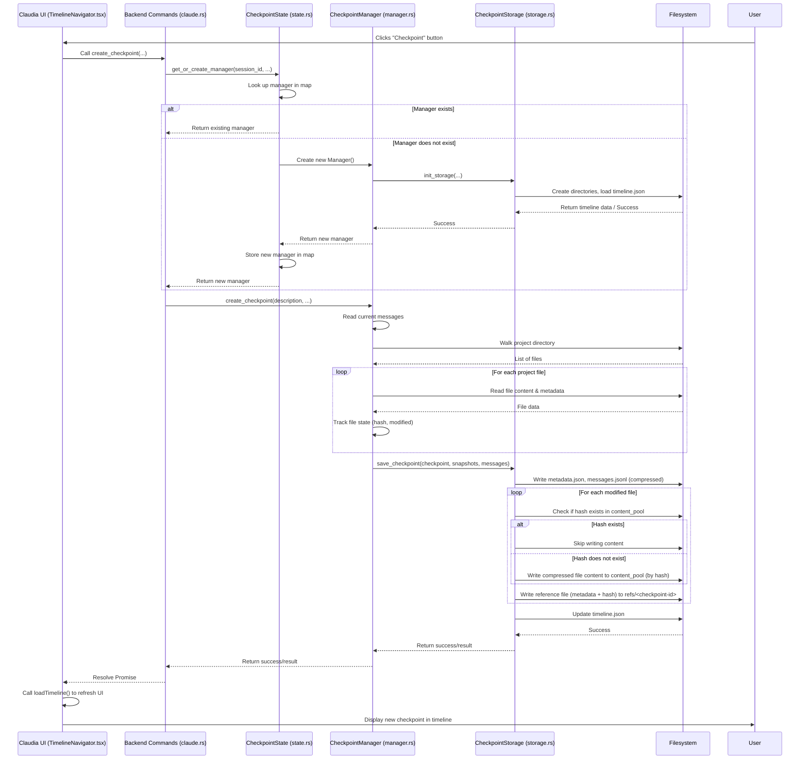

# Chapter 9: Checkpointing

Welcome back to the `claudia` tutorial! In our previous chapter, [Chapter 8: Process Registry](08_process_registry_.md), we learned how `claudia` keeps track of and manages the individual `claude` processes it launches. This allows the application to handle multiple running tasks simultaneously and provides a view of what's currently active.

Now, let's talk about preserving the state of those tasks over time, even after they finish or the application closes. This is the powerful concept of **Checkpointing**.

## The Problem: Sessions Are Temporary

Imagine you're working with Claude Code on a complex feature development within a project. You have a long conversation, make several changes to files, get some code snippets, debug an issue, and maybe even use tools to run tests. This interaction might span hours or even days across multiple `claude` runs.

Each run of `claude` is a session ([Chapter 1: Session/Project Management](01_session_project_management_.md)), and the CLI automatically saves the message history for that session. But what about the state of your project files? What if you want to go back to how the files looked *before* Claude made a specific set of changes? What if you want to experiment with a different approach, but keep the option to return to the current state?

The basic session history saves the *conversation*, but it doesn't version control your *project files*. This is where checkpoints become essential.

Think of it like writing a book. The message history is like your rough draft – a linear flow of words. But sometimes you want to save a specific version (e.g., "finished Chapter 5"), experiment with rewriting a scene, and maybe decide later to revert to that saved version or start a new version branched from it. Checkpointing provides this capability for your AI-assisted coding sessions.

## What is Checkpointing?

Checkpointing in `claudia` is a system for creating save points of your entire working state for a specific Claude Code session. A checkpoint captures two main things at a particular moment:

1.  **The complete message history** up to that point in the session.
2.  **Snapshots of your project files** that have changed since the last checkpoint (or are being tracked).

When you create a checkpoint, `claudia` records the session's conversation history and saves copies of the relevant files in a special location. This lets you revisit that exact moment later.

**In simpler terms:**

*   A Checkpoint is a snapshot of your conversation *and* your project files at a specific point in time.
*   You can create checkpoints manually whenever you want to save a significant state (like "After implementing Login feature").
*   `claudia` can also create checkpoints automatically based on certain events (like after a tool makes changes to files).
*   Checkpoints are organized in a **Timeline**, showing the history of your session like a branching tree (similar to how git commits work).
*   You can **Restore** a checkpoint to revert your message history and project files to that saved state.
*   You can **Fork** from a checkpoint to start a new conversation branch from a previous state.
*   You can **Diff** between checkpoints to see exactly which files were changed and what the changes were.

## Key Concepts in Checkpointing

Let's break down the core ideas behind `claudia`'s checkpointing system:

| Concept            | Description                                                                                                | Analogy                                         |
| :----------------- | :--------------------------------------------------------------------------------------------------------- | :---------------------------------------------- |
| **Checkpoint**     | A specific save point containing session messages and file snapshots.                                      | Saving your game progress.                      |
| **Timeline**       | The chronological history of checkpoints for a session, shown as a tree structure reflecting branching (forks). | A Git history tree or a family tree.            |
| **File Snapshot**  | A saved copy of a project file's content and metadata at a specific checkpoint. Only saves changes efficiently. | Saving individual changed files in a commit.    |
| **Restoring**      | Reverting the current session messages and project files to the state captured in a chosen checkpoint.         | Loading a previous save game.                   |
| **Forking**        | Creating a new session branch starting from a specific checkpoint.                                         | Branching in Git or creating an alternate story. |
| **Automatic Checkpoints** | Checkpoints created by `claudia` based on predefined rules (e.g., after certain actions).               | Auto-save feature in software.                  |
| **Checkpoint Strategy** | The specific rule defining when automatic checkpoints are created (Per Prompt, Per Tool Use, Smart).         | Different auto-save frequencies/triggers.       |
| **Diffing**        | Comparing two checkpoints to see the differences in file content and token usage.                          | `git diff` command.                             |

## Using Checkpointing in the UI

You interact with checkpointing primarily within a specific session view (like `ClaudeCodeSession.tsx`), typically via a dedicated section or side panel.

The `TimelineNavigator.tsx` component is the central piece of the UI for browsing and interacting with checkpoints:

```typescript
// src/components/TimelineNavigator.tsx (Simplified)
import React, { useState, useEffect } from "react";
import { GitBranch, Save, RotateCcw, GitFork, Diff } from "lucide-react";
import { Button } from "@/components/ui/button";
import { Card, CardContent } from "@/components/ui/card";
import { Badge } from "@/components/ui/badge";
import { Dialog, DialogContent, DialogHeader, DialogTitle } from "@/components/ui/dialog";
import { Input } from "@/components/ui/input";
import { Label } from "@/components/ui/label";
import { api, type Checkpoint, type TimelineNode, type SessionTimeline, type CheckpointDiff } from "@/lib/api"; // Import types and API

// ... component props interface ...

/**
 * Visual timeline navigator for checkpoint management
 */
export const TimelineNavigator: React.FC<TimelineNavigatorProps> = ({
  sessionId,
  projectId,
  projectPath,
  currentMessageIndex,
  onCheckpointSelect, // Callback for selecting a checkpoint (e.g., for Diff)
  onFork, // Callback for triggering a fork
  refreshVersion = 0, // Prop to force reload
  className
}) => {
  const [timeline, setTimeline] = useState<SessionTimeline | null>(null); // State for the timeline data
  const [selectedCheckpoint, setSelectedCheckpoint] = useState<Checkpoint | null>(null); // State for the currently selected checkpoint (for diffing, etc.)
  const [showCreateDialog, setShowCreateDialog] = useState(false); // State for the "Create Checkpoint" dialog
  const [checkpointDescription, setCheckpointDescription] = useState(""); // State for the description input
  const [isLoading, setIsLoading] = useState(false);
  // ... other state for diff dialog, errors, etc. ...

  // Effect to load the timeline when the component mounts or needs refreshing
  useEffect(() => {
    loadTimeline();
  }, [sessionId, projectId, projectPath, refreshVersion]); // Dependencies

  // Function to load timeline data from backend
  const loadTimeline = async () => {
    try {
      setIsLoading(true);
      // Call backend API to get the timeline
      const timelineData = await api.getSessionTimeline(sessionId, projectId, projectPath);
      setTimeline(timelineData); // Update state
      // ... logic to auto-expand current branch ...
    } catch (err) {
      console.error("Failed to load timeline:", err);
      // ... set error state ...
    } finally {
      setIsLoading(false);
    }
  };

  // Function to handle manual checkpoint creation
  const handleCreateCheckpoint = async () => {
    try {
      setIsLoading(true);
      // Call backend API to create a checkpoint
      await api.createCheckpoint(
        sessionId,
        projectId,
        projectPath,
        currentMessageIndex, // Pass current message count
        checkpointDescription || undefined // Pass optional description
      );
      setCheckpointDescription(""); // Clear input
      setShowCreateDialog(false); // Close dialog
      await loadTimeline(); // Reload timeline to show the new checkpoint
    } catch (err) {
      console.error("Failed to create checkpoint:", err);
      // ... set error state ...
    } finally {
      setIsLoading(false);
    }
  };

  // Function to handle restoring a checkpoint
  const handleRestoreCheckpoint = async (checkpoint: Checkpoint) => {
      // ... confirmation logic ...
    try {
      setIsLoading(true);
      // Call backend API to restore the checkpoint
      await api.restoreCheckpoint(checkpoint.id, sessionId, projectId, projectPath);
      await loadTimeline(); // Reload timeline
      // Notify parent component or session view about the restore
      // This might trigger reloading the message history from the checkpoint
      onCheckpointSelect(checkpoint); 
    } catch (err) {
      console.error("Failed to restore checkpoint:", err);
      // ... set error state ...
    } finally {
      setIsLoading(false);
    }
  };

  // Function to handle forking (delegates to parent component via callback)
  const handleFork = async (checkpoint: Checkpoint) => {
    // This component doesn't *create* the new session, it tells the parent
    // session view to initiate a fork from this checkpoint ID
    onFork(checkpoint.id); 
  };
  
   // Function to handle comparing checkpoints
  const handleCompare = async (checkpoint: Checkpoint) => {
      if (!selectedCheckpoint) {
          // If no checkpoint is selected for comparison, select this one
          setSelectedCheckpoint(checkpoint);
          // You might update UI to show this checkpoint is selected for compare
          return;
      }
      // If a checkpoint is already selected, perform the comparison
      try {
          setIsLoading(true);
          const diffData = await api.getCheckpointDiff(
              selectedCheckpoint.id, // The first selected checkpoint
              checkpoint.id,         // The checkpoint being compared against
              sessionId, projectId // Session/Project context
          );
          // ... show diffData in a dialog ...
          setDiff(diffData);
          // ... open diff dialog ...
      } catch (err) {
           console.error("Failed to get diff:", err);
           // ... set error state ...
      } finally {
          setIsLoading(false);
      }
  };


  // Recursive function to render the timeline tree structure
  const renderTimelineNode = (node: TimelineNode, depth: number = 0) => {
      // ... rendering logic for node, its children, and buttons ...
      // Each node displays checkpoint info and buttons for Restore, Fork, Diff
       const isCurrent = timeline?.currentCheckpointId === node.checkpoint.id;
       const isSelected = selectedCheckpoint?.id === node.checkpoint.id; // For compare selection


      return (
          <div key={node.checkpoint.id} className="...">
              {/* UI representation of the checkpoint */}
              <Card 
                className={cn(
                  "...",
                   isCurrent && "border-primary", // Highlight current
                   isSelected && "border-blue-500" // Highlight for compare
                )}
                onClick={() => setSelectedCheckpoint(node.checkpoint)} // Select for compare/info
              >
                  <CardContent className="...">
                      {/* Display checkpoint ID, timestamp, description, metadata (tokens, files) */}
                      <p>{node.checkpoint.id.slice(0, 8)}...</p>
                      <p>{node.checkpoint.timestamp}</p>
                      <p>{node.checkpoint.description}</p>
                      <Badge>{node.checkpoint.metadata.totalTokens} tokens</Badge>
                      <Badge>{node.checkpoint.metadata.fileChanges} files changed</Badge>

                       {/* Action Buttons */}
                       <Button onClick={(e) => { e.stopPropagation(); handleRestoreCheckpoint(node.checkpoint); }}>
                          <RotateCcw className="h-3 w-3" /> Restore
                       </Button>
                       <Button onClick={(e) => { e.stopPropagation(); handleFork(node.checkpoint); }}>
                           <GitFork className="h-3 w-3" /> Fork
                       </Button>
                        <Button onClick={(e) => { e.stopPropagation(); handleCompare(node.checkpoint); }}>
                            <Diff className="h-3 w-3" /> Compare
                        </Button>
                  </CardContent>
              </Card>
              
              {/* Recursively render children */}
              {/* ... Conditional rendering based on expanded state ... */}
              <div className="...">
                  {node.children.map((child) => renderTimelineNode(child, depth + 1))}
              </div>
          </div>
      );
  };

  return (
    <div className={cn("space-y-4", className)}>
      {/* ... Warning message ... */}
      {/* Header with "Checkpoint" button */}
      <div className="flex items-center justify-between">
        <div className="flex items-center gap-2">
          <GitBranch className="h-5 w-5 text-muted-foreground" />
          <h3 className="text-sm font-medium">Timeline</h3>
           {/* Display total checkpoints badge */}
        </div>
        <Button
          size="sm"
          variant="default"
          onClick={() => setShowCreateDialog(true)} // Open create dialog
          disabled={isLoading}
        >
          <Save className="h-3 w-3 mr-1" />
          Checkpoint
        </Button>
      </div>
      
      {/* Error display */}
      {/* ... */}
      
      {/* Render the timeline tree starting from the root node */}
      {timeline?.rootNode ? (
        <div className="relative overflow-x-auto">
          {renderTimelineNode(timeline.rootNode)}
        </div>
      ) : (
         // ... Loading/empty state ...
      )}
      
      {/* Create checkpoint dialog */}
      <Dialog open={showCreateDialog} onOpenChange={setShowCreateDialog}>
        <DialogContent>
          <DialogHeader>
            <DialogTitle>Create Checkpoint</DialogTitle>
             {/* ... Dialog description and input for description ... */}
          </DialogHeader>
           <div className="space-y-4 py-4">
             <div className="space-y-2">
               <Label htmlFor="description">Description (optional)</Label>
               <Input id="description" placeholder="..." value={checkpointDescription} onChange={e => setCheckpointDescription(e.target.value)} />
             </div>
           </div>
          <DialogFooter>
             {/* ... Cancel and Create buttons calling handleCreateCheckpoint ... */}
          </DialogFooter>
        </DialogContent>
      </Dialog>

      {/* Diff dialog (not shown here, but would display diff state) */}
      {/* ... Dialog for showing diff results ... */}
    </div>
  );
};
```

This component displays the timeline tree structure, fetched from the backend using `api.getSessionTimeline`. Each node in the tree represents a checkpoint (`TimelineNode` contains a `Checkpoint` struct). The component provides buttons to trigger actions like creating a manual checkpoint (`handleCreateCheckpoint`), restoring a checkpoint (`handleRestoreCheckpoint`), forking (`handleFork`), and comparing checkpoints (`handleCompare`). These actions call corresponding backend API functions via `src/lib/api.ts`.

You can also configure automatic checkpointing and cleanup using the `CheckpointSettings.tsx` component:

```typescript
// src/components/CheckpointSettings.tsx (Simplified)
import React, { useState, useEffect } from "react";
import { Settings, Save, Trash2, HardDrive } from "lucide-react";
import { Button } from "@/components/ui/button";
import { Label } from "@/components/ui/label";
import { Switch } from "@/components/ui/switch";
import { SelectComponent } from "@/components/ui/select";
import { Input } from "@/components/ui/input";
import { api, type CheckpointStrategy } from "@/lib/api"; // Import types and API

// ... component props interface ...

/**
 * CheckpointSettings component for managing checkpoint configuration
 */
export const CheckpointSettings: React.FC<CheckpointSettingsProps> = ({
  sessionId,
  projectId,
  projectPath,
  onClose,
  className,
}) => {
  const [autoCheckpointEnabled, setAutoCheckpointEnabled] = useState(true);
  const [checkpointStrategy, setCheckpointStrategy] = useState<CheckpointStrategy>("smart");
  const [totalCheckpoints, setTotalCheckpoints] = useState(0);
  const [keepCount, setKeepCount] = useState(10); // State for cleanup setting
  const [isLoading, setIsLoading] = useState(false);
  const [isSaving, setIsSaving] = useState(false);
  // ... error/success states ...

  const strategyOptions: SelectOption[] = [
    { value: "manual", label: "Manual Only" },
    { value: "per_prompt", label: "After Each Prompt" },
    { value: "per_tool_use", label: "After Tool Use" },
    { value: "smart", label: "Smart (Recommended)" },
  ];

  // Load settings when component mounts
  useEffect(() => {
    loadSettings();
  }, [sessionId, projectId, projectPath]);

  const loadSettings = async () => {
    try {
      setIsLoading(true);
      // Call backend API to get settings
      const settings = await api.getCheckpointSettings(sessionId, projectId, projectPath);
      setAutoCheckpointEnabled(settings.auto_checkpoint_enabled);
      setCheckpointStrategy(settings.checkpoint_strategy);
      setTotalCheckpoints(settings.total_checkpoints); // Get total count for cleanup info
    } catch (err) {
      console.error("Failed to load checkpoint settings:", err);
      // ... set error state ...
    } finally {
      setIsLoading(false);
    }
  };

  const handleSaveSettings = async () => {
    try {
      setIsSaving(true);
      // Call backend API to update settings
      await api.updateCheckpointSettings(
        sessionId,
        projectId,
        projectPath,
        autoCheckpointEnabled,
        checkpointStrategy
      );
      // ... show success message ...
    } catch (err) {
      console.error("Failed to save checkpoint settings:", err);
      // ... set error state ...
    } finally {
      setIsSaving(false);
    }
  };
  
  const handleCleanup = async () => {
    // ... confirmation ...
    try {
       setIsLoading(true);
        // Call backend API to cleanup
       const removed = await api.cleanupOldCheckpoints(
           sessionId,
           projectId,
           projectPath,
           keepCount // Pass how many recent checkpoints to keep
       );
       // ... show success message ...
       await loadSettings(); // Refresh count
    } catch (err) {
       console.error("Failed to cleanup checkpoints:", err);
        // ... set error state ...
    } finally {
        setIsLoading(false);
    }
  };

  return (
    <div className={cn("space-y-6", className)}>
      {/* ... Experimental Warning ... */}
      {/* Header */}
      <div className="flex items-center justify-between">
         {/* ... Title and icon ... */}
         {onClose && <Button onClick={onClose}>Close</Button>}
      </div>

      {/* Error/Success messages */}
      {/* ... */}

      <div className="space-y-4">
        {/* Auto-checkpoint toggle */}
        <div className="flex items-center justify-between">
          <div className="space-y-0.5">
            <Label htmlFor="auto-checkpoint">Automatic Checkpoints</Label>
            <p className="text-sm text-muted-foreground">Automatically create checkpoints</p>
          </div>
          <Switch
            id="auto-checkpoint"
            checked={autoCheckpointEnabled}
            onCheckedChange={setAutoCheckpointEnabled}
            disabled={isLoading}
          />
        </div>

        {/* Checkpoint strategy select */}
        <div className="space-y-2">
          <Label htmlFor="strategy">Checkpoint Strategy</Label>
          <SelectComponent
            value={checkpointStrategy}
            onValueChange={(value: string) => setCheckpointStrategy(value as CheckpointStrategy)}
            options={strategyOptions}
            disabled={isLoading || !autoCheckpointEnabled} // Disable if auto-checkpoint is off
          />
          {/* ... Strategy description text ... */}
        </div>

        {/* Save button */}
        <Button onClick={handleSaveSettings} disabled={isLoading || isSaving} className="w-full">
          <Save className="h-4 w-4 mr-2" /> Save Settings
        </Button>
      </div>
      
      {/* Storage Management Section */}
      <div className="border-t pt-6 space-y-4">
        <div className="flex items-center justify-between">
            {/* ... "Storage Management" title and icon ... */}
             <p className="text-sm text-muted-foreground">Total checkpoints: {totalCheckpoints}</p> {/* Display count */}
        </div>
         {/* Cleanup settings */}
        <div className="space-y-2">
          <Label htmlFor="keep-count">Keep Recent Checkpoints</Label>
           <div className="flex gap-2">
             <Input id="keep-count" type="number" min="1" max="100" value={keepCount} onChange={e => setKeepCount(parseInt(e.target.value) || 10)} disabled={isLoading} className="flex-1"/>
             <Button variant="destructive" onClick={handleCleanup} disabled={isLoading || totalCheckpoints <= keepCount}>
                 <Trash2 className="h-4 w-4 mr-2"/> Clean Up
             </Button>
           </div>
           {/* ... Cleanup description text ... */}
        </div>
      </div>
    </motion.div>
  );
};
```

This component allows you to toggle automatic checkpoints, select a strategy (Manual, Per Prompt, Per Tool Use, Smart), set how many recent checkpoints to keep, and trigger a cleanup. These actions are handled by backend commands called via `api`.

## How it Works: Under the Hood (Backend)

The checkpointing logic resides in the `src-tauri/src/checkpoint/` module. This module contains several key parts:

1.  **`checkpoint::mod.rs`**: Defines the main data structures (`Checkpoint`, `FileSnapshot`, `SessionTimeline`, `TimelineNode`, `CheckpointStrategy`, etc.) and utility structs (`CheckpointPaths`, `CheckpointDiff`).
2.  **`checkpoint::storage.rs`**: Handles reading from and writing to disk. It manages saving/loading checkpoint metadata, messages, and file snapshots. It uses content-addressable storage for file contents to save space.
3.  **`checkpoint::manager.rs`**: The core logic for managing a *single session*'s checkpoints. It tracks file changes (`FileTracker`), keeps the current message history (`current_messages`), interacts with `CheckpointStorage` for saving/loading, manages the session's `Timeline`, and handles operations like creating, restoring, and forking.
4.  **`checkpoint::state.rs`**: A stateful manager (similar to the Process Registry) that holds `CheckpointManager` instances for *all active sessions* in memory. This prevents needing to recreate managers for each command call.

Checkpoint data is stored within the `~/.claude` directory, specifically within the project's timeline directory:

`~/.claude/projects/<project-id>/.timelines/<session-id>/`

Inside this session timeline directory, you'll find:
*   `timeline.json`: Stores the `SessionTimeline` structure (the tree metadata).
*   `checkpoints/`: A directory containing subdirectories for each checkpoint ID. Each checkpoint directory (`checkpoints/<checkpoint-id>/`) holds `metadata.json` and `messages.jsonl` (the compressed messages).
*   `files/`: A directory containing file snapshots, organized into a `content_pool/` (actual compressed file contents, stored by hash) and `refs/` (references from each checkpoint back to the content pool, stored as small JSON files).

### The `CheckpointState`

Just like the Process Registry manages active processes, the `CheckpointState` manages active `CheckpointManager` instances. When a session starts or is loaded in the UI, the frontend calls a backend command which then uses `CheckpointState::get_or_create_manager` to get the manager for that session.

```rust
// src-tauri/src/checkpoint/state.rs (Simplified)
// ... imports ...
use std::collections::HashMap;
use std::sync::Arc;
use tokio::sync::RwLock; // For thread-safe async access

use super::manager::CheckpointManager;

/// Manages checkpoint managers for active sessions
#[derive(Default, Clone)]
pub struct CheckpointState {
    /// Map of session_id to CheckpointManager
    managers: Arc<RwLock<HashMap<String, Arc<CheckpointManager>>>>, // Use RwLock for concurrent reads/writes
    claude_dir: Arc<RwLock<Option<PathBuf>>>, // Claude dir path needed for storage initialization
}

impl CheckpointState {
    // ... new(), set_claude_dir(), remove_manager(), clear_all() methods ...

    /// Gets or creates a CheckpointManager for a session
    pub async fn get_or_create_manager(
        &self,
        session_id: String,
        project_id: String,
        project_path: PathBuf,
    ) -> Result<Arc<CheckpointManager>> {
        let mut managers = self.managers.write().await; // Lock for writing

        // Check if manager already exists
        if let Some(manager) = managers.get(&session_id) {
            return Ok(Arc::clone(manager)); // Return existing manager (Arc::clone increases ref count)
        }

        // ... get claude_dir ...

        // Create new manager if it doesn't exist
        let manager = CheckpointManager::new(
            project_id,
            session_id.clone(),
            project_path,
            claude_dir,
        ).await?; // CheckpointManager::new handles loading/init storage

        let manager_arc = Arc::new(manager);
        managers.insert(session_id, Arc::clone(&manager_arc)); // Store new manager
        
        Ok(manager_arc)
    }

    // ... get_manager(), list_active_sessions() methods ...
}
```

This structure ensures that the heavy work of loading the timeline and setting up file tracking only happens once per session when it's first accessed, not for every single checkpoint-related command.

### Creating a Checkpoint Flow

When the frontend requests to create a checkpoint (manually or automatically), the backend command retrieves the session's `CheckpointManager` from the `CheckpointState` and calls `manager.create_checkpoint(...)`.

Here's a simplified look at what happens inside `CheckpointManager::create_checkpoint`:

```rust
// src-tauri/src/checkpoint/manager.rs (Simplified)
// ... imports ...

impl CheckpointManager {
    // ... new(), track_message(), track_file_modification(), etc. ...

    /// Create a checkpoint
    pub async fn create_checkpoint(
        &self,
        description: Option<String>,
        parent_checkpoint_id: Option<String>, // Optional parent ID for explicit forks
    ) -> Result<CheckpointResult> {
        let messages = self.current_messages.read().await; // Get current messages
        let message_index = messages.len().saturating_sub(1);

        // ... Extract metadata (prompt, tokens, etc.) from messages ...

        // Ensure all files in the project are tracked before snapshotting
        // This discovers new files and adds them to the file tracker
        let mut all_files = Vec::new();
        let _ = collect_files(&self.project_path, &self.project_path, &mut all_files);
        for rel in all_files {
            if let Some(p) = rel.to_str() {
                let _ = self.track_file_modification(p).await; // Adds/updates tracker state
            }
        }
        
        // Generate a unique ID for the new checkpoint
        let checkpoint_id = storage::CheckpointStorage::generate_checkpoint_id();

        // Create file snapshots based on the *current* state of tracked files
        // This reads the content of files marked as modified by track_file_modification
        let file_snapshots = self.create_file_snapshots(&checkpoint_id).await?;

        // Build the Checkpoint metadata struct
        let checkpoint = Checkpoint {
            id: checkpoint_id.clone(),
            session_id: self.session_id.clone(),
            project_id: self.project_id.clone(),
            message_index,
            timestamp: Utc::now(),
            description,
            parent_checkpoint_id: parent_checkpoint_id.or_else(|| self.timeline.read().await.current_checkpoint_id.clone()), // Link to current parent or explicit parent
            // ... include extracted metadata ...
        };

        // Save the checkpoint using the storage layer
        let messages_content = messages.join("\n");
        let result = self.storage.save_checkpoint(
            &self.project_id,
            &self.session_id,
            &checkpoint,
            file_snapshots, // Pass the actual snapshots
            &messages_content, // Pass the message content
        )?;

        // ... Reload timeline from disk to incorporate new node ...
        // ... Update current_checkpoint_id in in-memory timeline ...
        // ... Reset is_modified flag in the file tracker ...

        Ok(result)
    }

    // Helper to create FileSnapshots from the FileTracker state
    async fn create_file_snapshots(&self, checkpoint_id: &str) -> Result<Vec<FileSnapshot>> {
        let tracker = self.file_tracker.read().await;
        let mut snapshots = Vec::new();

        for (rel_path, state) in &tracker.tracked_files {
            // Only snapshot files marked as modified or deleted
            if !state.is_modified && state.exists { // Only include if modified OR was deleted
                 continue; // Skip if not modified AND still exists
            }
             if state.is_modified || !state.exists { // Snapshot if modified or is now deleted
                 // ... read file content, calculate hash, get metadata ...
                 let (content, exists, permissions, size, current_hash) = { /* ... */ };

                snapshots.push(FileSnapshot {
                    checkpoint_id: checkpoint_id.to_string(),
                    file_path: rel_path.clone(),
                    content, // Content will be empty for deleted files
                    hash: current_hash, // Hash will be empty for deleted files
                    is_deleted: !exists,
                    permissions,
                    size,
                });
             }
        }
        Ok(snapshots)
    }

    // ... other methods ...
}
```

The `create_checkpoint` function coordinates the process: it reads current messages, identifies changed files using the `FileTracker`, generates file snapshots by reading changed file contents, creates the checkpoint metadata, saves everything to disk via `CheckpointStorage`, and updates the timeline.

The `FileTracker` keeps a list of files that have been referenced (either by the user or by tool outputs). The `track_file_modification` method is called whenever a file might have changed (e.g., mentioned in an edit tool output). It checks the file's current state (existence, hash, modification time) and marks it as `is_modified` if it differs from the last known state.

The `CheckpointStorage::save_checkpoint` method handles the actual disk writing, including compressing messages and file contents and managing the content-addressable storage for file snapshots (`save_file_snapshot`).

```rust
// src-tauri/src/checkpoint/storage.rs (Simplified)
// ... imports ...

impl CheckpointStorage {
    // ... new(), init_storage(), load_checkpoint(), etc. ...

    /// Save a checkpoint to disk
    pub fn save_checkpoint(/* ... arguments ... */) -> Result<CheckpointResult> {
        // ... create directories ...
        // ... save metadata.json ...
        // ... save compressed messages.jsonl ...

        // Save file snapshots (calling save_file_snapshot for each)
        let mut files_processed = 0;
        for snapshot in &file_snapshots {
            if self.save_file_snapshot(&paths, snapshot).is_ok() { // Calls helper
                files_processed += 1;
            }
        }

        // Update timeline file on disk
        self.update_timeline_with_checkpoint(/* ... */)?;

        // ... return result ...
        Ok(CheckpointResult { /* ... */ })
    }

    /// Save a single file snapshot using content-addressable storage
    fn save_file_snapshot(&self, paths: &CheckpointPaths, snapshot: &FileSnapshot) -> Result<()> {
        // Directory where actual file content is stored by hash
        let content_pool_dir = paths.files_dir.join("content_pool");
        fs::create_dir_all(&content_pool_dir)?;

        // Path to the content file based on its hash
        let content_file = content_pool_dir.join(&snapshot.hash);

        // Only write content if the file doesn't exist (avoids duplicates)
        if !content_file.exists() && !snapshot.is_deleted {
            // Compress and save file content
            let compressed_content = encode_all(snapshot.content.as_bytes(), self.compression_level)
                .context("Failed to compress file content")?;
            fs::write(&content_file, compressed_content)?;
        }

        // Create a reference file for this checkpoint's view of the file
        let checkpoint_refs_dir = paths.files_dir.join("refs").join(&snapshot.checkpoint_id);
        fs::create_dir_all(&checkpoint_refs_dir)?;

        // Save a small JSON file containing metadata and a pointer (hash) to the content pool
        let ref_metadata = serde_json::json!({
            "path": snapshot.file_path,
            "hash": snapshot.hash,
            "is_deleted": snapshot.is_deleted,
            "permissions": snapshot.permissions,
            "size": snapshot.size,
        });
        let safe_filename = snapshot.file_path.to_string_lossy().replace('/', "_").replace('\\', "_");
        let ref_path = checkpoint_refs_dir.join(format!("{}.json", safe_filename));
        fs::write(&ref_path, serde_json::to_string_pretty(&ref_metadata)?)?;

        Ok(())
    }

    // ... update_timeline_with_checkpoint() and other methods ...
}
```

This snippet shows how `save_file_snapshot` stores the *actual* file content in a `content_pool` directory, named by the file's hash. This means if the same file content appears in multiple checkpoints, it's only stored once on disk. Then, in a `refs` directory specific to the checkpoint, a small file is saved that just contains the file's metadata and a pointer (the hash) back to the content pool.

Here is a simplified sequence diagram for creating a manual checkpoint:



This diagram illustrates the flow from the user clicking a button to the backend coordinating with the manager, which in turn uses the storage layer to read and write data to the filesystem, resulting in a new checkpoint entry and updated timeline on disk.

### Restoring a Checkpoint Flow

Restoring a checkpoint works in reverse. When the frontend calls `api.restoreCheckpoint(checkpointId, ...)`, the backend finds the `CheckpointManager` and calls `manager.restore_checkpoint(checkpointId)`.

```rust
// src-tauri/src/checkpoint/manager.rs (Simplified)
// ... imports ...

impl CheckpointManager {
    // ... create_checkpoint() etc. ...

    /// Restore a checkpoint
    pub async fn restore_checkpoint(&self, checkpoint_id: &str) -> Result<CheckpointResult> {
        // Load checkpoint data using the storage layer
        let (checkpoint, file_snapshots, messages) = self.storage.load_checkpoint(
            &self.project_id,
            &self.session_id,
            checkpoint_id,
        )?;

        // Get list of all files currently in the project directory
        let mut current_files = Vec::new();
        let _ = collect_all_project_files(&self.project_path, &self.project_path, &mut current_files);

        // Determine which files need to be deleted (exist now, but not in snapshot as non-deleted)
        let mut checkpoint_files_set = std::collections::HashSet::new();
        for snapshot in &file_snapshots {
            if !snapshot.is_deleted {
                 checkpoint_files_set.insert(snapshot.file_path.clone());
            }
        }

        // Delete files not present (as non-deleted) in the checkpoint
        for current_file in current_files {
            if !checkpoint_files_set.contains(&current_file) {
                let full_path = self.project_path.join(&current_file);
                 // ... attempt fs::remove_file(&full_path) ...
                 log::info!("Deleted file not in checkpoint: {:?}", current_file);
            }
        }
        // ... attempt to remove empty directories ...


        // Restore/overwrite files from snapshots
        let mut files_processed = 0;
        for snapshot in &file_snapshots {
            // This helper handles creating parent dirs, writing content, setting permissions, or deleting
            match self.restore_file_snapshot(snapshot).await { // Calls helper
                Ok(_) => { /* ... */ },
                Err(e) => { /* ... collect warnings ... */ },
            }
            files_processed += 1;
        }

        // Update in-memory messages buffer
        let mut current_messages = self.current_messages.write().await;
        current_messages.clear();
        for line in messages.lines() {
            current_messages.push(line.to_string());
        }

        // Update the current_checkpoint_id in the in-memory timeline
        let mut timeline = self.timeline.write().await;
        timeline.current_checkpoint_id = Some(checkpoint_id.to_string());

        // Reset the file tracker state to match the restored checkpoint
        let mut tracker = self.file_tracker.write().await;
        tracker.tracked_files.clear(); // Clear old state
        for snapshot in &file_snapshots {
            if !snapshot.is_deleted {
                 tracker.tracked_files.insert(
                     snapshot.file_path.clone(),
                      FileState {
                         last_hash: snapshot.hash.clone(),
                         is_modified: false, // Assume clean state after restore
                         last_modified: Utc::now(), // Or snapshot timestamp if available?
                         exists: true,
                     }
                 );
            }
        }


        Ok(CheckpointResult { /* ... checkpoint, files_processed, warnings ... */ })
    }

    // Helper to restore a single file from its snapshot data
    async fn restore_file_snapshot(&self, snapshot: &FileSnapshot) -> Result<()> {
        let full_path = self.project_path.join(&snapshot.file_path);

        if snapshot.is_deleted {
            // If snapshot indicates deleted, remove the file if it exists
            if full_path.exists() {
                fs::remove_file(&full_path).context("Failed to delete file")?;
            }
        } else {
            // If snapshot exists, create parent directories and write content
            if let Some(parent) = full_path.parent() {
                fs::create_dir_all(parent).context("Failed to create parent directories")?;
            }
            fs::write(&full_path, &snapshot.content).context("Failed to write file")?;

            // Restore permissions (Unix only)
            #[cfg(unix)]
            if let Some(mode) = snapshot.permissions {
                use std::os::unix::fs::PermissionsExt;
                let permissions = std::fs::Permissions::from_mode(mode);
                fs::set_permissions(&full_path, permissions).context("Failed to set file permissions")?;
            }
        }
        Ok(())
    }

    // ... other methods ...
}
```

The `restore_checkpoint` function reads the checkpoint data from disk using `CheckpointStorage::load_checkpoint`. It then gets a list of the *current* files in the project directory. By comparing the current files with the files present in the checkpoint snapshot, it identifies which files need to be deleted. It iterates through the snapshots, using `restore_file_snapshot` to either delete files or write their content back to the project directory, recreating parent directories and setting permissions as needed. Finally, it updates the in-memory message list and the current checkpoint pointer in the timeline manager.

This process effectively reverts the project directory and the session's state to match the chosen checkpoint.

### Forking

Forking is implemented by first restoring the session to the chosen checkpoint and then immediately creating a *new* checkpoint from that restored state. The key is that the new checkpoint explicitly sets its `parent_checkpoint_id` to the checkpoint it forked *from*, causing the timeline to branch.

### Automatic Checkpointing

Automatic checkpointing is controlled by the `auto_checkpoint_enabled` flag and the `checkpoint_strategy` setting stored in the `SessionTimeline`. When a new message arrives in the session (handled by the streaming output processing, [Chapter 7]), the `CheckpointManager::should_auto_checkpoint` method is called. This checks the strategy. For example, if the strategy is `PerPrompt`, it checks if the message is a user prompt. If the strategy is `Smart`, it checks if the message indicates a potentially destructive tool use (like `write`, `edit`, `bash`). If `should_auto_checkpoint` returns `true`, the backend triggers the `create_checkpoint` flow described above.

### Cleanup

The `Cleanup` feature in the `CheckpointSettings.tsx` component calls a backend command that uses `CheckpointStorage::cleanup_old_checkpoints`. This function loads the timeline, sorts checkpoints chronologically, identifies checkpoints older than the `keep_count`, and removes their metadata and references from disk. Crucially, it then calls `CheckpointStorage::garbage_collect_content` to find any actual file content in the `content_pool` directory that is *no longer referenced by any remaining checkpoints* and deletes that orphaned content to free up disk space.

## Conclusion

In this chapter, we delved into **Checkpointing**, a powerful feature in `claudia` that provides version control for your Claude Code sessions. We learned that checkpoints save snapshots of both your session's message history and the state of your project files, organized into a visual timeline.

We explored how you can use the UI to create manual checkpoints, restore to previous states, fork off new branches of work, view differences between checkpoints, and configure automatic checkpointing and cleanup settings.

Under the hood, we saw how the backend uses a `CheckpointManager` per session, coordinates with `CheckpointStorage` for reading and writing to disk, tracks file changes using a `FileTracker`, and uses a content-addressable storage mechanism for file snapshots to save disk space. We walked through the steps involved in creating and restoring checkpoints, including managing file changes and updating the session state.

Understanding checkpointing empowers you to use Claude Code for more complex and iterative tasks with confidence, knowing you can always revert to a previous state or explore different paths.

In the next and final chapter, we will explore **MCP (Model Context Protocol)**, the standardized format Claude Code uses for exchanging information with tools and other components, which plays a role in enabling features like checkpointing and tool execution.

[Next Chapter: MCP (Model Context Protocol)](10_mcp__model_context_protocol__.md)

---

<sub><sup>Generated by [AI Codebase Knowledge Builder](https://github.com/The-Pocket/Tutorial-Codebase-Knowledge).</sup></sub> <sub><sup>**References**: [[1]](https://github.com/getAsterisk/claudia/blob/abe0891b0b6e0f5516343bd86ed590bdc8e479b3/src-tauri/src/checkpoint/manager.rs), [[2]](https://github.com/getAsterisk/claudia/blob/abe0891b0b6e0f5516343bd86ed590bdc8e479b3/src-tauri/src/checkpoint/mod.rs), [[3]](https://github.com/getAsterisk/claudia/blob/abe0891b0b6e0f5516343bd86ed590bdc8e479b3/src-tauri/src/checkpoint/state.rs), [[4]](https://github.com/getAsterisk/claudia/blob/abe0891b0b6e0f5516343bd86ed590bdc8e479b3/src-tauri/src/checkpoint/storage.rs), [[5]](https://github.com/getAsterisk/claudia/blob/abe0891b0b6e0f5516343bd86ed590bdc8e479b3/src/components/CheckpointSettings.tsx), [[6]](https://github.com/getAsterisk/claudia/blob/abe0891b0b6e0f5516343bd86ed590bdc8e479b3/src/components/TimelineNavigator.tsx)</sup></sub>
````