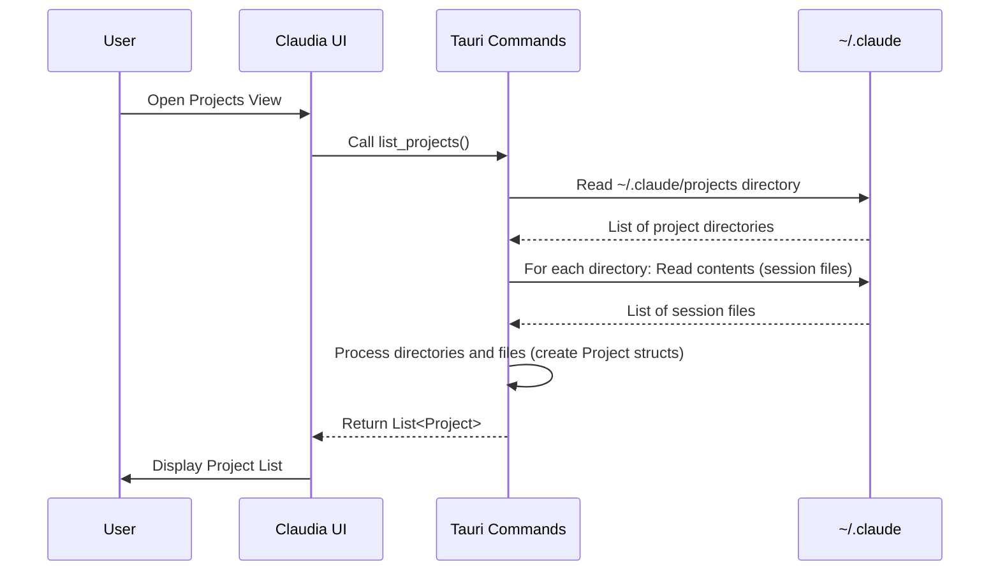
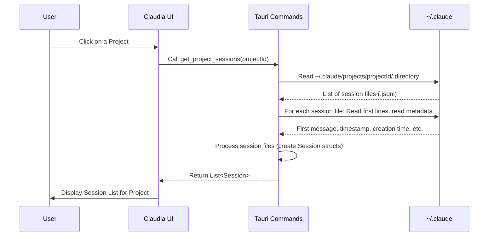
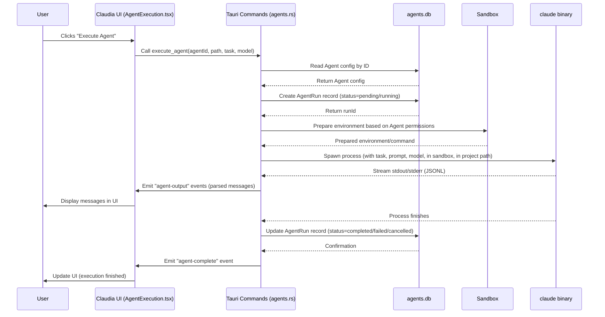
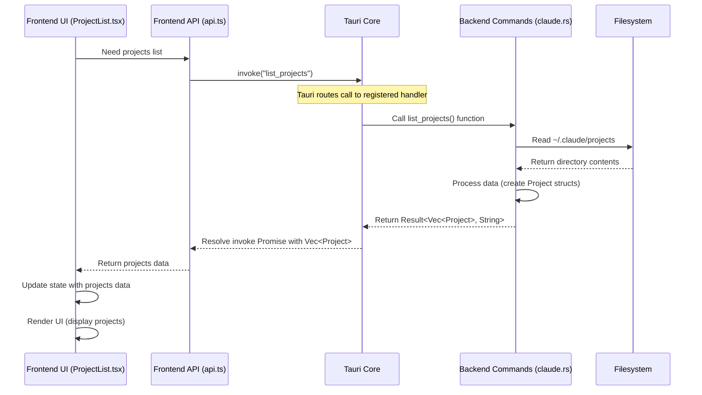
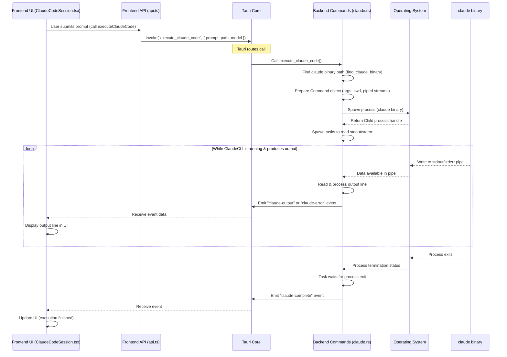

# Chapter 1: Session/Project Management

Welcome to the first chapter of the `claudia` tutorial! In this chapter, we'll explore how `claudia` helps you keep track of your work with Claude Code using its Session/Project Management feature.

Imagine you're using Claude Code to help you build a new feature in a software project. You spend hours talking to Claude, asking it to write code, explain concepts, and debug issues. This interaction is a "session". Your feature development is happening within a specific folder on your computer – that's your "project".

As you work on different projects, you'll have many sessions. How do you find that helpful conversation you had last week about a bug fix in your "website-redesign" project? How do you pick up where you left off? This is exactly what the Session/Project Management part of `claudia` solves!

It's like having a digital filing cabinet for all your Claude Code conversations, organized by the project you were working on.

## What are Projects and Sessions in `claudia`?

At its core, Session/Project Management deals with two main ideas:

1.  **Projects:** A "Project" in `claudia` (and the underlying Claude Code CLI) corresponds to a directory on your computer where you were running Claude Code. When you start Claude Code in a folder, it recognizes that as a project.
2.  **Sessions:** A "Session" is a single, continuous conversation you had with Claude Code within a specific project. Every time you run the `claude` command (or `claude --resume`, `claude --continue`), you're starting or continuing a session.

The Claude Code CLI automatically saves your conversation history. `claudia` reads this saved history to show you what you've done.

## Where is the Data Stored?

The Claude Code CLI stores everything it needs inside a special directory in your home folder: `~/.claude`.

Inside `~/.claude`, you'll find:

*   A `projects` directory: This is where information about your projects and their sessions is kept.
*   Other files like `settings.json` or `CLAUDE.md` (we'll talk about settings and `CLAUDE.md` later).

Each project you've worked on will have a subdirectory inside `~/.claude/projects`. The name of this subdirectory is a special encoded version of the project's file path.

Inside a project's directory (`~/.claude/projects/your-project-id/`), you'll find files ending in `.jsonl`. Each `.jsonl` file is a single **session**. The name of the file (before `.jsonl`) is the unique ID for that session. These files contain a history of messages, commands, and tool outputs for that specific conversation.

## How Does `claudia` Show You Your History?

Let's look at the user interface of `claudia`. When you open it, you'll likely see a list of your recent projects. Clicking on a project takes you to a list of sessions within that project. You can then click on a session to view its history or resume it.

Here's a simplified look at how the frontend components display this information:

```typescript
// src/components/ProjectList.tsx - Simplified structure
import { Card, CardContent } from "@/components/ui/card";
import type { Project } from "@/lib/api";

interface ProjectListProps {
  projects: Project[]; // This array comes from the backend
  onProjectClick: (project: Project) => void;
}

export const ProjectList: React.FC<ProjectListProps> = ({ projects, onProjectClick }) => {
  return (
    <div className="space-y-4">
      {/* Loop through the projects array */}
      {projects.map((project) => (
        <Card key={project.id} onClick={() => onProjectClick(project)}>
          <CardContent className="p-3">
            <div>
              <p>{project.path}</p> {/* Display the project path */}
              <p>{project.sessions.length} sessions</p> {/* Show session count */}
              {/* ... other project info like creation date */}
            </div>
            {/* ... click handler */}
          </CardContent>
        </Card>
      ))}
      {/* ... Pagination */}
    </div>
  );
};
```

This component (`ProjectList.tsx`) takes a list of `Project` objects (fetched from the backend) and renders a card for each one, showing basic info like the project path and how many sessions it contains. When you click a card, it calls the `onProjectClick` function, typically navigating you to the sessions list for that project.

Next, let's look at how the sessions for a selected project are displayed:

```typescript
// src/components/SessionList.tsx - Simplified structure
import { Card, CardContent } from "@/components/ui/card";
import type { Session } from "@/lib/api";

interface SessionListProps {
  sessions: Session[]; // This array comes from the backend for the selected project
  projectPath: string;
  onSessionClick?: (session: Session) => void;
  onBack: () => void; // Button to go back to project list
}

export const SessionList: React.FC<SessionListProps> = ({ sessions, projectPath, onSessionClick, onBack }) => {
  return (
    <div className="space-y-4">
      <button onClick={onBack}>Back to Projects</button> {/* Back button */}
      <h2>{projectPath}</h2> {/* Display the current project path */}
      <div className="space-y-2">
        {/* Loop through the sessions array */}
        {sessions.map((session) => (
          <Card key={session.id} onClick={() => onSessionClick?.(session)}>
            <CardContent className="p-3">
              <div>
                <p>Session ID: {session.id.slice(0, 8)}...</p> {/* Display truncated session ID */}
                {/* Display the first message preview if available */}
                {session.first_message && <p>First msg: {session.first_message}</p>}
                {/* ... other session info like timestamps */}
              </div>
              {/* ... click handler */}
            </CardContent>
          </Card>
        ))}
      </div>
      {/* ... Pagination */}
    </div>
  );
};
```

The `SessionList.tsx` component receives the list of sessions for a *single* project (again, fetched from the backend). It shows you the project path you're currently viewing and lists each session, often including its ID, creation time, and a preview of the first message. Clicking a session calls `onSessionClick`, which will lead to the conversation view (`ClaudeCodeSession.tsx`).

## How it Works: Under the Hood

The frontend components we just saw need data to display. This data is provided by the backend code, which runs in Rust using the Tauri framework. The backend's job for Session/Project Management is to read the files in the `~/.claude` directory and structure that information for the frontend.

Here's a simplified step-by-step of what happens when the frontend asks for the list of projects:

1.  The frontend calls a backend command, specifically `list_projects`.
2.  The backend code starts by finding the `~/.claude` directory on your computer.
3.  It then looks inside the `~/.claude/projects` directory.
4.  For each directory found inside `projects`, it treats it as a potential project.
5.  It reads the name of the project directory (which is an encoded path) and tries to find the actual project path by looking at the session files inside.
6.  It also counts the number of `.jsonl` files (sessions) inside that project directory.
7.  It gets the creation timestamp of the project directory.
8.  It gathers this information (project ID, path, sessions list, creation time) into a `Project` struct.
9.  It repeats this for all project directories.
10. Finally, it sends a list of these `Project` structs back to the frontend.

Fetching sessions for a specific project follows a similar pattern:

1.  The frontend calls the `get_project_sessions` command, providing the `project_id`.
2.  The backend finds the specific project directory inside `~/.claude/projects` using the provided `project_id`.
3.  It looks inside that project directory for all `.jsonl` files.
4.  For each `.jsonl` file (session), it extracts the session ID from the filename.
5.  It gets the file's creation timestamp.
6.  It reads the *first few lines* of the `.jsonl` file to find the first user message and its timestamp, for display as a preview in the UI.
7.  It might also check for related files like todo data (`.json` files in `~/.claude/todos` linked by session ID).
8.  It gathers this info into a `Session` struct.
9.  It repeats this for all session files in the project directory.
10. Finally, it sends a list of `Session` structs back to the frontend.

Here's a sequence diagram illustrating the `list_projects` flow:



And the `get_project_sessions` flow:



## Diving into the Code

Let's look at some specific parts of the Rust code in `src-tauri/src/commands/claude.rs` that handle this logic.

First, the data structures that represent a project and a session:

```rust
// src-tauri/src/commands/claude.rs
#[derive(Debug, Clone, Serialize, Deserialize)]
pub struct Project {
    pub id: String, // The encoded directory name
    pub path: String, // The decoded or detected real path
    pub sessions: Vec<String>, // List of session file names (IDs)
    pub created_at: u64, // Timestamp
}

#[derive(Debug, Clone, Serialize, Deserialize)]
pub struct Session {
    pub id: String, // The session file name (UUID)
    pub project_id: String, // Link back to the project
    pub project_path: String, // The project's real path
    pub todo_data: Option<serde_json::Value>, // Optional associated data
    pub created_at: u64, // Timestamp
    pub first_message: Option<String>, // Preview of the first user message
    pub message_timestamp: Option<String>, // Timestamp of the first message
}
// ... rest of the file
```

These `struct` definitions tell us what information the backend collects and sends to the frontend for projects and sessions. Notice the `Serialize` and `Deserialize` derives; this is what allows Tauri to easily pass these structures between the Rust backend and the JavaScript/TypeScript frontend.

Here's the function that finds the base `~/.claude` directory:

```rust
// src-tauri/src/commands/claude.rs
fn get_claude_dir() -> Result<PathBuf> {
    dirs::home_dir() // Find the user's home directory
        .context("Could not find home directory")? // Handle potential error
        .join(".claude") // Append the .claude directory name
        .canonicalize() // Resolve symbolic links, etc.
        .context("Could not find ~/.claude directory") // Handle potential error
}
// ... rest of the file
```

This simple function is crucial as all project and session data is located relative to `~/.claude`.

Now, a look at the `list_projects` function. We'll skip some error handling and logging for brevity here:

```rust
// src-tauri/src/commands/claude.rs
#[tauri::command]
pub async fn list_projects() -> Result<Vec<Project>, String> {
    let claude_dir = get_claude_dir().map_err(|e| e.to_string())?;
    let projects_dir = claude_dir.join("projects"); // Path to ~/.claude/projects

    if !projects_dir.exists() {
        return Ok(Vec::new()); // Return empty list if directory doesn't exist
    }

    let mut projects = Vec::new();

    // Iterate over entries inside ~/.claude/projects
    let entries = fs::read_dir(&projects_dir).map_err(|e| format!("..."))?;

    for entry in entries {
        let entry = entry.map_err(|e| format!("..."))?;
        let path = entry.path();

        if path.is_dir() { // Only process directories
            let dir_name = path.file_name().and_then(|n| n.to_str()).ok_or_else(|| "...").unwrap();

            // Get creation/modification timestamp
            let metadata = fs::metadata(&path).map_err(|e| format!("..."))?;
            let created_at = metadata.created().or_else(|_| metadata.modified()).unwrap_or(SystemTime::UNIX_EPOCH).duration_since(SystemTime::UNIX_EPOCH).unwrap_or_default().as_secs();

            // Determine the actual project path (explained next)
            let project_path = match get_project_path_from_sessions(&path) {
                Ok(p) => p,
                Err(_) => decode_project_path(dir_name) // Fallback if session files don't exist
            };

            // Find all session files (.jsonl) in this project directory
            let mut sessions = Vec::new();
            if let Ok(session_entries) = fs::read_dir(&path) {
                for session_entry in session_entries.flatten() {
                    let session_path = session_entry.path();
                    if session_path.is_file() && session_path.extension().and_then(|s| s.to_str()) == Some("jsonl") {
                        if let Some(session_id) = session_path.file_stem().and_then(|s| s.to_str()) {
                            sessions.push(session_id.to_string()); // Store session ID (filename)
                        }
                    }
                }
            }

            // Add the project to the list
            projects.push(Project {
                id: dir_name.to_string(),
                path: project_path,
                sessions,
                created_at,
            });
        }
    }

    projects.sort_by(|a, b| b.created_at.cmp(&a.created_at)); // Sort newest first
    Ok(projects)
}
// ... rest of the file
```

This code reads the `projects` directory, identifies subdirectories as projects, and collects basic information for each. A key part is determining the *actual* project path, as the directory name is an encoded version of the path where Claude Code was run. The `get_project_path_from_sessions` function handles this:

```rust
// src-tauri/src/commands/claude.rs
fn get_project_path_from_sessions(project_dir: &PathBuf) -> Result<String, String> {
    // Try to read any JSONL file in the directory
    let entries = fs::read_dir(project_dir)
        .map_err(|e| format!("..."))?;

    for entry in entries {
        if let Ok(entry) = entry {
            let path = entry.path();
            if path.is_file() && path.extension().and_then(|s| s.to_str()) == Some("jsonl") {
                // Read the first line of the JSONL file
                if let Ok(file) = fs::File::open(&path) {
                    let reader = BufReader::new(file);
                    if let Some(Ok(first_line)) = reader.lines().next() {
                        // Parse the JSON and extract "cwd" (current working directory)
                        if let Ok(json) = serde_json::from_str::<serde_json::Value>(&first_line) {
                            if let Some(cwd) = json.get("cwd").and_then(|v| v.as_str()) {
                                return Ok(cwd.to_string()); // Found the project path!
                            }
                        }
                    }
                }
            }
        }
    }

    Err("Could not determine project path from session files".to_string()) // Failed to find it
}
// ... rest of the file
```

This function is smarter than just decoding the directory name. It opens the first session file it finds within a project directory, reads the very first line (which usually contains metadata including the `cwd` - current working directory - where Claude Code was launched), and uses that `cwd` as the definitive project path. This is more reliable than trying to decode the directory name.

Finally, let's look at `get_project_sessions`:

```rust
// src-tauri/src/commands/claude.rs
#[tauri::command]
pub async fn get_project_sessions(project_id: String) -> Result<Vec<Session>, String> {
    let claude_dir = get_claude_dir().map_err(|e| e.to_string())?;
    let project_dir = claude_dir.join("projects").join(&project_id); // Path to specific project dir
    let todos_dir = claude_dir.join("todos"); // Path to todo data

    if !project_dir.exists() {
        return Err(format!("Project directory not found: {}", project_id));
    }

    // Determine the actual project path
    let project_path = match get_project_path_from_sessions(&project_dir) {
        Ok(p) => p,
        Err(_) => decode_project_path(&project_id) // Fallback
    };

    let mut sessions = Vec::new();

    // Read all files in the project directory
    let entries = fs::read_dir(&project_dir).map_err(|e| format!("..."))?;

    for entry in entries {
        let entry = entry.map_err(|e| format!("..."))?;
        let path = entry.path();

        // Process only .jsonl files
        if path.is_file() && path.extension().and_then(|s| s.to_str()) == Some("jsonl") {
            if let Some(session_id) = path.file_stem().and_then(|s| s.to_str()) { // Get filename as session ID
                // Get file creation timestamp
                let metadata = fs::metadata(&path).map_err(|e| format!("..."))?;
                let created_at = metadata.created().or_else(|_| metadata.modified()).unwrap_or(SystemTime::UNIX_EPOCH).duration_since(SystemTime::UNIX_EPOCH).unwrap_or_default().as_secs();

                // Extract first user message for preview (explained next)
                let (first_message, message_timestamp) = extract_first_user_message(&path);

                // Check for associated todo data file
                let todo_path = todos_dir.join(format!("{}.json", session_id));
                let todo_data = if todo_path.exists() {
                     // ... read and parse todo.json ...
                     None // Simplified: just show if it exists, not the data
                } else {
                    None
                };

                // Add the session to the list
                sessions.push(Session {
                    id: session_id.to_string(),
                    project_id: project_id.clone(),
                    project_path: project_path.clone(),
                    todo_data,
                    created_at,
                    first_message,
                    message_timestamp,
                });
            }
        }
    }

    sessions.sort_by(|a, b| b.created_at.cmp(&a.created_at)); // Sort newest first
    Ok(sessions)
}
// ... rest of the file
```

This function is similar to `list_projects` but focuses on one project directory. It iterates through the files, identifies the `.jsonl` session files, extracts metadata like ID and timestamp, and importantly, calls `extract_first_user_message` to get a quick preview of the conversation's start for the UI.

The `extract_first_user_message` function reads the session's `.jsonl` file line by line, parses each line as JSON, and looks for the first entry that represents a message from the "user" role, making sure to skip certain types of messages (like the initial system caveat or command outputs) to find the actual user prompt.

## Putting it Together

So, the Session/Project Management feature in `claudia` works by:

1.  Reading the file structure created by the Claude Code CLI in `~/.claude`.
2.  Identifying directories in `~/.claude/projects` as projects and `.jsonl` files within them as sessions.
3.  Extracting key metadata (IDs, paths, timestamps, first message previews).
4.  Providing this structured data to the frontend UI via Tauri commands (`list_projects`, `get_project_sessions`).
5.  Allowing the frontend (`ProjectList.tsx`, `SessionList.tsx`) to display this information in an organized, browsable way.
6.  Enabling the user to select a session, triggering navigation to the main session view (`ClaudeCodeSession.tsx`) where they can see the full history (loaded using `load_session_history`) and potentially resume the conversation.

This abstraction provides the essential foundation for interacting with your past Claude Code work, allowing you to manage your conversation history effectively.

## Conclusion

In this chapter, we learned how `claudia` discovers, lists, and displays your Claude Code projects and sessions by reading files from the `~/.claude` directory. We saw how the frontend components like `ProjectList` and `SessionList` use data provided by backend commands like `list_projects` and `get_project_sessions` to build the navigation interface. We also briefly touched upon how session data (`.jsonl` files) is parsed to show previews.

Understanding how `claudia` manages sessions and projects is the first step in seeing how it builds a rich user interface on top of the command-line tool. In the next chapter, we'll dive into the concept of [Agents](02_agents_.md), which are central to how Claude Code and `claudia` understand the context of your work.

[Next Chapter: Agents](02_agents_.md)

---

<sub><sup>Generated by [AI Codebase Knowledge Builder](https://github.com/The-Pocket/Tutorial-Codebase-Knowledge).</sup></sub> <sub><sup>**References**: [[1]](https://github.com/getAsterisk/claudia/blob/abe0891b0b6e0f5516343bd86ed590bdc8e479b3/src-tauri/src/commands/claude.rs), [[2]](https://github.com/getAsterisk/claudia/blob/abe0891b0b6e0f5516343bd86ed590bdc8e479b3/src/components/ClaudeCodeSession.tsx), [[3]](https://github.com/getAsterisk/claudia/blob/abe0891b0b6e0f5516343bd86ed590bdc8e479b3/src/components/ProjectList.tsx), [[4]](https://github.com/getAsterisk/claudia/blob/abe0891b0b6e0f5516343bd86ed590bdc8e479b3/src/components/SessionList.tsx)</sup></sub>
# Chapter 2: Agents

Welcome back to the `claudia` tutorial! In [Chapter 1: Session/Project Management](01_session_project_management_.md), we learned how `claudia` helps you keep track of your conversations with Claude Code by organizing them into projects and sessions stored in the `~/.claude` directory.

Now that you know how to find your past work, let's talk about the next key concept in `claudia`: **Agents**.

## What is an Agent?

Imagine you use Claude Code for different kinds of tasks. Sometimes you need it to act as a strict code reviewer, sometimes as a creative brainstorming partner, and other times as a focused debugger. Each task might require Claude to have a different "personality" or set of instructions.

Instead of typing out the same long system prompt (the initial instructions you give to Claude) every time, `claudia` lets you save these configurations as **Agents**.

Think of an Agent as a pre-packaged, specialized assistant you create within `claudia`. Each Agent is designed for a specific purpose, with its own instructions and capabilities already defined.

**In simpler terms:**

*   An Agent is like a saved profile for how you want Claude Code to behave.
*   You give it a name (like "Bug Hunter" or "Documentation Writer").
*   You give it an icon to easily spot it.
*   You give it a "System Prompt" - this is the set of rules or instructions that tell Claude how to act for this specific Agent. For example, a "Bug Hunter" agent might have a system prompt like, "You are an expert Python debugger. Analyze the provided code snippets for potential bugs, common errors, and suggest fixes."
*   You can set what permissions it has (like if it's allowed to read or write files).
*   You choose which Claude model it should use (like Sonnet or Opus).

Once an Agent is created, you can select it, give it a specific task (like "debug the function in `main.py`"), choose a project directory, and hit "Execute". `claudia` then runs the Claude Code CLI using *that Agent's* configuration.

This is much more efficient than manually setting options every time you use Claude Code for a particular job!

## Key Parts of an Agent

Let's break down the core components that make up an Agent in `claudia`. You'll configure these when you create or edit an Agent:

| Part            | Description                                                                 | Why it's important                                  |
| :-------------- | :-------------------------------------------------------------------------- | :-------------------------------------------------- |
| **Name**        | A human-readable label (e.g., "Code Reviewer", "Creative Writer").        | Helps you identify the Agent.                       |
| **Icon**        | A visual symbol (e.g., 🤖, ✨, 🛠️).                                         | Makes it easy to find the right Agent at a glance.  |
| **System Prompt** | The core instructions given to Claude at the start of the conversation.     | Defines the Agent's role, personality, and rules. |
| **Model**       | Which Claude model (e.g., Sonnet, Opus) the Agent should use.               | Affects performance, capabilities, and cost.        |
| **Permissions** | Controls what the Agent is allowed to do (file read/write, network).        | **Crucial for security** when running code or tools. |
| **Default Task**| Optional pre-filled text for the task input field when running the Agent. | Saves time for common tasks with this Agent.        |

## Creating and Managing Agents

`claudia` provides a friendly user interface for managing your Agents. You'll typically find this in the main menu under something like "CC Agents".

### The Agents List

When you go to the Agents section, you'll see a list (or grid) of all the Agents you've created.

You can see their name, icon, and options to:

*   **Execute:** Run the Agent with a new task.
*   **Edit:** Change the Agent's configuration.
*   **Delete:** Remove the Agent.
*   **Create:** Add a brand new Agent.

Let's look at a simplified frontend component (`CCAgents.tsx`) that displays this list:

```typescript
// src/components/CCAgents.tsx (Simplified)
// ... imports ...
export const CCAgents: React.FC<CCAgentsProps> = ({ onBack, className }) => {
  const [agents, setAgents] = useState<Agent[]>([]);
  // ... state for loading, view mode, etc. ...

  useEffect(() => {
    // Fetch agents from the backend when the component loads
    const loadAgents = async () => {
      try {
        const agentsList = await api.listAgents(); // Call backend API
        setAgents(agentsList);
      } catch (err) {
        console.error("Failed to load agents:", err);
      }
    };
    loadAgents();
  }, []);

  // ... handleDeleteAgent, handleEditAgent, handleExecuteAgent functions ...
  // ... state for pagination ...

  return (
    // ... layout code ...
    {/* Agents Grid */}
    <div className="grid grid-cols-1 sm:grid-cols-2 lg:grid-cols-3 gap-4">
      {/* Loop through the fetched agents */}
      {agents.map((agent) => (
        <Card key={agent.id} /* ... styling ... */>
          <CardContent className="p-6 flex flex-col items-center text-center">
            <div className="mb-4">{/* Render agent icon */}</div>
            <h3 className="text-lg font-semibold mb-2">{agent.name}</h3>
            {/* ... other agent info ... */}
          </CardContent>
          <CardFooter className="p-4 pt-0 flex justify-center gap-2">
            {/* Buttons to Execute, Edit, Delete */}
            <Button size="sm" onClick={() => handleExecuteAgent(agent)}>Execute</Button>
            <Button size="sm" onClick={() => handleEditAgent(agent)}>Edit</Button>
            <Button size="sm" onClick={() => handleDeleteAgent(agent.id!)}>Delete</Button>
          </CardFooter>
        </Card>
      ))}
    </div>
    // ... pagination and other UI elements ...
  );
};
// ... AGENT_ICONS and other types ...
```

This simplified code shows how the `CCAgents` component fetches a list of `Agent` objects from the backend using `api.listAgents()` and then displays them in cards, providing buttons for common actions.

### Creating or Editing an Agent

Clicking "Create" or "Edit" takes you to a different view (`CreateAgent.tsx`). Here, you'll find a form where you can fill in the details of the Agent: name, choose an icon, write the system prompt, select the model, set permissions, and add an optional default task.

A snippet from the `CreateAgent.tsx` component:

```typescript
// src/components/CreateAgent.tsx (Simplified)
// ... imports ...
export const CreateAgent: React.FC<CreateAgentProps> = ({
  agent, // If provided, we are editing
  onBack,
  onAgentCreated,
  className,
}) => {
  const [name, setName] = useState(agent?.name || "");
  const [systemPrompt, setSystemPrompt] = useState(agent?.system_prompt || "");
  // ... state for icon, model, permissions, etc. ...

  const isEditMode = !!agent;

  const handleSave = async () => {
    // ... validation ...
    try {
      // ... set saving state ...
      if (isEditMode && agent.id) {
        // Call backend API to update agent
        await api.updateAgent(agent.id, name, /* ... other fields ... */ systemPrompt, /* ... */);
      } else {
        // Call backend API to create new agent
        await api.createAgent(name, /* ... other fields ... */ systemPrompt, /* ... */);
      }
      onAgentCreated(); // Notify parent component
    } catch (err) {
      console.error("Failed to save agent:", err);
      // ... show error ...
    } finally {
      // ... unset saving state ...
    }
  };

  // ... handleBack function with confirmation ...

  return (
    // ... layout code ...
    <div className="flex flex-col h-full">
      {/* Header with Back and Save buttons */}
      <div className="flex items-center justify-between p-4 border-b">
        <Button onClick={handleBack}>Back</Button>
        <h2>{isEditMode ? "Edit CC Agent" : "Create CC Agent"}</h2>
        <Button onClick={handleSave}>Save</Button>
      </div>
      
      {/* Form fields */}
      <div className="flex-1 p-4 overflow-y-auto space-y-6">
        {/* Name Input */}
        <div className="space-y-2">
          <Label htmlFor="agent-name">Agent Name</Label>
          <Input id="agent-name" value={name} onChange={(e) => setName(e.target.value)} />
        </div>

        {/* Icon Picker */}
        {/* ... component for selecting icon ... */}

        {/* Model Selection */}
        {/* ... buttons/radios for model selection ... */}

        {/* Default Task Input */}
        {/* ... input for default task ... */}

        {/* Sandbox Settings (Separate Component) */}
        <AgentSandboxSettings /* ... props passing permission states ... */ />

        {/* System Prompt Editor */}
        <div className="space-y-2">
          <Label>System Prompt</Label>
          {/* ... MDEditor component for system prompt ... */}
        </div>
      </div>
    </div>
    // ... Toast Notification ...
  );
};
// ... AGENT_ICONS and other types ...
```

This component manages the state for the agent's properties and calls either `api.createAgent` or `api.updateAgent` from the backend API layer when the "Save" button is clicked.

Notice the inclusion of `AgentSandboxSettings`. This is a smaller component (`AgentSandboxSettings.tsx`) specifically for managing the permission toggles:

```typescript
// src/components/AgentSandboxSettings.tsx (Simplified)
// ... imports ...
export const AgentSandboxSettings: React.FC<AgentSandboxSettingsProps> = ({ 
  agent, // Receives the current agent state
  onUpdate, // Callback to notify parent of changes
  className 
}) => {
  // ... handleToggle function ...

  return (
    <Card className={cn("p-4 space-y-4", className)}>
      {/* ... Header with Shield icon ... */}
      <div className="space-y-3">
        {/* Master sandbox toggle */}
        <div className="flex items-center justify-between p-3 rounded-lg border bg-muted/30">
          <Label className="text-sm font-medium">Enable Sandbox</Label>
          <Switch 
            checked={agent.sandbox_enabled} 
            onCheckedChange={(checked) => handleToggle('sandbox_enabled', checked)} // Update parent state
          />
        </div>

        {/* Permission toggles - conditional render */}
        {agent.sandbox_enabled && (
          <div className="space-y-3 pl-4 border-l-2 border-amber-200">
            {/* File Read Toggle */}
            <div className="flex items-center justify-between">
              <Label className="text-sm font-medium">File Read Access</Label>
              <Switch 
                checked={agent.enable_file_read} 
                onCheckedChange={(checked) => handleToggle('enable_file_read', checked)} // Update parent state
              />
            </div>
            {/* File Write Toggle */}
            <div className="flex items-center justify-between">
              <Label className="text-sm font-medium">File Write Access</Label>
              <Switch 
                checked={agent.enable_file_write} 
                onCheckedChange={(checked) => handleToggle('enable_file_write', checked)} // Update parent state
              />
            </div>
            {/* Network Toggle */}
            <div className="flex items-center justify-between">
              <Label className="text-sm font-medium">Network Access</Label>
              <Switch 
                checked={agent.enable_network} 
                onCheckedChange={(checked) => handleToggle('enable_network', checked)} // Update parent state
              />
            </div>
          </div>
        )}
        {/* ... Warning when sandbox disabled ... */}
      </div>
    </Card>
  );
};
```

This component simply displays the current sandbox settings for the agent and provides switches to toggle them. When a switch is toggled, it calls the `onUpdate` prop to inform the parent (`CreateAgent`) component, which manages the overall agent state.

## Executing an Agent

Once you have agents created, the main purpose is to *run* them. Selecting an agent from the list and clicking "Execute" (or the Play button) takes you to the Agent Execution view (`AgentExecution.tsx`).

Here's where you:

1.  Select a **Project Path**: This is the directory where the agent will run and where it can potentially read/write files (subject to its permissions). This ties back to the projects we discussed in [Chapter 1: Session/Project Management](01_session_project_management_.md).
2.  Enter the **Task**: This is the specific request you have for the agent *for this particular run*.
3.  (Optional) Override the **Model**: Choose a different model (Sonnet/Opus) just for this run if needed.
4.  Click **Execute**.

The `AgentExecution.tsx` component handles this:

```typescript
// src/components/AgentExecution.tsx (Simplified)
// ... imports ...
export const AgentExecution: React.FC<AgentExecutionProps> = ({
  agent, // The agent being executed
  onBack,
  className,
}) => {
  const [projectPath, setProjectPath] = useState("");
  const [task, setTask] = useState("");
  const [model, setModel] = useState(agent.model || "sonnet"); // Default to agent's model
  const [isRunning, setIsRunning] = useState(false);
  const [messages, setMessages] = useState<ClaudeStreamMessage[]>([]); // Output messages
  // ... state for stats, errors, etc. ...

  // ... useEffect for listeners and timers ...

  const handleSelectPath = async () => {
    // Use Tauri dialog to select a directory
    const selected = await open({ directory: true, multiple: false });
    if (selected) {
      setProjectPath(selected as string);
    }
  };

  const handleExecute = async () => {
    if (!projectPath || !task.trim()) return; // Basic validation

    try {
      setIsRunning(true);
      setMessages([]); // Clear previous output
      // ... reset stats, setup listeners ...

      // Call backend API to execute the agent
      await api.executeAgent(agent.id!, projectPath, task, model);

    } catch (err) {
      console.error("Failed to execute agent:", err);
      // ... show error, update state ...
    }
  };

  // ... handleStop, handleBackWithConfirmation functions ...

  return (
    // ... layout code ...
    <div className={cn("flex flex-col h-full", className)}>
      {/* Header with Back button and Agent Name */}
      <div className="flex items-center justify-between p-4 border-b">
        <Button onClick={handleBackWithConfirmation}>Back</Button>
        <h2>{agent.name}</h2>
        {/* ... Running status indicator ... */}
      </div>

      {/* Configuration Section */}
      <div className="p-4 border-b space-y-4">
        {/* ... Error display ... */}
        {/* Project Path Input with Select Button */}
        <div className="space-y-2">
          <Label>Project Path</Label>
          <Input value={projectPath} onChange={(e) => setProjectPath(e.target.value)} disabled={isRunning} />
          <Button onClick={handleSelectPath} disabled={isRunning}>Select Path</Button>
        </div>
        {/* Model Selection Buttons */}
        {/* ... buttons for Sonnet/Opus selection ... */}
        {/* Task Input with Execute/Stop Button */}
        <div className="space-y-2">
          <Label>Task</Label>
          <Input value={task} onChange={(e) => setTask(e.target.value)} disabled={isRunning} />
          <Button onClick={isRunning ? handleStop : handleExecute} disabled={!projectPath || !task.trim()}>
            {isRunning ? "Stop" : "Execute"}
          </Button>
        </div>
      </div>

      {/* Output Display Section */}
      <div className="flex-1 flex flex-col min-h-0 overflow-y-auto">
        {/* Messages are displayed here, streaming as they arrive */}
        {/* ... Rendering messages using StreamMessage component ... */}
      </div>
      
      {/* Floating Execution Control Bar */}
      {/* ... Component showing elapsed time, tokens, etc. ... */}
    </div>
    // ... Fullscreen Modal ...
  );
};
// ... AGENT_ICONS and other types ...
```

This component uses the `api.executeAgent` Tauri command to start the agent's run. It also sets up event listeners (`agent-output`, `agent-error`, `agent-complete`) to receive data and status updates from the backend *while* the agent is running. This streaming output is then displayed to the user, which we'll cover in more detail in [Chapter 7: Streamed Output Processing](07_streamed_output_processing_.md).

## How it Works: Under the Hood

Let's peek behind the curtain to understand how `claudia` handles Agents in the backend (Rust code).

### Agent Storage

Unlike projects and sessions which are managed by the Claude Code CLI itself in the filesystem (`~/.claude`), `claudia` stores its Agent definitions in a local SQLite database file, typically located within `claudia`'s application data directory (e.g., `~/.config/claudia/agents.db` on Linux, or similar paths on macOS/Windows).

The `Agent` struct in the Rust backend corresponds to the data stored for each agent:

```rust
// src-tauri/src/commands/agents.rs (Simplified)
#[derive(Debug, Serialize, Deserialize, Clone)]
pub struct Agent {
    pub id: Option<i64>, // Database ID
    pub name: String,
    pub icon: String,
    pub system_prompt: String,
    pub default_task: Option<String>,
    pub model: String, // e.g., "sonnet", "opus"
    // Permissions managed directly on the agent struct
    pub sandbox_enabled: bool,
    pub enable_file_read: bool,
    pub enable_file_write: bool,
    pub enable_network: bool,
    pub created_at: String,
    pub updated_at: String,
}
// ... rest of the file
```

The database initialization (`init_database` function) creates the `agents` table to store this information. Backend functions like `list_agents`, `create_agent`, `update_agent`, and `delete_agent` interact with this SQLite database to perform the requested actions. They simply execute standard SQL commands (SELECT, INSERT, UPDATE, DELETE) to manage the `Agent` records.

Here's a tiny snippet showing a database interaction (listing agents):

```rust
// src-tauri/src/commands/agents.rs (Simplified)
#[tauri::command]
pub async fn list_agents(db: State<'_, AgentDb>) -> Result<Vec<Agent>, String> {
    let conn = db.0.lock().map_err(|e| e.to_string())?; // Get database connection
    
    let mut stmt = conn
        .prepare("SELECT id, name, icon, system_prompt, default_task, model, sandbox_enabled, enable_file_read, enable_file_write, enable_network, created_at, updated_at FROM agents ORDER BY created_at DESC")
        .map_err(|e| e.to_string())?; // Prepare SQL query
    
    let agents = stmt
        .query_map([], |row| { // Map database rows to Agent structs
            Ok(Agent {
                id: Some(row.get(0)?),
                name: row.get(1)?,
                // ... map other fields ...
                system_prompt: row.get(3)?,
                model: row.get::<_, String>(5).unwrap_or_else(|_| "sonnet".to_string()),
                sandbox_enabled: row.get::<_, bool>(6).unwrap_or(true),
                enable_file_read: row.get::<_, bool>(7).unwrap_or(true),
                enable_file_write: row.get::<_, bool>(8).unwrap_or(true),
                enable_network: row.get::<_, bool>(9).unwrap_or(false),
                created_at: row.get(10)?,
                updated_at: row.get(11)?,
            })
        })
        .map_err(|e| e.to_string())?
        .collect::<Result<Vec<_>, _>>()
        .map_err(|e| e.to_string())?;
    
    Ok(agents) // Return the list of Agent structs
}
```

This snippet shows how `list_agents` connects to the database, prepares a simple `SELECT` statement, and then uses `query_map` to convert each row returned by the database into an `Agent` struct, which is then sent back to the frontend.

### Agent Execution Flow

When you click "Execute" for an Agent:

1.  The frontend (`AgentExecution.tsx`) calls the backend command `execute_agent` ([Chapter 4: Tauri Commands](04_tauri_commands_.md)), passing the agent's ID, the selected project path, and the entered task.
2.  The backend receives the call and retrieves the full details of the selected Agent from the database.
3.  It creates a record in the `agent_runs` database table. This table keeps track of each individual execution run of an agent, including which agent was run, the task given, the project path, and its current status (pending, running, completed, failed, cancelled). This links back to the run history shown in the `CCAgents.tsx` component and managed by the `AgentRun` struct:
    ```rust
    // src-tauri/src/commands/agents.rs (Simplified)
    #[derive(Debug, Serialize, Deserialize, Clone)]
    pub struct AgentRun {
        pub id: Option<i64>, // Database ID for this run
        pub agent_id: i64, // Foreign key linking to the Agent
        pub agent_name: String, // Stored for convenience
        pub agent_icon: String, // Stored for convenience
        pub task: String, // The task given for this run
        pub model: String, // The model used for this run
        pub project_path: String, // The directory where it was executed
        pub session_id: String, // The UUID from the Claude Code CLI session
        pub status: String, // 'pending', 'running', 'completed', 'failed', 'cancelled'
        pub pid: Option<u32>, // Process ID if running
        pub process_started_at: Option<String>,
        pub created_at: String,
        pub completed_at: Option<String>,
    }
    ```
    When the run starts, the status is set to 'running', and the Process ID (PID) is recorded.
4.  Based on the Agent's configured permissions (`enable_file_read`, `enable_file_write`, `enable_network`), the backend constructs a sandbox profile. This process involves defining rules that the operating system will enforce to limit what the `claude` process can access or do. This is a core part of the [Sandboxing](06_sandboxing_.md) concept.
5.  The backend prepares the command to launch the `claude` binary ([Chapter 5: Claude CLI Interaction](05_claude_cli_interaction_.md)). It includes arguments like:
    *   `-p "the task"`
    *   `--system-prompt "the agent's system prompt"`
    *   `--model "the selected model"`
    *   `--output-format stream-json` (to get structured output)
    *   `--dangerously-skip-permissions` (since `claudia` manages permissions via the sandbox, it tells `claude` not to ask the user).
    *   The command is also set to run in the specified project directory.
6.  The backend then *spawns* the `claude` process within the sandbox environment.
7.  As the `claude` process runs, its standard output (stdout) and standard error (stderr) streams are captured by the backend ([Chapter 7: Streamed Output Processing](07_streamed_output_processing_.md)).
8.  The backend processes this output. For JSONL output from Claude Code, it extracts information like message content and session IDs.
9.  It emits events back to the frontend (`agent-output`, `agent-error`) using the Tauri event system.
10. The frontend (`AgentExecution.tsx`) listens for these events and updates the displayed messages in real-time.
11. The backend also detects when the `claude` process finishes (either successfully, with an error, or if killed).
12. When the process finishes, the backend updates the `agent_runs` record in the database, setting the status to 'completed', 'failed', or 'cancelled' and recording the completion timestamp.

Here's a simplified sequence diagram for Agent execution:



This diagram illustrates how the frontend initiates the run, the backend fetches the agent's configuration, prepares the environment (including sandbox rules), launches the `claude` process, captures its output, and updates the UI and database based on the process's progress and completion.

## Conclusion

In this chapter, we introduced the concept of **Agents** in `claudia`. We learned that Agents are customizable configurations for the Claude Code CLI, allowing you to define specific roles, instructions (System Prompt), models, and crucially, permissions for different types of tasks.

We saw how the `claudia` UI allows you to easily create, edit, list, and execute these Agents, and how the backend stores Agent definitions in a local database. We also got a high-level view of the execution process, understanding that `claudia` launches the `claude` binary with the Agent's settings and captures its output. A key part of this is the preparation of a secure execution environment based on the Agent's defined permissions, which introduces the idea of sandboxing.

Understanding Agents is fundamental, as they are the primary way you'll interact with Claude Code through `claudia` for structured tasks. In the next chapter, we'll zoom out and look at how the different visual parts of the `claudia` application you've seen connect together – diving into [Frontend UI Components](03_frontend_ui_components_.md).

[Next Chapter: Frontend UI Components](03_frontend_ui_components_.md)

---

<sub><sup>Generated by [AI Codebase Knowledge Builder](https://github.com/The-Pocket/Tutorial-Codebase-Knowledge).</sup></sub> <sub><sup>**References**: [[1]](https://github.com/getAsterisk/claudia/blob/abe0891b0b6e0f5516343bd86ed590bdc8e479b3/src-tauri/src/commands/agents.rs), [[2]](https://github.com/getAsterisk/claudia/blob/abe0891b0b6e0f5516343bd86ed590bdc8e479b3/src/components/AgentExecution.tsx), [[3]]
```
(https://github.com/getAsterisk/claudia/blob/abe0891b0b6e0f5516343bd86ed590bdc8e479b3/src/components/AgentSandboxSettings.tsx), [[4]](https://github.com/getAsterisk/claudia/blob/abe0891b0b6e0f5516343bd86ed590bdc8e479b3/src/components/CCAgents.tsx), [[5]](https://github.com/getAsterisk/claudia/blob/abe0891b0b6e0f5516343bd86ed590bdc8e479b3/src/components/CreateAgent.tsx)</sup></sub>

# Chapter 3: Frontend UI Components

Welcome back to the `claudia` tutorial! In [Chapter 1: Session/Project Management](01_session_project_management_.md), we explored how `claudia` keeps track of your conversations. In [Chapter 2: Agents](02_agents_.md), we learned about creating and managing specialized configurations for Claude Code tasks.

Now, let's shift our focus to what you actually *see* and *interact with* when you use `claudia`: its graphical interface. This interface is built using **Frontend UI Components**.

## What are Frontend UI Components?

Imagine building something complex, like a house. You don't start by crafting every tiny screw and nail from raw metal. Instead, you use pre-made bricks, windows, doors, and roof tiles. These are like reusable building blocks.

Frontend UI Components in `claudia` are exactly like these building blocks, but for the visual parts of the application. They are self-contained pieces of the user interface, like:

*   A **Button** you click.
*   A **Card** that displays information (like a project or an agent).
*   An **Input** field where you type text.
*   A **List** that shows multiple items.
*   A **Dialog** box that pops up.

`claudia` uses a popular web development framework called **React** to build these components. They are written using **TypeScript** (which adds type safety) and styled using **Tailwind CSS** (a way to add styles quickly using special class names).

The key idea is reusability. Instead of designing a button from scratch every time it's needed, you create a `Button` component once and use it everywhere. This makes the UI consistent and development faster.

## Building Views by Combining Components

Just like you combine bricks and windows to build a wall, `claudia` combines different UI components to create full views (pages) of the application.

For example, the list of projects you saw in Chapter 1 is a view. This view isn't one giant piece of code; it's made by combining:

*   `Button` components (like the "Back to Home" button).
*   `Card` components, each displaying information about a single project.
*   A `ProjectList` component which *contains* all the individual project `Card`s and handles looping through the list of projects.
*   Layout components (like `div`s with Tailwind classes) to arrange everything.

Let's look at a simplified structure of the `App.tsx` file, which acts like the main blueprint for `claudia`'s views. It decides *which* major component (view) to show based on the current state (`view` variable):

```typescript
// src/App.tsx (Simplified)
import { useState } from "react";
import { Button } from "@/components/ui/button"; // Import a UI component
import { Card } from "@/components/ui/card";     // Import another UI component
import { ProjectList } from "@/components/ProjectList"; // Import a view component
import { CCAgents } from "@/components/CCAgents";   // Import another view component
// ... other imports ...

type View = "welcome" | "projects" | "agents" | "settings" | "claude-code-session";

function App() {
  const [view, setView] = useState<View>("welcome"); // State variable to control current view
  // ... other state variables ...

  const renderContent = () => {
    switch (view) {
      case "welcome":
        // Show the welcome view, using Card and Button components
        return (
          <div className="..."> {/* Layout */}
            <Card onClick={() => setView("agents")}> {/* Uses Card */}
              <div className="...">
                {/* Icon component */}
                <h2>CC Agents</h2>
              </div>
            </Card>
            <Card onClick={() => setView("projects")}> {/* Uses Card */}
              <div className="...">
                 {/* Icon component */}
                 <h2>CC Projects</h2>
              </div>
            </Card>
          </div>
        );

      case "agents":
        // Show the Agents view, which is handled by the CCAgents component
        return <CCAgents onBack={() => setView("welcome")} />; // Uses CCAgents component

      case "projects":
        // Show the Projects/Sessions view
        return (
          <div className="..."> {/* Layout */}
             <Button onClick={() => setView("welcome")}>← Back</Button> {/* Uses Button */}
             {/* ... displays either ProjectList or SessionList based on selectedProject state ... */}
          </div>
        );

      // ... other cases for settings, session view, etc. ...

      default:
        return null;
    }
  };

  return (
    <div className="h-screen bg-background flex flex-col">
      {/* Topbar component */}
      {/* Main content area */}
      <div className="flex-1 overflow-y-auto">
        {renderContent()} {/* Renders the selected view */}
      </div>
      {/* ... other global components like dialogs ... */}
    </div>
  );
}

export default App;
```

As you can see, `App.tsx` doesn't contain the detailed code for *every* button or card. Instead, it imports and uses components like `Button`, `Card`, `CCAgents`, and `ProjectList`. The `renderContent` function simply decides which larger component to display based on the `view` state.

## How Components Work Together

Components communicate with each other primarily through **props** (short for properties) and **callbacks** (functions passed as props).

*   **Props:** Data is passed *down* from parent components to child components using props. For example, the `App` component might pass the list of `projects` to the `ProjectList` component. The `ProjectList` component then passes individual `project` objects down to the `Card` components it renders.
*   **Callbacks:** When something happens inside a child component (like a button click), it needs to tell its parent. It does this by calling a function that was passed down as a prop (a callback). For example, when a `Card` in the `ProjectList` is clicked, it calls the `onProjectClick` function that was given to it by `ProjectList`. `ProjectList` received this function from `App`.

Let's revisit the `ProjectList` component from Chapter 1:

```typescript
// src/components/ProjectList.tsx (Simplified)
// ... imports ...
import { Card, CardContent } from "@/components/ui/card"; // Uses Card component
import type { Project } from "@/lib/api";

interface ProjectListProps {
  projects: Project[]; // Prop: receives array of project data
  onProjectClick: (project: Project) => void; // Prop: receives a function (callback)
}

export const ProjectList: React.FC<ProjectListProps> = ({ projects, onProjectClick }) => {
  return (
    <div className="space-y-4">
      {/* Loops through the projects array received via props */}
      {projects.map((project) => (
        // Renders a Card component for each project
        <Card key={project.id} onClick={() => onProjectClick(project)}> {/* Calls the onProjectClick callback when clicked */}
          <CardContent className="p-3"> {/* Uses CardContent sub-component */}
            <div>
              <p>{project.path}</p> {/* Displays data received from the project prop */}
              <p>{project.sessions.length} sessions</p> {/* Displays data from the project prop */}
            </div>
          </CardContent>
        </Card>
      ))}
    </div>
  );
};
```

This component clearly shows:
1.  It receives data (`projects` array) and a function (`onProjectClick`) as props.
2.  It loops through the `projects` array.
3.  For each item, it renders a `Card` component (another UI component).
4.  It passes data (`project.path`, `project.sessions.length`) into the `CardContent` to be displayed.
5.  It attaches an `onClick` handler to the `Card` that calls the `onProjectClick` callback function, passing the relevant `project` data back up to the parent component (`App` in this case).

Similarly, the `CCAgents` component from Chapter 2 receives data and callbacks:

```typescript
// src/components/CCAgents.tsx (Simplified)
// ... imports ...
import { Card, CardContent, CardFooter } from "@/components/ui/card"; // Uses Card components
import { Button } from "@/components/ui/button"; // Uses Button component
// ... types and state ...

export const CCAgents: React.FC<CCAgentsProps> = ({ onBack, className }) => {
  // ... state for agents data ...

  // ... useEffect to load agents (calls backend, covered in Chapter 2) ...

  // Callback functions for actions
  const handleExecuteAgent = (agent: Agent) => {
    // ... navigate to execution view ...
  };
  const handleEditAgent = (agent: Agent) => {
     // ... navigate to edit view ...
  };
  const handleDeleteAgent = (agentId: number) => {
     // ... call backend API to delete ...
  };

  return (
    <div className="flex-1 overflow-hidden">
      {/* ... Back button using Button component calling onBack prop ... */}
      
      {/* Agents Grid */}
      <div className="grid grid-cols-1 ... gap-4">
        {/* Loop through agents state */}
        {agents.map((agent) => (
          <Card key={agent.id}> {/* Uses Card */}
            <CardContent className="..."> {/* Uses CardContent */}
              {/* ... display agent icon, name (data from agent state) ... */}
            </CardContent>
            <CardFooter className="..."> {/* Uses CardFooter */}
              {/* Buttons using Button component, calling local callbacks */}
              <Button size="sm" onClick={() => handleExecuteAgent(agent)}>Execute</Button>
              <Button size="sm" onClick={() => handleEditAgent(agent)}>Edit</Button>
              <Button size="sm" onClick={() => handleDeleteAgent(agent.id!)}>Delete</Button>
            </CardFooter>
          </Card>
        ))}
      </div>
      {/* ... pagination ... */}
    </div>
  );
};
```

This component shows how UI components (`Card`, `Button`) are used within a larger view component (`CCAgents`). `CCAgents` manages its own state (the list of `agents`) and defines callback functions (`handleExecuteAgent`, `handleEditAgent`, `handleDeleteAgent`) which are triggered by user interaction with the child `Button` components. It also receives an `onBack` prop from its parent (`App`) to navigate back.

## Common UI Components in `claudia`

`claudia` uses a set of pre-built, simple UI components provided by a library often referred to as "shadcn/ui" (though integrated directly into the project). You saw some examples in the code:

*   **`Button`**: Used for clickable actions (`components/ui/button.tsx`).
*   **`Card`**: Used to group related information with a border and shadow (`components/ui/card.tsx`). It often has `CardHeader`, `CardContent`, and `CardFooter` sub-components for structure.
*   **`Input`**: Used for single-line text entry fields (similar to standard HTML `<input>`, used in `CreateAgent`, `AgentExecution`).
*   **`Textarea`**: Used for multi-line text entry, like for the system prompt (`components/ui/textarea.tsx`, used in `CreateAgent`).
*   **`Switch`**: Used for toggling options on/off, like permissions in the sandbox settings (`components/ui/switch.tsx`, used in `AgentSandboxSettings`).
*   **`Label`**: Used to associate text labels with form elements (`components/ui/label.tsx`).
*   **`Popover`**: Used to display floating content when a trigger is clicked (`components/ui/popover.tsx`).
*   **`Toast`**: Used for temporary notification messages (`components/ui/toast.tsx`).

You can find these components and others in the `src/components/ui/` directory. Each file defines a single, reusable UI component using React's functional component pattern, TypeScript for typing props, and Tailwind CSS classes for styling.

For example, the `Button` component (`components/ui/button.tsx`) defines different visual `variant`s (default, destructive, outline, secondary, ghost, link) and `size`s (default, sm, lg, icon) using `class-variance-authority` and then applies the corresponding Tailwind classes (`cn` utility combines class names). When you use `<Button variant="outline" size="sm">`, you're simply telling the `Button` component which pre-defined styles to apply.

```typescript
// src/components/ui/button.tsx (Simplified)
// ... imports ...
import { cva, type VariantProps } from "class-variance-authority"; // Helps manage style variants
import { cn } from "@/lib/utils"; // Utility to combine Tailwind classes

const buttonVariants = cva(
  "inline-flex items-center ... transition-colors ...", // Base styles
  {
    variants: { // Define different style options
      variant: {
        default: "bg-primary ...",
        destructive: "bg-destructive ...",
        outline: "border border-input ...",
        // ... other variants
      },
      size: { // Define different size options
        default: "h-9 px-4 py-2",
        sm: "h-8 rounded-md px-3 text-xs",
        // ... other sizes
      },
    },
    defaultVariants: { // Default options if none are specified
      variant: "default",
      size: "default",
    },
  }
);

// Define the props the Button component accepts
export interface ButtonProps
  extends React.ButtonHTMLAttributes<HTMLButtonElement>, // Inherit standard button props
    VariantProps<typeof buttonVariants> { // Add variant/size props
  asChild?: boolean; // Optional prop for advanced use
}

// The actual React component
const Button = React.forwardRef<HTMLButtonElement, ButtonProps>(
  ({ className, variant, size, ...props }, ref) => { // Destructure props
    return (
      <button
        // Combine base classes, variant classes, size classes, and any custom className
        className={cn(buttonVariants({ variant, size, className }))} 
        ref={ref} // Forward the ref if needed
        {...props} // Pass any other standard button props (like onClick, disabled)
      />
    );
  }
);
Button.displayName = "Button";

export { Button, buttonVariants }; // Export for use elsewhere
```

This shows how a basic UI component like `Button` is created. It takes props (`variant`, `size`, `className`, plus standard HTML button attributes like `onClick`), uses logic (`cn`, `cva`) to determine the final CSS classes, and renders a simple HTML `<button>` element. When other parts of the app need a button, they just import and use this component, e.g., `<Button onClick={handleSave} variant="primary">Save</Button>`.

## How it Works: Under the Hood (Frontend)

The core idea behind these UI components in React is quite simple:

1.  **They are functions or classes:** A component is essentially a JavaScript/TypeScript function (or class) that receives data as `props`.
2.  **They return UI:** This function returns a description of what the UI should look like (React elements, often resembling HTML).
3.  **React renders the UI:** React takes this description and efficiently updates the actual web page (the Document Object Model or DOM) to match.
4.  **State for interactivity:** Some components manage their own internal data called `state` (e.g., an input component's text value, whether a dialog is open). When state changes, the component re-renders.
5.  **Event Handlers:** Components respond to user interactions (like clicks, typing) by calling functions defined within them or received via props (callbacks).

The process looks like this:

```mermaid
graph TD
    A[App.tsx] --> B(Passes props like projects, callbacks like handleProjectClick)
    B --> C{ProjectList Component}
    C --> D(Iterates through projects, passes individual project + onProjectClick to Cards)
    D --> E{Card Component (for a single project)}
    E --> F(Receives project data + onProjectClick)
    F -- Displays Data --> G[UI on screen (a Card)]
    G -- User Clicks Card --> H(onClick handler in Card)
    H --> I(Calls the onProjectClick callback received via props)
    I --> J(Returns the clicked project data)
    J --> C(ProjectList receives data)
    C --> K(Calls the onProjectClick callback received via props)
    K --> A(App.tsx receives clicked project data)
    A -- Updates state (e.g., setSelectedProject) --> A
    A -- Re-renders with new view --> L[New UI on screen (e.g., SessionList)]
```

This diagram shows the flow of data (props) and events (callbacks) that allows components to work together to create a dynamic interface. `App.tsx` is at the top, managing the main state (`view`, `selectedProject`). It passes data and functions down to its children (`ProjectList`). `ProjectList` loops and renders more children (`Card`). When a `Card` receives a user action, it calls a function passed down (`onProjectClick`), sending relevant data back up the chain, which triggers state changes in the parent (`App`), leading to a re-render and a different view being displayed.

## Conclusion

In this chapter, we explored Frontend UI Components, the reusable building blocks that form the visual interface of `claudia`. We learned that these components, built with React, TypeScript, and Tailwind CSS, are combined like Lego bricks to create complex views like project lists, agent managers, and the main session interface.

We saw how components receive data through `props` and communicate back to their parents using `callbacks`. This system allows the UI to be modular, consistent, and maintainable. Understanding these components is key to seeing how `claudia` presents information and interacts with the user.

In the next chapter, we'll bridge the gap between the frontend UI components and the backend Rust logic by learning about [Tauri Commands](04_tauri_commands_.md). These commands are the communication layer that allows the components to ask the backend for data (like listing projects) or request actions (like executing an agent).

[Next Chapter: Tauri Commands](04_tauri_commands_.md)

---

<sub><sup>Generated by [AI Codebase Knowledge Builder](https://github.com/The-Pocket/Tutorial-Codebase-Knowledge).</sup></sub> <sub><sup>**References**: [[1]](https://github.com/getAsterisk/claudia/blob/abe0891b0b6e0f5516343bd86ed590bdc8e479b3/src/App.tsx), [[2]](https://github.com/getAsterisk/claudia/blob/abe0891b0b6e0f5516343bd86ed590bdc8e479b3/src/components/index.ts), [[3]](https://github.com/getAsterisk/claudia/blob/abe0891b0b6e0f5516343bd86ed590bdc8e479b3/src/components/ui/badge.tsx), [[4]](https://github.com/getAsterisk/claudia/blob/abe0891b0b6e0f5516343bd86ed590bdc8e479b3/src/components/ui/button.tsx), [[5]](https://github.com/getAsterisk/claudia/blob/abe0891b0b6e0f5516343bd86ed590bdc8e479b3/src/components/ui/card.tsx), [[6]](https://github.com/getAsterisk/claudia/blob/abe0891b0b6e0f5516343bd86ed590bdc8e479b3/src/components/ui/popover.tsx), [[7]](https://github.com/getAsterisk/claudia/blob/abe0891b0b6e0f5516343bd86ed590bdc8e479b3/src/components/ui/textarea.tsx)</sup></sub>

# Chapter 4: Tauri Commands

Welcome back to the `claudia` tutorial! In [Chapter 3: Frontend UI Components](03_frontend_ui_components_.md), we explored the visual building blocks that make up `claudia`'s interface, like Buttons and Cards, and how they communicate with each other using props and callbacks.

But those frontend components, written in TypeScript/JavaScript, can't directly talk to your operating system. They can't read files, launch other programs, or perform heavy computations safely and efficiently. This is where the backend, written in Rust, comes in.

We need a way for the frontend UI (your browser-like window) to ask the powerful native backend to do things for it. That communication bridge is what **Tauri Commands** are all about.

## What are Tauri Commands?

Think of Tauri Commands as a special "phone line" or "API" that connects the frontend world (where the user clicks buttons and sees things) to the backend world (where the native code runs).

When the user clicks a button in `claudia`'s UI, and that button needs to do something like:

*   List your projects (which requires reading the file system).
*   Create a new Agent (which requires saving to a database).
*   Execute a Claude Code session (which requires launching a separate process).

...the frontend can't do this itself. Instead, it calls a specific **Tauri Command** that lives in the Rust backend. The backend command performs the requested action and then sends the result back to the frontend.

**In simple terms:**

*   Tauri Commands are functions in the Rust backend.
*   They are specifically marked so that Tauri knows they can be called from the frontend.
*   The frontend calls these functions using a special `invoke` mechanism provided by Tauri.
*   This allows the frontend to trigger native actions and get data from the backend.

This separation keeps the UI responsive and safe, while the backend handles the heavy lifting and privileged operations.

## How to Call a Tauri Command from the Frontend

In `claudia`'s frontend (written in TypeScript), you call a backend command using the `invoke` function from the `@tauri-apps/api/core` library.

The `invoke` function is straightforward:

```typescript
import { invoke } from "@tauri-apps/api/core";

// ... later in your component or API helper ...

async function exampleCall() {
  try {
    // Call the command named 'list_projects'
    // If the command takes arguments, pass them as the second parameter (an object)
    const result = await invoke<any>("list_projects"); 
    
    console.log("Projects received:", result); // Handle the result
    // result will be the value returned by the Rust function
    
  } catch (error) {
    console.error("Error calling list_projects:", error); // Handle errors
  }
}

// To actually trigger it, you might call exampleCall() in response to a button click or when a page loads.
```

Let's look at the `src/lib/api.ts` file, which we briefly mentioned in previous chapters. This file provides a cleaner way to call backend commands instead of using `invoke` directly everywhere. It defines functions like `listProjects`, `getProjectSessions`, `listAgents`, `createAgent`, `executeAgent`, etc., which wrap the `invoke` calls.

Here's how the `listProjects` function is defined in `src/lib/api.ts`:

```typescript
// src/lib/api.ts (Simplified)
import { invoke } from "@tauri-apps/api/core";
// ... other imports and type definitions ...

/**
 * Represents a project in the ~/.claude/projects directory
 */
export interface Project {
  // ... project fields ...
}

/**
 * API client for interacting with the Rust backend
 */
export const api = {
  /**
   * Lists all projects in the ~/.claude/projects directory
   * @returns Promise resolving to an array of projects
   */
  async listProjects(): Promise<Project[]> { // Defines a friendly TypeScript function
    try {
      // Calls the actual Tauri command named "list_projects"
      return await invoke<Project[]>("list_projects"); 
    } catch (error) {
      console.error("Failed to list projects:", error);
      throw error; // Re-throw the error for the caller to handle
    }
  },

  // ... other API functions like getProjectSessions, listAgents, etc.
};
```

Now, in a frontend component like `ProjectList.tsx` or its parent view, instead of `invoke`, you'll see code calling `api.listProjects()`:

```typescript
// src/components/ProjectList.tsx (Simplified - from Chapter 1)
import React, { useEffect, useState } from 'react';
// ... other imports ...
import { api, type Project } from "@/lib/api"; // Import the api client and types

// ... component definition ...

export const ProjectList: React.FC<ProjectListProps> = ({ onProjectClick }) => {
  const [projects, setProjects] = useState<Project[]>([]);
  // ... other state ...

  useEffect(() => {
    // Fetch projects from the backend when the component loads
    const loadProjects = async () => {
      try {
        // Call the backend command via the api helper
        const projectsList = await api.listProjects(); 
        setProjects(projectsList); // Update the component's state with the data
      } catch (err) {
        console.error("Failed to load projects:", err);
      }
    };
    loadProjects(); // Call the function to load data
  }, []); // Empty dependency array means this runs once after initial render

  // ... render function using the 'projects' state ...
  // Uses projects.map to display each project (as shown in Chapter 1)
};
```

This shows the typical pattern: A frontend component needs data, so it calls a function in `src/lib/api.ts` (like `api.listProjects`), which in turn uses `invoke` to call the corresponding backend command. The component then uses the received data (`projectsList`) to update its state and render the UI.

## How to Define a Tauri Command in the Backend (Rust)

Now, let's look at the other side: how the backend tells Tauri that a specific Rust function can be called as a command.

This is done using the `#[tauri::command]` attribute right above the function definition. These command functions typically live in modules within the `src-tauri/src/commands/` directory (like `claude.rs` or `agents.rs`).

Here's the simplified Rust code for the `list_projects` command, located in `src-tauri/src/commands/claude.rs`:

```rust
// src-tauri/src/commands/claude.rs (Simplified)
use tauri::command;
use serde::{Serialize, Deserialize}; // Needed for sending data back

// Define the structure that will be sent back to the frontend
#[derive(Debug, Clone, Serialize, Deserialize)]
pub struct Project {
    pub id: String, 
    pub path: String,
    pub sessions: Vec<String>,
    pub created_at: u64,
}

// Mark this function as a Tauri command
#[command]
pub async fn list_projects() -> Result<Vec<Project>, String> {
    // ... Code to find ~/.claude and read project directories ...
    // This is where the file system access happens (backend logic)
    
    let mut projects = Vec::new();
    
    // Simplified: Imagine we found some projects and populated the 'projects' vector
    // For a real implementation, see the detailed code snippet in Chapter 1
    
    // Example placeholder data:
    projects.push(Project {
        id: "encoded-path-1".to_string(),
        path: "/path/to/my/project1".to_string(),
        sessions: vec!["session1_id".to_string(), "session2_id".to_string()],
        created_at: 1678886400, // Example timestamp
    });
     projects.push(Project {
        id: "encoded-path-2".to_string(),
        path: "/path/to/my/project2".to_string(),
        sessions: vec!["session3_id".to_string()],
        created_at: 1678972800, // Example timestamp
    });


    // Return the vector of Project structs.
    // Result<T, E> is often used for commands that might fail.
    // Tauri automatically serializes Vec<Project> into JSON for the frontend.
    Ok(projects) 
}

// ... other commands defined in this file ...
```

Key points here:

1.  `#[tauri::command]`: This attribute is essential. It tells Tauri to generate the necessary code to make this Rust function callable from the frontend JavaScript.
2.  `pub async fn`: Commands are typically `async` functions because they often perform non-blocking operations (like reading files, launching processes) that shouldn't block the main UI thread. They must also be `pub` (public) so Tauri can access them.
3.  `Result<Vec<Project>, String>`: This is the return type. `Result` is a standard Rust type for handling operations that can either succeed (`Ok`) or fail (`Err`). Here, on success, it returns a `Vec<Project>` (a list of `Project` structs); on failure, it returns a `String` error message. Tauri handles converting this Rust `Result` into a JavaScript Promise that resolves on `Ok` and rejects on `Err`.
4.  `#[derive(Serialize, Deserialize)]`: Any custom data structures (like `Project` here) that you want to send between the frontend and backend must be able to be converted to/from a common format like JSON. `serde` is a Rust library for this, and deriving `Serialize` and `Deserialize` (for data going back and forth) makes this automatic.

## Registering Commands

Finally, for Tauri to know about your command functions, they need to be registered in the main application entry point, `src-tauri/src/main.rs`.

In `src-tauri/src/main.rs`, there's a section using `tauri::generate_handler!` that lists all the command functions that the frontend is allowed to call:

```rust
// src-tauri/src/main.rs (Simplified)
// ... imports ...

mod commands; // Import your commands module

use commands::claude::{
    list_projects, // Import the specific command functions
    get_project_sessions,
    // ... import other claude commands ...
};
use commands::agents::{
    list_agents, // Import agent commands
    create_agent,
    execute_agent,
    // ... import other agent commands ...
};
// ... import commands from other modules like sandbox, usage, mcp ...

fn main() {
    // ... setup code ...

    tauri::Builder::default()
        // ... plugins and setup ...
        .invoke_handler(tauri::generate_handler![ // **This is where commands are registered!**
            list_projects, // List the name of each command function
            get_project_sessions,
            list_agents,
            create_agent,
            execute_agent,
            // ... list all other commands you want to expose ...
        ])
        .run(tauri::generate_context!())
        .expect("error while running tauri application");
}
```

The `tauri::generate_handler! macro` takes a list of function names that are marked with `#[tauri::command]`. It generates the code needed for Tauri's core to receive `invoke` calls from the frontend and route them to the correct Rust function. If a command isn't listed here, the frontend can't call it.

## How it Works: Under the Hood

Let's visualize the flow when the frontend calls a Tauri Command.

Imagine the user is on the Projects screen, and the `ProjectList` component needs the list of projects:



1.  The `ProjectList` component (Frontend UI) decides it needs the list of projects, perhaps in a `useEffect` hook when it mounts.
2.  It calls `api.listProjects()` (Frontend API wrapper).
3.  `api.listProjects()` calls `invoke("list_projects")`, which sends a message to the Tauri Core.
4.  The Tauri Core receives the message "call command 'list\_projects'" and looks up the corresponding registered Rust function.
5.  The Tauri Core executes the `list_projects()` function in the Backend Commands module.
6.  The Rust function performs its logic, which involves interacting with the Filesystem (reading directories and files).
7.  The Filesystem returns the necessary data to the Rust function.
8.  The Rust function processes this data and constructs the `Vec<Project>` result.
9.  The Rust function returns the `Result<Vec<Project>, String>`. Tauri automatically serializes the `Vec<Project>` into JSON.
10. The Tauri Core receives the result and sends it back to the frontend process.
11. The Promise returned by the initial `invoke` call in `api.ts` resolves with the JSON data, which Tauri automatically deserializes back into a TypeScript `Project[]` array.
12. `api.listProjects()` returns this array to the `ProjectList` component.
13. The `ProjectList` component updates its internal state, triggering React to re-render the component, displaying the list of projects on the screen.

This same pattern is used for almost all interactions where the frontend needs to get information or trigger actions in the backend. For example, when you click "Execute" for an Agent (as seen in Chapter 2), the `AgentExecution.tsx` component calls `api.executeAgent()`, which calls the backend `execute_agent` command, which then launches the `claude` binary (as we'll see in [Chapter 5: Claude CLI Interaction](05_claude_cli_interaction_.md)).

## Conclusion

In this chapter, we learned about **Tauri Commands**, the essential communication layer that bridges the gap between the frontend UI (built with React/TypeScript) and the native backend logic (written in Rust).

We saw how the frontend uses `invoke` (often wrapped by helpful functions in `src/lib/api.ts`) to call named backend commands, passing arguments and receiving results via Promises. We also saw how backend Rust functions are defined using `#[tauri::command]`, must be `pub async fn`, return a `Result`, and how data is serialized using `serde`. Finally, we looked at how these commands are registered in `src-tauri/src/main.rs` using `tauri::generate_handler!`.

Understanding Tauri Commands is crucial because they are the fundamental way `claudia`'s UI interacts with the powerful, native capabilities provided by the Rust backend. This mechanism allows the frontend to stay focused on presentation while relying on the backend for tasks like file system access, process management, and database interaction.

In the next chapter, we'll delve into the very core of `claudia`'s function: how it interacts with the command-line `claude` binary to run sessions and execute tasks.

[Next Chapter: Claude CLI Interaction](05_claude_cli_interaction_.md)

---

<sub><sup>Generated by [AI Codebase Knowledge Builder](https://github.com/The-Pocket/Tutorial-Codebase-Knowledge).</sup></sub> <sub><sup>**References**: [[1]](https://github.com/getAsterisk/claudia/blob/abe0891b0b6e0f5516343bd86ed590bdc8e479b3/src-tauri/src/commands/mod.rs), [[2]](https://github.com/getAsterisk/claudia/blob/abe0891b0b6e0f5516343bd86ed590bdc8e479b3/src-tauri/src/lib.rs), [[3]](https://github.com/getAsterisk/claudia/blob/abe0891b0b6e0f5516343bd86ed590bdc8e479b3/src-tauri/src/main.rs), [[4]](https://github.com/getAsterisk/claudia/blob/abe0891b0b6e0f5516343bd86ed590bdc8e479b3/src/lib/api.ts)</sup></sub>
# Chapter 5: Claude CLI Interaction

Welcome back to the `claudia` tutorial! In our previous chapters, we learned about managing your work with Claude Code through [Session/Project Management](01_session_project_management_.md), creating specialized [Agents](02_agents_.md) to define how Claude should behave, how the [Frontend UI Components](03_frontend_ui_components_.md) like buttons and lists build the interface, and how [Tauri Commands](04_tauri_commands_.md) allow the frontend (TypeScript/React) to talk to the backend (Rust).

Now, let's dive into the core action: how `claudia` actually makes the powerful `claude` command-line tool run and communicate with it. This chapter is all about the **Claude CLI Interaction** layer.

## The Problem: GUI Needs to Talk to CLI

You're using `claudia`, which is a beautiful graphical application. You click buttons, type in text boxes, and see output in a nice interface. But the actual intelligence, the part that runs your requests and generates code or text, is the `claude` command-line interface (CLI) tool that you installed separately.

So, how does `claudia`'s backend, written in Rust, tell the `claude` CLI, which is a separate program running on your computer, what to do? How does it get the response back in real-time to show you?

This is exactly what the Claude CLI Interaction part of `claudia` handles. It's the bridge between the graphical application and the underlying CLI tool.

Imagine you're the director of an orchestra (`claudia`). You have a conductor's stand (the UI), but the music is played by the musicians (`claude`). You need a way to signal to the musicians what piece to play, at what tempo, and capture their performance to share with the audience. `claudia`'s CLI Interaction is your way of signaling to the `claude` process and listening to its "music" (the output).

## What the Claude CLI Interaction Does

The core function of this layer in `claudia`'s backend is to:

1.  **Find the `claude` binary:** Figure out where the `claude` executable is located on your system.
2.  **Prepare the command:** Build the command line that needs to be run, including the `claude` binary path and all the necessary arguments (like the prompt, model, system prompt, etc.).
3.  **Spawn the process:** Start the `claude` binary as a separate process.
4.  **Control the environment:** Set the working directory for the `claude` process (the project path) and potentially adjust its environment variables (like the PATH).
5.  **Manage sandboxing (Optional but important):** If sandboxing is enabled, ensure the `claude` process runs within the defined security restrictions (more on this in [Chapter 6: Sandboxing](06_sandboxing_.md)).
6.  **Capture output:** Get the standard output (stdout) and standard error (stderr) streams from the running `claude` process in real-time.
7.  **Process output:** Take the raw output (which is in a special JSONL format for Claude Code) and process it.
8.  **Report status/output:** Send the processed output and status updates (running, complete, failed) back to the frontend so the user interface can update.
9.  **Manage process lifecycle:** Keep track of the running process and handle requests to stop or kill it.

## Triggering a Claude Code Run from the Frontend

You've already seen in Chapter 4 how frontend components use `api` functions to call backend commands. This is how you initiate a Claude Code run.

Whether you're executing an Agent (from `AgentExecution.tsx`) or starting/continuing a direct session (from `ClaudeCodeSession.tsx`), the frontend makes a call to a specific backend command responsible for launching `claude`.

Here's a simplified look at how `AgentExecution.tsx` initiates a run:

```typescript
// src/components/AgentExecution.tsx (Simplified)
// ... imports ...
import { api, type Agent } from "@/lib/api";
import { listen, type UnlistenFn } from "@tauri-apps/api/event";

// ... component definition ...

const handleExecute = async () => {
  // ... validation and state updates (isLoading, etc.) ...

  try {
    // Set up event listeners first (covered in Chapter 7)
    // These listeners will receive output and status updates from the backend
    const outputUnlisten = await listen<string>("agent-output", (event) => {
      // Process received output line (JSONL)
      // ... update messages state ...
    });
    const completeUnlisten = await listen<boolean>("agent-complete", (event) => {
      // Process completion status
      // ... update isRunning state ...
    });
    // ... store unlisten functions ...

    // Call the backend command to execute the agent
    // This command prepares and spawns the 'claude' process
    await api.executeAgent(agent.id!, projectPath, task, model);

  } catch (err) {
    console.error("Failed to execute agent:", err);
    // ... handle error ...
  }
};

// ... render function with button calling handleExecute ...
```

And here's a similar pattern from `ClaudeCodeSession.tsx` for starting a new session:

```typescript
// src/components/ClaudeCodeSession.tsx (Simplified)
// ... imports ...
import { api, type Session } from "@/lib/api";
import { listen, type UnlistenFn } from "@tauri-apps/api/event";

// ... component definition ...

const handleSendPrompt = async (prompt: string, model: "sonnet" | "opus") => {
  // ... validation and state updates (isLoading, etc.) ...

  try {
    // Add the user message to the UI immediately
    // ... update messages state ...

    // Clean up old listeners, set up new ones (for "claude-output", "claude-complete")
    // ... setup listeners (covered in Chapter 7) ...

    // Call the appropriate backend command
    // This command prepares and spawns the 'claude' process
    if (isFirstPrompt && !session) {
        await api.executeClaudeCode(projectPath, prompt, model); // New session
    } else if (session && isFirstPrompt) {
        await api.resumeClaudeCode(projectPath, session.id, prompt, model); // Resume session
    } else {
        await api.continueClaudeCode(projectPath, prompt, model); // Continue conversation
    }

  } catch (err) {
    console.error("Failed to send prompt:", err);
    // ... handle error ...
  }
};

// ... render function with FloatingPromptInput component calling handleSendPrompt ...
```

These snippets show that from the frontend's perspective, starting a Claude Code interaction is simply calling a backend API function (a Tauri Command wrapper) and then listening for events that the backend sends back as the process runs and finishes.

## How it Works: Under the Hood (Backend)

When the backend receives a Tauri command like `execute_agent` or `execute_claude_code`, it performs a series of steps to launch and manage the `claude` process.

Here's a simplified step-by-step flow:

1.  **Find the `claude` executable:** The backend needs the full path to the `claude` binary. It looks in common installation locations and potentially a path saved in `claudia`'s settings.
2.  **Determine process parameters:** It gathers the necessary information for the command: the prompt (`-p`), the system prompt (`--system-prompt`, from the Agent config or CLAUDE.md), the model (`--model`), the output format (`--output-format stream-json` is crucial for real-time processing), flags like `--verbose` and `--dangerously-skip-permissions` (since `claudia` handles permissions via sandboxing), and the working directory (`--current-dir` or set via `Command`).
3.  **Prepare Sandbox (if enabled):** Based on Agent permissions or global settings, the backend constructs sandbox rules using the `gaol` library. This involves defining what file paths (`file_read_all`, `file_write_all`) and network connections (`network_outbound`) the `claude` process is allowed to make. This is tightly linked to the actual command execution.
4.  **Build the Command object:** Rust's standard library (and the `tokio` library for asynchronous operations) provides a `Command` struct to build process commands. The backend creates a `Command` instance, sets the `claude` binary path, adds all the arguments, sets the working directory (`current_dir`), and configures standard input/output (`stdin`, `stdout`, `stderr`) to be piped so the backend can capture them.
5.  **Spawn the child process:** The `Command` object is executed using a method like `spawn()`. This starts the `claude` process and gives the backend a handle to it (a `Child` object).
6.  **Capture Output Streams:** The `stdout` and `stderr` streams of the child process, which were configured to be piped, are now available as asynchronous readers. The backend spawns separate asynchronous tasks (using `tokio::spawn`) to continuously read lines from these streams.
7.  **Process and Emit:** As each line of output (usually a JSON object in the JSONL format) or error arrives, the reading tasks process it (e.g., parse JSON, extract relevant data) and immediately emit it as a Tauri event back to the frontend (`agent-output`, `claude-output`, `agent-error`, `claude-error`). This provides the real-time streaming experience.
8.  **Monitor Completion:** The backend also has a task that waits for the `claude` process to finish (`child.wait().await`). When it exits, the task notifies the frontend (e.g., via `agent-complete`, `claude-complete`) and potentially updates internal state or a database record (like the `agent_runs` table for Agents).
9.  **Handle Cancellation:** If the user requests to stop the process (e.g., clicking a "Stop" button for an Agent run), the backend uses the process ID (PID) to send a termination signal (`kill`).

Here's a sequence diagram showing the flow for a standard `execute_claude_code` call:



This diagram visually outlines how the request flows from the frontend to the backend, how the backend launches the separate `claude` process via the OS, how output streams back through the backend and Tauri, and finally how the frontend is updated in real-time.

## Diving into the Backend Code

Let's look at some key parts of the Rust code in `src-tauri/src/commands/claude.rs` and `src-tauri/src/commands/agents.rs` that handle this process interaction.

First, finding the binary and setting up the environment:

```rust
// src-tauri/src/commands/claude.rs (Simplified)
// ... imports ...
use tokio::process::Command;
use std::process::Stdio;
use tauri::{AppHandle, Emitter, Manager};

// This function tries to locate the 'claude' executable
fn find_claude_binary(app_handle: &AppHandle) -> Result<String, String> {
    // ... logic to check settings, common paths, 'which' command ...
    // Returns the found path or an error
    Ok("path/to/claude".to_string()) // Simplified
}

// This function creates a Tokio Command object, setting environment variables
fn create_command_with_env(program: &str) -> Command {
    let mut cmd = Command::new(program);
    
    // Inherit essential environment variables like PATH, HOME, etc.
    // This helps the 'claude' binary find Node.js and other dependencies
    for (key, value) in std::env::vars() {
       // ... filtering for safe/necessary variables ...
       cmd.env(&key, &value);
    }
    
    cmd // Return the Command object
}

// ... rest of the file ...
```

`find_claude_binary` is crucial to ensure `claudia` can actually find the executable regardless of how it was installed. `create_command_with_env` is a helper to build the base command object and ensure it inherits essential environment variables, which is often necessary for `claude` to run correctly, especially on macOS GUI launches where the default PATH is minimal.

Next, the core logic for spawning the process and handling its output streams. This is extracted into a helper function `spawn_claude_process` used by `execute_claude_code`, `continue_claude_code`, and `resume_claude_code`. A similar pattern exists within `execute_agent`.

```rust
// src-tauri/src/commands/claude.rs (Simplified)
// ... imports ...
use tokio::io::{AsyncBufReadExt, BufReader};

/// Helper function to spawn Claude process and handle streaming
async fn spawn_claude_process(app: AppHandle, mut cmd: Command) -> Result<(), String> {
    log::info!("Spawning Claude process...");
    
    // Configure stdout and stderr to be piped
    cmd.stdout(Stdio::piped()).stderr(Stdio::piped());
    
    // Spawn the process asynchronously
    let mut child = cmd.spawn().map_err(|e| format!("Failed to spawn Claude: {}", e))?;
    
    log::info!("Claude process spawned successfully with PID: {:?}", child.id());

    // Take the piped stdout and stderr handles
    let stdout = child.stdout.take().ok_or("Failed to get stdout")?;
    let stderr = child.stderr.take().ok_or("Failed to get stderr")?;
    
    // Create asynchronous buffered readers for the streams
    let stdout_reader = BufReader::new(stdout);
    let stderr_reader = BufReader::new(stderr);
    
    // Spawn a separate task to read and process stdout lines
    let app_handle_stdout = app.clone();
    tokio::spawn(async move {
        let mut lines = stdout_reader.lines();
        while let Ok(Some(line)) = lines.next_line().await {
            log::debug!("Claude stdout: {}", line);
            // Emit the line as an event to the frontend
            // Frontend listens for "claude-output"
            let _ = app_handle_stdout.emit("claude-output", &line); 
        }
        log::info!("Finished reading Claude stdout.");
    });
    
    // Spawn a separate task to read and process stderr lines
    let app_handle_stderr = app.clone();
    tokio::spawn(async move {
        let mut lines = stderr_reader.lines();
        while let Ok(Some(line)) = lines.next_line().await {
            log::error!("Claude stderr: {}", line);
            // Emit error lines as an event to the frontend
            // Frontend listens for "claude-error"
            let _ = app_handle_stderr.emit("claude-error", &line);
        }
         log::info!("Finished reading Claude stderr.");
    });
    
    // Spawn a task to wait for the process to finish
    let app_handle_complete = app.clone();
    tokio::spawn(async move {
        match child.wait().await { // Wait for the process to exit
            Ok(status) => {
                log::info!("Claude process exited with status: {}", status);
                // Emit a completion event to the frontend
                // Frontend listens for "claude-complete"
                 tokio::time::sleep(std::time::Duration::from_millis(100)).await; // Small delay
                let _ = app_handle_complete.emit("claude-complete", status.success());
            }
            Err(e) => {
                log::error!("Failed to wait for Claude process: {}", e);
                 tokio::time::sleep(std::time::Duration::from_millis(100)).await; // Small delay
                let _ = app_handle_complete.emit("claude-complete", false); // Indicate failure
            }
        }
    });
    
    Ok(())
}

// ... rest of the file with commands like execute_claude_code calling spawn_claude_process ...
```

This `spawn_claude_process` function is the heart of the interaction. It sets up the communication channels (`stdout`, `stderr` pipes), starts the `claude` process, and then uses `tokio::spawn` to run multiple things concurrently: reading output, reading errors, and waiting for the process to finish. Each piece of output or status change triggers an `app.emit` call, sending the information via Tauri's event system back to the frontend.

Finally, handling cancellation for Agent runs involves finding the process ID (PID) and sending a signal.

```rust
// src-tauri/src/commands/agents.rs (Simplified)
// ... imports ...
use rusqlite::{params, Connection, Result as SqliteResult}; // For database access

/// Kill a running agent session
#[tauri::command]
pub async fn kill_agent_session(
    db: State<'_, AgentDb>, // Access to the database state
    run_id: i64,
) -> Result<bool, String> {
    log::info!("Attempting to kill agent session run: {}", run_id);

    let pid_result = {
        let conn = db.0.lock().map_err(|e| e.to_string())?;
        // Retrieve the PID from the database for the specific run
        conn.query_row(
            "SELECT pid FROM agent_runs WHERE id = ?1 AND status = 'running'",
            params![run_id],
            |row| row.get::<_, Option<i64>>(0)
        )
        .map_err(|e| e.to_string())?
    };
    
    if let Some(pid) = pid_result {
        log::info!("Found PID {} for run {}", pid, run_id);
        // Use the standard library to send a kill signal
        // Behavior differs slightly on Windows vs Unix-like systems
        let kill_result = if cfg!(target_os = "windows") {
            std::process::Command::new("taskkill")
                .args(["/F", "/PID", &pid.to_string()]) // Force kill by PID
                .output()
        } else {
            std::process::Command::new("kill")
                .args(["-TERM", &pid.to_string()]) // Send termination signal
                .output()
        };
        
        match kill_result {
            Ok(output) if output.status.success() => {
                log::info!("Successfully sent kill signal to process {}", pid);
            }
            Ok(_) => {
                log::warn!("Kill command failed for PID {}", pid);
            }
            Err(e) => {
                log::warn!("Failed to execute kill command for PID {}: {}", pid, e);
            }
        }
    } else {
         log::warn!("No running PID found for run {}", run_id);
    }
    
    // Update the database to mark the run as cancelled, regardless of kill success
    let conn = db.0.lock().map_err(|e| e.to_string())?;
    let updated = conn.execute(
        "UPDATE agent_runs SET status = 'cancelled', completed_at = CURRENT_TIMESTAMP WHERE id = ?1 AND status = 'running'",
        params![run_id],
    ).map_err(|e| e.to_string())?;
    
    Ok(updated > 0) // Return true if a record was updated
}

// ... rest of the file ...
```

This `kill_agent_session` command looks up the process ID associated with the agent run in the database, then attempts to terminate that process using system commands (`kill` or `taskkill`). Finally, it updates the database record for the run to mark it as "cancelled".

## Conclusion

In this chapter, we explored the **Claude CLI Interaction** layer, which is fundamental to how `claudia` functions. We learned that this part of the backend is responsible for finding the `claude` binary, preparing the command with all necessary arguments, spawning the `claude` process, setting its environment (including sandboxing), capturing its output and errors in real-time, and managing its lifecycle until completion or cancellation.

We saw how frontend calls to Tauri Commands trigger this process, how the backend uses Rust's `Command` features and `tokio` for asynchronous stream handling, and how output and status updates are sent back to the frontend via Tauri events, enabling the real-time display of results. This interaction layer effectively turns the `claude` CLI into a powerful engine driven by the user-friendly `claudia` graphical interface.

Next, we'll take a closer look at a critical aspect touched upon in this chapter: **Sandboxing**. We'll see how `claudia` uses operating system features to limit the permissions of the `claude` process, enhancing security when running code or interacting with your file system.

[Next Chapter: Sandboxing](06_sandboxing_.md)

---

<sub><sup>Generated by [AI Codebase Knowledge Builder](https://github.com/The-Pocket/Tutorial-Codebase-Knowledge).</sup></sub> <sub><sup>**References**: [[1]](https://github.com/getAsterisk/claudia/blob/abe0891b0b6e0f5516343bd86ed590bdc8e479b3/src-tauri/src/commands/agents.rs), [[2]](https://github.com/getAsterisk/claudia/blob/abe0891b0b6e0f5516343bd86ed590bdc8e479b3/src-tauri/src/commands/claude.rs), [[3]](https://github.com/getAsterisk/claudia/blob/abe0891b0b6e0f5516343bd86ed590bdc8e479b3/src-tauri/src/sandbox/executor.rs), [[4]](https://github.com/getAsterisk/claudia/blob/abe0891b0b6e0f5516343bd86ed590bdc8e479b3/src/components/AgentExecution.tsx), [[5]](https://github.com/getAsterisk/claudia/blob/abe0891b0b6e0f5516343bd86ed590bdc8e479b3/src/components/ClaudeCodeSession.tsx)</sup></sub>
