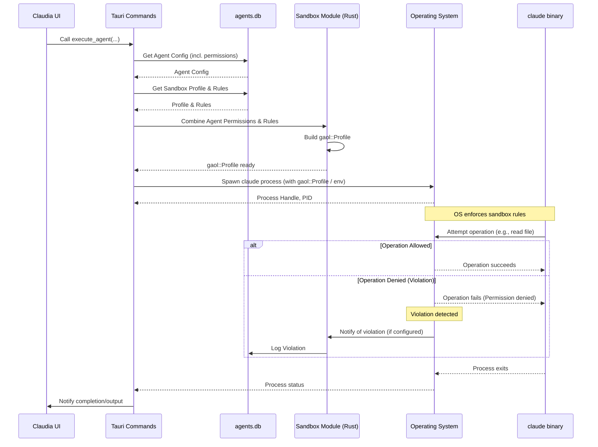
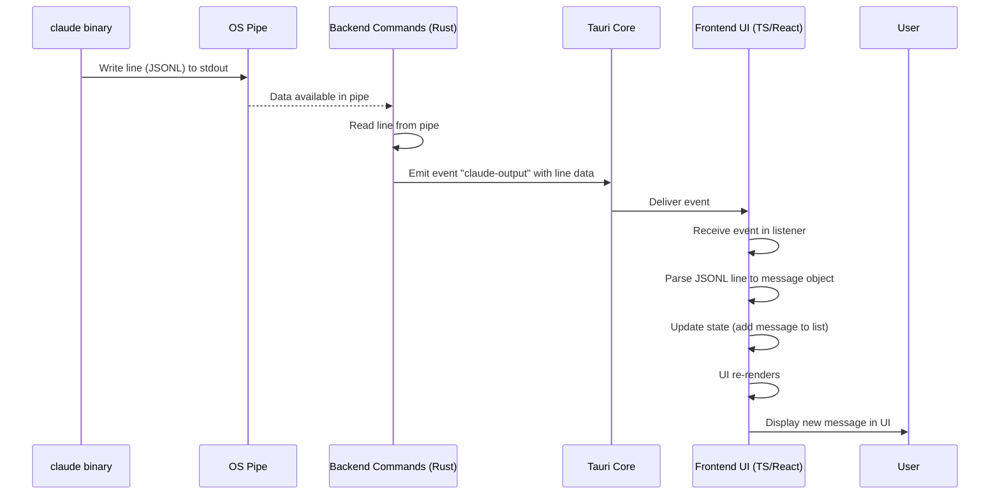
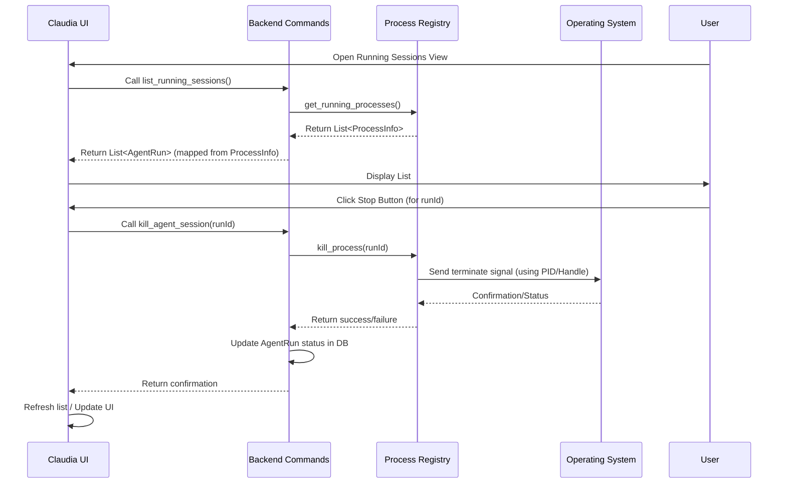
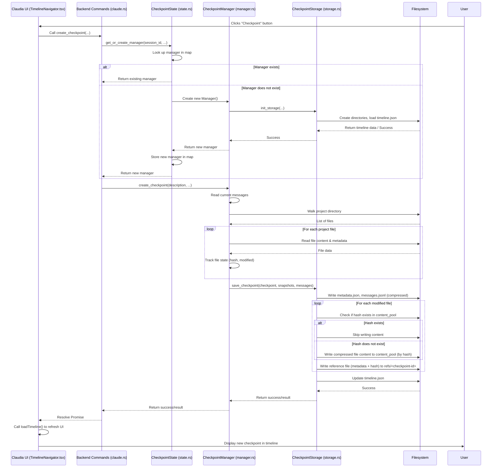
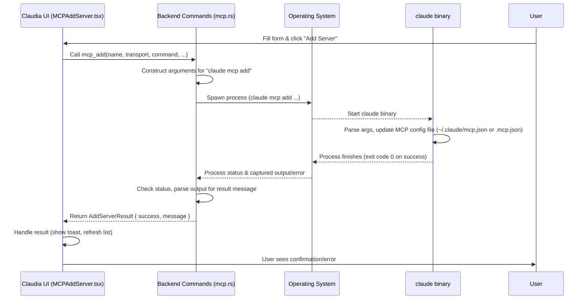

# Chapter 6: Sandboxing

Welcome back to the `claudia` tutorial! In our previous chapters, we've learned about organizing your work with [Session/Project Management](01_session_project_management_.md), defining specialized assistants with [Agents](02_agents_.md), how the [Frontend UI Components](03_frontend_ui_components_.md) create the user interface, how [Tauri Commands](04_tauri_commands_.md) connect the frontend and backend, and how `claudia` interacts with the `claude` command-line tool in [Claude CLI Interaction](05_claude_cli_interaction_.md).

Now, let's talk about a crucial aspect of security: **Sandboxing**.

## The Problem: Running Untrusted Code

When you use `claudia` to run an Agent or a direct Claude Code session, you are essentially asking the application to launch the separate `claude` binary on your computer. This `claude` binary can then execute code or perform actions based on the instructions it receives from Claude (and indirectly, from you).

Imagine you ask Claude to "write a script to delete all files in `/tmp`". While this is a harmless directory, what if you accidentally asked it to delete files in your `/Users/yourname/Documents` folder, or worse, system files? Or what if a malicious instruction somehow slipped into the context?

Running external processes, especially ones that might execute code or interact with your file system and network, introduces a security risk. By default, any program you run has the same permissions as you do. It could potentially read your sensitive files, delete important data, or connect to unwanted places on the internet.

This is where **Sandboxing** comes in.

## What is Sandboxing?

Sandboxing is like putting a protective barrier around the process that `claudia` launches (the `claude` binary). It creates a restricted environment that limits what that process can see and do on your computer, based on a predefined set of rules.

Think of it like giving the AI a restricted workspace. You give it access only to the specific tools and areas it needs to do its job for this particular task, and nothing more.

In `claudia`, sandboxing is primarily used to control the `claude` process's access to:

1.  **File System:** Prevent reading or writing files outside of specific allowed directories (like your project folder).
2.  **Network:** Prevent making unwanted connections to the internet or local network.
3.  **System Information:** Limit access to potentially sensitive system details.

By default, `claudia` aims to run Agents and sessions within a sandbox, giving you control over their permissions.

## Sandboxing with Agents

The primary way you interact with sandboxing settings in `claudia` is through the **Agent configuration**. As you saw in [Chapter 2: Agents](02_agents_.md), each Agent has specific permission toggles.

Let's revisit the simplified `AgentSandboxSettings.tsx` component from Chapter 2:

```typescript
// src/components/AgentSandboxSettings.tsx (Simplified)
// ... imports ...
import { Switch } from "@/components/ui/switch";
// ... other components ...

export const AgentSandboxSettings: React.FC<AgentSandboxSettingsProps> = ({ 
  agent, 
  onUpdate, 
  className 
}) => {
  // ... handleToggle function ...

  return (
    // ... Card and layout ...
      {/* Master sandbox toggle */}
      <div className="flex items-center justify-between">
        <Label>Enable Sandbox</Label>
        <Switch 
          checked={agent.sandbox_enabled} 
          onCheckedChange={(checked) => handleToggle('sandbox_enabled', checked)}
        />
      </div>

      {/* Permission toggles - conditional render */}
      {agent.sandbox_enabled && (
        <div className="space-y-3 pl-4 border-l-2">
          {/* File Read Toggle */}
          <div className="flex items-center justify-between">
            <Label>File Read Access</Label>
            <Switch 
              checked={agent.enable_file_read} 
              onCheckedChange={(checked) => handleToggle('enable_file_read', checked)}
            />
          </div>
          {/* File Write Toggle */}
          <div className="flex items-center justify-between">
            <Label>File Write Access</Label>
            <Switch 
              checked={agent.enable_file_write} 
              onCheckedChange={(checked) => handleToggle('enable_file_write', checked)}
            />
          </div>
          {/* Network Toggle */}
          <div className="flex items-center justify-between">
            <Label>Network Access</Label>
            <Switch 
              checked={agent.enable_network} 
              onCheckedChange={(checked) => handleToggle('enable_network', checked)}
            />
          </div>
        </div>
      )}
      {/* ... Warning when sandbox disabled ... */}
    // ... end Card ...
  );
};
```

These switches directly control whether the `claude` process launched *by this specific Agent* will be sandboxed and what high-level permissions it will have:

*   **Enable Sandbox:** The main switch. If off, sandboxing is disabled for this Agent, and the process runs with full permissions (like running `claude` directly in your terminal). This should be used with caution.
*   **File Read Access:** If enabled, the sandboxed process can read files. Without this, it might not even be able to read the source files in your project directory.
*   **File Write Access:** If enabled, the sandboxed process can create or modify files.
*   **Network Access:** If enabled, the sandboxed process can make outbound network connections (e.g., accessing APIs, cloning repositories).

These Agent-specific toggles allow you to quickly define a security posture tailored to the Agent's purpose. A "Code Reader" Agent might only need File Read. A "Code Fixer" might need File Read and Write. A "Web API Helper" might need Network Access.

## How it Works: Under the Hood

When you click "Execute" for an Agent or start a session, `claudia`'s backend takes the Agent's sandbox settings (or default settings for direct sessions) and translates them into concrete rules that the operating system can enforce.

`claudia` uses system-level sandboxing mechanisms through a library called `gaol`. `gaol` provides a way for the parent process (`claudia`'s backend) to define restrictions for a child process (`claude`).

Here's a simplified look at the steps when `claudia` launches a sandboxed `claude` process:

1.  **Get Agent Permissions:** The backend fetches the selected Agent's configuration from the database, including the `sandbox_enabled`, `enable_file_read`, `enable_file_write`, and `enable_network` fields.
2.  **Load Sandbox Profile & Rules:** `claudia` stores more detailed, reusable sandbox configurations called "Profiles" and "Rules" in its database ([Chapter 2: Agents](02_agents_.md)). The Agent might be linked to a specific Profile, or a default Profile is used. The backend loads the rules associated with this Profile.
3.  **Combine Agent Permissions and Rules:** The backend logic combines the high-level Agent toggles with the detailed Profile rules. For example, if the Agent has `enable_file_read: false`, any "file read" rules from the loaded Profile are ignored for this run. If `enable_file_read: true`, the specific paths defined in the Profile rules (like "allow reading subpaths of the project directory") are used. The project path itself (from [Chapter 1: Session/Project Management](01_session_project_management_.md)) is crucial here, as file access is often restricted to this directory.
4.  **Build `gaol` Profile:** The combined set of effective rules is used to build a `gaol::profile::Profile` object in memory. This object contains the precise operations the child process will be allowed or denied.
5.  **Prepare & Spawn Command:** The backend prepares the command to launch the `claude` binary ([Chapter 5: Claude CLI Interaction](05_claude_cli_interaction_.md)). It configures the command to run within the sandbox environment defined by the `gaol` Profile. This might involve setting special environment variables or using `gaol`'s API to spawn the child process with the restrictions already applied by the parent.
6.  **OS Enforces Sandbox:** When the `claude` process starts, the operating system, guided by the `gaol` library and the configured profile, actively monitors the process. If the `claude` process attempts an action that is *not* allowed by the sandbox rules (like trying to read a file outside the permitted paths when file read is enabled, or any file if file read is disabled), the operating system blocks the action immediately.
7.  **Violation Logging:** If a sandboxed process attempts a forbidden action, `claudia` can detect this violation and log it to its database. This helps you understand if an Agent is trying to do something unexpected.

Here's a simplified sequence diagram illustrating the sandboxing flow during execution:



This diagram shows how the Agent's settings propagate through the backend to influence the creation of the sandbox profile, which is then enforced by the operating system when the `claude` process is launched.

## Diving into the Backend Code

Let's look at snippets from the Rust code related to sandboxing, found primarily in the `src-tauri/src/sandbox/` module and `src-tauri/src/commands/sandbox.rs`.

The `Agent` struct (from `src-tauri/src/commands/agents.rs`) holds the basic toggles:

```rust
// src-tauri/src/commands/agents.rs (Simplified)
#[derive(Debug, Serialize, Deserialize, Clone)]
pub struct Agent {
    // ... other fields ...
    pub sandbox_enabled: bool,
    pub enable_file_read: bool,
    pub enable_file_write: bool, // Note: This permission is often difficult to enforce precisely via sandboxing alone and might require manual user confirmation or is inherently less secure.
    pub enable_network: bool,
    // ... other fields ...
}
```

The `src-tauri/src/commands/sandbox.rs` file contains Tauri commands for managing sandbox profiles and rules stored in the database, and for viewing violations:

```rust
// src-tauri/src/commands/sandbox.rs (Simplified)
// ... imports ...

// Represents a detailed rule in a sandbox profile
#[derive(Debug, Clone, Serialize, Deserialize)]
pub struct SandboxRule {
    pub id: Option<i64>,
    pub profile_id: i64, // Links to a profile
    pub operation_type: String, // e.g., "file_read_all", "network_outbound"
    pub pattern_type: String, // e.g., "subpath", "literal"
    pub pattern_value: String, // e.g., "{{PROJECT_PATH}}", "/home/user/.config"
    pub enabled: bool,
    pub platform_support: Option<String>, // e.g., "[\"macos\", \"linux\"]"
    pub created_at: String,
}

// Represents a log entry for a denied operation
#[derive(Debug, Clone, Serialize, Deserialize)]
pub struct SandboxViolation {
    pub id: Option<i64>,
    pub profile_id: Option<i64>, // What profile was active?
    pub agent_id: Option<i64>, // What agent was running?
    pub agent_run_id: Option<i64>, // What specific run?
    pub operation_type: String, // What was attempted?
    pub pattern_value: Option<String>, // What path/address was involved?
    pub process_name: Option<String>, // Which binary?
    pub pid: Option<i32>, // Which process ID?
    pub denied_at: String, // When did it happen?
}

// Tauri command to list sandbox profiles
#[tauri::command]
pub async fn list_sandbox_profiles(/* ... */) -> Result<Vec<SandboxProfile>, String> { /* ... */ }

// Tauri command to list rules for a profile
#[tauri::command]
pub async fn list_sandbox_rules(/* ... */) -> Result<Vec<SandboxRule>, String> { /* ... */ }

// Tauri command to view recorded violations
#[tauri::command]
pub async fn list_sandbox_violations(/* ... */) -> Result<Vec<SandboxViolation>, String> { /* ... */ }

// ... other commands for creating/updating/deleting profiles and rules ...
```

These commands allow the frontend to manage the detailed sandbox configurations that underpin the Agent's simpler toggles. For example, when you enable "File Read Access" on an Agent, the backend loads rules of `operation_type: "file_read_all"` from the selected profile.

The logic to combine Agent permissions, Profile rules, and build the `gaol::profile::Profile` happens in the `src-tauri/src/sandbox/profile.rs` and `src-tauri/src/sandbox/executor.rs` modules.

The `ProfileBuilder` is used to translate `SandboxRule` database entries into `gaol::profile::Operation` objects:

```rust
// src-tauri/src/sandbox/profile.rs (Simplified)
// ... imports ...
use gaol::profile::{Operation, PathPattern, AddressPattern, Profile};
// ... SandboxRule struct ...

pub struct ProfileBuilder {
    project_path: PathBuf, // The current project directory
    home_dir: PathBuf,     // The user's home directory
}

impl ProfileBuilder {
    // ... constructor ...

    /// Build a gaol Profile from database rules, filtered by agent permissions
    pub fn build_agent_profile(&self, rules: Vec<SandboxRule>, sandbox_enabled: bool, enable_file_read: bool, enable_file_write: bool, enable_network: bool) -> Result<ProfileBuildResult> {
        // If sandbox is disabled, return empty profile (no restrictions)
        if !sandbox_enabled {
            // ... create and return empty profile ...
        }

        let mut effective_rules = Vec::new();

        for rule in rules {
            if !rule.enabled { continue; }

            // Filter rules based on Agent permissions:
            let include_rule = match rule.operation_type.as_str() {
                "file_read_all" | "file_read_metadata" => enable_file_read,
                "network_outbound" => enable_network,
                "system_info_read" => true, // System info often needed, allow if sandbox is ON
                _ => true // Default to include if unknown
            };

            if include_rule {
                effective_rules.push(rule);
            }
        }
        
        // Always ensure project path access is included if file read is ON
        if enable_file_read {
           // ... add rule for project path if not already present ...
        }

        // Now build the actual gaol Profile from the effective rules
        self.build_profile_with_serialization(effective_rules) // This translates rules into gaol::Operation
    }

    /// Translates SandboxRules into gaol::Operation and serialized form
    fn build_operation_with_serialization(&self, rule: &SandboxRule) -> Result<Option<(Operation, SerializedOperation)>> {
        match rule.operation_type.as_str() {
            "file_read_all" => {
                 let (pattern, path, is_subpath) = self.build_path_pattern_with_info(&rule.pattern_type, &rule.pattern_value)?;
                 Ok(Some((Operation::FileReadAll(pattern), SerializedOperation::FileReadAll { path, is_subpath })))
            },
            "network_outbound" => {
                 let (pattern, serialized) = self.build_address_pattern_with_serialization(&rule.pattern_type, &rule.pattern_value)?;
                 Ok(Some((Operation::NetworkOutbound(pattern), serialized)))
            },
            // ... handle other operation types ...
            _ => Ok(None)
        }
    }

    // ... helper functions to build path/address patterns ...
}
```

The `build_agent_profile` function is key. It takes the raw rules from the database and the Agent's simple boolean toggles, then filters the rules. It also ensures essential access (like reading the project directory) is granted if file read is enabled. Finally, it calls `build_profile_with_serialization` to create the actual `gaol::Profile` object and a simplified, serializable representation of the rules (`SerializedProfile`).

This `SerializedProfile` is then passed to the `SandboxExecutor`:

```rust
// src-tauri/src/sandbox/executor.rs (Simplified)
// ... imports ...
use gaol::sandbox::Sandbox;
use tokio::process::Command;
use std::path::Path;

pub struct SandboxExecutor {
    profile: gaol::profile::Profile, // The gaol profile object
    project_path: PathBuf,
    serialized_profile: Option<SerializedProfile>, // Serialized rules for child process
}

impl SandboxExecutor {
    // ... constructor ...

    /// Prepare a tokio Command for sandboxed execution
    /// The sandbox will be activated in the child process by reading environment variables
    pub fn prepare_sandboxed_command(&self, command: &str, args: &[&str], cwd: &Path) -> Command {
        let mut cmd = Command::new(command);
        cmd.args(args).current_dir(cwd);

        // ... inherit environment variables like PATH, HOME ...

        // Serialize the sandbox rules and set environment variables
        if let Some(ref serialized) = self.serialized_profile {
             let rules_json = serde_json::to_string(serialized).expect("Failed to serialize rules");
             // NOTE: These environment variables are currently commented out in the actual code
             // for debugging and compatibility reasons.
             // In a fully enabled child-side sandboxing model, these would be set:
             // cmd.env("GAOL_SANDBOX_ACTIVE", "1");
             // cmd.env("GAOL_PROJECT_PATH", self.project_path.to_string_lossy().as_ref());
             // cmd.env("GAOL_SANDBOX_RULES", &rules_json);
             log::warn!("🚨 Sandboxing environment variables for child process are currently disabled!");
        } else {
             log::warn!("🚨 No serialized profile - running without sandbox environment!");
        }
        
        cmd.stdin(Stdio::null()).stdout(Stdio::piped()).stderr(Stdio::piped())
    }
    
    // ... Other execution methods ...
}
```

The `prepare_sandboxed_command` function takes the `gaol::profile::Profile` and the `SerializedProfile`. Although the environment variable mechanism shown above is temporarily disabled in the provided code snippets, the *intention* is for the parent process (`claudia`'s backend) to set up the environment for the child process (`claude`). The child process, if it supports this model (like `gaol`'s `ChildSandbox::activate()`), would read these environment variables upon startup and activate the sandbox *within itself* before executing the main task.

Alternatively, `gaol` also supports launching the child process directly from the sandboxed parent using `Sandbox::start()`. The provided code attempts this first but falls back due to current `gaol` library limitations regarding getting the child process handle back.

The `src-tauri/src/sandbox/platform.rs` file defines what kind of sandboxing capabilities are available and supported on the current operating system (Linux, macOS, FreeBSD have some support).

```rust
// src-tauri/src/sandbox/platform.rs (Simplified)
// ... imports ...

#[derive(Debug, Clone, Serialize, Deserialize)]
pub struct PlatformCapabilities {
    pub os: String,
    pub sandboxing_supported: bool, // Is sandboxing generally possible?
    // ... details about specific operation support ...
}

pub fn get_platform_capabilities() -> PlatformCapabilities { /* ... detects OS and returns capabilities ... */ }
pub fn is_sandboxing_available() -> bool { /* ... checks if OS is supported ... */ }
```

This is used by the UI (via the `get_platform_capabilities` command) to inform the user if sandboxing is fully supported or if there are limitations on their platform.

In summary, sandboxing in `claudia` works by:
1.  Allowing users to set high-level permissions (read/write/network) on Agents via the UI.
2.  Storing detailed, reusable sandbox Profiles and Rules in the backend database.
3.  Combining Agent permissions with Profile rules in the backend to create a specific set of restrictions for a given process run.
4.  Using system-level sandboxing features (via the `gaol` library and potentially environment variables) to apply these restrictions when launching the `claude` process.
5.  Logging any attempts by the sandboxed process to violate these rules.

This multi-layered approach provides both ease of use (Agent toggles) and flexibility (detailed rules in Profiles), significantly improving security when running AI-generated instructions or code.

## Conclusion

In this chapter, we explored **Sandboxing**, `claudia`'s security system. We learned why running external processes requires security measures and how sandboxing provides a protective barrier to limit what the `claude` process can access or do.

We saw how you control sandboxing primarily through Agent permissions in the UI, enabling or disabling file read, file write, and network access. We then dived into the backend to understand how these simple toggles are combined with detailed Sandbox Profile rules to build a concrete `gaol::profile::Profile`. This profile is then used to launch the `claude` binary within a restricted environment enforced by the operating system, with potential violations being logged.

Understanding sandboxing is key to securely leveraging the power of Claude Code, especially when it interacts with your local file system.

In the next chapter, we'll learn how `claudia` handles the continuous stream of output from the `claude` binary to update the UI in real-time: [Streamed Output Processing](07_streamed_output_processing_.md).

[Next Chapter: Streamed Output Processing](07_streamed_output_processing_.md)

---

<sub><sup>Generated by [AI Codebase Knowledge Builder](https://github.com/The-Pocket/Tutorial-Codebase-Knowledge).</sup></sub> <sub><sup>**References**: [[1]](https://github.com/getAsterisk/claudia/blob/abe0891b0b6e0f5516343bd86ed590bdc8e479b3/src-tauri/src/commands/sandbox.rs), [[2]](https://github.com/getAsterisk/claudia/blob/abe0891b0b6e0f5516343bd86ed590bdc8e479b3/src-tauri/src/sandbox/executor.rs), [[3]](https://github.com/getAsterisk/claudia/blob/abe0891b0b6e0f5516343bd86ed590bdc8e479b3/src-tauri/src/sandbox/mod.rs), [[4]](https://github.com/getAsterisk/claudia/blob/abe0891b0b6e0f5516343bd86ed590bdc8e479b3/src-tauri/src/sandbox/platform.rs), [[5]](https://github.com/getAsterisk/claudia/blob/abe0891b0b6e0f5516343bd86ed590bdc8e479b3/src-tauri/src/sandbox/profile.rs), [[6]](https://github.com/getAsterisk/claudia/blob/abe0891b0b6e0f5516343bd86ed590bdc8e479b3/src/components/AgentSandboxSettings.tsx)</sup></sub>

# Chapter 7: Streamed Output Processing

Welcome back to the `claudia` tutorial! In our previous chapters, we've learned about organizing your work with [Session/Project Management](01_session_project_management_.md), defining specialized assistants with [Agents](02_agents_.md), how the [Frontend UI Components](03_frontend_ui_components_.md) create the user interface, how [Tauri Commands](04_tauri_commands_.md) connect the frontend and backend, how `claudia` interacts with the `claude` command-line tool in [Claude CLI Interaction](05_claude_cli_interaction_.md), and how [Sandboxing](06_sandboxing_.md) keeps things secure.

Now, let's look at how `claudia` handles the constant flow of information coming *from* the `claude` binary while it's running. This is the concept of **Streamed Output Processing**.

## The Problem: Real-time Updates

Imagine you ask Claude Code to perform a complex task, like analyzing your codebase or generating a long piece of documentation. This process can take time. The `claude` command-line tool doesn't just wait until it's completely finished and then dump all the results at once. Instead, it often sends its output piece by piece: a thought process here, a tool call there, a chunk of generated text, and finally, a result message.

As a user of `claudia`'s graphical interface, you don't want to stare at a frozen screen waiting for everything to finish. You want to see what Claude is doing *right now*, as it's happening. You want a live view of its progress.

This is the problem that Streamed Output Processing solves. `claudia` needs to capture this real-time, piece-by-piece output from the `claude` process and display it to you instantly.

Think of it like watching a live news feed or a chat application. Messages appear as they are sent, not all bundled up and delivered at the very end.

## What is Streamed Output Processing?

Streamed Output Processing in `claudia` refers to the entire system that:

1.  **Captures** the output from the running `claude` process *as it is generated*.
2.  **Receives** this output in the backend, often as a stream of data.
3.  **Parses** this data (which is typically in a specific format called JSONL) line by line.
4.  **Transforms** each parsed piece into a structured message that the frontend understands.
5.  **Sends** these structured messages from the backend to the frontend immediately.
6.  **Displays** these messages in the user interface as they arrive, providing a live, dynamic view.

The core idea is that the output is treated as a *stream* – a continuous flow of data arriving over time – rather than a single large block of data at the end.

## How it Looks in the UI

When you execute an Agent or run an interactive session in `claudia`, the main part of the screen fills up with messages as they come in.

You'll see different types of messages appear:

*   Initial system messages (showing session info, tools available).
*   Assistant messages (Claude's thoughts, text, tool calls).
*   User messages (your prompts, tool results sent back to Claude).
*   Result messages (indicating the overall success or failure of a step).

Each of these appears in the UI as soon as `claudia` receives the corresponding piece of output from the `claude` process.

In the frontend code (like `src/components/AgentExecution.tsx` or `src/components/ClaudeCodeSession.tsx`), there's a state variable, typically an array, that holds all the messages displayed. When a new piece of output arrives, this array is updated, and React automatically re-renders the list to include the new message.

For example, in `AgentExecution.tsx`, you'll find code like this managing the displayed messages:

```typescript
// src/components/AgentExecution.tsx (Simplified)
// ... imports ...

interface AgentExecutionProps {
  // ... props ...
}

export interface ClaudeStreamMessage {
  type: "system" | "assistant" | "user" | "result";
  // ... other fields based on the JSONL structure ...
}

export const AgentExecution: React.FC<AgentExecutionProps> = ({
  agent,
  onBack,
  className,
}) => {
  // State to hold the list of messages displayed in the UI
  const [messages, setMessages] = useState<ClaudeStreamMessage[]>([]);
  // ... other state variables ...

  // ... handleExecute function ...
  
  // When a new message arrives (handled by an event listener, shown below):
  const handleNewMessage = (newMessage: ClaudeStreamMessage) => {
      setMessages(prev => [...prev, newMessage]); // Add the new message to the array
  };

  // ... render function ...
  // The rendering logic maps over the `messages` array to display each one
  // using the StreamMessage component
  /*
  return (
    // ... layout ...
    <div className="flex-1 overflow-y-auto">
      {messages.map((message, index) => (
        <StreamMessage key={index} message={message} /> // Render each message
      ))}
    </div>
    // ... rest of component ...
  );
  */
};
// ... rest of file ...
```

This state update (`setMessages`) is the frontend's way of saying, "Hey React, something new arrived, please update the list!"

## How it Works: The Data Flow

The communication happens in several steps, involving the `claude` binary, the operating system's pipes, the `claudia` backend (Rust), the Tauri framework, and the `claudia` frontend (TypeScript/React).

1.  **`claude` writes output:** The `claude` process executes your request. When it has a piece of output to share (like a tool call or a chunk of text), it writes it to its standard output (stdout).
2.  **OS captures output:** Because `claudia`'s backend spawned `claude` with piped stdout ([Chapter 5: Claude CLI Interaction](05_claude_cli_interaction_.md)), the operating system redirects `claude`'s stdout into a temporary buffer or pipe that the `claudia` backend can read from.
3.  **Backend reads line by line:** The `claudia` backend continuously reads from this pipe. It's specifically looking for newline characters to know when a complete line (a complete JSONL entry) has arrived.
4.  **Backend emits event:** As soon as the backend reads a complete line, it takes the raw string data and emits it as a Tauri event. These events have a specific name (like `"agent-output"` or `"claude-output"`) that the frontend is listening for.
5.  **Tauri delivers event:** The Tauri framework acts as the messenger, efficiently delivering the event and its data payload from the backend Rust process to the frontend JavaScript process.
6.  **Frontend receives event:** The frontend has registered event listeners using Tauri's event API. When an event with the matching name arrives, the registered callback function is executed.
7.  **Frontend processes and updates:** The callback function receives the raw output line. It parses the JSONL string into a JavaScript object and updates the component's state (`messages` array).
8.  **UI re-renders:** React detects the state change and updates only the necessary parts of the UI to display the new message.

Here is a simplified sequence diagram for this process:



This flow repeats every time `claude` outputs a new line, providing the smooth, real-time updates you see in the `claudia` interface.

## Diving into the Code

Let's look at the relevant code snippets from both the backend (Rust) and the frontend (TypeScript).

### Backend: Reading and Emitting

As seen in [Chapter 5: Claude CLI Interaction](05_claude_cli_interaction_.md), the backend uses `tokio` to handle the asynchronous reading of the process's standard output. It spawns a task that reads line by line and emits events.

Here's a simplified look at the part of `src-tauri/src/commands/claude.rs` (or similar module) that does this:

```rust
// src-tauri/src/commands/claude.rs (Simplified)
// ... imports ...
use tokio::io::{AsyncBufReadExt, BufReader};
use tauri::{AppHandle, Manager};
use tokio::process::Command; // Assuming command is already built

/// Helper function to spawn Claude process and handle streaming
async fn spawn_claude_process(app: AppHandle, mut cmd: Command) -> Result<(), String> {
    // ... Configure stdout/stderr pipes ...
    cmd.stdout(std::process::Stdio::piped()).stderr(std::process::Stdio::piped());

    let mut child = cmd.spawn().map_err(|e| format!("Failed to spawn Claude: {}", e))?;

    let stdout = child.stdout.take().ok_or("Failed to get stdout")?;
    let stdout_reader = BufReader::new(stdout);

    // Spawn a task to read stdout line by line and emit events
    let app_handle_stdout = app.clone(); // Clone handle for the async task
    tokio::spawn(async move {
        let mut lines = stdout_reader.lines();
        while let Ok(Some(line)) = lines.next_line().await {
            // Log or process the raw line
            log::debug!("Claude stdout line: {}", line);
            // Emit the line as an event to the frontend
            let _ = app_handle_stdout.emit("claude-output", &line); // <-- Emitting the event!
        }
         log::info!("Finished reading Claude stdout.");
    });

    // ... Similar task for stderr ...
    // ... Task to wait for process exit and emit completion event ...

    Ok(())
}

// Example Tauri command calling the helper
/*
#[tauri::command]
pub async fn execute_claude_code(app: AppHandle, project_path: String, prompt: String, model: String) -> Result<(), String> {
    // ... build the Command object 'cmd' ...
    spawn_claude_process(app, cmd).await // Calls the streaming helper
}
*/
```

The crucial part here is the `tokio::spawn` block that reads lines (`lines.next_line().await`) and, for each line, calls `app_handle_stdout.emit("claude-output", &line)`. This sends the raw JSONL line string to the frontend via the Tauri event system. The `"claude-output"` string is the event name.

### Frontend: Listening and Processing

In the frontend (TypeScript), the component that displays the output (like `AgentExecution.tsx` or `ClaudeCodeSession.tsx`) needs to set up listeners for these events when it loads and clean them up when it unmounts.

Here's a simplified look at the event listener setup in `AgentExecution.tsx`:

```typescript
// src/components/AgentExecution.tsx (Simplified)
// ... imports ...
import { listen, type UnlistenFn } from "@tauri-apps/api/event";
// ... ClaudeStreamMessage type ...

export const AgentExecution: React.FC<AgentExecutionProps> = ({
  agent,
  onBack,
  className,
}) => {
  const [messages, setMessages] = useState<ClaudeStreamMessage[]>([]);
  const [rawJsonlOutput, setRawJsonlOutput] = useState<string[]>([]); // Keep raw output too
  // ... other state variables ...

  const unlistenRefs = useRef<UnlistenFn[]>([]); // Ref to store unlisten functions

  useEffect(() => {
    // Set up event listeners when the component mounts or execution starts
    let outputUnlisten: UnlistenFn | undefined;
    let errorUnlisten: UnlistenFn | undefined;
    let completeUnlisten: UnlistenFn | undefined;

    const setupListeners = async () => {
       try {
            // Listen for lines from stdout
           outputUnlisten = await listen<string>("agent-output", (event) => { // <-- Listening for the event!
               try {
                   // The event payload is the raw JSONL line string
                   const rawLine = event.payload;
                   setRawJsonlOutput(prev => [...prev, rawLine]); // Store raw line

                   // Parse the JSONL string into a JavaScript object
                   const message = JSON.parse(rawLine) as ClaudeStreamMessage;

                   // Update the messages state, triggering a UI re-render
                   setMessages(prev => [...prev, message]); // <-- Updating state!

               } catch (err) {
                   console.error("Failed to process Claude output line:", err, event.payload);
                   // Handle parsing errors if necessary
               }
           });

           // Listen for stderr lines (errors)
           errorUnlisten = await listen<string>("agent-error", (event) => {
               console.error("Claude stderr:", event.payload);
               // You might want to display these errors in the UI too
           });

           // Listen for the process completion event
           completeUnlisten = await listen<boolean>("agent-complete", (event) => {
               console.log("Claude process complete:", event.payload);
               // Update UI state (e.g., hide loading indicator)
               // ... update isRunning state ...
           });

           // Store unlisten functions so we can clean them up later
           unlistenRefs.current = [outputUnlisten, errorUnlisten, completeUnlisten];

       } catch (err) {
           console.error("Failed to set up event listeners:", err);
           // Handle listener setup errors
       }
    };

    setupListeners();

    // Clean up listeners when the component unmounts
    return () => {
      unlistenRefs.current.forEach(unlisten => unlisten());
    };
  }, []); // Empty dependency array means setup runs once on mount

  // ... render function ...
};
// ... rest of file ...
```

This `useEffect` hook sets up the listener using `listen("agent-output", ...)`. The callback function receives the event, accesses the raw JSONL string via `event.payload`, parses it with `JSON.parse`, and then updates the `messages` state using `setMessages`. This sequence is the core of the streamed output processing on the frontend. The `useRef` and the cleanup function in the `useEffect` are standard React patterns for managing resources (like event listeners) that persist across renders but need to be cleaned up when the component is no longer needed.

The parsed `message` object is then passed down to the `StreamMessage` component (referenced in the provided code snippet for `src/components/StreamMessage.tsx`) which knows how to interpret the different `type` and `subtype` fields (like "assistant", "tool_use", "tool_result", "result") and render them with appropriate icons, formatting, and potentially syntax highlighting (using libraries like `react-markdown` and `react-syntax-highlighter`) or custom widgets ([ToolWidgets.tsx]).

## Conclusion

In this chapter, we explored **Streamed Output Processing**, understanding how `claudia` handles the real-time flow of information from the running `claude` command-line tool. We learned that `claude` sends output piece by piece in JSONL format, and that `claudia`'s backend captures this stream, reads it line by line, and immediately emits each line as a Tauri event to the frontend.

On the frontend, we saw how components use `listen` to subscribe to these events, parse the JSONL payload into structured message objects, and update their state to display the new information dynamically. This entire process ensures that the `claudia` UI provides a responsive, live view of the AI's progress and actions during interactive sessions and Agent runs.

Understanding streamed output is key to seeing how `claudia` provides its core real-time chat and execution experience on top of a command-line binary.

In the next chapter, we'll look at how `claudia` keeps track of multiple potentially running processes, like Agent runs or direct sessions: [Process Registry](08_process_registry_.md).

[Next Chapter: Process Registry](08_process_registry_.md)

---

<sub><sup>Generated by [AI Codebase Knowledge Builder](https://github.com/The-Pocket/Tutorial-Codebase-Knowledge).</sup></sub> <sub><sup>**References**: [[1]](https://github.com/getAsterisk/claudia/blob/abe0891b0b6e0f5516343bd86ed590bdc8e479b3/src/components/AgentExecution.tsx), [[2]](https://github.com/getAsterisk/claudia/blob/abe0891b0b6e0f5516343bd86ed590bdc8e479b3/src/components/ClaudeCodeSession.tsx), [[3]](https://github.com/getAsterisk/claudia/blob/abe0891b0b6e0f5516343bd86ed590bdc8e479b3/src/components/StreamMessage.tsx), [[4]](https://github.com/getAsterisk/claudia/blob/abe0891b0b6e0f5516343bd86ed590bdc8e479b3/src/components/ToolWidgets.tsx), [[5]](https://github.com/getAsterisk/claudia/blob/abe0891b0b6e0f5516343bd86ed590bdc8e479b3/src/types/enhanced-messages.ts)</sup></sub>

# Chapter 8: Process Registry

Welcome back to the `claudia` tutorial! In our last chapter, [Chapter 7: Streamed Output Processing](07_streamed_output_processing_.md), we learned how `claudia` captures and displays the output from the `claude` command-line tool in real-time as it's running.

Now, let's talk about something that happens just *before* that output starts streaming: launching the `claude` tool itself. When you click "Execute" for an Agent or start a new session, `claudia` doesn't just run the command and wait; it starts the `claude` binary as a separate **process** that runs in the background.

What if you run multiple agents? What if you start a session and then switch to look at something else while it's running? How does `claudia` keep track of all these separate `claude` processes? How does it know which process is which? And how can it show you their status or let you stop them if needed?

This is where the **Process Registry** comes in.

## What is the Process Registry?

Think of the Process Registry as `claudia`'s internal "Task Manager" specifically for the `claude` processes it starts. It's a system within the `claudia` backend (the Rust code) that keeps a list of all the `claude` processes that are currently running.

For each running process, the registry stores important information, such as:

*   A unique identifier for this specific "run" (like the `run_id` we saw for Agent Runs in [Chapter 2: Agents](02_agents_.md)).
*   The **Process ID (PID)** assigned by the operating system. This is like the process's unique phone number that the operating system uses to identify it.
*   The current **status** (like "running", "completed", "failed", "cancelled").
*   Information about *what* is being run (like which Agent, the task description, the project path).
*   A reference to the process itself, allowing `claudia` to interact with it (like sending a signal to stop it).
*   A temporary buffer to hold the most recent output, allowing quick access to live status without reading the entire JSONL file every time.

The Process Registry allows `claudia` to monitor these background processes, provide access to their live output streams (as discussed in [Chapter 7: Streamed Output Processing](07_streamed_output_processing_.md)), and offer controls like stopping a running task.

## The Use Case: Managing Running Sessions

The most visible use case for the Process Registry in `claudia` is the "Running Sessions" screen. This screen lists all the Agent runs or interactive sessions that `claudia` has started and are still considered "active" (running or perhaps recently finished but not yet fully cleaned up).

Here's a simplified look at the frontend component responsible for this, `RunningSessionsView.tsx`:

```typescript
// src/components/RunningSessionsView.tsx (Simplified)
import { useState, useEffect } from 'react';
// ... other imports ...
import { api } from '@/lib/api'; // Import API helper
import type { AgentRun } from '@/lib/api'; // Import data type

export function RunningSessionsView({ /* ... props ... */ }) {
  const [runningSessions, setRunningSessions] = useState<AgentRun[]>([]); // State to hold list
  const [loading, setLoading] = useState(true);
  // ... other state ...

  // Function to fetch the list of running sessions
  const loadRunningSessions = async () => {
    try {
      // Call the backend command to get running sessions
      const sessions = await api.listRunningAgentSessions(); 
      setRunningSessions(sessions); // Update state with the list
    } catch (error) {
      console.error('Failed to load running sessions:', error);
      // ... handle error ...
    } finally {
      setLoading(false);
    }
  };

  // Function to stop a session
  const killSession = async (runId: number, agentName: string) => {
    try {
      // Call the backend command to kill a session
      const success = await api.killAgentSession(runId);
      if (success) {
        console.log(`${agentName} session stopped.`);
        // Refresh the list after killing
        await loadRunningSessions();
      } else {
        console.warn('Session may have already finished');
      }
    } catch (error) {
      console.error('Failed to kill session:', error);
      // ... handle error ...
    }
  };

  useEffect(() => {
    loadRunningSessions(); // Load sessions when component mounts
    
    // Set up auto-refresh
    const interval = setInterval(() => {
      loadRunningSessions(); 
    }, 5000); // Refresh every 5 seconds

    return () => clearInterval(interval); // Clean up interval
  }, []);

  if (loading) {
    return <p>Loading running sessions...</p>; // Loading indicator
  }

  return (
    <div className="space-y-4">
      <h2>Running Agent Sessions</h2>
      {runningSessions.length === 0 ? (
        <p>No agent sessions are currently running</p>
      ) : (
        <div className="space-y-3">
          {/* Map over the runningSessions list to display each one */}
          {runningSessions.map((session) => (
            <div key={session.id}> {/* Card or similar display */}
              <h3>{session.agent_name}</h3>
              <p>Status: {session.status}</p>
              <p>PID: {session.pid}</p>
              {/* ... other details like task, project path, duration ... */}
              
              {/* Buttons to interact with the session */}
              <button onClick={() => setSelectedSession(session)}>View Output</button> {/* Set state to open viewer */}
              <button onClick={() => session.id && killSession(session.id, session.agent_name)}>Stop</button>
            </div>
          ))}
        </div>
      )}
      
      {/* Session Output Viewer component (shown when selectedSession is not null) */}
      {selectedSession && (
        <SessionOutputViewer 
          session={selectedSession} 
          onClose={() => setSelectedSession(null)} 
        />
      )}
    </div>
  );
}
```

This component demonstrates how the frontend relies on the backend's Process Registry:
1.  It calls `api.listRunningAgentSessions()` to get the current list.
2.  It displays information for each running process, including the PID and status.
3.  It provides "Stop" buttons that call `api.killAgentSession(runId)`, requesting the backend to terminate the corresponding process.
4.  It provides a "View Output" button that, when clicked, might fetch the live output buffer from the registry (using a command like `api.getLiveSessionOutput(runId)`) before potentially switching to file-based streaming ([Chapter 7: Streamed Output Processing](07_streamed_output_processing_.md)).
5.  It automatically refreshes this list periodically by calling `loadRunningSessions` again.

## How it Works: Under the Hood

The Process Registry is implemented in the Rust backend, primarily in the `src-tauri/src/process/registry.rs` file.

Here's a simplified look at what happens step-by-step:

1.  **Process Spawned:** When a backend command like `execute_agent` or `execute_claude_code` needs to launch the `claude` binary ([Chapter 5: Claude CLI Interaction](05_claude_cli_interaction_.md)), it prepares the command and then calls `child.spawn()`.
2.  **Registration:** Immediately after `child.spawn()` successfully starts the process, the backend extracts the **PID** from the returned `Child` object. It then takes the `run_id` (generated when the Agent run record was created in the database), the PID, and other relevant info (Agent name, task, project path) and calls a method on the `ProcessRegistry` instance, typically `registry.register_process(...)`.
3.  **Registry Storage:** The `ProcessRegistry` stores this information in an in-memory data structure, like a `HashMap`, where the key is the `run_id` and the value is an object containing the `ProcessInfo` and the actual `Child` handle. It also initializes a buffer for live output for this specific run.
4.  **Output Appending:** As the streaming output processing ([Chapter 7: Streamed Output Processing](07_streamed_output_processing_.md)) reads lines from the process's stdout/stderr pipes, it also appends these lines to the live output buffer associated with this run_id in the Process Registry using `registry.append_live_output(run_id, line)`.
5.  **Listing Processes:** When the frontend calls `list_running_agent_sessions` (which maps to a backend command like `list_running_sessions`), the backend accesses the `ProcessRegistry` and asks it for the list of currently registered processes (`registry.get_running_processes()`). The registry returns the stored `ProcessInfo` for each active entry in its map.
6.  **Viewing Live Output:** When the frontend calls `get_live_session_output(runId)`, the backend asks the registry for the live output buffer associated with that `runId` (`registry.get_live_output(runId)`), and returns it to the frontend.
7.  **Killing Process:** When the frontend calls `kill_agent_session(runId)`, the backend first tells the `ProcessRegistry` to attempt to terminate the process (`registry.kill_process(runId)`). The registry uses the stored `Child` handle or PID to send a termination signal to the operating system. After attempting the kill, the backend also updates the database record for that run to mark its status as 'cancelled'.
8.  **Cleanup:** Periodically, `claudia` runs a cleanup task (`cleanup_finished_processes`) that checks the status of processes currently in the registry. If a process has exited (e.g., finished naturally or was killed), the registry removes its entry (`registry.unregister_process(runId)`). This also helps keep the database status accurate.

Here's a simple sequence diagram showing the core interactions:



This diagram illustrates how the frontend relies on backend commands to query and manage the processes tracked by the Process Registry.

## Diving into the Backend Code

The core implementation of the Process Registry is found in `src-tauri/src/process/registry.rs`.

First, let's look at the `ProcessInfo` struct, which holds the basic details about a running process:

```rust
// src-tauri/src/process/registry.rs (Simplified)
// ... imports ...
use chrono::{DateTime, Utc};
use serde::{Deserialize, Serialize};

/// Information about a running agent process
#[derive(Debug, Clone, Serialize, Deserialize)]
pub struct ProcessInfo {
    pub run_id: i64,       // Matches the agent_runs database ID
    pub agent_id: i64,     // Which agent started this run
    pub agent_name: String, // Agent's name
    pub pid: u32,          // Operating System Process ID
    pub started_at: DateTime<Utc>, // When it started
    pub project_path: String, // Where it's running
    pub task: String,      // The task given
    pub model: String,     // The model used
}
```

The `ProcessRegistry` struct itself is simple; it just holds the map and uses `Arc<Mutex<...>>` for thread-safe access because multiple parts of the backend might need to interact with it concurrently.

```rust
// src-tauri/src/process/registry.rs (Simplified)
// ... imports ...
use std::collections::HashMap;
use std::sync::{Arc, Mutex};
use tokio::process::Child; // Need the process handle itself

/// Information about a running process with handle
pub struct ProcessHandle {
    pub info: ProcessInfo,
    pub child: Arc<Mutex<Option<Child>>>, // The handle to the child process
    pub live_output: Arc<Mutex<String>>,  // Buffer for live output
}

/// Registry for tracking active agent processes
pub struct ProcessRegistry {
    // Map from run_id to the ProcessHandle
    processes: Arc<Mutex<HashMap<i64, ProcessHandle>>>, 
}

impl ProcessRegistry {
    pub fn new() -> Self {
        Self {
            processes: Arc::new(Mutex::new(HashMap::new())),
        }
    }

    // ... methods like register_process, unregister_process, get_running_processes, kill_process, append_live_output, get_live_output ...
}

// Tauri State wrapper for the registry
pub struct ProcessRegistryState(pub Arc<ProcessRegistry>);
// ... Default impl ...
```

When a process is spawned, the `execute_agent` command (in `src-tauri/src/commands/agents.rs`) calls `registry.register_process`:

```rust
// src-tauri/src/commands/agents.rs (Simplified)
// ... imports ...
// Assuming 'registry' is the State<ProcessRegistryState>
// Assuming 'child' is the tokio::process::Child from cmd.spawn()...
// Assuming 'run_id', 'agent_id', etc., are defined...

// Register the process in the registry
registry.0.register_process(
    run_id,
    agent_id,
    agent.name.clone(), // Agent name
    pid,                // Process ID
    project_path.clone(),
    task.clone(),
    execution_model.clone(),
    child, // Pass the child handle
).map_err(|e| format!("Failed to register process: {}", e))?;

info!("📋 Registered process in registry");

// ... rest of the async task waiting for process to finish ...
```

The `register_process` method in the `ProcessRegistry` then locks the internal map and inserts the new entry:

```rust
// src-tauri/src/process/registry.rs (Simplified)
// ... in impl ProcessRegistry ...

/// Register a new running process
pub fn register_process(
    &self,
    run_id: i64,
    agent_id: i64,
    agent_name: String,
    pid: u32,
    project_path: String,
    task: String,
    model: String,
    child: Child, // Receives the child handle
) -> Result<(), String> {
    let mut processes = self.processes.lock().map_err(|e| e.to_string())?; // Lock the map
    
    let process_info = ProcessInfo {
        run_id, agent_id, agent_name, pid, 
        started_at: Utc::now(), 
        project_path, task, model,
    };

    let process_handle = ProcessHandle {
        info: process_info,
        child: Arc::new(Mutex::new(Some(child))), // Store the handle
        live_output: Arc::new(Mutex::new(String::new())), // Init output buffer
    };

    processes.insert(run_id, process_handle); // Insert into the map
    Ok(())
}
```

Listing running processes involves locking the map and collecting the `ProcessInfo` from each `ProcessHandle`:

```rust
// src-tauri/src/process/registry.rs (Simplified)
// ... in impl ProcessRegistry ...

/// Get all running processes
pub fn get_running_processes(&self) -> Result<Vec<ProcessInfo>, String> {
    let processes = self.processes.lock().map_err(|e| e.to_string())?; // Lock the map
    // Iterate through the map's values (ProcessHandle), clone the info field, collect into a Vec
    Ok(processes.values().map(|handle| handle.info.clone()).collect())
}
```

Killing a process involves looking up the `ProcessHandle` by `run_id`, accessing the stored `Child` handle, and calling its `kill` method:

```rust
// src-tauri/src/process/registry.rs (Simplified)
// ... in impl ProcessRegistry ...
use tokio::process::Child;

/// Kill a running process
pub async fn kill_process(&self, run_id: i64) -> Result<bool, String> {
    let processes = self.processes.lock().map_err(|e| e.to_string())?; // Lock the map
    
    if let Some(handle) = processes.get(&run_id) {
        let child_arc = handle.child.clone();
        drop(processes); // IMPORTANT: Release the lock before calling async kill()
        
        let mut child_guard = child_arc.lock().map_err(|e| e.to_string())?; // Lock the child handle
        if let Some(ref mut child) = child_guard.as_mut() {
            match child.kill().await { // Call the async kill method
                Ok(_) => {
                    *child_guard = None; // Clear the handle after killing
                    Ok(true)
                }
                Err(e) => Err(format!("Failed to kill process: {}", e)),
            }
        } else {
            Ok(false) // Process was already killed or completed
        }
    } else {
        Ok(false) // Process not found in registry
    }
}
```

Note that the `kill_agent_session` Tauri command ([src-tauri/src/commands/agents.rs]) first calls `registry.kill_process` to try terminating the *actual* OS process via the `Child` handle, and *then* updates the database status. This ensures the UI accurately reflects the state even if the process doesn't immediately exit after the signal.

The `cleanup_finished_processes` command (also in `src-tauri/src/commands/agents.rs`) periodically checks all processes currently in the registry using `registry.is_process_running()` and, if they are no longer running, updates their status in the database and removes them from the registry.

This Process Registry provides the backend's central point for managing and interacting with all the separate `claude` instances that `claudia` is running, enabling features like the "Running Sessions" view and the ability to stop tasks.

## Conclusion

In this chapter, we introduced the **Process Registry**, `claudia`'s internal system for tracking the `claude` command-line tool processes it launches in the background. We learned that it stores essential information like PID, status, and associated run details, allowing `claudia` to monitor and control these separate tasks.

We saw how the Process Registry is used to power features like the "Running Sessions" view in the UI, enabling users to see what's currently executing, view live output, and stop processes. We also delved into the backend implementation, seeing how processes are registered upon spawning, how the registry stores their handles, and how backend commands interact with the registry to list, kill, and manage these running tasks.

Understanding the Process Registry is key to seeing how `claudia` manages concurrency and provides visibility and control over the AI tasks running on your system.

In the next chapter, we'll explore **Checkpointing**, a feature that allows Claude Code to save and restore its state, enabling longer, more complex interactions across multiple runs.

[Next Chapter: Checkpointing](09_checkpointing_.md)

---

<sub><sup>Generated by [AI Codebase Knowledge Builder](https://github.com/The-Pocket/Tutorial-Codebase-Knowledge).</sup></sub> <sub><sup>**References**: [[1]](https://github.com/getAsterisk/claudia/blob/abe0891b0b6e0f5516343bd86ed590bdc8e479b3/src-tauri/src/commands/agents.rs), [[2]](https://github.com/getAsterisk/claudia/blob/abe0891b0b6e0f5516343bd86ed590bdc8e479b3/src-tauri/src/process/mod.rs), [[3]](https://github.com/getAsterisk/claudia/blob/abe0891b0b6e0f5516343bd86ed590bdc8e479b3/src-tauri/src/process/registry.rs), [[4]](https://github.com/getAsterisk/claudia/blob/abe0891b0b6e0f5516343bd86ed590bdc8e479b3/src/components/RunningSessionsView.tsx)</sup></sub>

# Chapter 9: Checkpointing

Welcome back to the `claudia` tutorial! In our previous chapter, [Chapter 8: Process Registry](08_process_registry_.md), we learned how `claudia` keeps track of and manages the individual `claude` processes it launches. This allows the application to handle multiple running tasks simultaneously and provides a view of what's currently active.

Now, let's talk about preserving the state of those tasks over time, even after they finish or the application closes. This is the powerful concept of **Checkpointing**.

## The Problem: Sessions Are Temporary

Imagine you're working with Claude Code on a complex feature development within a project. You have a long conversation, make several changes to files, get some code snippets, debug an issue, and maybe even use tools to run tests. This interaction might span hours or even days across multiple `claude` runs.

Each run of `claude` is a session ([Chapter 1: Session/Project Management](01_session_project_management_.md)), and the CLI automatically saves the message history for that session. But what about the state of your project files? What if you want to go back to how the files looked *before* Claude made a specific set of changes? What if you want to experiment with a different approach, but keep the option to return to the current state?

The basic session history saves the *conversation*, but it doesn't version control your *project files*. This is where checkpoints become essential.

Think of it like writing a book. The message history is like your rough draft – a linear flow of words. But sometimes you want to save a specific version (e.g., "finished Chapter 5"), experiment with rewriting a scene, and maybe decide later to revert to that saved version or start a new version branched from it. Checkpointing provides this capability for your AI-assisted coding sessions.

## What is Checkpointing?

Checkpointing in `claudia` is a system for creating save points of your entire working state for a specific Claude Code session. A checkpoint captures two main things at a particular moment:

1.  **The complete message history** up to that point in the session.
2.  **Snapshots of your project files** that have changed since the last checkpoint (or are being tracked).

When you create a checkpoint, `claudia` records the session's conversation history and saves copies of the relevant files in a special location. This lets you revisit that exact moment later.

**In simpler terms:**

*   A Checkpoint is a snapshot of your conversation *and* your project files at a specific point in time.
*   You can create checkpoints manually whenever you want to save a significant state (like "After implementing Login feature").
*   `claudia` can also create checkpoints automatically based on certain events (like after a tool makes changes to files).
*   Checkpoints are organized in a **Timeline**, showing the history of your session like a branching tree (similar to how git commits work).
*   You can **Restore** a checkpoint to revert your message history and project files to that saved state.
*   You can **Fork** from a checkpoint to start a new conversation branch from a previous state.
*   You can **Diff** between checkpoints to see exactly which files were changed and what the changes were.

## Key Concepts in Checkpointing

Let's break down the core ideas behind `claudia`'s checkpointing system:

| Concept            | Description                                                                                                | Analogy                                         |
| :----------------- | :--------------------------------------------------------------------------------------------------------- | :---------------------------------------------- |
| **Checkpoint**     | A specific save point containing session messages and file snapshots.                                      | Saving your game progress.                      |
| **Timeline**       | The chronological history of checkpoints for a session, shown as a tree structure reflecting branching (forks). | A Git history tree or a family tree.            |
| **File Snapshot**  | A saved copy of a project file's content and metadata at a specific checkpoint. Only saves changes efficiently. | Saving individual changed files in a commit.    |
| **Restoring**      | Reverting the current session messages and project files to the state captured in a chosen checkpoint.         | Loading a previous save game.                   |
| **Forking**        | Creating a new session branch starting from a specific checkpoint.                                         | Branching in Git or creating an alternate story. |
| **Automatic Checkpoints** | Checkpoints created by `claudia` based on predefined rules (e.g., after certain actions).               | Auto-save feature in software.                  |
| **Checkpoint Strategy** | The specific rule defining when automatic checkpoints are created (Per Prompt, Per Tool Use, Smart).         | Different auto-save frequencies/triggers.       |
| **Diffing**        | Comparing two checkpoints to see the differences in file content and token usage.                          | `git diff` command.                             |

## Using Checkpointing in the UI

You interact with checkpointing primarily within a specific session view (like `ClaudeCodeSession.tsx`), typically via a dedicated section or side panel.

The `TimelineNavigator.tsx` component is the central piece of the UI for browsing and interacting with checkpoints:

```typescript
// src/components/TimelineNavigator.tsx (Simplified)
import React, { useState, useEffect } from "react";
import { GitBranch, Save, RotateCcw, GitFork, Diff } from "lucide-react";
import { Button } from "@/components/ui/button";
import { Card, CardContent } from "@/components/ui/card";
import { Badge } from "@/components/ui/badge";
import { Dialog, DialogContent, DialogHeader, DialogTitle } from "@/components/ui/dialog";
import { Input } from "@/components/ui/input";
import { Label } from "@/components/ui/label";
import { api, type Checkpoint, type TimelineNode, type SessionTimeline, type CheckpointDiff } from "@/lib/api"; // Import types and API

// ... component props interface ...

/**
 * Visual timeline navigator for checkpoint management
 */
export const TimelineNavigator: React.FC<TimelineNavigatorProps> = ({
  sessionId,
  projectId,
  projectPath,
  currentMessageIndex,
  onCheckpointSelect, // Callback for selecting a checkpoint (e.g., for Diff)
  onFork, // Callback for triggering a fork
  refreshVersion = 0, // Prop to force reload
  className
}) => {
  const [timeline, setTimeline] = useState<SessionTimeline | null>(null); // State for the timeline data
  const [selectedCheckpoint, setSelectedCheckpoint] = useState<Checkpoint | null>(null); // State for the currently selected checkpoint (for diffing, etc.)
  const [showCreateDialog, setShowCreateDialog] = useState(false); // State for the "Create Checkpoint" dialog
  const [checkpointDescription, setCheckpointDescription] = useState(""); // State for the description input
  const [isLoading, setIsLoading] = useState(false);
  // ... other state for diff dialog, errors, etc. ...

  // Effect to load the timeline when the component mounts or needs refreshing
  useEffect(() => {
    loadTimeline();
  }, [sessionId, projectId, projectPath, refreshVersion]); // Dependencies

  // Function to load timeline data from backend
  const loadTimeline = async () => {
    try {
      setIsLoading(true);
      // Call backend API to get the timeline
      const timelineData = await api.getSessionTimeline(sessionId, projectId, projectPath);
      setTimeline(timelineData); // Update state
      // ... logic to auto-expand current branch ...
    } catch (err) {
      console.error("Failed to load timeline:", err);
      // ... set error state ...
    } finally {
      setIsLoading(false);
    }
  };

  // Function to handle manual checkpoint creation
  const handleCreateCheckpoint = async () => {
    try {
      setIsLoading(true);
      // Call backend API to create a checkpoint
      await api.createCheckpoint(
        sessionId,
        projectId,
        projectPath,
        currentMessageIndex, // Pass current message count
        checkpointDescription || undefined // Pass optional description
      );
      setCheckpointDescription(""); // Clear input
      setShowCreateDialog(false); // Close dialog
      await loadTimeline(); // Reload timeline to show the new checkpoint
    } catch (err) {
      console.error("Failed to create checkpoint:", err);
      // ... set error state ...
    } finally {
      setIsLoading(false);
    }
  };

  // Function to handle restoring a checkpoint
  const handleRestoreCheckpoint = async (checkpoint: Checkpoint) => {
      // ... confirmation logic ...
    try {
      setIsLoading(true);
      // Call backend API to restore the checkpoint
      await api.restoreCheckpoint(checkpoint.id, sessionId, projectId, projectPath);
      await loadTimeline(); // Reload timeline
      // Notify parent component or session view about the restore
      // This might trigger reloading the message history from the checkpoint
      onCheckpointSelect(checkpoint); 
    } catch (err) {
      console.error("Failed to restore checkpoint:", err);
      // ... set error state ...
    } finally {
      setIsLoading(false);
    }
  };

  // Function to handle forking (delegates to parent component via callback)
  const handleFork = async (checkpoint: Checkpoint) => {
    // This component doesn't *create* the new session, it tells the parent
    // session view to initiate a fork from this checkpoint ID
    onFork(checkpoint.id); 
  };
  
   // Function to handle comparing checkpoints
  const handleCompare = async (checkpoint: Checkpoint) => {
      if (!selectedCheckpoint) {
          // If no checkpoint is selected for comparison, select this one
          setSelectedCheckpoint(checkpoint);
          // You might update UI to show this checkpoint is selected for compare
          return;
      }
      // If a checkpoint is already selected, perform the comparison
      try {
          setIsLoading(true);
          const diffData = await api.getCheckpointDiff(
              selectedCheckpoint.id, // The first selected checkpoint
              checkpoint.id,         // The checkpoint being compared against
              sessionId, projectId // Session/Project context
          );
          // ... show diffData in a dialog ...
          setDiff(diffData);
          // ... open diff dialog ...
      } catch (err) {
           console.error("Failed to get diff:", err);
           // ... set error state ...
      } finally {
          setIsLoading(false);
      }
  };


  // Recursive function to render the timeline tree structure
  const renderTimelineNode = (node: TimelineNode, depth: number = 0) => {
      // ... rendering logic for node, its children, and buttons ...
      // Each node displays checkpoint info and buttons for Restore, Fork, Diff
       const isCurrent = timeline?.currentCheckpointId === node.checkpoint.id;
       const isSelected = selectedCheckpoint?.id === node.checkpoint.id; // For compare selection


      return (
          <div key={node.checkpoint.id} className="...">
              {/* UI representation of the checkpoint */}
              <Card 
                className={cn(
                  "...",
                   isCurrent && "border-primary", // Highlight current
                   isSelected && "border-blue-500" // Highlight for compare
                )}
                onClick={() => setSelectedCheckpoint(node.checkpoint)} // Select for compare/info
              >
                  <CardContent className="...">
                      {/* Display checkpoint ID, timestamp, description, metadata (tokens, files) */}
                      <p>{node.checkpoint.id.slice(0, 8)}...</p>
                      <p>{node.checkpoint.timestamp}</p>
                      <p>{node.checkpoint.description}</p>
                      <Badge>{node.checkpoint.metadata.totalTokens} tokens</Badge>
                      <Badge>{node.checkpoint.metadata.fileChanges} files changed</Badge>

                       {/* Action Buttons */}
                       <Button onClick={(e) => { e.stopPropagation(); handleRestoreCheckpoint(node.checkpoint); }}>
                          <RotateCcw className="h-3 w-3" /> Restore
                       </Button>
                       <Button onClick={(e) => { e.stopPropagation(); handleFork(node.checkpoint); }}>
                           <GitFork className="h-3 w-3" /> Fork
                       </Button>
                        <Button onClick={(e) => { e.stopPropagation(); handleCompare(node.checkpoint); }}>
                            <Diff className="h-3 w-3" /> Compare
                        </Button>
                  </CardContent>
              </Card>
              
              {/* Recursively render children */}
              {/* ... Conditional rendering based on expanded state ... */}
              <div className="...">
                  {node.children.map((child) => renderTimelineNode(child, depth + 1))}
              </div>
          </div>
      );
  };

  return (
    <div className={cn("space-y-4", className)}>
      {/* ... Warning message ... */}
      {/* Header with "Checkpoint" button */}
      <div className="flex items-center justify-between">
        <div className="flex items-center gap-2">
          <GitBranch className="h-5 w-5 text-muted-foreground" />
          <h3 className="text-sm font-medium">Timeline</h3>
           {/* Display total checkpoints badge */}
        </div>
        <Button
          size="sm"
          variant="default"
          onClick={() => setShowCreateDialog(true)} // Open create dialog
          disabled={isLoading}
        >
          <Save className="h-3 w-3 mr-1" />
          Checkpoint
        </Button>
      </div>
      
      {/* Error display */}
      {/* ... */}
      
      {/* Render the timeline tree starting from the root node */}
      {timeline?.rootNode ? (
        <div className="relative overflow-x-auto">
          {renderTimelineNode(timeline.rootNode)}
        </div>
      ) : (
         // ... Loading/empty state ...
      )}
      
      {/* Create checkpoint dialog */}
      <Dialog open={showCreateDialog} onOpenChange={setShowCreateDialog}>
        <DialogContent>
          <DialogHeader>
            <DialogTitle>Create Checkpoint</DialogTitle>
             {/* ... Dialog description and input for description ... */}
          </DialogHeader>
           <div className="space-y-4 py-4">
             <div className="space-y-2">
               <Label htmlFor="description">Description (optional)</Label>
               <Input id="description" placeholder="..." value={checkpointDescription} onChange={e => setCheckpointDescription(e.target.value)} />
             </div>
           </div>
          <DialogFooter>
             {/* ... Cancel and Create buttons calling handleCreateCheckpoint ... */}
          </DialogFooter>
        </DialogContent>
      </Dialog>

      {/* Diff dialog (not shown here, but would display diff state) */}
      {/* ... Dialog for showing diff results ... */}
    </div>
  );
};
```

This component displays the timeline tree structure, fetched from the backend using `api.getSessionTimeline`. Each node in the tree represents a checkpoint (`TimelineNode` contains a `Checkpoint` struct). The component provides buttons to trigger actions like creating a manual checkpoint (`handleCreateCheckpoint`), restoring a checkpoint (`handleRestoreCheckpoint`), forking (`handleFork`), and comparing checkpoints (`handleCompare`). These actions call corresponding backend API functions via `src/lib/api.ts`.

You can also configure automatic checkpointing and cleanup using the `CheckpointSettings.tsx` component:

```typescript
// src/components/CheckpointSettings.tsx (Simplified)
import React, { useState, useEffect } from "react";
import { Settings, Save, Trash2, HardDrive } from "lucide-react";
import { Button } from "@/components/ui/button";
import { Label } from "@/components/ui/label";
import { Switch } from "@/components/ui/switch";
import { SelectComponent } from "@/components/ui/select";
import { Input } from "@/components/ui/input";
import { api, type CheckpointStrategy } from "@/lib/api"; // Import types and API

// ... component props interface ...

/**
 * CheckpointSettings component for managing checkpoint configuration
 */
export const CheckpointSettings: React.FC<CheckpointSettingsProps> = ({
  sessionId,
  projectId,
  projectPath,
  onClose,
  className,
}) => {
  const [autoCheckpointEnabled, setAutoCheckpointEnabled] = useState(true);
  const [checkpointStrategy, setCheckpointStrategy] = useState<CheckpointStrategy>("smart");
  const [totalCheckpoints, setTotalCheckpoints] = useState(0);
  const [keepCount, setKeepCount] = useState(10); // State for cleanup setting
  const [isLoading, setIsLoading] = useState(false);
  const [isSaving, setIsSaving] = useState(false);
  // ... error/success states ...

  const strategyOptions: SelectOption[] = [
    { value: "manual", label: "Manual Only" },
    { value: "per_prompt", label: "After Each Prompt" },
    { value: "per_tool_use", label: "After Tool Use" },
    { value: "smart", label: "Smart (Recommended)" },
  ];

  // Load settings when component mounts
  useEffect(() => {
    loadSettings();
  }, [sessionId, projectId, projectPath]);

  const loadSettings = async () => {
    try {
      setIsLoading(true);
      // Call backend API to get settings
      const settings = await api.getCheckpointSettings(sessionId, projectId, projectPath);
      setAutoCheckpointEnabled(settings.auto_checkpoint_enabled);
      setCheckpointStrategy(settings.checkpoint_strategy);
      setTotalCheckpoints(settings.total_checkpoints); // Get total count for cleanup info
    } catch (err) {
      console.error("Failed to load checkpoint settings:", err);
      // ... set error state ...
    } finally {
      setIsLoading(false);
    }
  };

  const handleSaveSettings = async () => {
    try {
      setIsSaving(true);
      // Call backend API to update settings
      await api.updateCheckpointSettings(
        sessionId,
        projectId,
        projectPath,
        autoCheckpointEnabled,
        checkpointStrategy
      );
      // ... show success message ...
    } catch (err) {
      console.error("Failed to save checkpoint settings:", err);
      // ... set error state ...
    } finally {
      setIsSaving(false);
    }
  };
  
  const handleCleanup = async () => {
    // ... confirmation ...
    try {
       setIsLoading(true);
        // Call backend API to cleanup
       const removed = await api.cleanupOldCheckpoints(
           sessionId,
           projectId,
           projectPath,
           keepCount // Pass how many recent checkpoints to keep
       );
       // ... show success message ...
       await loadSettings(); // Refresh count
    } catch (err) {
       console.error("Failed to cleanup checkpoints:", err);
        // ... set error state ...
    } finally {
        setIsLoading(false);
    }
  };

  return (
    <div className={cn("space-y-6", className)}>
      {/* ... Experimental Warning ... */}
      {/* Header */}
      <div className="flex items-center justify-between">
         {/* ... Title and icon ... */}
         {onClose && <Button onClick={onClose}>Close</Button>}
      </div>

      {/* Error/Success messages */}
      {/* ... */}

      <div className="space-y-4">
        {/* Auto-checkpoint toggle */}
        <div className="flex items-center justify-between">
          <div className="space-y-0.5">
            <Label htmlFor="auto-checkpoint">Automatic Checkpoints</Label>
            <p className="text-sm text-muted-foreground">Automatically create checkpoints</p>
          </div>
          <Switch
            id="auto-checkpoint"
            checked={autoCheckpointEnabled}
            onCheckedChange={setAutoCheckpointEnabled}
            disabled={isLoading}
          />
        </div>

        {/* Checkpoint strategy select */}
        <div className="space-y-2">
          <Label htmlFor="strategy">Checkpoint Strategy</Label>
          <SelectComponent
            value={checkpointStrategy}
            onValueChange={(value: string) => setCheckpointStrategy(value as CheckpointStrategy)}
            options={strategyOptions}
            disabled={isLoading || !autoCheckpointEnabled} // Disable if auto-checkpoint is off
          />
          {/* ... Strategy description text ... */}
        </div>

        {/* Save button */}
        <Button onClick={handleSaveSettings} disabled={isLoading || isSaving} className="w-full">
          <Save className="h-4 w-4 mr-2" /> Save Settings
        </Button>
      </div>
      
      {/* Storage Management Section */}
      <div className="border-t pt-6 space-y-4">
        <div className="flex items-center justify-between">
            {/* ... "Storage Management" title and icon ... */}
             <p className="text-sm text-muted-foreground">Total checkpoints: {totalCheckpoints}</p> {/* Display count */}
        </div>
         {/* Cleanup settings */}
        <div className="space-y-2">
          <Label htmlFor="keep-count">Keep Recent Checkpoints</Label>
           <div className="flex gap-2">
             <Input id="keep-count" type="number" min="1" max="100" value={keepCount} onChange={e => setKeepCount(parseInt(e.target.value) || 10)} disabled={isLoading} className="flex-1"/>
             <Button variant="destructive" onClick={handleCleanup} disabled={isLoading || totalCheckpoints <= keepCount}>
                 <Trash2 className="h-4 w-4 mr-2"/> Clean Up
             </Button>
           </div>
           {/* ... Cleanup description text ... */}
        </div>
      </div>
    </motion.div>
  );
};
```

This component allows you to toggle automatic checkpoints, select a strategy (Manual, Per Prompt, Per Tool Use, Smart), set how many recent checkpoints to keep, and trigger a cleanup. These actions are handled by backend commands called via `api`.

## How it Works: Under the Hood (Backend)

The checkpointing logic resides in the `src-tauri/src/checkpoint/` module. This module contains several key parts:

1.  **`checkpoint::mod.rs`**: Defines the main data structures (`Checkpoint`, `FileSnapshot`, `SessionTimeline`, `TimelineNode`, `CheckpointStrategy`, etc.) and utility structs (`CheckpointPaths`, `CheckpointDiff`).
2.  **`checkpoint::storage.rs`**: Handles reading from and writing to disk. It manages saving/loading checkpoint metadata, messages, and file snapshots. It uses content-addressable storage for file contents to save space.
3.  **`checkpoint::manager.rs`**: The core logic for managing a *single session*'s checkpoints. It tracks file changes (`FileTracker`), keeps the current message history (`current_messages`), interacts with `CheckpointStorage` for saving/loading, manages the session's `Timeline`, and handles operations like creating, restoring, and forking.
4.  **`checkpoint::state.rs`**: A stateful manager (similar to the Process Registry) that holds `CheckpointManager` instances for *all active sessions* in memory. This prevents needing to recreate managers for each command call.

Checkpoint data is stored within the `~/.claude` directory, specifically within the project's timeline directory:

`~/.claude/projects/<project-id>/.timelines/<session-id>/`

Inside this session timeline directory, you'll find:
*   `timeline.json`: Stores the `SessionTimeline` structure (the tree metadata).
*   `checkpoints/`: A directory containing subdirectories for each checkpoint ID. Each checkpoint directory (`checkpoints/<checkpoint-id>/`) holds `metadata.json` and `messages.jsonl` (the compressed messages).
*   `files/`: A directory containing file snapshots, organized into a `content_pool/` (actual compressed file contents, stored by hash) and `refs/` (references from each checkpoint back to the content pool, stored as small JSON files).

### The `CheckpointState`

Just like the Process Registry manages active processes, the `CheckpointState` manages active `CheckpointManager` instances. When a session starts or is loaded in the UI, the frontend calls a backend command which then uses `CheckpointState::get_or_create_manager` to get the manager for that session.

```rust
// src-tauri/src/checkpoint/state.rs (Simplified)
// ... imports ...
use std::collections::HashMap;
use std::sync::Arc;
use tokio::sync::RwLock; // For thread-safe async access

use super::manager::CheckpointManager;

/// Manages checkpoint managers for active sessions
#[derive(Default, Clone)]
pub struct CheckpointState {
    /// Map of session_id to CheckpointManager
    managers: Arc<RwLock<HashMap<String, Arc<CheckpointManager>>>>, // Use RwLock for concurrent reads/writes
    claude_dir: Arc<RwLock<Option<PathBuf>>>, // Claude dir path needed for storage initialization
}

impl CheckpointState {
    // ... new(), set_claude_dir(), remove_manager(), clear_all() methods ...

    /// Gets or creates a CheckpointManager for a session
    pub async fn get_or_create_manager(
        &self,
        session_id: String,
        project_id: String,
        project_path: PathBuf,
    ) -> Result<Arc<CheckpointManager>> {
        let mut managers = self.managers.write().await; // Lock for writing

        // Check if manager already exists
        if let Some(manager) = managers.get(&session_id) {
            return Ok(Arc::clone(manager)); // Return existing manager (Arc::clone increases ref count)
        }

        // ... get claude_dir ...

        // Create new manager if it doesn't exist
        let manager = CheckpointManager::new(
            project_id,
            session_id.clone(),
            project_path,
            claude_dir,
        ).await?; // CheckpointManager::new handles loading/init storage

        let manager_arc = Arc::new(manager);
        managers.insert(session_id, Arc::clone(&manager_arc)); // Store new manager
        
        Ok(manager_arc)
    }

    // ... get_manager(), list_active_sessions() methods ...
}
```

This structure ensures that the heavy work of loading the timeline and setting up file tracking only happens once per session when it's first accessed, not for every single checkpoint-related command.

### Creating a Checkpoint Flow

When the frontend requests to create a checkpoint (manually or automatically), the backend command retrieves the session's `CheckpointManager` from the `CheckpointState` and calls `manager.create_checkpoint(...)`.

Here's a simplified look at what happens inside `CheckpointManager::create_checkpoint`:

```rust
// src-tauri/src/checkpoint/manager.rs (Simplified)
// ... imports ...

impl CheckpointManager {
    // ... new(), track_message(), track_file_modification(), etc. ...

    /// Create a checkpoint
    pub async fn create_checkpoint(
        &self,
        description: Option<String>,
        parent_checkpoint_id: Option<String>, // Optional parent ID for explicit forks
    ) -> Result<CheckpointResult> {
        let messages = self.current_messages.read().await; // Get current messages
        let message_index = messages.len().saturating_sub(1);

        // ... Extract metadata (prompt, tokens, etc.) from messages ...

        // Ensure all files in the project are tracked before snapshotting
        // This discovers new files and adds them to the file tracker
        let mut all_files = Vec::new();
        let _ = collect_files(&self.project_path, &self.project_path, &mut all_files);
        for rel in all_files {
            if let Some(p) = rel.to_str() {
                let _ = self.track_file_modification(p).await; // Adds/updates tracker state
            }
        }
        
        // Generate a unique ID for the new checkpoint
        let checkpoint_id = storage::CheckpointStorage::generate_checkpoint_id();

        // Create file snapshots based on the *current* state of tracked files
        // This reads the content of files marked as modified by track_file_modification
        let file_snapshots = self.create_file_snapshots(&checkpoint_id).await?;

        // Build the Checkpoint metadata struct
        let checkpoint = Checkpoint {
            id: checkpoint_id.clone(),
            session_id: self.session_id.clone(),
            project_id: self.project_id.clone(),
            message_index,
            timestamp: Utc::now(),
            description,
            parent_checkpoint_id: parent_checkpoint_id.or_else(|| self.timeline.read().await.current_checkpoint_id.clone()), // Link to current parent or explicit parent
            // ... include extracted metadata ...
        };

        // Save the checkpoint using the storage layer
        let messages_content = messages.join("\n");
        let result = self.storage.save_checkpoint(
            &self.project_id,
            &self.session_id,
            &checkpoint,
            file_snapshots, // Pass the actual snapshots
            &messages_content, // Pass the message content
        )?;

        // ... Reload timeline from disk to incorporate new node ...
        // ... Update current_checkpoint_id in in-memory timeline ...
        // ... Reset is_modified flag in the file tracker ...

        Ok(result)
    }

    // Helper to create FileSnapshots from the FileTracker state
    async fn create_file_snapshots(&self, checkpoint_id: &str) -> Result<Vec<FileSnapshot>> {
        let tracker = self.file_tracker.read().await;
        let mut snapshots = Vec::new();

        for (rel_path, state) in &tracker.tracked_files {
            // Only snapshot files marked as modified or deleted
            if !state.is_modified && state.exists { // Only include if modified OR was deleted
                 continue; // Skip if not modified AND still exists
            }
             if state.is_modified || !state.exists { // Snapshot if modified or is now deleted
                 // ... read file content, calculate hash, get metadata ...
                 let (content, exists, permissions, size, current_hash) = { /* ... */ };

                snapshots.push(FileSnapshot {
                    checkpoint_id: checkpoint_id.to_string(),
                    file_path: rel_path.clone(),
                    content, // Content will be empty for deleted files
                    hash: current_hash, // Hash will be empty for deleted files
                    is_deleted: !exists,
                    permissions,
                    size,
                });
             }
        }
        Ok(snapshots)
    }

    // ... other methods ...
}
```

The `create_checkpoint` function coordinates the process: it reads current messages, identifies changed files using the `FileTracker`, generates file snapshots by reading changed file contents, creates the checkpoint metadata, saves everything to disk via `CheckpointStorage`, and updates the timeline.

The `FileTracker` keeps a list of files that have been referenced (either by the user or by tool outputs). The `track_file_modification` method is called whenever a file might have changed (e.g., mentioned in an edit tool output). It checks the file's current state (existence, hash, modification time) and marks it as `is_modified` if it differs from the last known state.

The `CheckpointStorage::save_checkpoint` method handles the actual disk writing, including compressing messages and file contents and managing the content-addressable storage for file snapshots (`save_file_snapshot`).

```rust
// src-tauri/src/checkpoint/storage.rs (Simplified)
// ... imports ...

impl CheckpointStorage {
    // ... new(), init_storage(), load_checkpoint(), etc. ...

    /// Save a checkpoint to disk
    pub fn save_checkpoint(/* ... arguments ... */) -> Result<CheckpointResult> {
        // ... create directories ...
        // ... save metadata.json ...
        // ... save compressed messages.jsonl ...

        // Save file snapshots (calling save_file_snapshot for each)
        let mut files_processed = 0;
        for snapshot in &file_snapshots {
            if self.save_file_snapshot(&paths, snapshot).is_ok() { // Calls helper
                files_processed += 1;
            }
        }

        // Update timeline file on disk
        self.update_timeline_with_checkpoint(/* ... */)?;

        // ... return result ...
        Ok(CheckpointResult { /* ... */ })
    }

    /// Save a single file snapshot using content-addressable storage
    fn save_file_snapshot(&self, paths: &CheckpointPaths, snapshot: &FileSnapshot) -> Result<()> {
        // Directory where actual file content is stored by hash
        let content_pool_dir = paths.files_dir.join("content_pool");
        fs::create_dir_all(&content_pool_dir)?;

        // Path to the content file based on its hash
        let content_file = content_pool_dir.join(&snapshot.hash);

        // Only write content if the file doesn't exist (avoids duplicates)
        if !content_file.exists() && !snapshot.is_deleted {
            // Compress and save file content
            let compressed_content = encode_all(snapshot.content.as_bytes(), self.compression_level)
                .context("Failed to compress file content")?;
            fs::write(&content_file, compressed_content)?;
        }

        // Create a reference file for this checkpoint's view of the file
        let checkpoint_refs_dir = paths.files_dir.join("refs").join(&snapshot.checkpoint_id);
        fs::create_dir_all(&checkpoint_refs_dir)?;

        // Save a small JSON file containing metadata and a pointer (hash) to the content pool
        let ref_metadata = serde_json::json!({
            "path": snapshot.file_path,
            "hash": snapshot.hash,
            "is_deleted": snapshot.is_deleted,
            "permissions": snapshot.permissions,
            "size": snapshot.size,
        });
        let safe_filename = snapshot.file_path.to_string_lossy().replace('/', "_").replace('\\', "_");
        let ref_path = checkpoint_refs_dir.join(format!("{}.json", safe_filename));
        fs::write(&ref_path, serde_json::to_string_pretty(&ref_metadata)?)?;

        Ok(())
    }

    // ... update_timeline_with_checkpoint() and other methods ...
}
```

This snippet shows how `save_file_snapshot` stores the *actual* file content in a `content_pool` directory, named by the file's hash. This means if the same file content appears in multiple checkpoints, it's only stored once on disk. Then, in a `refs` directory specific to the checkpoint, a small file is saved that just contains the file's metadata and a pointer (the hash) back to the content pool.

Here is a simplified sequence diagram for creating a manual checkpoint:



This diagram illustrates the flow from the user clicking a button to the backend coordinating with the manager, which in turn uses the storage layer to read and write data to the filesystem, resulting in a new checkpoint entry and updated timeline on disk.

### Restoring a Checkpoint Flow

Restoring a checkpoint works in reverse. When the frontend calls `api.restoreCheckpoint(checkpointId, ...)`, the backend finds the `CheckpointManager` and calls `manager.restore_checkpoint(checkpointId)`.

```rust
// src-tauri/src/checkpoint/manager.rs (Simplified)
// ... imports ...

impl CheckpointManager {
    // ... create_checkpoint() etc. ...

    /// Restore a checkpoint
    pub async fn restore_checkpoint(&self, checkpoint_id: &str) -> Result<CheckpointResult> {
        // Load checkpoint data using the storage layer
        let (checkpoint, file_snapshots, messages) = self.storage.load_checkpoint(
            &self.project_id,
            &self.session_id,
            checkpoint_id,
        )?;

        // Get list of all files currently in the project directory
        let mut current_files = Vec::new();
        let _ = collect_all_project_files(&self.project_path, &self.project_path, &mut current_files);

        // Determine which files need to be deleted (exist now, but not in snapshot as non-deleted)
        let mut checkpoint_files_set = std::collections::HashSet::new();
        for snapshot in &file_snapshots {
            if !snapshot.is_deleted {
                 checkpoint_files_set.insert(snapshot.file_path.clone());
            }
        }

        // Delete files not present (as non-deleted) in the checkpoint
        for current_file in current_files {
            if !checkpoint_files_set.contains(&current_file) {
                let full_path = self.project_path.join(&current_file);
                 // ... attempt fs::remove_file(&full_path) ...
                 log::info!("Deleted file not in checkpoint: {:?}", current_file);
            }
        }
        // ... attempt to remove empty directories ...


        // Restore/overwrite files from snapshots
        let mut files_processed = 0;
        for snapshot in &file_snapshots {
            // This helper handles creating parent dirs, writing content, setting permissions, or deleting
            match self.restore_file_snapshot(snapshot).await { // Calls helper
                Ok(_) => { /* ... */ },
                Err(e) => { /* ... collect warnings ... */ },
            }
            files_processed += 1;
        }

        // Update in-memory messages buffer
        let mut current_messages = self.current_messages.write().await;
        current_messages.clear();
        for line in messages.lines() {
            current_messages.push(line.to_string());
        }

        // Update the current_checkpoint_id in the in-memory timeline
        let mut timeline = self.timeline.write().await;
        timeline.current_checkpoint_id = Some(checkpoint_id.to_string());

        // Reset the file tracker state to match the restored checkpoint
        let mut tracker = self.file_tracker.write().await;
        tracker.tracked_files.clear(); // Clear old state
        for snapshot in &file_snapshots {
            if !snapshot.is_deleted {
                 tracker.tracked_files.insert(
                     snapshot.file_path.clone(),
                      FileState {
                         last_hash: snapshot.hash.clone(),
                         is_modified: false, // Assume clean state after restore
                         last_modified: Utc::now(), // Or snapshot timestamp if available?
                         exists: true,
                     }
                 );
            }
        }


        Ok(CheckpointResult { /* ... checkpoint, files_processed, warnings ... */ })
    }

    // Helper to restore a single file from its snapshot data
    async fn restore_file_snapshot(&self, snapshot: &FileSnapshot) -> Result<()> {
        let full_path = self.project_path.join(&snapshot.file_path);

        if snapshot.is_deleted {
            // If snapshot indicates deleted, remove the file if it exists
            if full_path.exists() {
                fs::remove_file(&full_path).context("Failed to delete file")?;
            }
        } else {
            // If snapshot exists, create parent directories and write content
            if let Some(parent) = full_path.parent() {
                fs::create_dir_all(parent).context("Failed to create parent directories")?;
            }
            fs::write(&full_path, &snapshot.content).context("Failed to write file")?;

            // Restore permissions (Unix only)
            #[cfg(unix)]
            if let Some(mode) = snapshot.permissions {
                use std::os::unix::fs::PermissionsExt;
                let permissions = std::fs::Permissions::from_mode(mode);
                fs::set_permissions(&full_path, permissions).context("Failed to set file permissions")?;
            }
        }
        Ok(())
    }

    // ... other methods ...
}
```

The `restore_checkpoint` function reads the checkpoint data from disk using `CheckpointStorage::load_checkpoint`. It then gets a list of the *current* files in the project directory. By comparing the current files with the files present in the checkpoint snapshot, it identifies which files need to be deleted. It iterates through the snapshots, using `restore_file_snapshot` to either delete files or write their content back to the project directory, recreating parent directories and setting permissions as needed. Finally, it updates the in-memory message list and the current checkpoint pointer in the timeline manager.

This process effectively reverts the project directory and the session's state to match the chosen checkpoint.

### Forking

Forking is implemented by first restoring the session to the chosen checkpoint and then immediately creating a *new* checkpoint from that restored state. The key is that the new checkpoint explicitly sets its `parent_checkpoint_id` to the checkpoint it forked *from*, causing the timeline to branch.

### Automatic Checkpointing

Automatic checkpointing is controlled by the `auto_checkpoint_enabled` flag and the `checkpoint_strategy` setting stored in the `SessionTimeline`. When a new message arrives in the session (handled by the streaming output processing, [Chapter 7]), the `CheckpointManager::should_auto_checkpoint` method is called. This checks the strategy. For example, if the strategy is `PerPrompt`, it checks if the message is a user prompt. If the strategy is `Smart`, it checks if the message indicates a potentially destructive tool use (like `write`, `edit`, `bash`). If `should_auto_checkpoint` returns `true`, the backend triggers the `create_checkpoint` flow described above.

### Cleanup

The `Cleanup` feature in the `CheckpointSettings.tsx` component calls a backend command that uses `CheckpointStorage::cleanup_old_checkpoints`. This function loads the timeline, sorts checkpoints chronologically, identifies checkpoints older than the `keep_count`, and removes their metadata and references from disk. Crucially, it then calls `CheckpointStorage::garbage_collect_content` to find any actual file content in the `content_pool` directory that is *no longer referenced by any remaining checkpoints* and deletes that orphaned content to free up disk space.

## Conclusion

In this chapter, we delved into **Checkpointing**, a powerful feature in `claudia` that provides version control for your Claude Code sessions. We learned that checkpoints save snapshots of both your session's message history and the state of your project files, organized into a visual timeline.

We explored how you can use the UI to create manual checkpoints, restore to previous states, fork off new branches of work, view differences between checkpoints, and configure automatic checkpointing and cleanup settings.

Under the hood, we saw how the backend uses a `CheckpointManager` per session, coordinates with `CheckpointStorage` for reading and writing to disk, tracks file changes using a `FileTracker`, and uses a content-addressable storage mechanism for file snapshots to save disk space. We walked through the steps involved in creating and restoring checkpoints, including managing file changes and updating the session state.

Understanding checkpointing empowers you to use Claude Code for more complex and iterative tasks with confidence, knowing you can always revert to a previous state or explore different paths.

In the next and final chapter, we will explore **MCP (Model Context Protocol)**, the standardized format Claude Code uses for exchanging information with tools and other components, which plays a role in enabling features like checkpointing and tool execution.

[Next Chapter: MCP (Model Context Protocol)](10_mcp__model_context_protocol__.md)

---

<sub><sup>Generated by [AI Codebase Knowledge Builder](https://github.com/The-Pocket/Tutorial-Codebase-Knowledge).</sup></sub> <sub><sup>**References**: [[1]](https://github.com/getAsterisk/claudia/blob/abe0891b0b6e0f5516343bd86ed590bdc8e479b3/src-tauri/src/checkpoint/manager.rs), [[2]](https://github.com/getAsterisk/claudia/blob/abe0891b0b6e0f5516343bd86ed590bdc8e479b3/src-tauri/src/checkpoint/mod.rs), [[3]](https://github.com/getAsterisk/claudia/blob/abe0891b0b6e0f5516343bd86ed590bdc8e479b3/src-tauri/src/checkpoint/state.rs), [[4]](https://github.com/getAsterisk/claudia/blob/abe0891b0b6e0f5516343bd86ed590bdc8e479b3/src-tauri/src/checkpoint/storage.rs), [[5]](https://github.com/getAsterisk/claudia/blob/abe0891b0b6e0f5516343bd86ed590bdc8e479b3/src/components/CheckpointSettings.tsx), [[6]](https://github.com/getAsterisk/claudia/blob/abe0891b0b6e0f5516343bd86ed590bdc8e479b3/src/components/TimelineNavigator.tsx)</sup></sub>
# Chapter 10: MCP (Model Context Protocol)

Welcome to the final chapter of the `claudia` tutorial! We've covered a lot, from managing your work with [Session/Project Management](01_session_project_management_.md) and defining specialized [Agents](02_agents_.md), to understanding how the [Frontend UI Components](03_frontend_ui_components_.md) are built and how they talk to the backend using [Tauri Commands](04_tauri_commands_.md). We've seen how `claudia` interacts with the core [Claude CLI Interaction](05_claude_cli_interaction_.md), how [Sandboxing](06_sandboxing_.md) keeps your environment secure, how [Streamed Output Processing](07_streamed_output_processing_.md) provides real-time feedback, and how the [Process Registry](08_process_registry_.md) tracks running tasks. Finally, we explored [Checkpointing](09_checkpointing_.md) for versioning your sessions.

Now, let's look at a feature that allows `claudia` (specifically, the `claude` CLI it controls) to go beyond just interacting with Anthropic's standard Claude API: **MCP (Model Context Protocol)**.

## The Problem: Connecting to Different AI Sources

By default, the `claude` CLI is primarily designed to connect to Anthropic's Claude API endpoints (like the ones that power Sonnet, Opus, etc.). But what if you want to use a different AI model? Perhaps a smaller model running locally on your machine, a specialized AI tool you built, or an internal AI service within your company?

These other AI sources might have different ways of communicating. You need a standard way for `claudia` (or rather, the `claude` CLI it manages) to talk to *any* AI service that can process prompts, use tools, and respond, regardless of who built it or how it runs.

This is the problem MCP solves. It provides a standardized "language" or "interface" that allows `claude` to communicate with any external program or service that "speaks" MCP.

Imagine `claudia` is a smart home hub. It needs to talk to various devices – lights, thermostats, speakers – made by different companies. Instead of needing a unique connection method for every single brand, they all agree to use a standard protocol (like Wi-Fi and a common API). MCP is that standard protocol for AI model servers.

## What is MCP (Model Context Protocol)?

MCP stands for **Model Context Protocol**. It's a standard protocol used by the `claude` CLI to exchange information with external programs or services that act as AI models or tools.

When you configure an "MCP Server" in `claude` (and thus in `claudia`), you're telling `claude` about an external AI source that it can connect to using the MCP standard.

This abstraction layer manages:

1.  **Defining Servers:** Telling `claude` about external MCP sources by giving them a name and specifying how to connect (e.g., run a specific command, connect to a URL).
2.  **Listing Servers:** Seeing which MCP servers are configured.
3.  **Interacting:** When a session or Agent is configured to use a specific MCP server, the `claude` CLI connects to that server (instead of the default Anthropic API) and uses the MCP to send prompts and receive responses.

This capability extends `claudia`'s potential far beyond just Anthropic's hosted models, enabling connections to a variety of AI models or services that implement the MCP standard.

## Key Concepts

Here are the main ideas behind MCP in `claudia` (and `claude`):

| Concept           | Description                                                                                                  | Analogy                                                 |
| :---------------- | :----------------------------------------------------------------------------------------------------------- | :------------------------------------------------------ |
| **MCP Server**    | An external program or service that speaks the MCP standard and can act as an AI model or provide tools.       | A smart device (light, speaker) in a smart home system. |
| **Transport**     | How `claude` connects to the MCP Server. Common types are `stdio` (running the server as a command-line process) or `sse` (connecting to a network URL via Server-Sent Events). | How the hub talks to the device (e.g., Wi-Fi, Bluetooth). |
| **Scope**         | Where the MCP server configuration is stored. Affects who can see/use it: `user` (all projects), `project` (via `.mcp.json` in the project directory), `local` (only this `claudia` instance's settings, usually linked to a project). | Where you save the device setup (e.g., globally in the app, specific to one room setup). |
| **MCP Configuration** | The details needed to connect to a server: name, transport type, command/URL, environment variables, scope. | The device's settings (name, type, how to connect, what room it's in). |

## Using MCP in the UI

`claudia` provides a dedicated section to manage MCP servers. You'll typically find this under "Settings" or a similar menu item.

The `MCPManager.tsx` component is the main view for this:

```typescript
// src/components/MCPManager.tsx (Simplified)
import React, { useState, useEffect } from "react";
import { Button } from "@/components/ui/button";
import { Tabs, TabsList, TabsTrigger, TabsContent } from "@/components/ui/tabs";
import { Card } from "@/components/ui/card";
// ... other imports like api, MCPServerList, MCPAddServer, MCPImportExport ...

export const MCPManager: React.FC<MCPManagerProps> = ({ onBack, className }) => {
  const [activeTab, setActiveTab] = useState("servers"); // State for the active tab
  const [servers, setServers] = useState<MCPServer[]>([]); // State for the list of servers
  const [loading, setLoading] = useState(true);
  // ... error/toast state ...

  // Load servers when the component mounts
  useEffect(() => {
    loadServers();
  }, []);

  // Function to load servers from the backend
  const loadServers = async () => {
    try {
      setLoading(true);
      // Call the backend command to list servers
      const serverList = await api.mcpList(); 
      setServers(serverList); // Update state
    } catch (err) {
      console.error("Failed to load MCP servers:", err);
      // ... set error state ...
    } finally {
      setLoading(false);
    }
  };

  // Callbacks for child components (Add, List, Import)
  const handleServerAdded = () => {
    loadServers(); // Refresh the list after adding
    setActiveTab("servers"); // Switch back to the list view
    // ... show success toast ...
  };

  const handleServerRemoved = (name: string) => {
    setServers(prev => prev.filter(s => s.name !== name)); // Remove server from state
    // ... show success toast ...
  };

  const handleImportCompleted = (imported: number, failed: number) => {
    loadServers(); // Refresh after import
    // ... show import result toast ...
  };

  return (
    <div className="..."> {/* Layout container */}
      {/* Header with Back button */}
      <div className="flex items-center justify-between p-4 border-b">
        <Button onClick={onBack}>← Back</Button>
        <h2>MCP Servers</h2>
      </div>

      {/* Tabs for navigating sections */}
      <Tabs value={activeTab} onValueChange={setActiveTab} className="p-4">
        <TabsList className="grid w-full max-w-md grid-cols-3">
          <TabsTrigger value="servers">Servers</TabsTrigger>
          <TabsTrigger value="add">Add Server</TabsTrigger>
          <TabsTrigger value="import">Import/Export</TabsTrigger>
        </TabsList>

        {/* Server List Tab Content */}
        <TabsContent value="servers">
          <Card> {/* Using a Card component */}
            <MCPServerList // Child component to display the list
              servers={servers} // Pass the loaded servers
              loading={loading}
              onServerRemoved={handleServerRemoved} // Pass callback for removal
              onRefresh={loadServers} // Pass callback to refresh
            />
          </Card>
        </TabsContent>

        {/* Add Server Tab Content */}
        <TabsContent value="add">
          <Card> {/* Using a Card component */}
            <MCPAddServer // Child component for adding servers
              onServerAdded={handleServerAdded} // Pass callback when added
              onError={/* ... */} // Pass callback for errors
            />
          </Card>
        </TabsContent>

        {/* Import/Export Tab Content */}
        <TabsContent value="import">
          <Card> {/* Using a Card component */}
             <MCPImportExport // Child component for import/export
                onImportCompleted={handleImportCompleted} // Pass callback
                onError={/* ... */} // Pass callback for errors
             />
          </Card>
        </TabsContent>
      </Tabs>

      {/* ... Toast notifications ... */}
    </div>
  );
};
```

This main component uses tabs to organize the different MCP management tasks:
*   **Servers:** Shows a list of configured servers using the `MCPServerList` component.
*   **Add Server:** Provides a form to manually add a new server using the `MCPAddServer` component.
*   **Import/Export:** Contains options to import servers (e.g., from a JSON file or Claude Desktop config) or potentially export them, using the `MCPImportExport` component.

The `MCPServerList.tsx` component simply takes the list of `MCPServer` objects and displays them, grouped by scope (User, Project, Local). It provides buttons to remove or test the connection for each server, calling the relevant `onServerRemoved` or backend test command.

The `MCPAddServer.tsx` component presents a form where you can enter the details of a new server: name, select the transport type (Stdio or SSE), provide the command or URL, add environment variables, and choose the scope. When you click "Add", it calls the backend `api.mcpAdd` command.

```typescript
// src/components/MCPAddServer.tsx (Simplified)
import React, { useState } from "react";
import { Button } from "@/components/ui/button";
import { Input } from "@/components/ui/input";
import { Label } from "@/components/ui/label";
import { Tabs, TabsList, TabsTrigger, TabsContent } from "@/components/ui/tabs";
import { SelectComponent } from "@/components/ui/select";
// ... other imports like api ...

export const MCPAddServer: React.FC<MCPAddServerProps> = ({ onServerAdded, onError }) => {
  const [transport, setTransport] = useState<"stdio" | "sse">("stdio");
  const [serverName, setServerName] = useState("");
  const [commandOrUrl, setCommandOrUrl] = useState("");
  const [scope, setScope] = useState("local");
  // ... state for args, env vars, saving indicator ...

  const handleAddServer = async () => {
    if (!serverName.trim() || !commandOrUrl.trim()) {
      onError("Name and Command/URL are required");
      return;
    }

    try {
      // ... set saving state ...

      // Prepare arguments based on transport type
      const command = transport === "stdio" ? commandOrUrl : undefined;
      const url = transport === "sse" ? commandOrUrl : undefined;
      const args = transport === "stdio" ? commandOrUrl.split(/\s+/).slice(1) : []; // Simplified arg parsing
      const env = {}; // Simplified env vars

      // Call the backend API command
      const result = await api.mcpAdd(
        serverName,
        transport,
        command,
        args,
        env,
        url,
        scope
      );

      if (result.success) {
        // Reset form and notify parent
        setServerName("");
        setCommandOrUrl("");
        setScope("local");
        // ... reset args/env ...
        onServerAdded();
      } else {
        onError(result.message); // Show error from backend
      }
    } catch (error) {
      onError("Failed to add server");
      console.error("Failed to add MCP server:", error);
    } finally {
      // ... unset saving state ...
    }
  };

  return (
    <div className="p-6 space-y-6">
      <h3>Add MCP Server</h3>
      <Tabs value={transport} onValueChange={(v) => setTransport(v as "stdio" | "sse")}>
        <TabsList className="grid w-full grid-cols-2">
          <TabsTrigger value="stdio">Stdio</TabsTrigger>
          <TabsTrigger value="sse">SSE</TabsTrigger>
        </TabsList>
        {/* ... Form fields based on transport type (Name, Command/URL, Scope, Env) ... */}
      </Tabs>
       <Button onClick={handleAddServer} disabled={/* ... */}>
          Add Server
       </Button>
    </div>
  );
};
```

This component collects user input and passes it to the `api.mcpAdd` function, which is a wrapper around the backend Tauri command.

Once an MCP server is configured, it can potentially be selected as the "model" for an Agent run or an interactive session, although the integration point for selecting MCP servers specifically during session execution might be evolving or limited in the current `claudia` UI compared to standard Anthropic models. The core mechanism is that the `claude` CLI itself is told *which* configured MCP server to use for a task via command-line arguments, rather than connecting directly to Anthropic.

## How it Works: Under the Hood (Backend)

The MCP management in `claudia`'s backend (Rust) doesn't re-implement the MCP standard or manage external processes/connections directly for all servers. Instead, it primarily acts as a wrapper around the **`claude mcp`** subcommand provided by the `claude` CLI itself.

When you use the MCP management features in `claudia`'s UI:

1.  **Frontend Calls Command:** The frontend calls a Tauri command like `mcp_add`, `mcp_list`, or `mcp_remove` ([Chapter 4: Tauri Commands]).
2.  **Backend Calls `claude mcp`:** The backend command receives the request and constructs the appropriate command-line arguments for the `claude mcp` subcommand (e.g., `claude mcp add`, `claude mcp list`, `claude mcp remove`).
3.  **Backend Spawns Process:** The backend spawns the `claude` binary as a child process, executing it with the prepared `mcp` arguments ([Chapter 5: Claude CLI Interaction]).
4.  **`claude` CLI Handles Logic:** The `claude` CLI process receives the `mcp` command and performs the requested action:
    *   `claude mcp add`: Parses the provided configuration (name, transport, command/URL, scope) and saves it to its own configuration file (usually `~/.claude/mcp.json` for user/local scope, or writes to `.mcp.json` in the project path for project scope).
    *   `claude mcp list`: Reads its configuration files and prints the list of configured servers to standard output in a specific text format.
    *   `claude mcp remove`: Removes the specified server from its configuration files.
5.  **Backend Captures Output/Status:** `claudia`'s backend captures the standard output and standard error of the `claude mcp` process ([Chapter 7: Streamed Output Processing], though for simple `mcp` commands it's usually just capturing the final output).
6.  **Backend Returns Result:** The backend processes the captured output (e.g., parses the list for `mcp list`, checks for success/failure messages for `mcp add`/`remove`) and returns the result back to the frontend.

For managing project-scoped servers via `.mcp.json`, the backend also contains specific commands (`mcp_read_project_config`, `mcp_save_project_config`) that read and write the `.mcp.json` file directly using Rust's filesystem functions and JSON parsing. This is an alternative way to manage project-specific MCP configurations that doesn't strictly go through the `claude mcp` CLI commands.

Here's a sequence diagram showing the flow for adding an MCP server using the `mcp_add` command:



This diagram shows that for server *management* operations (add, list, remove), `claudia` acts as a GUI frontend to the `claude mcp` command-line interface.

When a session or Agent is configured to *use* one of these registered MCP servers for its AI interactions, the `claude` binary (launched by `claudia` as described in [Chapter 5: Claude CLI Interaction]) is invoked with arguments telling it *which* server to connect to (e.g., `--model mcp:my-server`). The `claude` binary then uses the configuration it previously saved to establish communication with the specified external MCP server using the correct transport (stdio or sse) and protocol. `claudia`'s role during this phase is primarily launching and monitoring the `claude` process, and streaming its output, as covered in previous chapters.

## Diving into the Backend Code

Let's look at some snippets from `src-tauri/src/commands/mcp.rs`.

The helper function `execute_claude_mcp_command` is central to wrapping the CLI calls:

```rust
// src-tauri/src/commands/mcp.rs (Simplified)
// ... imports ...
use tauri::AppHandle;
use anyhow::{Context, Result};
use std::process::Command;
use log::info;

/// Executes a claude mcp command
fn execute_claude_mcp_command(app_handle: &AppHandle, args: Vec<&str>) -> Result<String> {
    info!("Executing claude mcp command with args: {:?}", args);
    
    // Find the claude binary path (logic from Chapter 5)
    let claude_path = super::claude::find_claude_binary(app_handle)?; 
    
    // Create a command with inherited environment (helper from Chapter 5)
    let mut cmd = super::claude::create_command_with_env(&claude_path);
    
    cmd.arg("mcp"); // Add the 'mcp' subcommand
    for arg in args {
        cmd.arg(arg); // Add specific arguments (add, list, remove, get, serve, test-connection, etc.)
    }
    
    // Run the command and capture output
    let output = cmd.output()
        .context("Failed to execute claude mcp command")?;
    
    if output.status.success() {
        Ok(String::from_utf8_lossy(&output.stdout).to_string()) // Return stdout on success
    } else {
        let stderr = String::from_utf8_lossy(&output.stderr).to_string();
        Err(anyhow::anyhow!("Command failed: {}", stderr)) // Return stderr as error
    }
}
```

This function simply prepares and runs the `claude mcp ...` command and handles returning the result or error message based on the exit status.

Now, let's see how `mcp_add` uses this helper:

```rust
// src-tauri/src/commands/mcp.rs (Simplified)
// ... imports ...

/// Adds a new MCP server
#[tauri::command]
pub async fn mcp_add(
    app: AppHandle,
    name: String,
    transport: String,
    command: Option<String>,
    args: Vec<String>,
    env: HashMap<String, String>,
    url: Option<String>,
    scope: String,
) -> Result<AddServerResult, String> {
    info!("Adding MCP server: {} with transport: {}", name, transport);
    
    let mut cmd_args = vec!["add"]; // The 'add' subcommand argument
    
    // Add arguments for scope, transport, env, name, command/url
    // These match the expected arguments for 'claude mcp add'
    cmd_args.push("-s");
    cmd_args.push(&scope);
    
    if transport == "sse" {
        cmd_args.push("--transport");
        cmd_args.push("sse");
    }
    
    for (key, value) in env.iter() {
        cmd_args.push("-e");
        cmd_args.push(&format!("{}={}", key, value)); // Format env vars correctly
    }
    
    cmd_args.push(&name); // The server name

    if transport == "stdio" {
        if let Some(cmd_str) = &command {
            // Handle commands with spaces/args by adding "--" separator if needed
             cmd_args.push("--"); 
             cmd_args.push(cmd_str);
             for arg in &args {
                cmd_args.push(arg);
             }
        } else { /* ... error handling ... */ }
    } else if transport == "sse" {
        if let Some(url_str) = &url {
            cmd_args.push(url_str); // The URL for SSE
        } else { /* ... error handling ... */ }
    } else { /* ... error handling ... */ }
    
    // Execute the command using the helper
    match execute_claude_mcp_command(&app, cmd_args) {
        Ok(output) => {
            // Parse the output message from claude mcp add
            Ok(AddServerResult {
                success: true,
                message: output.trim().to_string(),
                server_name: Some(name),
            })
        }
        Err(e) => {
            // Handle errors from the command execution
            Ok(AddServerResult {
                success: false,
                message: e.to_string(),
                server_name: None,
            })
        }
    }
}
```

This command function demonstrates how it builds the `cmd_args` vector, carefully adding the correct flags and values expected by the `claude mcp add` command. It then passes these arguments to `execute_claude_mcp_command` and formats the result into the `AddServerResult` struct for the frontend.

The `mcp_list` command is similar, executing `claude mcp list` and then parsing the text output (which can be complex, as noted in the code comments) to build the `Vec<MCPServer>` structure returned to the frontend.

Direct file access for `.mcp.json` (project scope) looks like this:

```rust
// src-tauri/src/commands/mcp.rs (Simplified)
// ... imports ...
use std::path::PathBuf;
use std::fs;
use serde::{Serialize, Deserialize};

// Structs mirroring the .mcp.json structure
#[derive(Debug, Clone, Serialize, Deserialize)]
pub struct MCPProjectConfig {
    #[serde(rename = "mcpServers")]
    pub mcp_servers: HashMap<String, MCPServerConfig>,
}

#[derive(Debug, Clone, Serialize, Deserialize)]
pub struct MCPServerConfig {
    pub command: String,
    #[serde(default)]
    pub args: Vec<String>,
    #[serde(default)]
    pub env: HashMap<String, String>,
}


/// Reads .mcp.json from the current project
#[tauri::command]
pub async fn mcp_read_project_config(project_path: String) -> Result<MCPProjectConfig, String> {
    log::info!("Reading .mcp.json from project: {}", project_path);
    
    let mcp_json_path = PathBuf::from(&project_path).join(".mcp.json");
    
    if !mcp_json_path.exists() {
        // Return empty config if file doesn't exist
        return Ok(MCPProjectConfig { mcp_servers: HashMap::new() });
    }
    
    match fs::read_to_string(&mcp_json_path) { // Read the file content
        Ok(content) => {
            match serde_json::from_str::<MCPProjectConfig>(&content) { // Parse JSON
                Ok(config) => Ok(config),
                Err(e) => {
                    log::error!("Failed to parse .mcp.json: {}", e);
                    Err(format!("Failed to parse .mcp.json: {}", e))
                }
            }
        }
        Err(e) => {
            log::error!("Failed to read .mcp.json: {}", e);
            Err(format!("Failed to read .mcp.json: {}", e))
        }
    }
}

/// Saves .mcp.json to the current project
#[tauri::command]
pub async fn mcp_save_project_config(
    project_path: String,
    config: MCPProjectConfig,
) -> Result<String, String> {
    log::info!("Saving .mcp.json to project: {}", project_path);
    
    let mcp_json_path = PathBuf::from(&project_path).join(".mcp.json");
    
    let json_content = serde_json::to_string_pretty(&config) // Serialize config to JSON
        .map_err(|e| format!("Failed to serialize config: {}", e))?;
    
    fs::write(&mcp_json_path, json_content) // Write to the file
        .map_err(|e| format!("Failed to write .mcp.json: {}", e))?;
    
    Ok("Project MCP configuration saved".to_string())
}
```

These commands directly interact with the `.mcp.json` file in the project directory, allowing the UI to edit project-specific configurations without necessarily going through the `claude mcp` command for every change, although `claude` itself will still read this file when run within that project.

## Conclusion

In this final chapter, we explored **MCP (Model Context Protocol)**, the standard that allows the `claude` CLI to communicate with external AI model servers running outside the main Claude API. We learned that `claudia` leverages the `claude mcp` subcommand to manage configurations for these external servers, supporting different transport methods (stdio, sse) and scopes (user, project, local).

We saw how the `claudia` UI provides dedicated sections to list, add, and import MCP servers, and how these actions map to backend Tauri commands. We then looked under the hood to understand that `claudia`'s backend primarily acts as a wrapper, executing `claude mcp` commands to let the `claude` CLI handle the actual configuration management and, during session execution, the communication with the external MCP servers. `claudia` also provides direct file-based management for project-scoped `.mcp.json` configurations.

Understanding MCP highlights how `claudia` builds a flexible interface on top of `claude`, enabling connections to a potentially diverse ecosystem of AI tools and models that implement this protocol. This extends `claudia`'s capabilities beyond simply interacting with Anthropic's hosted services.

This concludes our tutorial on the core concepts behind the `claudia` project. We hope this journey through its various components has provided you with a solid understanding of how this application works!

---

<sub><sup>Generated by [AI Codebase Knowledge Builder](https://github.com/The-Pocket/Tutorial-Codebase-Knowledge).</sup></sub> <sub><sup>**References**: [[1]](https://github.com/getAsterisk/claudia/blob/abe0891b0b6e0f5516343bd86ed590bdc8e479b3/src-tauri/src/commands/mcp.rs), [[2]](https://github.com/getAsterisk/claudia/blob/abe0891b0b6e0f5516343bd86ed590bdc8e479b3/src/components/MCPAddServer.tsx), [[3]](https://github.com/getAsterisk/claudia/blob/abe0891b0b6e0f5516343bd86ed590bdc8e479b3/src/components/MCPImportExport.tsx), [[4]](https://github.com/getAsterisk/claudia/blob/abe0891b0b6e0f5516343bd86ed590bdc8e479b3/src/components/MCPManager.tsx), [[5]](https://github.com/getAsterisk/claudia/blob/abe0891b0b6e0f5516343bd86ed590bdc8e479b3/src/components/MCPServerList.tsx)</sup></sub>
