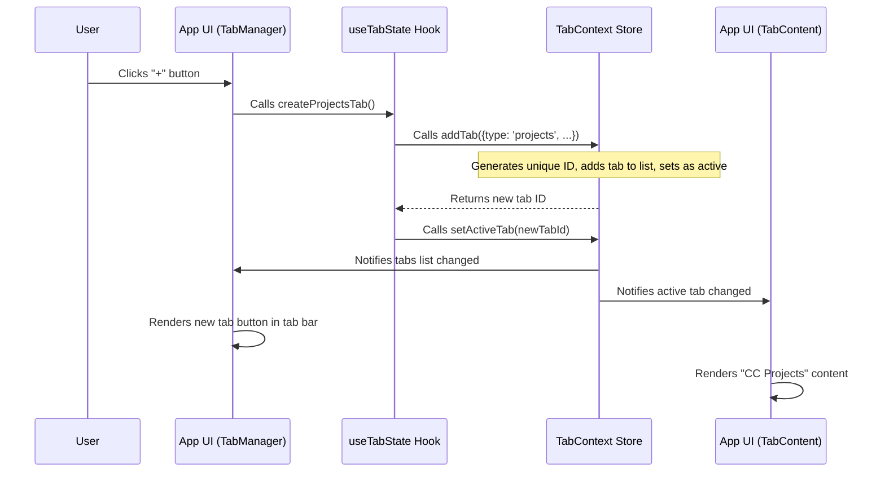

# Chapter 1: Tab Management

Welcome to Claudia! This tutorial will guide you through the core concepts that make Claudia a powerful and organized tool for your coding projects. We'll start with something you're probably already very familiar with: tabs!

## What is Tab Management?

Think about how you use a web browser like Chrome or Firefox. You probably have many tabs open at once, right? One for your email, another for a news article, maybe a few for different research pages. You can easily switch between them, open new ones, and close old ones. This helps you keep multiple tasks organized without having to open many separate browser windows.

In Claudia, we use the exact same idea! Instead of browser pages, our tabs hold different parts of the application. You might have:

*   A **chat session** where you're asking Claude (our AI assistant) to write code.
*   A **project list** to see all your ongoing coding projects.
*   A **settings page** to customize Claudia's behavior.
*   An **agent execution** view, showing what an AI agent is doing.

This system of tabs is what we call "Tab Management." It's designed to help you stay organized and switch between different workflows seamlessly.

## Why is Tab Management Important?

Imagine you're deeply engrossed in a Claude Code chat session, working on a complex problem. Suddenly, you realize you need to check the overall list of your projects. Without tabs, you might have to leave your current chat, go to a different screen, find your project, and then try to remember where you left off in your chat. That's disruptive!

With Tab Management, it's easy: you just click on the "CC Projects" tab or open a new one, browse what you need, and then click back to your "Claude Chat" tab. Your chat session is still there, exactly as you left it. It's like having multiple workspaces open at the same time, right at your fingertips.

## Key Concepts of Claudia's Tab System

To understand how this works, let's look at a few core ideas:

1.  **Tab:** Each "box" at the top of the Claudia window represents a tab. It's a container for a specific view or activity.
2.  **Active Tab:** Only one tab can be "active" at a time. This is the tab whose content you currently see and interact with. It's usually highlighted.
3.  **Tab Types:** Not all tabs are the same! A tab can be of different "types" depending on what it's showing:
    *   `chat`: For interactive Claude Code sessions.
    *   `projects`: To view your project list and their sessions.
    *   `settings`: For application settings.
    *   `agent`: To monitor AI agent runs.
    *   ...and more! Each type has its own content.
4.  **Tab Lifecycle:** Tabs are not static. You can:
    *   **Create** new tabs.
    *   **Switch** between existing tabs.
    *   **Update** a tab's content (e.g., changing its title or showing new data).
    *   **Close** tabs when you're done with them.

## How to Use Tabs in Claudia

Let's see how you'd use these concepts in practice.

### Opening a New Tab

You'll often start by wanting to create a new Claude Code chat session or browse your projects.

**In the User Interface:**

Look for the `+` button, usually on the right side of your tab bar. Clicking this button will typically open a new "CC Projects" tab, from which you can then start a new Claude Code session.

**Using Code (for developers):**

If you were building a new feature in Claudia and wanted to open a new chat tab, you might use a special tool called a "hook" (we'll learn more about hooks later!) called `useTabState`.

```typescript
import { useTabState } from "@/hooks/useTabState";

function MyComponent() {
  const { createChatTab } = useTabState();

  const handleNewChatClick = () => {
    // This function creates a new chat tab
    createChatTab(); 
  };

  return (
    <button onClick={handleNewChatClick}>
      Start New Chat
    </button>
  );
}
```
This small snippet, when part of a larger component, means that when `handleNewChatClick` is activated (for example, by clicking a button), a brand new Claude Code chat tab will appear and become the active tab.

Similarly, to open the "CC Projects" view in a tab (if it's not already open):

```typescript
import { useTabState } from "@/hooks/useTabState";

function TopbarMenu() {
  const { createProjectsTab } = useTabState();

  const openProjects = () => {
    // This will open or switch to the CC Projects tab
    createProjectsTab(); 
  };

  // ... rest of your component
}
```
Calling `createProjectsTab()` checks if a "CC Projects" tab already exists. If it does, it simply switches to it; otherwise, it creates a new one. This ensures you don't end up with many identical "CC Projects" tabs.

### Switching Between Tabs

Once you have multiple tabs, you'll want to move between them.

**In the User Interface:**

*   **Clicking:** Simply click on the title of the tab you want to switch to in the tab bar.
*   **Keyboard Shortcuts:**
    *   `Ctrl + Tab` (Windows/Linux) or `Cmd + Tab` (macOS): Switches to the next tab.
    *   `Ctrl + Shift + Tab` (Windows/Linux) or `Cmd + Shift + Tab` (macOS): Switches to the previous tab.
    *   `Ctrl + 1` through `Ctrl + 9` (or `Cmd + 1` through `Cmd + 9`): Switches directly to the tab at that number position (e.g., `Ctrl + 1` for the first tab).

**Using Code:**

If you need to programmatically switch to a specific tab, for instance, after an operation completes in another part of the app:

```typescript
import { useTabState } from "@/hooks/useTabState";

function SessionList({ sessionIdToFocus }) {
  const { switchToTab } = useTabState();

  const handleSessionOpen = (tabId: string) => {
    // This will make the tab with `tabId` the active one
    switchToTab(tabId); 
  };

  // ... imagine logic that gets a tabId and calls handleSessionOpen
}
```
The `switchToTab` function takes the unique `id` of a tab and makes it the active one, bringing its content to the front.

### Closing Tabs

When you're done with a task, you can close its tab.

**In the User Interface:**

*   **Click the 'X':** Each tab has a small `X` icon next to its title. Click it to close the tab.
*   **Keyboard Shortcut:** `Ctrl + W` (Windows/Linux) or `Cmd + W` (macOS): Closes the currently active tab.

**Using Code:**

```typescript
import { useTabState } from "@/hooks/useTabState";

function TabItem({ tabId }) {
  const { closeTab } = useTabState();

  const handleCloseClick = () => {
    // This will close the tab with `tabId`
    closeTab(tabId); 
  };

  // ... render the 'X' button with onClick={handleCloseClick}
}
```
The `closeTab` function handles the removal of a tab. If a tab has unsaved changes, it might even ask for confirmation before closing (though this part is not shown in the simple example).

## Under the Hood: How Tab Management Works

Now, let's peek behind the curtain and see how Claudia manages all these tabs.

### The Flow of a New Tab

When you, for example, click the `+` button to create a new "CC Projects" tab, here's a simplified sequence of what happens:



### The Core Components

Claudia's tab management is built using a few key pieces:

1.  **`TabContext` (The Brain):**
    *   **File:** `src/contexts/TabContext.tsx`
    *   **Purpose:** This is the central "data store" for all tab-related information. It holds the list of all open tabs, which tab is currently active, and the functions to add, remove, and update tabs.
    *   **Analogy:** Imagine a clipboard or a big whiteboard where all the tabs' information is kept. Any part of the app can look at or change this whiteboard's contents through specific rules.

    Here's a simplified look at how `TabContext` defines a tab and manages its state:

    ```typescript
    // src/contexts/TabContext.tsx (simplified)
    export interface Tab {
      id: string; // Unique identifier for the tab
      type: 'chat' | 'agent' | 'projects' | 'settings'; // What kind of content it holds
      title: string; // Text shown on the tab button
      sessionId?: string; // Optional: specific to chat tabs
      status: 'active' | 'idle' | 'running'; // Tab's current state
      hasUnsavedChanges: boolean; // Does it need saving?
      // ... more properties
    }

    export const TabProvider: React.FC<{ children: React.ReactNode }> = ({ children }) => {
      const [tabs, setTabs] = useState<Tab[]>([]);
      const [activeTabId, setActiveTabId] = useState<string | null>(null);

      // Effect to create a default "CC Projects" tab when the app starts
      useEffect(() => {
        const defaultTab: Tab = {
          id: `tab-${Date.now()}-...`, // unique ID
          type: 'projects',
          title: 'CC Projects',
          status: 'idle',
          hasUnsavedChanges: false,
          order: 0,
          createdAt: new Date(),
          updatedAt: new Date()
        };
        setTabs([defaultTab]);
        setActiveTabId(defaultTab.id);
      }, []); // [] means it runs only once when the component mounts

      // Functions like addTab, removeTab, updateTab, setActiveTab are defined here
      // ...
      return (
        <TabContext.Provider value={{ tabs, activeTabId, addTab, /* ... */ }}>
          {children}
        </TabContext.Provider>
      );
    };
    ```
    The `TabProvider` wraps the entire application (you can see this in `src/App.tsx`), making the `TabContext` available to all parts of the app. It also ensures that Claudia always starts with a "CC Projects" tab.

2.  **`useTabState` (The Helper Hook):**
    *   **File:** `src/hooks/useTabState.ts`
    *   **Purpose:** This is a special "hook" that makes it super easy for any part of Claudia's user interface to talk to the `TabContext`. Instead of directly messing with `TabContext`, components use `useTabState` to create tabs, switch them, or get information about them.
    *   **Analogy:** If `TabContext` is the big whiteboard, `useTabState` is like your personal assistant who reads from and writes on the whiteboard for you, so you don't have to get your hands dirty.

    Here's how `useTabState` provides handy functions:

    ```typescript
    // src/hooks/useTabState.ts (simplified)
    import { useTabContext } from '@/contexts/TabContext';

    export const useTabState = () => {
      const { 
        tabs, activeTabId, addTab, removeTab, updateTab, setActiveTab 
      } = useTabContext();

      // Example: A helper function to create a chat tab
      const createChatTab = useCallback((projectId?: string, title?: string): string => {
        const tabTitle = title || `Chat ${tabs.length + 1}`;
        return addTab({ // Calls addTab from TabContext
          type: 'chat',
          title: tabTitle,
          sessionId: projectId,
          status: 'idle',
          hasUnsavedChanges: false,
        });
      }, [addTab, tabs.length]); // Dependencies for useCallback

      // Example: A helper function to close a tab
      const closeTab = useCallback(async (id: string, force: boolean = false): Promise<boolean> => {
        // ... logic to check for unsaved changes ...
        removeTab(id); // Calls removeTab from TabContext
        return true;
      }, [removeTab]);

      // Returns all the useful functions and state for components
      return {
        tabs, activeTabId, createChatTab, closeTab, 
        switchToTab: setActiveTab, // Renaming setActiveTab for clarity
        // ... more functions
      };
    };
    ```

3.  **`TabManager` (The Tab Bar UI):**
    *   **File:** `src/components/TabManager.tsx`
    *   **Purpose:** This component is responsible for drawing the visual tab bar at the top of the application. It shows each tab's title, icon, close button, and highlights the active tab. It also handles the `+` button for creating new tabs.
    *   **Analogy:** This is the physical row of tabs on your web browser's window frame.

    ```typescript
    // src/components/TabManager.tsx (simplified)
    import { useTabState } from '@/hooks/useTabState';
    import { X, Plus, Folder } from 'lucide-react'; // Icons

    export const TabManager: React.FC = () => {
      const {
        tabs, activeTabId, createProjectsTab, closeTab, switchToTab, canAddTab
      } = useTabState(); // Uses our helper hook!

      const handleNewTab = () => {
        if (canAddTab()) {
          createProjectsTab(); // Calls the function from useTabState
        }
      };

      return (
        <div className="flex items-center bg-muted/30 border-b">
          {/* Loop through all 'tabs' to render each one */}
          {tabs.map((tab) => (
            <div 
              key={tab.id} 
              className={`tab-item ${tab.id === activeTabId ? 'active' : ''}`}
              onClick={() => switchToTab(tab.id)} // Switches tab on click
            >
              <Folder className="w-4 h-4" /> {/* Example icon */}
              <span>{tab.title}</span>
              <button onClick={(e) => { e.stopPropagation(); closeTab(tab.id); }}>
                <X className="w-3 h-3" />
              </button>
            </div>
          ))}
          <button onClick={handleNewTab} disabled={!canAddTab()}>
            <Plus className="w-4 h-4" />
          </button>
        </div>
      );
    };
    ```
    This component directly uses `useTabState` to get the list of tabs, know which one is active, and call functions like `createProjectsTab`, `closeTab`, and `switchToTab` when the user interacts with the UI.

4.  **`TabContent` (The View Area):**
    *   **File:** `src/components/TabContent.tsx`
    *   **Purpose:** This component is where the actual content of the active tab is displayed. It looks at the `activeTabId` from `useTabState` and then renders the correct component for that tab's `type` (e.g., `ClaudeCodeSession` for a `chat` tab, `ProjectList` for a `projects` tab).
    *   **Analogy:** This is the main part of your web browser window where the actual web page content appears.

    ```typescript
    // src/components/TabContent.tsx (simplified)
    import React, { Suspense, lazy } from 'react';
    import { useTabState } from '@/hooks/useTabState';
    import { Loader2 } from 'lucide-react';

    // Lazily load components for performance
    const ClaudeCodeSession = lazy(() => import('@/components/ClaudeCodeSession').then(m => ({ default: m.ClaudeCodeSession })));
    const ProjectList = lazy(() => import('@/components/ProjectList').then(m => ({ default: m.ProjectList })));
    const Settings = lazy(() => import('@/components/Settings').then(m => ({ default: m.Settings })));

    interface TabPanelProps {
      tab: Tab;
      isActive: boolean;
    }

    const TabPanel: React.FC<TabPanelProps> = ({ tab, isActive }) => {
      // Determines which component to show based on tab.type
      const renderContent = () => {
        switch (tab.type) {
          case 'projects':
            // ProjectList needs data, so it fetches it internally or gets it from context
            return <ProjectList /* ...props... */ />;
          case 'chat':
            return <ClaudeCodeSession sessionId={tab.sessionId} /* ...props... */ />;
          case 'settings':
            return <Settings /* ...props... */ />;
          // ... other tab types
          default:
            return <div className="p-4">Unknown tab type: {tab.type}</div>;
        }
      };

      return (
        <div className={`h-full w-full ${isActive ? "" : "hidden"}`}>
          <Suspense fallback={<Loader2 className="w-8 h-8 animate-spin" />}>
            {renderContent()}
          </Suspense>
        </div>
      );
    };

    export const TabContent: React.FC = () => {
      const { tabs, activeTabId } = useTabState(); // Gets tabs and activeTabId

      return (
        <div className="flex-1 h-full relative">
          {/* Render a TabPanel for each tab, but only show the active one */}
          {tabs.map((tab) => (
            <TabPanel
              key={tab.id}
              tab={tab}
              isActive={tab.id === activeTabId}
            />
          ))}
          {tabs.length === 0 && (
            <div className="flex items-center justify-center h-full text-muted-foreground">
              <p>No tabs open. Click the + button to start a new chat.</p>
            </div>
          )}
        </div>
      );
    };
    ```
    `TabContent` ensures that only the content for the `activeTabId` is visible, effectively "switching" the view when you click on a different tab.

In summary, `TabContext` manages the data, `useTabState` provides an easy way for components to interact with that data, `TabManager` displays the tab bar, and `TabContent` displays the content of the currently selected tab.

## Conclusion

You've now learned about Claudia's powerful Tab Management system! You understand why it's crucial for keeping your workflows organized, how to interact with tabs via the UI and (if you're a developer) through code, and the main components working behind the scenes. This multi-tab interface allows you to effortlessly navigate between your coding projects, AI chat sessions, agent executions, and application settings, providing a smooth and efficient user experience.

In the next chapter, we'll dive deeper into one of the most exciting features you can use within these tabs: [Claude Code Session](02_claude_code_session_.md). You'll learn how to start interacting with Claude and manage your AI-powered coding sessions.

---

<sub><sup>Generated by [AI Codebase Knowledge Builder](https://github.com/The-Pocket/Tutorial-Codebase-Knowledge).</sup></sub> <sub><sup>**References**: [[1]](https://github.com/getAsterisk/claudia/blob/abc73231946ee446d94453be20c51e88fa15b9ef/src/App.tsx), [[2]](https://github.com/getAsterisk/claudia/blob/abc73231946ee446d94453be20c51e88fa15b9ef/src/components/App.cleaned.tsx), [[3]](https://github.com/getAsterisk/claudia/blob/abc73231946ee446d94453be20c51e88fa15b9ef/src/components/TabContent.tsx), [[4]](https://github.com/getAsterisk/claudia/blob/abc73231946ee446d94453be20c51e88fa15b9ef/src/components/TabManager.tsx), [[5]](https://github.com/getAsterisk/claudia/blob/abc73231946ee446d94453be20c51e88fa15b9ef/src/contexts/TabContext.tsx), [[6]](https://github.com/getAsterisk/claudia/blob/abc73231946ee446d94453be20c51e88fa15b9ef/src/hooks/useTabState.ts)</sup></sub>
````