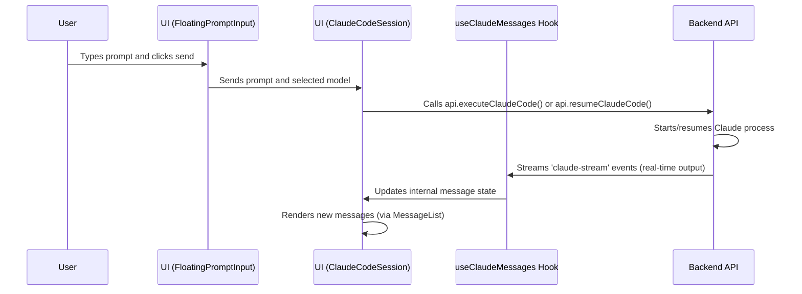

# Chapter 2: Claude Code Session

In the last chapter, you learned how Claudia uses [Tab Management](01_tab_management_.md) to keep your workspace organized. You discovered that each tab can hold different parts of the application, including a "chat" tab. Now, let's dive into what that "chat" tab truly represents: the **Claude Code Session**.

## What is a Claude Code Session?

Imagine you're working on a coding project and you need a super-smart assistant right by your side, who can not only chat with you but also understand your code, make changes to files, and even run commands in your project's terminal. That's exactly what a Claude Code Session is!

It's a specialized, interactive chat window built into Claudia. Instead of just talking, you're collaborating with Claude (our AI assistant) directly on your code. You give it instructions, Claude responds, and its actions—like editing files, running tests, or listing directory contents—are displayed right there in the conversation.

**The main problem it solves:** How do you effectively integrate an advanced AI into your everyday coding workflow? A Claude Code Session provides that seamless interface, making AI-assisted development feel natural and intuitive.

**Think of it like this:** You're sitting next to a highly skilled co-worker. You tell them what you want to achieve, they might ask clarifying questions, then they show you the code they've written, perhaps explaining their choices. If it's not quite right, you give more feedback, and they adjust. The Claude Code Session is your digital version of this collaborative experience.

### A Common Scenario: Fixing a Bug

Let's say you're working on a web application, and you've identified a bug in a specific file. Here's how a Claude Code Session helps:

1.  **You:** "Hey Claude, I have a bug in `src/utils/dateFormatter.ts`. It's incorrectly formatting dates for users in the Asia/Tokyo timezone. Can you take a look and fix it?"
2.  **Claude:** (Reads the file, analyzes the code, possibly runs a test) "Okay, I see the issue. It looks like the `Intl.DateTimeFormat` options are not correctly handling the `timeZone` property. I'll propose an edit." (Displays a suggested code change)
3.  **You:** "Looks good. Apply that change."
4.  **Claude:** (Applies the change, confirms) "Done. Would you like me to run the tests to verify the fix?"
5.  **You:** "Yes, please."

This back-and-forth, with Claude directly interacting with your project, is the core of a Claude Code Session.

## Key Concepts of a Claude Code Session

To get the most out of your coding partnership with Claude, it's helpful to understand the main ideas behind a session:

1.  **Interactive Conversation (Chat Interface):**
    *   It's a live chat. You type messages (prompts), and Claude sends messages back.
    *   The entire conversation history is visible, so you can always see the context of your interaction.

2.  **Coding Environment & Context:**
    *   Unlike a general chatbot, Claude in a session is always aware of your **project path**. This means it knows which files and folders it can see and work with.
    *   Its responses and actions are tailored to the code within that specific project.

3.  **Input Prompt:**
    *   This is the text box at the bottom of the session where you type your instructions, questions, or feedback for Claude.
    *   It's your primary way to guide the AI.

4.  **Streaming Output:**
    *   Claude's responses don't just appear all at once. They "stream" in real-time, character by character. This makes the interaction feel very dynamic, as if Claude is typing live.
    *   You'll see not just text, but also visual indicators of its actions (like running commands or making edits).

5.  **Tool Uses:**
    *   Claude isn't magic; it uses specific "tools" to interact with your project. These tools are like mini-programs or functions that let Claude:
        *   `read`: Read the content of a file.
        *   `write`: Create or modify a file.
        *   `edit`: Apply specific changes to a file (like adding or deleting lines).
        *   `bash`: Run commands in your terminal (e.g., `npm test`, `ls`).
        *   `ls`: List files and directories.
        *   ...and many more!
    *   When Claude uses a tool, you'll see a clear display showing which tool it used and what its input was. This transparency helps you understand what Claude is doing.

6.  **Session Continuation & Resumption:**
    *   One of the best features is that your sessions are saved! You can close Claudia, or switch to a different tab, and when you return to a Claude Code Session tab, the entire conversation and project context is restored exactly as you left it.
    *   This allows you to take breaks, work on multiple tasks, and easily pick up where you left off.

## How to Use a Claude Code Session in Claudia

Let's walk through starting and interacting with a Claude Code Session.

### 1. Starting a New Session

You'll typically start a new session from the "CC Projects" tab.

**In the User Interface:**

1.  If you don't have a "CC Projects" tab open, click the `+` button in the tab bar (as learned in [Tab Management](01_tab_management_.md)).
2.  In the "CC Projects" view, you'll see a button like "Start new Claude Code session" or you can click on an existing project to resume a session within it.
3.  Once a new Claude Code Session tab opens, the first thing you'll need to do is **select your project directory**. This tells Claude where your code lives!

    You'll see an input field for "Project Directory" and a folder icon. Click the folder icon to browse your computer and select the root folder of your coding project.

     <!-- Placeholder image for visual clarity -->

    Once selected, the path will appear in the input field.

### 2. Giving Your First Prompt

With your project path set, you're ready to talk to Claude!

At the bottom of the session, you'll see the **prompt input area**. This is where you type your instructions.

```typescript
// src/components/FloatingPromptInput.tsx (simplified)

interface FloatingPromptInputProps {
  onSend: (prompt: string, model: "sonnet" | "opus") => void;
  // ... other props
}

const FloatingPromptInputInner = (props: FloatingPromptInputProps, ref: React.Ref<FloatingPromptInputRef>) => {
  const [prompt, setPrompt] = useState("");
  // ... other state and refs

  const handleSend = () => {
    if (prompt.trim()) {
      // Calls the onSend function passed from the parent component
      props.onSend(prompt.trim(), selectedModel);
      setPrompt(""); // Clear the input after sending
    }
  };

  return (
    <div className="flex items-end gap-3">
      {/* Model Picker, Thinking Mode Picker */}
      <div className="flex-1 relative">
        <Textarea
          value={prompt}
          onChange={(e) => setPrompt(e.target.value)}
          onKeyDown={(e) => {
            if (e.key === "Enter" && !e.shiftKey) {
              e.preventDefault(); // Prevents new line on Enter
              handleSend(); // Send the prompt
            }
          }}
          placeholder="Ask Claude anything..."
        />
        {/* Maximize button */}
      </div>
      <Button onClick={handleSend}>
        <Send className="h-4 w-4" /> {/* Send icon */}
      </Button>
    </div>
  );
};
// ... rest of the component
```
This is a simplified look at the `FloatingPromptInput` component. It's the box where you type your message (`Textarea`) and click the "Send" button (or press Enter).

**Let's try our example scenario:**

Type the following in the prompt input and press Enter:

```
Create a simple React component that displays 'Hello World!' in src/components/HelloWorld.tsx.
```

### 3. Watching Claude Respond and Act

Once you send your prompt, you'll see Claude's output streaming into the main message area.

First, Claude might "think" or ask clarifying questions, then it will use its tools.

**Example of Claude's Text Response:**

```
// Output in the session:
Okay, I can do that. I will create the `HelloWorld.tsx` component for you.
```
This is a standard text response, often seen before Claude performs an action or summarizes its plan. This text would be rendered by the `StreamMessage` component.

**Example of Claude Using a Tool (like `write`):**

```
// Output in the session (visualized by StreamMessage):

--- Using tool: write ---
File: src/components/HelloWorld.tsx
Content:
```jsx
import React from 'react';

const HelloWorld = () => {
  return (
    <div>
      <h1>Hello World!</h1>
      <p>This is a component created by Claude.</p>
    </div>
  );
};

export default HelloWorld;
```
```
When Claude executes a `write` tool, you'll see a clear block indicating the tool being used, the file it's writing to, and the content. This is a powerful feature as it shows you exactly what changes Claude is making to your project files.

After this, Claude might send a "Result" message indicating the execution is complete.

```
// Output in the session:
Execution Complete
```

### 4. Continuing or Resuming a Session

You can close the Claude Code Session tab (using the 'X' button or `Ctrl+W` / `Cmd+W`) and switch to another task. When you want to continue:

1.  Go back to your "CC Projects" tab.
2.  Locate your project (if you have multiple).
3.  You'll see a list of saved sessions associated with that project. Click on the one you want to resume.
4.  The session tab will open, and all your previous messages and the project context will be loaded. You can then simply type a new prompt to continue the conversation.

### 5. Other Handy Features

The Claude Code Session also includes features to enhance your interaction:

*   **Model Selection:** Below the prompt input, you can choose between different Claude models, such as "Claude 4 Sonnet" (faster, efficient) or "Claude 4 Opus" (more capable, better for complex tasks).

    ```typescript
    // src/components/FloatingPromptInput.tsx (simplified)
    const MODELS: Model[] = [
      { id: "sonnet", name: "Claude 4 Sonnet", icon: <Zap className="h-4 w-4" /> },
      { id: "opus", name: "Claude 4 Opus", icon: <Sparkles className="h-4 w-4" /> }
    ];

    const FloatingPromptInputInner = (/* ... */) => {
      const [selectedModel, setSelectedModel] = useState<"sonnet" | "opus">(defaultModel);
      // ...
      return (
        <Popover
          // ...
          content={
            <div className="w-[300px] p-1">
              {MODELS.map((model) => (
                <button
                  key={model.id}
                  onClick={() => setSelectedModel(model.id)}
                  // ... styling
                >
                  {model.icon} {model.name}
                </button>
              ))}
            </div>
          }
          // ...
        />
      );
    };
    ```
    This snippet shows how the model selection is implemented, allowing you to switch between Claude's different "brains."

*   **Thinking Modes:** You can tell Claude to "think," "think hard," or even "ultrathink." These modes encourage Claude to use more internal reasoning steps, which can lead to better results for complex problems, though it might take longer.

*   **File Mentioning (`@`):** Type `@` followed by part of a file or folder name in your prompt, and Claudia will offer suggestions from your project. This is a quick way to point Claude to specific parts of your codebase.
    *   Example: `Can you refactor @src/utils/datautils.ts?`

*   **Slash Commands (`/`):** These are special keywords that act like shortcuts for common operations. Typing `/` will bring up a list of available commands.
    *   Example: `/new-file src/components/MyNewComponent.tsx`

*   **Output Copying:** You can easily copy the entire session output as Markdown or JSONL, which is great for sharing, documentation, or debugging. Look for the "Copy Output" button in the header.

## Under the Hood: How a Claude Code Session Works

Let's peek behind the curtain to understand how all these pieces fit together.

### The Flow of a Prompt and Response

When you send a prompt to Claude, here's a simplified sequence of what happens:



### The Core Components

Claudia's Claude Code Session is built using several key components that work together:

1.  **`src/components/ClaudeCodeSession.tsx` (The Session Orchestrator):**
    *   **Purpose:** This is the main React component that brings all the parts of a Claude Code Session together. It manages the overall state (like the current project path, session ID, and loading status) and coordinates the interactions between the input, message display, and the backend.
    *   **Analogy:** Think of this as the session's "control room" or "manager." It doesn't do the detailed work itself, but it ensures all other parts are working correctly and data flows smoothly.

    ```typescript
    // src/components/ClaudeCodeSession.tsx (simplified)
    import { api, type Session } from "@/lib/api"; // For backend calls
    import { useClaudeMessages } from "./claude-code-session/useClaudeMessages"; // Our message hook
    import { FloatingPromptInput } from "./FloatingPromptInput"; // User input
    import { MessageList } from "./claude-code-session/MessageList"; // Message display

    export const ClaudeCodeSession: React.FC<ClaudeCodeSessionProps> = ({ session, initialProjectPath }) => {
      const [projectPath, setProjectPath] = useState(initialProjectPath || session?.project_path || "");
      const { messages, isStreaming, currentSessionId, loadMessages } = useClaudeMessages(); // Get message data and streaming status

      // Function called when the user sends a prompt
      const handleSendPrompt = async (prompt: string, model: "sonnet" | "opus") => {
        if (!projectPath || !prompt.trim()) return;
        try {
          // If it's a new session, execute; otherwise, resume
          if (!session && !currentSessionId) {
            await api.executeClaudeCode(projectPath, prompt, model);
          } else {
            await api.continueClaudeCode(projectPath, prompt, model);
          }
        } catch (error) {
          console.error("Failed to send prompt:", error);
          // Set an error state to display to the user
        }
      };

      // Load session messages when the component first mounts or session changes
      useEffect(() => {
        if (session) {
          loadMessages(session.id); // Load past messages
        }
      }, [session, loadMessages]);

      return (
        <div className="flex flex-col h-full">
          {/* Header (Project Path, Session ID, etc.) */}
          {/* Message List */}
          <MessageList messages={messages} projectPath={projectPath} isStreaming={isStreaming} />
          {/* Floating Prompt Input */}
          <FloatingPromptInput onSend={handleSendPrompt} isLoading={isStreaming} disabled={!projectPath} projectPath={projectPath} />
        </div>
      );
    };
    ```
    This snippet shows how `ClaudeCodeSession` uses other components (`MessageList`, `FloatingPromptInput`) and hooks (`useClaudeMessages`) to manage the session's core functionality. When a prompt is sent, it calls the appropriate backend function (`executeClaudeCode` or `continueClaudeCode`).

2.  **`src/components/claude-code-session/useClaudeMessages.ts` (The Stream Listener):**
    *   **Purpose:** This is a custom React Hook. Its main job is to listen for real-time `claude-stream` events coming from the Claudia backend (which communicates with Claude). When a new message arrives, it parses the message and updates the state of the messages displayed in the UI.
    *   **Analogy:** This is like a dedicated interpreter and note-taker. It listens to everything Claude says (through the event stream), translates it into a format the UI can understand, and then adds it to the session's conversation history.

    ```typescript
    // src/components/claude-code-session/useClaudeMessages.ts (simplified)
    import { useState, useCallback, useEffect, useRef } from 'react';
    import { listen, type UnlistenFn } from '@tauri-apps/api/event'; // For listening to events

    export function useClaudeMessages() {
      const [messages, setMessages] = useState<ClaudeStreamMessage[]>([]);
      const [isStreaming, setIsStreaming] = useState(false);
      const eventListenerRef = useRef<UnlistenFn | null>(null);

      const handleIncomingMessage = useCallback((message: ClaudeStreamMessage) => {
        if ((message as any).type === "start") {
          setIsStreaming(true); // Claude starts talking!
        } else if ((message as any).type === "response" || (message as any).type === "error") {
          setIsStreaming(false); // Claude finished talking (or errored)!
        }
        setMessages(prev => [...prev, message]); // Add message to the list
        // ... also handle token updates, session info extraction
      }, []);

      // This useEffect sets up the listener when the component mounts
      useEffect(() => {
        const setupListener = async () => {
          if (eventListenerRef.current) {
            eventListenerRef.current(); // Clean up old listener if any
          }
          eventListenerRef.current = await listen<string>("claude-stream", (event) => {
            try {
              const message = JSON.parse(event.payload) as ClaudeStreamMessage;
              handleIncomingMessage(message); // Process the incoming message
            } catch (error) {
              console.error("Failed to parse Claude stream message:", error);
            }
          });
        };
        setupListener();
        return () => {
          if (eventListenerRef.current) {
            eventListenerRef.current(); // Clean up listener when component unmounts
          }
        };
      }, [handleIncomingMessage]); // Re-run if handleIncomingMessage changes (rarely)

      return { messages, isStreaming /* ... other data */ };
    }
    ```
    This code shows how `useClaudeMessages` uses Tauri's `listen` function to subscribe to the `claude-stream` event. Whenever a new part of Claude's response arrives, `handleIncomingMessage` is called to update the `messages` state.

3.  **`src/components/FloatingPromptInput.tsx` (Your Direct Input):**
    *   **Purpose:** This component provides the interactive text input field where you type your prompts. It includes features like model selection, thinking modes, and the ability to mention files (`@`) or use slash commands (`/`).
    *   **Analogy:** This is your microphone and control panel for talking to Claude.

    ```typescript
    // src/components/FloatingPromptInput.tsx (simplified)
    import { Textarea } from "@/components/ui/textarea"; // The input box
    import { Button } from "@/components/ui/button"; // The send button

    const FloatingPromptInputInner = ({ onSend, isLoading, projectPath }) => {
      const [prompt, setPrompt] = useState("");
      // ... state for model, thinking mode, file picker, etc.

      const handleSend = () => {
        if (prompt.trim()) {
          onSend(prompt.trim(), selectedModel); // Call the onSend prop
          setPrompt(""); // Clear input
        }
      };

      const handleTextChange = (e: React.ChangeEvent<HTMLTextAreaElement>) => {
        const newValue = e.target.value;
        setPrompt(newValue);
        // Logic for detecting '@' for file picker or '/' for slash commands
        // ...
      };

      return (
        <div className="flex items-end gap-3">
          {/* Model & Thinking Mode buttons */}
          <div className="flex-1 relative">
            <Textarea
              value={prompt}
              onChange={handleTextChange}
              placeholder="Ask Claude anything..."
              disabled={isLoading || !projectPath}
              rows={1}
            />
            {/* FilePicker and SlashCommandPicker components would appear here conditionally */}
          </div>
          <Button onClick={handleSend} disabled={!prompt.trim() || !projectPath || isLoading}>
            {isLoading ? "..." : "Send"}
          </Button>
        </div>
      );
    };
    ```
    This code highlights the `Textarea` for typing and the "Send" `Button`. The `onSend` prop is crucial as it's how the prompt gets passed up to the `ClaudeCodeSession` component. The `handleTextChange` also includes logic to detect `@` and `/` symbols to trigger the file and slash command pickers.

4.  **`src/components/claude-code-session/MessageList.tsx` (The Conversation History):**
    *   **Purpose:** This component takes the `messages` array from `useClaudeMessages` and renders each individual message in a visually appealing and performant way. It uses "virtual scrolling" to handle very long conversations efficiently without slowing down the app.
    *   **Analogy:** This is the scrolling transcript of your conversation with Claude.

    ```typescript
    // src/components/claude-code-session/MessageList.tsx (simplified)
    import { useVirtualizer } from '@tanstack/react-virtual'; // For efficient scrolling
    import { StreamMessage } from '../StreamMessage'; // To render individual messages

    export const MessageList: React.FC<MessageListProps> = React.memo(({ messages, projectPath, isStreaming }) => {
      const scrollContainerRef = useRef<HTMLDivElement>(null);

      const virtualizer = useVirtualizer({
        count: messages.length,
        getScrollElement: () => scrollContainerRef.current,
        estimateSize: () => 100, // Estimated height per message
        overscan: 5,
      });

      // Auto-scroll logic here (removed for brevity, but it's important!)

      if (messages.length === 0) {
        return (
          <div className="flex-1 flex items-center justify-center">
            {/* Initial welcome message if no messages yet */}
          </div>
        );
      }

      return (
        <div ref={scrollContainerRef} className="flex-1 overflow-y-auto">
          <div style={{ height: `${virtualizer.getTotalSize()}px`, position: 'relative' }}>
            {virtualizer.getVirtualItems().map((virtualItem) => {
              const message = messages[virtualItem.index];
              return (
                <div key={virtualItem.key} style={{ position: 'absolute', top: 0, left: 0, width: '100%', transform: `translateY(${virtualItem.start}px)` }}>
                  <div className="px-4 py-2">
                    <StreamMessage message={message} streamMessages={messages} />
                  </div>
                </div>
              );
            })}
          </div>
          {/* Streaming indicator */}
        </div>
      );
    });
    ```
    This snippet shows how `MessageList` uses the `useVirtualizer` hook to efficiently render only the visible messages, and it maps each `message` to a `StreamMessage` component for detailed rendering.

5.  **`src/components/StreamMessage.tsx` (The Message Interpreter):**
    *   **Purpose:** This is a crucial component that takes a single raw `ClaudeStreamMessage` (which can be a user prompt, Claude's text, or a tool use/result) and intelligently renders it. It uses Markdown for text, and special "widgets" (mini-components) for displaying tool uses (like file edits, terminal commands, or file reads) in a user-friendly format.
    *   **Analogy:** This is the detailed visualizer. It takes Claude's raw output and turns it into easy-to-understand cards, code blocks, and interactive elements.

    ```typescript
    // src/components/StreamMessage.tsx (simplified)
    import { Card, CardContent } from "@/components/ui/card";
    import { Terminal, User, Bot, AlertCircle, CheckCircle2 } from "lucide-react";
    import ReactMarkdown from "react-markdown";
    import { SyntaxHighlighter } from "react-syntax-highlighter";
    import {
      EditWidget, // Example tool widget
      BashWidget, // Example tool widget
      ThinkingWidget // Example thinking widget
    } from "./ToolWidgets"; // Collection of special UI components for tools

    interface StreamMessageProps {
      message: ClaudeStreamMessage;
      streamMessages: ClaudeStreamMessage[]; // Needed for context (e.g., matching tool results)
    }

    const StreamMessageComponent: React.FC<StreamMessageProps> = ({ message, streamMessages }) => {
      // Logic to determine what type of message it is (system, assistant, user, result)
      // ...

      if (message.type === "assistant" && message.message) {
        const msg = message.message;
        return (
          <Card className="border-primary/20 bg-primary/5">
            <CardContent className="p-4 flex items-start gap-3">
              <Bot className="h-5 w-5 text-primary" />
              <div className="flex-1 space-y-2">
                {msg.content && Array.isArray(msg.content) && msg.content.map((content: any, idx: number) => {
                  if (content.type === "text") {
                    return <ReactMarkdown key={idx}>{content.text}</ReactMarkdown>;
                  }
                  if (content.type === "tool_use") {
                    const toolName = content.name?.toLowerCase();
                    if (toolName === "edit") {
                      // Get the tool result from streamMessages
                      const toolResult = streamMessages.find(m => m.type === 'user' && m.message?.content?.some((c: any) => c.type === 'tool_result' && c.tool_use_id === content.id));
                      return <EditWidget key={idx} {...content.input} result={toolResult?.message?.content[0]} />;
                    }
                    if (toolName === "bash") {
                      return <BashWidget key={idx} command={content.input.command} result={getToolResult(content.id)} />;
                    }
                    // ... other tool widgets
                  }
                  if (content.type === "thinking") {
                    return <ThinkingWidget key={idx} thinking={content.thinking} />;
                  }
                  return null;
                })}
              </div>
            </CardContent>
          </Card>
        );
      }
      // ... similar logic for "user" and "result" messages
      return null;
    };
    export const StreamMessage = React.memo(StreamMessageComponent);
    ```
    This heavily simplified code shows how `StreamMessage` checks the `type` of the incoming message and its `content` to decide how to render it. For example, if it detects a `tool_use` with the name "edit", it will render a specialized `EditWidget` to make the output clear and actionable. The `streamMessages` prop is crucial here for looking up a `tool_result` message that corresponds to a `tool_use` message.

6.  **`src/components/claude-code-session/SessionHeader.tsx` (Top Bar):**
    *   **Purpose:** This component renders the top bar of the Claude Code Session, displaying information like the session title, project path, total tokens used, and actions like "Copy Output" or "Timeline."
    *   **Analogy:** This is the session's dashboard, giving you a quick overview and access to essential controls.

    ```typescript
    // src/components/claude-code-session/SessionHeader.tsx (simplified)
    import { Button } from '@/components/ui/button';
    import { ArrowLeft, Terminal, FolderOpen, Copy } from 'lucide-react';

    export const SessionHeader: React.FC<SessionHeaderProps> = ({
      projectPath, totalTokens, onBack, onSelectPath, onCopyAsJsonl, onCopyAsMarkdown
    }) => {
      return (
        <div className="flex items-center justify-between p-4 border-b">
          <div className="flex items-center gap-3">
            <Button onClick={onBack}>
              <ArrowLeft className="h-4 w-4" /> {/* Back button */}
            </Button>
            <Terminal className="h-5 w-5 text-primary" />
            <span className="font-semibold">Claude Code Session</span>
            {projectPath ? (
              <span className="text-sm text-muted-foreground">{projectPath}</span>
            ) : (
              <Button onClick={onSelectPath}>Select Project</Button>
            )}
          </div>
          <div className="flex items-center gap-2">
            {totalTokens > 0 && <span>{totalTokens.toLocaleString()} tokens</span>}
            <Button onClick={onCopyAsMarkdown}>Copy Markdown</Button>
            <Button onClick={onCopyAsJsonl}>Copy JSONL</Button>
            {/* Other buttons like Timeline, Settings */}
          </div>
        </div>
      );
    };
    ```
    This snippet demonstrates the structure of the session header, which provides essential information and actions.

7.  **`src/components/claude-code-session/PromptQueue.tsx` (Queued Prompts):**
    *   **Purpose:** This small component visually displays any prompts that you've typed while Claude was still processing a previous instruction. If you keep typing before Claude finishes, your new prompts are "queued" and processed one by one.
    *   **Analogy:** This is like a small "waiting list" for your instructions, ensuring none are lost even if you're typing quickly.

    ```typescript
    // src/components/claude-code-session/PromptQueue.tsx (simplified)
    import { motion, AnimatePresence } from 'framer-motion';
    import { Clock, X } from 'lucide-react';

    interface QueuedPrompt { id: string; prompt: string; model: "sonnet" | "opus"; }
    interface PromptQueueProps { queuedPrompts: QueuedPrompt[]; onRemove: (id: string) => void; }

    export const PromptQueue: React.FC<PromptQueueProps> = React.memo(({ queuedPrompts, onRemove }) => {
      if (queuedPrompts.length === 0) return null; // Only show if there are prompts

      return (
        <motion.div initial={{ opacity: 0, height: 0 }} animate={{ opacity: 1, height: 'auto' }}>
          <div className="px-4 py-3 border-t bg-muted/20">
            <div className="flex items-center gap-2 mb-2">
              <Clock className="h-4 w-4 text-muted-foreground" />
              <span className="text-sm font-medium">Queued Prompts ({queuedPrompts.length})</span>
            </div>
            <div className="space-y-2 max-h-32 overflow-y-auto">
              <AnimatePresence mode="popLayout">
                {queuedPrompts.map((p, index) => (
                  <motion.div key={p.id} initial={{ opacity: 0, x: -20 }} animate={{ opacity: 1, x: 0 }}>
                    <div className="flex items-start gap-2 p-2 rounded-md bg-background/50">
                      <div className="flex-1 min-w-0">
                        <p className="text-sm truncate">{p.prompt}</p>
                        <span className="text-xs text-muted-foreground">{p.model}</span>
                      </div>
                      <Button onClick={() => onRemove(p.id)}><X className="h-3 w-3" /></Button>
                    </div>
                  </motion.div>
                ))}
              </AnimatePresence>
            </div>
          </div>
        </motion.div>
      );
    });
    ```
    This component helps manage user expectations by clearly showing which prompts are waiting to be processed, allowing for a more fluid interaction even during longer AI thinking times.

## Conclusion

You've now explored the heart of Claudia's direct AI-assisted development: the **Claude Code Session**. You understand how this interactive environment allows you to chat with Claude, see its actions on your project, and seamlessly continue your work across sessions. This powerful abstraction turns a simple chat into a dynamic, transparent, and collaborative coding experience.

In the next chapter, we'll build on this by introducing the [CC Agents System](03_cc_agents_system_.md), which takes the power of Claude Code Sessions to the next level by allowing you to define and run autonomous AI agents for more complex and multi-step tasks.

---

<sub><sup>Generated by [AI Codebase Knowledge Builder](https://github.com/The-Pocket/Tutorial-Codebase-Knowledge).</sup></sub> <sub><sup>**References**: [[1]](https://github.com/getAsterisk/claudia/blob/abc73231946ee446d94453be20c51e88fa15b9ef/src/components/AgentExecution.tsx), [[2]](https://github.com/getAsterisk/claudia/blob/abc73231946ee446d94453be20c51e88fa15b9ef/src/components/ClaudeCodeSession.refactored.tsx), [[3]](https://github.com/getAsterisk/claudia/blob/abc73231946ee446d94453be20c51e88fa15b9ef/src/components/ClaudeCodeSession.tsx), [[4]](https://github.com/getAsterisk/claudia/blob/abc73231946ee446d94453be20c51e88fa15b9ef/src/components/FloatingPromptInput.tsx), [[5]](https://github.com/getAsterisk/claudia/blob/abc73231946ee446d94453be20c51e88fa15b9ef/src/components/StreamMessage.tsx), [[6]](https://github.com/getAsterisk/claudia/blob/abc73231946ee446d94453be20c51e88fa15b9ef/src/components/claude-code-session/MessageList.tsx), [[7]](https://github.com/getAsterisk/claudia/blob/abc73231946ee446d94453be20c51e88fa15b9ef/src/components/claude-code-session/PromptQueue.tsx), [[8]](https://github.com/getAsterisk/claudia/blob/abc73231946ee446d94453be20c51e88fa15b9ef/src/components/claude-code-session/SessionHeader.tsx), [[9]](https://github.com/getAsterisk/claudia/blob/abc73231946ee446d94453be20c51e88fa15b9ef/src/components/claude-code-session/useClaudeMessages.ts)</sup></sub>
````