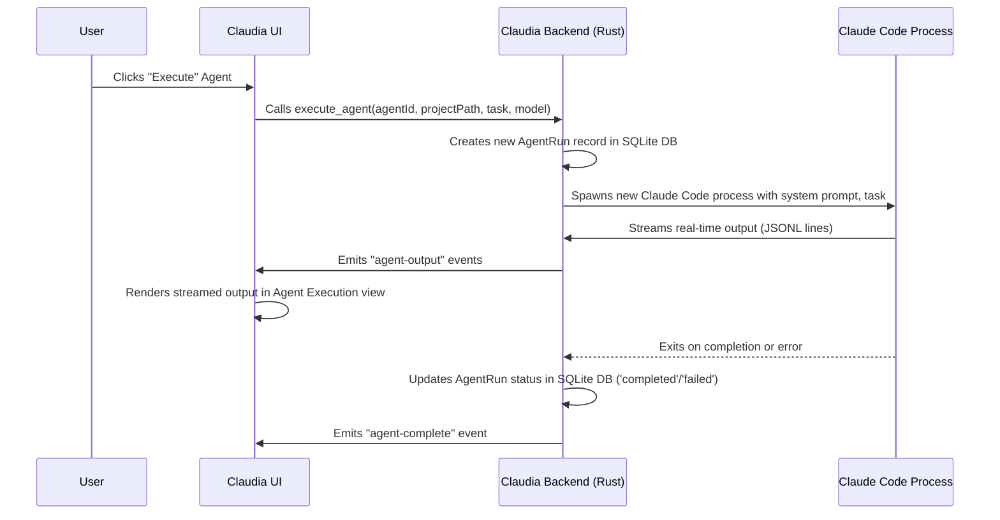

# Chapter 3: CC Agents System

In the last chapter, you mastered the [Claude Code Session](02_claude_code_session_.md), learning how to have a direct, interactive conversation with Claude, guiding it to write and modify your code. Imagine taking that power and automating it, turning Claude into a specialized robot designed for specific, recurring tasks. That's exactly what the **CC Agents System** allows you to do!

## What is the CC Agents System?

The CC Agents System in Claudia is your workshop for building and deploying "custom AI assistants" that we call **Agents**. Instead of you always typing instructions in a chat, you define an Agent once with its unique purpose, specific instructions, and a default task. Once defined, you can unleash these Agents on your projects, and they'll execute their jobs, even in the background, freeing you up for other tasks.

**The main problem it solves:** Repetitive or complex AI-assisted tasks that benefit from a consistent, pre-defined AI personality and set of instructions. Instead of manually explaining a task to Claude every time, you tell your "Git Commit Bot" to "push all changes," and it knows exactly what to do.

### A Common Scenario: Automating Git Commits

Let's consider a practical use case: you frequently make small code changes and need well-formatted Git commit messages. Manually writing descriptive, conventional commits can be tedious.

Here's how a "Git Commit Bot" Agent helps:

1.  **Define the Agent:** You create a "Git Commit Bot" Agent. Its instructions (system prompt) tell it to "Act as a Git expert. Analyze the current Git changes and generate a conventional commit message. Then, stage all changes and commit them." Its default task might be "Push all changes to the remote repository."
2.  **Run the Agent:** You click "Run" on your Git Commit Bot, specify your project path, and confirm the default task.
3.  **Agent Executes:** The bot silently analyzes your local Git repository, generates a commit message, stages, commits, and pushes, reporting its progress and outcome.
4.  **Monitor:** You can check the "Running Agents" list or the Agent's past runs to see if it completed successfully, review the generated commit message, or troubleshoot if something went wrong.

This system transforms a multi-step, manual AI interaction into a streamlined, automated process.

## Key Concepts of a CC Agent

To understand how these specialized AI assistants work, let's look at their core components:

1.  **Agent Definition:** This is the blueprint for your AI assistant. It includes:
    *   **Name:** A recognizable name (e.g., "Git Commit Bot").
    *   **Icon:** A visual icon to easily identify it (e.g., 🤖, 🛡️, 💻).
    *   **Model:** Which Claude model it should use (e.g., "Sonnet" for efficiency, "Opus" for complex reasoning).
    *   **System Prompt:** The most crucial part! This is a detailed set of instructions that tells the AI its role, persona, constraints, and how it should behave. It's like programming your robot's brain.
    *   **Default Task:** A common task the agent performs, used as a pre-filled suggestion when you run it.

2.  **Agent Run:** Every time you execute an Agent, it creates an "Agent Run." This is a specific instance of the Agent performing its task on a project. Each run is tracked with its:
    *   **Status:** `running`, `completed`, `failed`, or `cancelled`.
    *   **Output:** The full conversation and tool uses, just like a [Claude Code Session](02_claude_code_session_.md).
    *   **Metrics:** Information like tokens used, estimated cost, and duration.

3.  **Background Execution:** Agents are designed to run in the background. You can start an Agent, close its execution tab, or even switch to a different part of Claudia, and the Agent will continue working. You can monitor its progress from the "Running Agents" list.

4.  **Import/Export:** Agents can be saved to `.claudia.json` files and shared. This allows you to easily back up your custom agents or import agents created by others (like the pre-built ones in the `cc_agents` repository).

## How to Use CC Agents in Claudia

Let's see how you'd manage and run your custom AI assistants.

### 1. Accessing Agent Management

You can access the Agents system through the main application interface.

**In the User Interface:**
Look for a "CC Agents" option in your sidebar or a dedicated button in your main project view. Clicking it will open the Agent Management modal or a new tab, typically showing "Available Agents" and "Running Agents."

### 2. Creating a New Agent

To create our "Git Commit Bot":

1.  In the CC Agents view, click the **"Create CC Agent"** button.
2.  A new form will appear. Fill in the details:
    *   **Agent Name:** `Git Commit Bot`
    *   **Agent Icon:** Select `git-branch` or `bot`.
    *   **Model:** Select `Claude 4 Sonnet` (efficient for this task).
    *   **Default Task:** `Push all changes.`
    *   **System Prompt:**
        ```markdown
        You are a highly specialized Git expert AI.
        Your primary goal is to analyze the current state of a Git repository,
        generate appropriate conventional commit messages (feat, fix, chore, docs, etc.),
        stage all changes, commit them, and then push to the remote.

        Instructions:
        - First, use the 'bash' tool to run 'git status' and 'git diff --staged' to understand changes.
        - Based on the changes, formulate a concise and accurate conventional commit message.
        - Use the 'bash' tool to run 'git add -A' to stage all changes.
        - Use the 'bash' tool to run 'git commit -m "Your commit message"'
        - Finally, use the 'bash' tool to run 'git push' to push the changes to the remote.
        - Report success or any errors clearly.
        ```
3.  Click the **"Save"** button.

Here's a simplified look at the `CreateAgent` component's core logic:

```typescript
// src/components/CreateAgent.tsx (simplified)
import { api } from "@/lib/api";
import { useState } from "react";

interface CreateAgentProps {
  agent?: any; // Agent object if in edit mode
  onAgentCreated: () => void;
  onBack: () => void;
}

export const CreateAgent: React.FC<CreateAgentProps> = ({ agent, onAgentCreated }) => {
  const [name, setName] = useState(agent?.name || "");
  const [systemPrompt, setSystemPrompt] = useState(agent?.system_prompt || "");
  const [defaultTask, setDefaultTask] = useState(agent?.default_task || "");
  const [model, setModel] = useState(agent?.model || "sonnet");
  const [selectedIcon, setSelectedIcon] = useState(agent?.icon || "bot");

  const handleSave = async () => {
    // ... input validation for name and systemPrompt ...

    try {
      if (agent?.id) {
        // Update existing agent
        await api.updateAgent(agent.id, name, selectedIcon, systemPrompt, defaultTask, model);
      } else {
        // Create new agent
        await api.createAgent(name, selectedIcon, systemPrompt, defaultTask, model);
      }
      onAgentCreated(); // Notify parent component
    } catch (error) {
      console.error("Save failed:", error);
      // ... show error to user ...
    }
  };

  return (
    // ... UI elements for inputs, icon picker, model selection ...
    <button onClick={handleSave}>Save</button>
  );
};
```
This component manages the state for agent properties and, upon saving, calls either `api.createAgent` or `api.updateAgent` depending on whether an `agent` prop was passed in (indicating edit mode).

### 3. Running an Agent

Once your "Git Commit Bot" is saved, you can run it:

1.  Navigate back to the "Available Agents" list.
2.  Find your "Git Commit Bot" and click the **"Execute"** button next to it.
3.  A new "Agent Execution" tab will open.
4.  **Select your Project Path:** Click the folder icon next to "Project Path" and select the root directory of your Git project.
5.  **Confirm Task:** The "Task" input will likely pre-fill with `Push all changes.` from your default task. You can modify it if needed for a specific run.
6.  Click the **"Execute"** button.

You'll see the Agent's output streaming live, showing its `git status`, generated commit message, and progress of `git add`, `git commit`, and `git push` commands, much like a regular [Claude Code Session](02_claude_code_session_.md).

Here's a snippet from the `AgentExecution` component:

```typescript
// src/components/AgentExecution.tsx (simplified)
import { api } from "@/lib/api";
import { listen } from "@tauri-apps/api/event";
import { useState, useEffect } from "react";

export const AgentExecution: React.FC<any> = ({ agent, onBack }) => {
  const [projectPath, setProjectPath] = useState("");
  const [task, setTask] = useState(agent.default_task || "");
  const [model, setModel] = useState(agent.model || "sonnet");
  const [isRunning, setIsRunning] = useState(false);
  const [messages, setMessages] = useState<any[]>([]);
  const [runId, setRunId] = useState<number | null>(null);

  const handleExecute = async () => {
    if (!projectPath || !task.trim()) return; // Validation

    setIsRunning(true);
    setMessages([]); // Clear previous output

    try {
      // Call the backend to execute the agent
      const newRunId = await api.executeAgent(agent.id!, projectPath, task, model);
      setRunId(newRunId);

      // Listen for real-time output from the backend
      await listen<string>(`agent-output:${newRunId}`, (event) => {
        try {
          const message = JSON.parse(event.payload);
          setMessages(prev => [...prev, message]);
        } catch (err) {
          console.error("Failed to parse agent output:", err);
        }
      });
      // ... also listen for agent-complete, agent-error, agent-cancelled events ...

    } catch (error) {
      console.error("Agent execution failed:", error);
      setIsRunning(false);
    }
  };

  const handleStop = async () => {
    if (!runId) return;
    await api.killAgentSession(runId); // Stop the running process
    setIsRunning(false);
  };

  return (
    // ... UI for project path, task, model selection ...
    <button onClick={isRunning ? handleStop : handleExecute}>
      {isRunning ? "Stop" : "Execute"}
    </button>
    // ... MessageList component to display 'messages' ...
  );
};
```
When "Execute" is clicked, `handleExecute` is called. It initiates the agent run via `api.executeAgent` and then sets up listeners to receive streaming output (`agent-output:`) and updates the `messages` state in real-time.

### 4. Monitoring Agent Runs

You can keep an eye on your Agents even if you close their execution tab.

1.  Go back to the main CC Agents view (from the sidebar).
2.  Click the **"Running Agents"** tab.
3.  You'll see a list of all currently active Agent Runs. Each entry shows:
    *   Agent Name
    *   Task
    *   Status (e.g., "Running")
    *   Time Started

Clicking on a running agent in this list will open its execution tab, allowing you to view its live output.

### 5. Importing and Exporting Agents

You can share your custom agents or use pre-built ones:

*   **Import from File:** Click the "Import" dropdown in the main CC Agents view and select "From File." Choose a `.claudia.json` file.
*   **Import from GitHub:** Select "From GitHub" to browse and import agents directly from the official Claudia agents repository.
*   **Export:** Click the "Export" button next to any agent in your "Available Agents" list to save its definition to a `.claudia.json` file on your computer.

The `.claudia.json` file format is simple:

```json
{
  "version": 1,
  "exported_at": "2025-01-23T14:29:58.156063+00:00",
  "agent": {
    "name": "Git Commit Bot",
    "icon": "git-branch",
    "model": "sonnet",
    "system_prompt": "You are a Git expert...",
    "default_task": "Push all changes."
  }
}
```

## Under the Hood: How the CC Agents System Works

Let's lift the hood and see the magic happening behind the scenes.

### The Flow of an Agent Execution

When you click "Execute" on an Agent, here's a simplified sequence of what happens:



### The Core Components

The CC Agents System is built using a combination of Rust (for the backend logic, database, and process management) and React/TypeScript (for the user interface).

1.  **`src-tauri/src/commands/agents.rs` (The Backend Brain):**
    *   **Purpose:** This Rust file contains the core logic for managing agents and their runs. It handles creating, updating, deleting, and listing agents, as well as executing agent runs and listening to their output. It also interacts with an SQLite database to persist agent definitions and run history.
    *   **Analogy:** This is the factory and control center for your robots. It builds them, launches them, and keeps track of what they're doing.

    Here's a simplified look at the `Agent` and `AgentRun` data structures and the `execute_agent` command:

    ```rust
    // src-tauri/src/commands/agents.rs (simplified)

    // Represents a CC Agent stored in the database
    pub struct Agent {
        pub id: Option<i64>,
        pub name: String,
        pub icon: String,
        pub system_prompt: String,
        pub default_task: Option<String>,
        pub model: String,
        // ... other settings like enable_file_read, hooks
        pub created_at: String,
    }

    // Represents an agent execution run
    pub struct AgentRun {
        pub id: Option<i64>,
        pub agent_id: i64,
        pub task: String,
        pub project_path: String,
        pub session_id: String, // UUID for the underlying Claude Code session
        pub status: String,     // 'running', 'completed', 'failed', 'cancelled'
        pub pid: Option<u32>,   // Process ID if running
        // ... timestamps and other meta-data
    }

    // Execute a CC agent with streaming output
    #[tauri::command]
    pub async fn execute_agent(
        app: AppHandle,
        agent_id: i64,
        project_path: String,
        task: String,
        model: Option<String>,
        db: State<'_, AgentDb>, // Access to the SQLite database
        registry: State<'_, crate::process::ProcessRegistryState>, // Process tracker
    ) -> Result<i64, String> {
        // 1. Fetch agent details from DB using agent_id
        // 2. Create a new `AgentRun` record in the database, initially 'pending'
        // 3. Find the `claude` binary executable path
        // 4. Construct command arguments using agent's system_prompt, task, model
        //    (e.g., `claude -p <task> --system-prompt <prompt> --model <model> --output-format stream-json`)
        // 5. Spawn the `claude` process (using `tokio::process::Command` or Tauri sidecar)
        // 6. Update `AgentRun` status to 'running' and store PID
        // 7. Spawn background tasks to:
        //    a. Read stdout/stderr from the `claude` process line by line.
        //    b. Parse each line (which is JSONL) and emit it to the frontend (`app.emit("agent-output:<run_id>", &line)`).
        //    c. Extract the Claude Code `session_id` from the stream and update the `AgentRun` record.
        //    d. Monitor the `claude` process completion and update `AgentRun` status to 'completed' or 'failed'.
        // 8. Return the new `run_id` to the frontend.
        // ... (actual implementation is quite detailed, but this is the core flow)
        Ok(0) // Dummy return
    }
    ```
    The `agents.rs` file defines the schema for `Agent` and `AgentRun` data, and the `execute_agent` function orchestrates the entire process: talking to the database, launching the Claude Code binary, and streaming its output back to the UI.

2.  **`src/components/CCAgents.tsx` (The Agent Dashboard):**
    *   **Purpose:** This React component is the main user interface for the CC Agents system. It displays lists of available agents and running agents, and provides buttons for creating, editing, running, deleting, importing, and exporting agents.
    *   **Analogy:** This is your control panel with buttons and screens for all your robot assistants.

    ```typescript
    // src/components/CCAgents.tsx (simplified)
    import { api, type Agent, type AgentRunWithMetrics } from "@/lib/api";
    import { useState, useEffect } from "react";

    export const CCAgents: React.FC<any> = ({ onBack }) => {
      const [agents, setAgents] = useState<Agent[]>([]);
      const [runningAgents, setRunningAgents] = useState<AgentRunWithMetrics[]>([]);
      // ... state for current view (list, create, execute) ...

      useEffect(() => {
        api.listAgents().then(setAgents).catch(console.error);
        api.listRunningAgentSessions().then(setRunningAgents).catch(console.error);
        // Set up interval to refresh runningAgents
      }, []);

      const handleExecuteAgent = (agent: Agent) => {
        // Sets state to switch to AgentExecution view
        // The AgentExecution component will then call api.executeAgent
      };

      const handleCreateAgent = () => { /* ... switch to CreateAgent view ... */ };
      const handleDeleteAgent = (agent: Agent) => { /* ... show confirmation dialog then call api.deleteAgent ... */ };
      const handleImportAgent = async () => { /* ... call api.importAgentFromFile ... */ };
      const handleExportAgent = async (agent: Agent) => { /* ... call api.exportAgentToFile ... */ };

      return (
        <div>
          {/* Header with back button, import/export, create agent buttons */}
          {/* Tabs for "Available Agents" and "Running Agents" */}
          {/* Content area that conditionally renders:
              - A grid of available agents (with Execute, Edit, Delete, Export buttons)
              - A list of running agents
              - The CreateAgent component if in 'create' or 'edit' view
              - The AgentExecution component if in 'execute' view */}
        </div>
      );
    };
    ```
    This component is responsible for loading the lists of `Agent` and `AgentRunWithMetrics` data from the backend using the `api` layer, and then displaying them while providing UI actions like "Execute" or "Delete" that trigger further backend commands or view changes.

3.  **`src/components/AgentExecution.tsx` (The Live Output View):**
    *   **Purpose:** This component displays the real-time streaming output of a currently executing agent. It takes an `Agent` object, allows setting the project path and task, and then visualizes every message and tool use that the backend sends.
    *   **Analogy:** This is the periscope and logbook for a single robot mission. You see everything it's doing as it happens.

    (A simplified version of this was already shown in "How to Use" section.) This component receives the `agent-output` events that the Rust backend emits and updates its `messages` state, which is then rendered by `StreamMessage` (from [Claude Code Session](02_claude_code_session_.md)).

4.  **`src/components/AgentRunsList.tsx` / `src/components/AgentRunView.tsx` (Run History):**
    *   **Purpose:** These components display a list of past agent executions and allow viewing the full output of a completed run, including its metrics (tokens, cost, duration).
    *   **Analogy:** This is the mission control archive, where you can review all past operations of your robot fleet.

    ```typescript
    // src/components/AgentRunsList.tsx (simplified)
    import { api, type AgentRunWithMetrics } from "@/lib/api";
    import { useState, useEffect } from "react";

    export const AgentRunsList: React.FC<any> = ({ runs, onRunClick }) => {
      // `runs` prop comes from `api.listAgentRuns()` in `CCAgents.tsx`
      return (
        <div>
          {runs.map((run: AgentRunWithMetrics) => (
            <div key={run.id} onClick={() => onRunClick(run)}>
              {/* Display agent name, task, status, date, tokens, duration */}
              <h3>{run.agent_name}</h3>
              <p>{run.task}</p>
              <p>Status: {run.status}</p>
              {/* ... metrics like run.metrics?.total_tokens, run.metrics?.cost_usd */}
            </div>
          ))}
        </div>
      );
    };
    ```
    `AgentRunsList` simply takes a list of `AgentRunWithMetrics` objects (which include `AgentRun` data plus `metrics` calculated from the JSONL output) and renders them. `AgentRunView` would then fetch the full `AgentRunWithMetrics` and its `output` to display the detailed session.

In essence, the CC Agents System combines the power of the underlying Claude Code engine with a robust management layer to automate and track complex AI tasks. This allows you to build a library of specialized AI assistants tailored to your specific coding workflows.

## Conclusion

You've now learned about the powerful **CC Agents System** in Claudia! You understand how to define specialized AI agents, assign them specific instructions and default tasks, execute them on your projects, and monitor their progress, even in the background. This system empowers you to automate repetitive coding tasks and create a personalized suite of AI collaborators.

In the next chapter, we'll explore the [Checkpointing System](04_checkpointing_system_.md), which allows you to save and restore the state of your work with Claude at critical moments, providing a safety net for complex operations.

---

<sub><sup>Generated by [AI Codebase Knowledge Builder](https://github.com/The-Pocket/Tutorial-Codebase-Knowledge).</sup></sub> <sub><sup>**References**: [[1]](https://github.com/getAsterisk/claudia/blob/abc73231946ee446d94453be20c51e88fa15b9ef/cc_agents/README.md), [[2]](https://github.com/getAsterisk/claudia/blob/abc73231946ee446d94453be20c51e88fa15b9ef/src-tauri/src/commands/agents.rs), [[3]](https://github.com/getAsterisk/claudia/blob/abc73231946ee446d94453be20c51e88fa15b9ef/src/components/AgentExecution.tsx), [[4]](https://github.com/getAsterisk/claudia/blob/abc73231946ee446d94453be20c51e88fa15b9ef/src/components/AgentExecutionDemo.tsx), [[5]](https://github.com/getAsterisk/claudia/blob/abc73231946ee446d94453be20c51e88fa15b9ef/src/components/AgentRunOutputViewer.tsx), [[6]](https://github.com/getAsterisk/claudia/blob/abc73231946ee446d94453be20c51e88fa15b9ef/src/components/AgentRunView.tsx), [[7]](https://github.com/getAsterisk/claudia/blob/abc73231946ee446d94453be20c51e88fa15b9ef/src/components/AgentRunsList.tsx), [[8]](https://github.com/getAsterisk/claudia/blob/abc73231946ee446d94453be20c51e88fa15b9ef/src/components/AgentsModal.tsx), [[9]](https://github.com/getAsterisk/claudia/blob/abc73231946ee446d94453be20c51e88fa15b9ef/src/components/CCAgents.tsx), [[10]](https://github.com/getAsterisk/claudia/blob/abc73231946ee446d94453be20c51e88fa15b9ef/src/components/CreateAgent.tsx)</sup></sub>
````