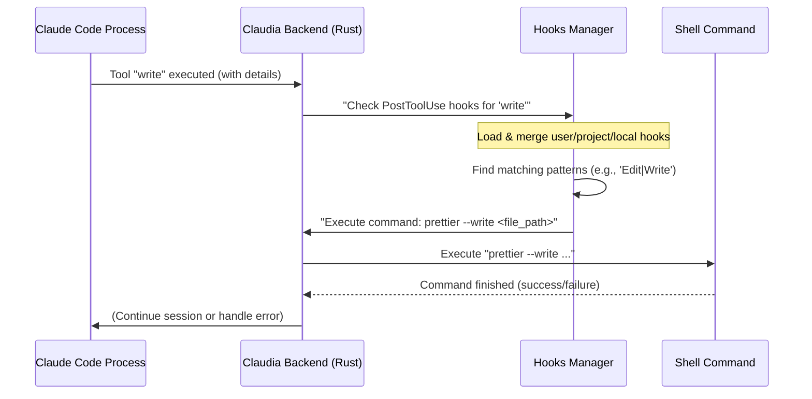

# Chapter 5: Hooks Configuration

In the last chapter, you learned about the [Checkpointing System](04_checkpointing_system_.md), which acts like a time machine for your code, allowing you to save and restore your project's state. Now, imagine if you could automate certain actions based on what Claude is doing or what happens in your coding session. For instance, wouldn't it be great if your code automatically formatted itself every time Claude wrote a new file?

That's where the **Hooks Configuration** comes in!

## What is Hooks Configuration?

Think of Hooks Configuration as a **programmable set of triggers** for Claude. It allows you to define "hooks"—small scripts, usually simple shell commands—that run automatically at specific points (or "events") in Claude's workflow. It's like setting up little automated assistants that spring into action when certain conditions are met.

**The main problem it solves:** Repetitive or routine tasks that you want to perform consistently during your AI-assisted development, without having to manually remember and execute them every time. This saves you effort, reduces human error, and keeps your workflow smooth.

### A Common Scenario: Auto-Formatting Code

Let's say you want to ensure all new code written by Claude (or modified by it) follows your project's formatting rules (e.g., using `prettier` for JavaScript/TypeScript, or `gofmt` for Go). Manually running the formatter after every change can be tedious and easily forgotten.

Here's how Hooks Configuration helps:

1.  **Define a "Post Tool Use" Hook:** You tell Claudia: "After Claude successfully uses the `Write` or `Edit` tool, run my code formatter on the changed file."
2.  **Claude Writes Code:** Claude generates a new TypeScript file (`src/new_feature.ts`) using the `Write` tool.
3.  **Hook Triggers:** Immediately after Claude successfully writes the file, your defined hook automatically executes a command like `prettier --write src/new_feature.ts`.
4.  **Formatted Code:** The new file is instantly formatted according to your rules, without you lifting a finger!

This powerful abstraction transforms routine tasks into seamless, automatic operations, keeping your codebase clean and consistent.

## Key Concepts of Hooks Configuration

To start using hooks, let's understand a few important ideas:

1.  **Hook:** At its core, a hook is just a small script, typically a shell command, that performs an action.

2.  **Hook Event:** This is the specific moment or "trigger point" in Claude's workflow when your hook can run. Claude has several predefined events:

    | Event Name        | Description                                                               | When it Triggers                                          |
    | :---------------- | :------------------------------------------------------------------------ | :-------------------------------------------------------- |
    | `PreToolUse`      | Runs *before* Claude executes a tool (like `Bash`, `Write`, `Edit`).    | Great for asking for confirmation or running checks.      |
    | `PostToolUse`     | Runs *after* Claude successfully executes a tool.                         | Ideal for formatting, logging, or post-action cleanups.   |
    | `Notification`    | Customizes how notifications appear when Claude needs your attention.     | When Claude pauses, waiting for user input or approval.   |
    | `Stop`            | Runs when Claude finishes responding or completes a conversation turn.     | Good for summarizing, or auto-continuing based on output. |
    | `SubagentStop`    | Runs when a Claude sub-agent (or "Task") finishes its execution.          | For managing complex, multi-step agent workflows.         |

3.  **Hook Matcher (for `PreToolUse` and `PostToolUse`):** For tool-related events (`PreToolUse` and `PostToolUse`), you can specify a "matcher." This is a pattern (which can be a regular expression) that helps you decide *which* specific tool will trigger your hook.
    *   Example: A matcher of `Bash` would trigger for any `Bash` tool use. `Edit|Write` would trigger for either `Edit` or `Write` tools.

4.  **Hook Command:** This is the actual shell command (e.g., `prettier --write .`) that will be executed when the hook triggers. These commands can access information about the event (like the file path or tool input) using special variables.

5.  **Hook Scope:** Hooks can be configured at different "scopes," determining how widely they apply:

    | Scope      | Location                                        | Description                                                                      |
    | :--------- | :---------------------------------------------- | :------------------------------------------------------------------------------- |
    | `User`     | `~/.claude/settings.json`                       | Applies to *all* your Claude Code sessions on your machine.                      |
    | `Project`  | `<your-project-path>/.claude/settings.json`     | Applies to all users working on this *specific project*. Should be committed to Git. |
    | `Local`    | `<your-project-path>/.claude/settings.local.json` | Applies only to your machine for this *specific project*. Should NOT be committed to Git. |

    **Priority:** `Local` hooks override `Project` hooks, and `Project` hooks override `User` hooks if they conflict (e.g., matching the same tool). This allows you to fine-tune behavior precisely where needed.

## How to Use Hooks in Claudia

Let's walk through creating the "Auto-format Code" hook using the `PostToolUse` event. We'll set it at the **Project Scope**, so it's shared with anyone collaborating on your project.

### 1. Navigate to Project Settings

To configure project-specific hooks, you need to go to your project's settings.

**In the User Interface:**
1.  In Claudia, open a [Claude Code Session](02_claude_code_session_.md) for your project.
2.  Look for a "Project Settings" button or a gear icon usually in the header or sidebar. Click it. This will open the Project Settings view.
3.  In the Project Settings, you'll see tabs. Click on the **"Project Hooks"** tab.

This tab is powered by the `HooksEditor` component, which fetches and displays the hooks defined for your project.

```typescript
// src/components/ProjectSettings.tsx (simplified)

export const ProjectSettings: React.FC<ProjectSettingsProps> = ({ project, onBack }) => {
  // ... (state and other functions)

  return (
    <div className="flex flex-col h-full">
      {/* ... header and other tabs ... */}
      <TabsContent value="project" className="space-y-6">
        <Card className="p-6">
          <div className="space-y-4">
            <div>
              <h3 className="text-lg font-semibold mb-2">Project Hooks</h3>
              <p className="text-sm text-muted-foreground mb-4">
                These hooks apply to all users working on this project. They are stored in
                <code className="mx-1 px-2 py-1 bg-muted rounded text-xs">.claude/settings.json</code>
                and should be committed to version control.
              </p>
            </div>
            
            {/* This is where the HooksEditor component is rendered */}
            <HooksEditor
              projectPath={project.path}
              scope="project" // Set the scope to 'project'
            />
          </div>
        </Card>
      </TabsContent>
      {/* ... other tabs ... */}
    </div>
  );
};
```
The `ProjectSettings` component uses `HooksEditor` and sets its `scope` prop to `"project"`, telling it to load and save hooks to the project-specific `settings.json` file.

### 2. Add a New Hook

Now, let's create our auto-formatter hook.

**In the User Interface:**
1.  In the **"Project Hooks"** tab, you'll see different sections for each Hook Event. Click on the **"Post Tool Use"** tab/section.
2.  If there are no hooks yet, click the **"Add Hook"** button. If there are existing hooks, click **"Add Another Matcher"**.
3.  A new "Matcher" block will appear.
4.  In the "Pattern" input field, type `Edit|Write`. This tells the hook to trigger when Claude uses either the `Edit` tool or the `Write` tool.
5.  Inside this new matcher block, click the **"Add Command"** button.
6.  In the large text area that appears, type the command:
    ```bash
    prettier --write "$(jq -r .tool_input.file_path)"
    ```
    *   **Explanation:**
        *   `prettier --write`: This is the command to run the Prettier formatter and save changes.
        *   `$(jq -r .tool_input.file_path)`: This is a powerful part! When a `PostToolUse` hook runs, it receives a JSON object (as standard input) containing details about the tool use. `jq` is a command-line JSON processor. This snippet extracts the `file_path` from the `tool_input` of the JSON, giving you the path to the file Claude just modified.

7.  (Optional) Click "Add Another Command" if you want to run multiple commands. You could add another one for Go files:
    ```bash
    if [[ "$(jq -r .tool_input.file_path)" =~ \.go$ ]]; then gofmt -w "$(jq -r .tool_input.file_path)"; fi
    ```
    *   **Explanation:** This command checks if the modified file has a `.go` extension and, if so, runs `gofmt` on it.

8.  Click the **"Save"** button at the top right of the Project Settings view. This saves your changes to the `.claude/settings.json` file inside your project.

Here's how the `HooksEditor` component manages adding and updating hooks:

```typescript
// src/components/HooksEditor.tsx (simplified)

// ... (state and other functions)

const addMatcher = (event: HookEvent) => {
  // Only for events with matchers (PreToolUse, PostToolUse)
  if (!matcherEvents.includes(event as any)) return;
  
  const newMatcher: EditableHookMatcher = {
    id: HooksManager.generateId(), // Generates a unique ID for React's key prop
    matcher: '', // Initial empty matcher pattern
    hooks: [],   // No commands initially
    expanded: true // Start expanded for easy editing
  };
  
  setEditableHooks(prev => ({
    ...prev,
    [event]: [...(prev[event as 'PreToolUse' | 'PostToolUse'] as EditableHookMatcher[]), newMatcher]
  }));
};

const addCommand = (event: HookEvent, matcherId: string) => {
  if (!matcherEvents.includes(event as any)) return;
  
  const newCommand: EditableHookCommand = {
    id: HooksManager.generateId(),
    type: 'command', // Indicates it's a shell command
    command: ''      // Empty command to be filled
  };
  
  setEditableHooks(prev => ({
    ...prev,
    [event]: (prev[event as 'PreToolUse' | 'PostToolUse'] as EditableHookMatcher[]).map(matcher =>
      matcher.id === matcherId
        ? { ...matcher, hooks: [...matcher.hooks, newCommand] } // Add to existing commands
        : matcher
    )
  }));
};

const handleSave = async () => {
  // ... (code to convert editableHooks back to HooksConfiguration format) ...
  try {
    // Calls the Rust backend to save the configuration
    await api.updateHooksConfig(scope, newHooks, projectPath);
    // ... (update UI state) ...
  } catch (error) {
    // ... (handle error) ...
  }
};
// ... (JSX for buttons and inputs) ...
```
This simplified code illustrates how the UI adds a new matcher (for `PreToolUse`/`PostToolUse`) and new commands within that matcher. When you save, the `handleSave` function converts the UI's internal `editableHooks` format back into the standard `HooksConfiguration` and sends it to the backend via `api.updateHooksConfig`.

### 3. Using Hook Templates

Claudia also provides ready-made hook templates to help you get started quickly.

**In the User Interface:**
1.  In the Hooks Editor (either in User Settings or Project Settings), look for a "Templates" button.
2.  Click it to open a dialog showing various pre-configured hooks (e.g., "Log Shell Commands", "Protect Main Branch").
3.  Click on a template to apply it. This will automatically add the hook configuration to your current settings.
4.  Remember to **Save** your settings after applying a template!

Here's a snippet of how these templates are defined:

```typescript
// src/types/hooks.ts (simplified)

export const HOOK_TEMPLATES: HookTemplate[] = [
  {
    id: 'log-bash-commands',
    name: 'Log Shell Commands',
    description: 'Log all bash commands to a file for auditing',
    event: 'PreToolUse', // This hook triggers before a tool is used
    matcher: 'Bash',     // Specifically for the 'Bash' tool
    commands: ['jq -r \'"\(.tool_input.command) - \(.tool_input.description // "No description")"\' >> ~/.claude/bash-command-log.txt']
  },
  {
    id: 'format-on-save',
    name: 'Auto-format Code',
    description: 'Run code formatters after file modifications',
    event: 'PostToolUse', // This hook triggers after a tool is used
    matcher: 'Write|Edit|MultiEdit', // Specifically for file writing/editing tools
    commands: [
      'if [[ "$( jq -r .tool_input.file_path )" =~ \\.(ts|tsx|js|jsx)$ ]]; then prettier --write "$( jq -r .tool_input.file_path )"; fi',
      // ... more commands for other languages
    ]
  },
  // ... other templates
];
```
These templates provide common, useful hooks that you can add with a single click, which can then be customized further.

## Under the Hood: How Hooks Configuration Works

The Hooks Configuration system involves both the frontend (your UI) and the powerful Rust backend working together to listen for events and execute commands.

### The Flow of a Hook Execution

When Claude performs an action that triggers a hook (like writing a file), here's a simplified sequence of what happens:



### The Core Components

Several key components in Claudia work together to manage and execute hooks:

1.  **`src/types/hooks.ts` (The Blueprint):**
    *   **Purpose:** This file defines the data structures (interfaces) that describe what a hook configuration looks like. It's the "contract" for how hooks are structured in Claudia.
    *   **Analogy:** This is like the architectural drawing for how hooks are built and organized.

    ```typescript
    // src/types/hooks.ts (simplified)
    export interface HookCommand {
      type: 'command';   // Currently only 'command' is supported
      command: string;   // The actual shell command to run
      timeout?: number;  // Optional timeout for the command in seconds
    }

    export interface HookMatcher {
      matcher?: string;  // Regex pattern to match tool names (e.g., "Bash", "Edit|Write")
      hooks: HookCommand[]; // List of commands to run if the matcher matches
    }

    export interface HooksConfiguration {
      PreToolUse?: HookMatcher[];
      PostToolUse?: HookMatcher[];
      Notification?: HookCommand[]; // No matcher for Notification, Stop, SubagentStop
      Stop?: HookCommand[];
      SubagentStop?: HookCommand[];
    }

    export type HookEvent = keyof HooksConfiguration;
    ```
    This defines that a `HooksConfiguration` is an object where keys are `HookEvent` names, and their values are either `HookMatcher` arrays (for tool-related events) or `HookCommand` arrays (for direct events).

2.  **`src/lib/hooksManager.ts` (The Brains of the Operation):**
    *   **Purpose:** This TypeScript class contains the core logic for managing hooks. It knows how to:
        *   **Merge configurations:** Combine user, project, and local hook settings according to their priority.
        *   **Validate hooks:** Check for syntax errors in commands or potentially dangerous patterns (e.g., `rm -rf /`).
        *   **Check dangerous patterns:** Identify commands that could be harmful.
    *   **Analogy:** This is the clever librarian who knows all the rules about which hooks apply where, and also acts as a security guard to warn about dangerous commands.

    ```typescript
    // src/lib/hooksManager.ts (simplified)
    export class HooksManager {
      static mergeConfigs(
        user: HooksConfiguration,
        project: HooksConfiguration,
        local: HooksConfiguration
      ): HooksConfiguration {
        const merged: HooksConfiguration = {};
        // ... (logic to iterate through events and combine matchers/commands based on priority) ...
        return merged;
      }

      static async validateConfig(hooks: HooksConfiguration): Promise<HookValidationResult> {
        const errors: HookValidationError[] = [];
        const warnings: HookValidationWarning[] = [];
        // ... (logic to check regex validity, empty commands, and dangerous patterns) ...
        return { valid: errors.length === 0, errors, warnings };
      }
      
      public static checkDangerousPatterns(command: string): string[] {
        const warnings: string[] = [];
        // ... (regex patterns to detect "rm -rf /", "sudo", "curl | bash" etc.) ...
        return warnings;
      }
    }
    ```
    The `mergeConfigs` function is crucial for ensuring that your local, project, and user hooks work together correctly, with the correct priority. `validateConfig` and `checkDangerousPatterns` provide important safety and feedback to the user.

3.  **`src-tauri/src/commands/claude.rs` (The Backend API Bridge):**
    *   **Purpose:** This Rust file exposes functions that the frontend (TypeScript/React) can call to interact with the hooks configuration. Specifically, it has `get_hooks_config` (to load settings) and `update_hooks_config` (to save settings).
    *   **Analogy:** This is the receptionist and translator. It receives requests from the user interface, fetches or saves the hook data to the correct file on disk, and then relays messages back.

    ```rust
    // src-tauri/src/commands/claude.rs (simplified)

    #[tauri::command]
    pub async fn get_hooks_config(scope: String, project_path: Option<String>) -> Result<serde_json::Value, String> {
        // ... (logic to determine the correct settings file path based on scope) ...
        // Reads the file, parses JSON, and extracts the "hooks" section
        // ...
        Ok(serde_json::json!({})) // Returns the hooks JSON
    }

    #[tauri::command]
    pub async fn update_hooks_config(
        scope: String, 
        hooks: serde_json::Value,
        project_path: Option<String>
    ) -> Result<String, String> {
        // ... (logic to determine the correct settings file path and create .claude dir if needed) ...
        // Reads existing settings, updates the "hooks" section, and writes back
        // ...
        Ok("Hooks configuration updated successfully".to_string())
    }
    ```
    These functions allow the frontend to load and save hook configurations without needing to know the exact file paths or how to handle JSON parsing.

4.  **`src/components/HooksEditor.tsx` (The User Interface):**
    *   **Purpose:** This React component provides the visual interface where you can add, edit, remove, and manage your hooks. It uses the `api` layer (which talks to the Rust backend) to load and save the configurations.
    *   **Analogy:** This is the control panel with all the buttons, text boxes, and dropdowns that you interact with to program your hooks.

    ```typescript
    // src/components/HooksEditor.tsx (simplified)
    import { api } from '@/lib/api'; // Frontend API for talking to Rust
    import { HooksManager } from '@/lib/hooksManager'; // Our hooks logic

    export const HooksEditor: React.FC<HooksEditorProps> = ({ projectPath, scope, readOnly, onChange }) => {
      const [hooks, setHooks] = useState<HooksConfiguration>({});
      const [editableHooks, setEditableHooks] = useState<any>(/* ... converted hooks ... */);
      // ... (state for selected event, validation errors, etc.) ...

      useEffect(() => {
        // Load hooks from backend when component mounts or scope/path changes
        api.getHooksConfig(scope, projectPath)
          .then(setHooks) // Update internal state
          .catch(console.error);
      }, [projectPath, scope]);

      useEffect(() => {
        // Update editableHooks when hooks (from backend) change
        // ... (logic to convert `hooks` to `editableHooks` format with unique IDs) ...
      }, [hooks]);

      const handleSave = async () => {
        // ... (logic to convert editableHooks back to HooksConfiguration) ...
        await api.updateHooksConfig(scope, newHooks, projectPath); // Save to backend
      };

      // ... (functions to add/remove/update matchers and commands) ...

      return (
        // ... (JSX for tabs, input fields, buttons, etc. as seen in "How to Use") ...
      );
    };
    ```
    The `HooksEditor` component is the bridge you directly interact with. It visualizes the hook data, lets you make changes, and then sends those changes to the backend for persistence. It also uses `HooksManager` to perform validation and merge logic behind the scenes.

In summary, Hooks Configuration empowers you to automate tasks and customize Claude's behavior at specific moments in its workflow. It uses a clear structure, allows for fine-grained control with matchers and scopes, and provides helpful templates and safety checks, all orchestrated by a robust backend and an intuitive user interface.

## Conclusion

You've now explored the powerful **Hooks Configuration** system in Claudia! You understand how to define automated scripts (hooks) that trigger at specific points in Claude's workflow, allowing you to automate tasks like code formatting or custom notifications. You've learned about different hook events, how to use matchers, and the important concept of hook scopes (user, project, local) to manage where your configurations apply.

In the next chapter, we'll delve into [Tauri Commands (API Layer)](06_tauri_commands__api_layer__.md), which is the underlying communication layer that allows the frontend (what you see) to talk to the backend (the powerful Rust logic) of Claudia.

---

<sub><sup>Generated by [AI Codebase Knowledge Builder](https://github.com/The-Pocket/Tutorial-Codebase-Knowledge).</sup></sub> <sub><sup>**References**: [[1]](https://github.com/getAsterisk/claudia/blob/abc73231946ee446d94453be20c51e88fa15b9ef/src-tauri/src/commands/claude.rs), [[2]](https://github.com/getAsterisk/claudia/blob/abc73231946ee446d94453be20c51e88fa15b9ef/src/components/HooksEditor.tsx), [[3]](https://github.com/getAsterisk/claudia/blob/abc73231946ee446d94453be20c51e88fa15b9ef/src/components/ProjectSettings.tsx), [[4]](https://github.com/getAsterisk/claudia/blob/abc73231946ee446d94453be20c51e88fa15b9ef/src/components/Settings.tsx), [[5]](https://github.com/getAsterisk/claudia/blob/abc73231946ee446d94453be20c51e88fa15b9ef/src/lib/hooksManager.ts), [[6]](https://github.com/getAsterisk/claudia/blob/abc73231946ee446d94453be20c51e88fa15b9ef/src/types/hooks.ts)</sup></sub>
````