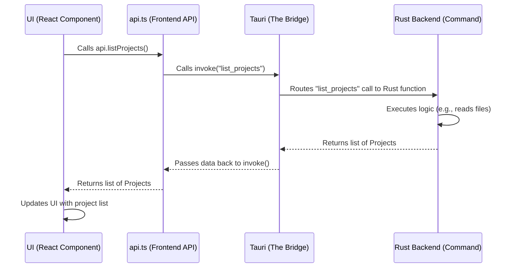

# Chapter 6: Tauri Commands (API Layer)

In the last chapter, you explored the [Hooks Configuration](05_hooks_configuration_.md) system, learning how to automate tasks based on events in your coding sessions. That system relies on commands and actions happening behind the scenes. But how does the visual part of Claudia (what you see on your screen) actually *tell* the powerful core logic (what makes Claudia work) to do things?

This is where **Tauri Commands (API Layer)** comes in!

## What are Tauri Commands?

Imagine Claudia is like a fancy restaurant. You, the user, are sitting at a table (the User Interface, or UI). The kitchen (the application's core logic, written in Rust) is where all the real work happens: preparing food, baking bread, and managing ingredients.

You can't just walk into the kitchen and grab what you need. Instead, you tell your waiter (the Tauri Command) what you want: "Bring me a list of all my projects," or "Run this piece of code." The waiter then takes your order to the kitchen, the chefs do their work, and the waiter brings back the result.

**The main problem it solves:** How do the two main parts of Claudia – the beautiful, interactive user interface (built with technologies like React) and the super-fast, powerful core logic (written in Rust) – talk to each other? They speak different "languages"! Tauri Commands act as the perfect communication bridge, allowing the frontend to ask the backend to perform tasks and receive data back.

**Think of it like this:** It's the only way data and instructions flow between the visual app and the powerful Rust functionalities. It's the backbone of all of Claudia's interactivity.

### A Common Scenario: Listing Your Projects

Let's say you open Claudia, and you want to see a list of all your saved coding projects. You don't want to dig through files manually; you expect the app to show them to you.

Here's how Tauri Commands make that happen:

1.  **You**: Click on the "CC Projects" tab or button in the Claudia interface.
2.  **UI**: The frontend (React) sends an "order" to the backend: "Hey, I need the list of projects!"
3.  **Backend**: The Rust code receives this order, goes to your `~/.claude/projects` directory, finds all your project folders, and compiles a nice list.
4.  **Backend**: Sends this list back to the frontend.
5.  **UI**: Receives the list and displays it beautifully on your screen.

This seemingly simple interaction is entirely powered by Tauri Commands.

## Key Concepts of Tauri Commands

To understand how this communication works, let's look at the main ideas:

1.  **Frontend (UI)**: This is the part of Claudia you see and interact with. It's built using web technologies like React and TypeScript. It sends commands.
2.  **Backend (Core Logic)**: This is the hidden engine of Claudia, written in Rust. It receives commands, performs heavy tasks (like file operations, running AI models, managing processes), and sends results back.
3.  **Tauri**: This is the framework that bundles the frontend and backend into a single, native desktop application. It provides the "bridge" for them to talk.
4.  **Command**: In Tauri, a "command" is a special Rust function that is designed to be callable directly from the frontend (JavaScript/TypeScript). It's like a specific, pre-defined request the frontend can make.
5.  **`invoke`**: This is a special JavaScript function provided by Tauri. It's what the frontend uses to actually "call" a Rust command. You pass the name of the Rust command and any data it needs.
6.  **API Layer (`src/lib/api.ts`)**: In Claudia, we've created a convenient "API layer" in `src/lib/api.ts`. This file acts like a phone book, containing easy-to-use functions (e.g., `api.listProjects()`) that internally use `invoke` to call the right Rust commands. This makes it much cleaner and safer for the frontend developers.
7.  **Serialization/Deserialization**: When data travels between JavaScript (frontend) and Rust (backend), it needs to be converted. This process is called serialization (converting to a format that can be sent, like JSON) and deserialization (converting back to a usable object on the other side). Tauri handles this automatically for you.

## How to Use Tauri Commands (as a Frontend Developer)

You won't directly write Rust code as a frontend developer, but you'll use the `api` layer to interact with the backend. Let's see how you'd list projects.

### 1. Calling a Backend Command from the Frontend

To list projects, a React component in Claudia would use the `api.listProjects()` function.

```typescript
// src/components/ProjectList.tsx (simplified)
import React, { useEffect, useState } from 'react';
import { api, type Project } from '@/lib/api'; // Import our API layer

export const ProjectList: React.FC = () => {
  const [projects, setProjects] = useState<Project[]>([]);
  const [isLoading, setIsLoading] = useState(true);
  const [error, setError] = useState<string | null>(null);

  useEffect(() => {
    const fetchProjects = async () => {
      setIsLoading(true);
      setError(null);
      try {
        // This is the magic line! We call a function from our API layer.
        const fetchedProjects = await api.listProjects(); 
        setProjects(fetchedProjects);
      } catch (err) {
        console.error("Failed to fetch projects:", err);
        setError("Could not load projects. Please try again.");
      } finally {
        setIsLoading(false);
      }
    };

    fetchProjects();
  }, []); // Run once when the component is first shown

  if (isLoading) return <p>Loading projects...</p>;
  if (error) return <p className="text-red-500">Error: {error}</p>;

  return (
    <div className="p-4">
      <h2 className="text-xl font-bold mb-4">Your Projects</h2>
      {projects.length === 0 ? (
        <p>No projects found. Start a new Claude Code session to create one!</p>
      ) : (
        <ul>
          {projects.map(project => (
            <li key={project.id} className="mb-2 p-2 border rounded">
              <h3 className="font-semibold">{project.path.split('/').pop()}</h3>
              <p className="text-sm text-gray-500">{project.path}</p>
              <p className="text-xs text-gray-400">Sessions: {project.sessions.length}</p>
            </li>
          ))}
        </ul>
      )}
    </div>
  );
};
```
In this simplified `ProjectList` component, the `useEffect` hook runs when the component appears on the screen. Inside `useEffect`, we call `api.listProjects()`. This function makes the request to the Rust backend, waits for the result, and then updates the `projects` state variable, causing the list to appear in the UI.

## Under the Hood: How Tauri Commands Work

Let's peek behind the curtain and see the journey of that `api.listProjects()` call.

### The Flow of a Command Call

When `api.listProjects()` is called from the frontend, here's a simplified sequence of what happens:


This diagram shows the full circle: The React UI asks the `api.ts` helper, which uses Tauri's `invoke` to cross the bridge to the Rust backend. The Rust command does its work and sends the data back across the bridge to the `api.ts` layer, which then returns it to the React UI for display.

### The Core Components

Tauri Commands are defined in Rust and then exposed to the JavaScript frontend.

1.  **`src-tauri/src/commands/claude.rs` (The Rust Command Definition):**
    *   **Purpose:** This file contains the actual Rust functions that perform tasks like listing projects, managing sessions, and handling files. Each function meant to be called from the frontend is marked with `#[tauri::command]`.
    *   **Analogy:** This is the recipe book in the kitchen. Each `#[tauri::command]` function is a recipe that the waiter (Tauri) knows how to execute when an order comes in.

    Let's look at a heavily simplified version of `list_projects`:

    ```rust
    // src-tauri/src/commands/claude.rs (simplified)
    use serde::{Serialize, Deserialize}; // To convert Rust data to JSON (and back)
    use std::path::PathBuf;
    // ... (other necessary imports)

    // Represents a project struct that matches our frontend interface
    #[derive(Debug, Clone, Serialize, Deserialize)]
    pub struct Project {
        pub id: String,
        pub path: String,
        pub sessions: Vec<String>,
        pub created_at: u64,
    }

    /// Lists all projects in the ~/.claude/projects directory
    #[tauri::command] // This macro makes the function callable from JavaScript!
    pub async fn list_projects() -> Result<Vec<Project>, String> {
        // In the real code, this would read directories, parse metadata, etc.
        // For simplicity, imagine it just creates some dummy data:
        let dummy_project = Project {
            id: "my-first-project".to_string(),
            path: "/home/user/code/my-first-project".to_string(),
            sessions: vec!["session-1".to_string(), "session-2".to_string()],
            created_at: 1678886400, // Example timestamp
        };
        
        println!("Rust backend: Listing projects now!"); // This would show in the Rust console
        Ok(vec![dummy_project]) // Return a successful result with our dummy project
    }
    // ... (other commands like execute_claude_code, save_claude_settings, etc.)
    ```
    The `#[tauri::command]` attribute is crucial here. It tells Tauri that this `list_projects` function should be accessible from the frontend. The `Result<Vec<Project>, String>` return type means it will either return a list of `Project` objects (if successful) or an error message (as a `String`). The `Project` struct itself is marked `#[derive(Serialize, Deserialize)]` so that Tauri knows how to convert it to and from JSON automatically when it crosses the bridge.

2.  **`src-tauri/src/commands/mod.rs` (The Command Registrar):**
    *   **Purpose:** This file acts as a central registry. It imports all the individual command functions from other Rust files (like `claude.rs`, `agents.rs`, etc.) and makes them available to the main Tauri application.
    *   **Analogy:** This is the main reception desk that takes all the "recipes" from different parts of the kitchen and puts them on a master list so the main restaurant manager (Tauri's `main.rs`) knows what's available.

    ```rust
    // src-tauri/src/commands/mod.rs (simplified)
    pub mod agents;
    pub mod claude; // We declared this module here!
    pub mod mcp;
    pub mod usage;
    pub mod storage;
    pub mod slash_commands;
    ```
    This file simply declares which other Rust files contain commands.

3.  **`src-tauri/src/main.rs` (The Main Tauri Application):**
    *   **Purpose:** This is the entry point of the entire Tauri application. It sets up the Tauri environment and, most importantly for us, registers all the `#[tauri::command]` functions so they can be `invoke`d by the frontend.
    *   **Analogy:** This is the restaurant's grand opening! It sets up everything, including telling the entire staff (Tauri) all the available recipes it can serve.

    ```rust
    // src-tauri/src/main.rs (simplified)
    // ... (other imports)
    use commands::claude::{list_projects, /* ... other claude commands ... */ };
    use commands::agents::{list_agents, /* ... other agent commands ... */};
    // ... (other command imports)

    fn main() {
        tauri::Builder::default()
            // ... (plugins and setup) ...
            .invoke_handler(tauri::generate_handler![
                // List all commands available to the frontend here!
                list_projects, // Our list_projects command is registered!
                // ... all other commands from claude.rs
                list_agents,
                // ... all other commands from agents.rs
                // ... etc.
            ])
            .run(tauri::generate_context!())
            .expect("error while running tauri application");
    }
    ```
    The `tauri::generate_handler![]` macro is where all the `#[tauri::command]` functions are explicitly listed, making them callable from the frontend.

4.  **`src/lib/api.ts` (The Frontend API Wrapper):**
    *   **Purpose:** This TypeScript file acts as a convenient, strongly-typed wrapper around Tauri's raw `invoke` function. Instead of calling `invoke("some_rust_command", { ... })` directly everywhere in your React components, you call `api.someCommand(...)`, which is cleaner, safer, and provides better auto-completion.
    *   **Analogy:** This is your personal phrasebook for talking to the kitchen. Instead of looking up "list projects" every time, you just say "api.listProjects()", and it handles the translation (`invoke`) for you.

    ```typescript
    // src/lib/api.ts (simplified)
    import { invoke } from "@tauri-apps/api/core"; // The raw Tauri function to call Rust
    
    // Define the TypeScript interface for our Project (matches Rust struct)
    export interface Project {
      id: string;
      path: string;
      sessions: string[];
      created_at: number;
    }

    // This object holds all our convenient API functions
    export const api = {
      /**
       * Lists all projects in the ~/.claude/projects directory
       * @returns Promise resolving to an array of projects
       */
      async listProjects(): Promise<Project[]> {
        try {
          // Here's where the actual call to the Rust backend happens!
          // "list_projects" is the exact name of the Rust command.
          return await invoke<Project[]>("list_projects"); 
        } catch (error) {
          console.error("Failed to list projects:", error);
          throw error;
        }
      },

      // ... (other API functions like createAgent, saveClaudeSettings, etc.)
    };
    ```
    This `api.ts` file acts as the primary interface for frontend developers. When `api.listProjects()` is called, it simply calls `invoke("list_projects")` behind the scenes, effectively triggering the Rust command.

In summary, Tauri Commands are the fundamental communication mechanism in Claudia. They bridge the gap between the React frontend and the Rust backend, allowing complex operations to be triggered and data exchanged seamlessly. The `api.ts` layer simplifies this interaction for frontend developers, providing a clean and organized way to talk to the powerful Rust core.

## Conclusion

You've now uncovered the core communication layer of Claudia: **Tauri Commands (API Layer)**. You understand how the user interface (React) talks to the powerful core logic (Rust) using these commands, how the `invoke` function acts as the bridge, and how Claudia's `api.ts` simplifies this interaction. This seamless communication is what enables all the dynamic features you've seen in previous chapters, from [Tab Management](01_tab_management_.md) to [Claude Code Sessions](02_claude_code_session_.md) and [CC Agents](03_cc_agents_system_.md).

In the next chapter, we'll delve into [Process Management (Registry)](07_process_management__registry__.md), learning how Claudia keeps track of all the background tasks and AI operations it's running, ensuring everything stays organized and under control.

---

<sub><sup>Generated by [AI Codebase Knowledge Builder](https://github.com/The-Pocket/Tutorial-Codebase-Knowledge).</sup></sub> <sub><sup>**References**: [[1]](https://github.com/getAsterisk/claudia/blob/abc73231946ee446d94453be20c51e88fa15b9ef/src-tauri/src/commands/agents.rs), [[2]](https://github.com/getAsterisk/claudia/blob/abc73231946ee446d94453be20c51e88fa15b9ef/src-tauri/src/commands/claude.rs), [[3]](https://github.com/getAsterisk/claudia/blob/abc73231946ee446d94453be20c51e88fa15b9ef/src-tauri/src/commands/mcp.rs), [[4]](https://github.com/getAsterisk/claudia/blob/abc73231946ee446d94453be20c51e88fa15b9ef/src-tauri/src/commands/mod.rs), [[5]](https://github.com/getAsterisk/claudia/blob/abc73231946ee446d94453be20c51e88fa15b9ef/src-tauri/src/commands/slash_commands.rs), [[6]](https://github.com/getAsterisk/claudia/blob/abc73231946ee446d94453be20c51e88fa15b9ef/src-tauri/src/commands/storage.rs), [[7]](https://github.com/getAsterisk/claudia/blob/abc73231946ee446d94453be20c51e88fa15b9ef/src-tauri/src/commands/usage.rs), [[8]](https://github.com/getAsterisk/claudia/blob/abc73231946ee446d94453be20c51e88fa15b9ef/src-tauri/src/main.rs), [[9]](https://github.com/getAsterisk/claudia/blob/abc73231946ee446d94453be20c51e88fa15b9ef/src/lib/api.ts)</sup></sub>
````