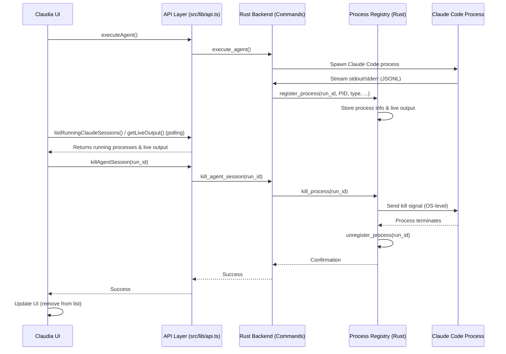

# Chapter 7: Process Management (Registry)

In the last chapter, you discovered how [Tauri Commands (API Layer)](06_tauri_commands__api_layer__.md) enable the visual part of Claudia (the user interface) to talk to its powerful core logic (written in Rust). When you, for example, clicked "Execute" on an Agent, a command was sent to the backend. But what happens next? How does Claudia keep track of these long-running tasks once they're launched?

This is where the **Process Management (Registry)** comes in!

## What is Process Management (Registry)?

Imagine your computer has a "Task Manager" or "Activity Monitor" (like the one you might open to see what programs are running). It shows you a list of all active applications and background processes, how much memory they're using, and lets you stop them if they're misbehaving.

Claudia has its own mini "Task Manager" built right in, and we call it the **Process Management (Registry)**. This system is like Claudia's central control room for all the background tasks it starts. When Claudia launches a Claude Code session or an AI agent, it's actually starting a separate "program" on your computer. The Registry keeps a detailed record of every one of these programs.

**The main problem it solves:** AI tasks, especially coding sessions or agent runs, can be long-running. They might work in the background, out of sight. Claudia needs a way to:

*   Know exactly which AI tasks are currently running.
*   Get real-time updates (like text output) from these tasks.
*   Allow you to gracefully stop a task if you no longer need it or if it gets stuck.
*   Ensure that even if you close a tab, the underlying AI process keeps working (and can be reconnected to).

Without the Process Management (Registry), Claudia would be like a chef who starts cooking many dishes but forgets what's on the stove! It's crucial for managing the lifecycle of AI tasks, especially since Claude Code (the AI engine) can operate independently of Claudia's user interface.

### A Common Scenario: Managing a Long-Running Agent

Let's say you've launched an AI agent (as learned in [CC Agents System](03_cc_agents_system_.md)) to perform a complex refactoring of your codebase. This might take a while, and you decide to switch to another tab or even close Claudia for a bit.

Here's how the Process Management (Registry) helps:

1.  **Launch Agent:** You click "Execute" on your refactoring agent. Claudia's backend starts a `claude-code` process in the background.
2.  **Registry Records:** The Registry immediately logs this new process, noting its unique identifier, which agent it is, and its process ID (PID) on your operating system.
3.  **Background Work:** The agent starts working. Even if you close the agent's tab or switch away, the process continues running because the Registry is keeping an eye on it.
4.  **Monitoring:** You can go to Claudia's "Running Agents" view. The Registry provides this view with an up-to-date list of all active agents, their status, and even their live output.
5.  **Stopping:** If the agent runs into an issue, or you just want to stop it, you click "Stop" in the UI. The Registry then uses its knowledge of the process (especially its PID) to send a signal to stop it.

This system ensures that you always have control over your AI assistants, even when they're working quietly in the background.

## Key Concepts of Process Management (Registry)

Let's break down the core ideas that make this system work:

1.  **Process**: In this context, a process is any instance of Claude Code or a command line tool that Claudia starts to perform a task. It's a separate "program" running on your computer.
2.  **Process ID (PID)**: Every running process on your computer gets a unique number from the operating system. The Registry uses this PID to directly identify and interact with (like stopping) a specific process.
3.  **Registry**: This is the central data store within Claudia's backend (in Rust) that keeps track of all active processes that Claudia has spawned. It holds information like the process's type (Claude session, agent run), its PID, when it started, and its live output.
4.  **`run_id`**: For tasks launched within Claudia (especially agent runs), the Registry assigns its own internal `run_id` to uniquely identify each execution instance. This helps link UI elements to background processes.
5.  **Live Output**: As a process runs, it generates text output (like logs, progress updates, or tool results). The Registry continuously captures this output in real-time, allowing Claudia's UI to display it to you.
6.  **Lifecycle Management**: The Registry provides the tools to manage a process from start to finish:
    *   **Starting**: Recording a newly launched process.
    *   **Monitoring**: Keeping track of its status and collecting its output.
    *   **Killing/Stopping**: Sending a signal to the process to terminate it.

## How to Use Process Management (Registry)

As a user, you don't directly interact with the "Registry." Instead, you interact with features in Claudia's UI that *use* the Registry behind the scenes. The most common place you'll see this in action is the "Running Agents" list or in monitoring active Claude Code sessions.

Let's revisit our scenario of stopping a running agent:

### 1. Finding Running Sessions and Agents

When you have active Claude Code sessions or agent runs (especially those started from the [CC Agents System](03_cc_agents_system_.md)), Claudia provides a way to see them.

**In the User Interface:**

1.  Open Claudia.
2.  You'll likely see a section dedicated to "Running Agents" or "Active Claude Sessions." This might be a tab in your main view or a section within the sidebar.

    The `RunningClaudeSessions` component in the UI is responsible for displaying this information:

    ```typescript
    // src/components/RunningClaudeSessions.tsx (simplified)
    import React, { useState, useEffect } from "react";
    import { api, type ProcessInfo, type Session } from "@/lib/api"; // Our API layer

    export const RunningClaudeSessions: React.FC<any> = ({ onSessionClick }) => {
      const [runningSessions, setRunningSessions] = useState<ProcessInfo[]>([]);

      useEffect(() => {
        const loadRunningSessions = async () => {
          try {
            // This calls the backend to get all active Claude sessions
            const sessions = await api.listRunningClaudeSessions();
            setRunningSessions(sessions);
          } catch (err) {
            console.error("Failed to load running sessions:", err);
          }
        };

        loadRunningSessions();
        const interval = setInterval(loadRunningSessions, 5000); // Poll every 5s
        return () => clearInterval(interval); // Cleanup
      }, []);

      if (runningSessions.length === 0) {
        return null; // Don't show anything if no sessions are running
      }

      return (
        <div className="space-y-3">
          <h3 className="text-sm font-medium">Active Claude Sessions ({runningSessions.length})</h3>
          {runningSessions.map((session) => (
            <div key={session.run_id} className="p-3 border rounded-md">
              <p className="font-semibold">{session.project_path}</p>
              <p className="text-sm text-muted-foreground">Task: {session.task}</p>
              {/* Display a "Resume" button here */}
              <button onClick={() => {/* handle resume logic */}}>Resume</button>
            </div>
          ))}
        </div>
      );
    };
    ```
    This component uses `useEffect` to call `api.listRunningClaudeSessions()` every few seconds, ensuring the list of active tasks is always up to date.

### 2. Stopping a Running Process

If you need to stop a running agent or Claude session:

**In the User Interface:**

1.  In the "Running Agents" or "Active Claude Sessions" list, find the task you want to stop.
2.  Next to its entry, you'll see a "Stop" button or an "X" icon. Click it.
3.  Claudia will send a command to the Registry to terminate that specific process. The task will then disappear from the running list.

    The action to stop a session relies on a `kill_agent_session` or `cancel_claude_execution` command in the backend:

    ```typescript
    // src/components/AgentExecution.tsx (simplified action)
    import { api } from "@/lib/api"; // Our API layer

    interface AgentExecutionProps {
      runId: number; // The unique ID for this agent run
      // ... other props
    }

    const AgentExecution: React.FC<AgentExecutionProps> = ({ runId }) => {
      const handleStop = async () => {
        try {
          // This calls the backend command to kill the process
          await api.killAgentSession(runId);
          console.log(`Agent run ${runId} stopped successfully.`);
          // UI might then update to show it as "cancelled" or remove it from list
        } catch (error) {
          console.error(`Failed to stop agent run ${runId}:`, error);
          // Show error to user
        }
      };

      return (
        <div>
          {/* ... agent output and other UI elements ... */}
          <button onClick={handleStop}>Stop Agent</button>
        </div>
      );
    };
    ```
    When the "Stop Agent" button is clicked, `handleStop` calls `api.killAgentSession(runId)`, telling the backend's Process Registry to terminate the process associated with that `runId`.

## Under the Hood: How Process Management Works

The Process Management (Registry) is a crucial part of Claudia's Rust backend. It actively monitors and controls the external `claude-code` processes that perform the AI tasks.

### The Flow of a Process's Life (and Death)

When you execute an agent or start a Claude Code session, and then potentially stop it, here's a simplified sequence of what happens:


This diagram illustrates the full lifecycle: the UI initiates an action, the Rust backend spawns a separate `Claude Code Process`, the `Process Registry` keeps track of it and its output, and finally, the Registry handles the termination when requested by the UI.

### The Core Components

The Process Management (Registry) relies primarily on Rust components in the backend to perform its duties.

1.  **`src-tauri/src/process/registry.rs` (The Central Registry):**
    *   **Purpose:** This file defines the `ProcessRegistry` struct, which is the heart of the system. It uses a `HashMap` (like a dictionary) to store `ProcessHandle` objects, mapping unique `run_id`s to details about each running process. It also contains methods for registering new processes, getting their information, appending live output, and crucially, killing them.
    *   **Analogy:** This is the main dispatch center. It assigns IDs to new tasks, monitors their vital signs (like PID and output), and can send a "stop" order when needed.

    Here's a simplified look at the `ProcessInfo` struct and key methods:

    ```rust
    // src-tauri/src/process/registry.rs (simplified)
    use std::collections::HashMap;
    use std::sync::{Arc, Mutex};
    use tokio::process::Child; // Represents a spawned process
    use serde::{Serialize, Deserialize};

    // Information about a running process
    #[derive(Debug, Clone, Serialize, Deserialize)]
    pub struct ProcessInfo {
        pub run_id: i64,
        // Using an enum to differentiate between AgentRun and ClaudeSession
        pub process_type: ProcessType, 
        pub pid: u32, // Operating system Process ID
        pub project_path: String,
        pub task: String,
        pub model: String,
        // ... more info like started_at
    }

    // The actual registry holding process handles
    pub struct ProcessRegistry {
        processes: Arc<Mutex<HashMap<i64, ProcessHandle>>>,
        // ... (other internal state like next_id for generating run_ids)
    }

    impl ProcessRegistry {
        /// Registers a new running process in the registry
        pub fn register_process(
            &self, run_id: i64, agent_id: i64, agent_name: String, pid: u32,
            project_path: String, task: String, model: String, child: Child
        ) -> Result<(), String> {
            let process_info = ProcessInfo {
                run_id,
                process_type: ProcessType::AgentRun { agent_id, agent_name },
                pid,
                project_path, task, model, // ...
            };
            
            let mut processes = self.processes.lock().map_err(|e| e.to_string())?;
            // Store the process info along with a handle to the actual child process
            processes.insert(run_id, ProcessHandle {
                info: process_info,
                child: Arc::new(Mutex::new(Some(child))), // Contains the actual OS process handle
                live_output: Arc::new(Mutex::new(String::new())),
            });
            Ok(())
        }

        /// Kills a process by its run_id
        pub async fn kill_process(&self, run_id: i64) -> Result<bool, String> {
            let (pid, child_arc) = {
                let processes = self.processes.lock().map_err(|e| e.to_string())?;
                if let Some(handle) = processes.get(&run_id) {
                    (handle.info.pid, handle.child.clone())
                } else {
                    return Ok(false); // Process not found
                }
            };
            
            // Try to kill the process gracefully using its child handle
            let mut child_guard = child_arc.lock().map_err(|e| e.to_string())?;
            if let Some(child) = child_guard.as_mut() {
                child.start_kill().await.map_err(|e| e.to_string())?;
                // Wait briefly for it to terminate
                tokio::time::sleep(tokio::time::Duration::from_millis(500)).await;
            } else {
                // If no child handle, try system-level kill by PID (fallback)
                // (More complex OS-specific code would go here)
            }

            // Remove from registry
            self.unregister_process(run_id)?;
            Ok(true)
        }
        
        /// Appends a line of output to a process's live output buffer
        pub fn append_live_output(&self, run_id: i64, output: &str) -> Result<(), String> {
            let processes = self.processes.lock().map_err(|e| e.to_string())?;
            if let Some(handle) = processes.get(&run_id) {
                let mut live_output = handle.live_output.lock().map_err(|e| e.to_string())?;
                live_output.push_str(output);
                live_output.push('\n');
            }
            Ok(())
        }

        /// Retrieves the accumulated live output for a process
        pub fn get_live_output(&self, run_id: i64) -> Result<String, String> {
            let processes = self.processes.lock().map_err(|e| e.to_string())?;
            if let Some(handle) = processes.get(&run_id) {
                let live_output = handle.live_output.lock().map_err(|e| e.to_string())?;
                Ok(live_output.clone())
            } else {
                Ok(String::new())
            }
        }

        /// Unregisters a process when it's done or killed
        pub fn unregister_process(&self, run_id: i64) -> Result<(), String> {
            let mut processes = self.processes.lock().map_err(|e| e.to_string())?;
            processes.remove(&run_id);
            Ok(())
        }
    }
    ```
    The `ProcessRegistry` uses `Arc<Mutex<...>>` to allow multiple parts of the application to safely access and modify the shared list of processes. The `register_process` method stores the `Child` handle (Tokio's representation of a spawned OS process), allowing `kill_process` to send termination signals. It also manages a `live_output` buffer for each process.

2.  **`src-tauri/src/commands/agents.rs` / `src-tauri/src/commands/claude.rs` (The Spawners and Users):**
    *   **Purpose:** These files contain the Tauri Commands that actually *spawn* the `claude-code` processes (for agents and direct Claude sessions) and then interact with the `ProcessRegistry` to register and monitor them.
    *   **Analogy:** These are the launch engineers. They start the rockets (processes) and then hand over their flight plans to Mission Control (the Registry).

    Simplified `execute_agent` example showing interaction with the Registry:

    ```rust
    // src-tauri/src/commands/agents.rs (simplified part of execute_agent)
    #[tauri::command]
    pub async fn execute_agent(
        app: AppHandle,
        agent_id: i64, // ... other params
        registry: State<'_, crate::process::ProcessRegistryState>, // Access to the Registry
    ) -> Result<i64, String> {
        // ... (code to find claude binary and build arguments) ...

        // Spawn the actual Claude Code process (either sidecar or system binary)
        let mut child = Command::new("claude-code").spawn()
            .map_err(|e| format!("Failed to spawn Claude process: {}", e))?;
        
        let pid = child.id().unwrap_or(0);
        let run_id = 12345; // In reality, this is generated or from DB

        // IMPORTANT: Register the new process with the Registry
        registry.0.register_process( // Uses the registry service!
            run_id,
            agent_id,
            "Agent Name".to_string(), // Dummy name
            pid,
            "/path/to/project".to_string(), // Dummy path
            "My Task".to_string(), // Dummy task
            "sonnet".to_string(), // Dummy model
            child, // Pass the child handle to the registry
        )?;

        // ... (spawn async tasks to read stdout/stderr from `child` and call `registry.0.append_live_output`) ...

        // When the process finishes or is killed:
        // registry.0.unregister_process(run_id)?; // This happens in a background monitoring task

        Ok(run_id) // Return the run_id to the frontend
    }
    ```
    This snippet shows how `execute_agent` creates a new `Command` and `spawns` it, getting a `child` handle. It then immediately `registers` this `child` process with the `ProcessRegistry`, passing along important metadata. It's also responsible for creating background tasks to read `stdout` and `stderr` from this `child` and feed that output into the Registry's `append_live_output` method.

3.  **`src/components/RunningClaudeSessions.tsx` (The UI List):**
    *   **Purpose:** This React component is what you see in Claudia's UI. It queries the backend (via `api.listRunningClaudeSessions()`) to get a list of active processes from the `ProcessRegistry` and displays them. It also provides the "Resume" and "Stop" buttons that trigger corresponding `api` calls.
    *   **Analogy:** This is your actual "Task Manager" screen, visually presenting the data that the Registry manages.

    (A simplified version of this component was shown in the "How to Use" section, demonstrating its use of the `api` layer.) This component acts as the user-facing window into the `ProcessRegistry`, allowing you to see and interact with your running AI tasks.

In summary, the Process Management (Registry) is a robust system in Claudia's Rust backend that acts as a central hub for tracking, monitoring, and controlling all background processes launched by the application. It ensures that long-running AI tasks are managed efficiently and transparently, providing the foundation for a reliable AI-assisted development experience.

## Conclusion

You've now explored the **Process Management (Registry)** in Claudia, understanding its vital role as the application's internal task manager. You learned how it keeps track of every background AI task (like Claude sessions and agents), collects their live output, and allows for graceful stopping. This invisible but powerful system is what gives you control and visibility over the long-running operations of your AI coding assistant.

This concludes our deep dive into Claudia's core concepts! You now have a solid understanding of how Claudia organizes your workspace, powers AI interactions, manages automated tasks, provides safety nets, and communicates seamlessly between its parts.

---

<sub><sup>Generated by [AI Codebase Knowledge Builder](https://github.com/The-Pocket/Tutorial-Codebase-Knowledge).</sup></sub> <sub><sup>**References**: [[1]](https://github.com/getAsterisk/claudia/blob/abc73231946ee446d94453be20c51e88fa15b9ef/src-tauri/src/commands/agents.rs), [[2]](https://github.com/getAsterisk/claudia/blob/abc73231946ee446d94453be20c51e88fa15b9ef/src-tauri/src/commands/claude.rs), [[3]](https://github.com/getAsterisk/claudia/blob/abc73231946ee446d94453be20c51e88fa15b9ef/src-tauri/src/process/mod.rs), [[4]](https://github.com/getAsterisk/claudia/blob/abc73231946ee446d94453be20c51e88fa15b9ef/src-tauri/src/process/registry.rs), [[5]](https://github.com/getAsterisk/claudia/blob/abc73231946ee446d94453be20c51e88fa15b9ef/src/components/RunningClaudeSessions.tsx)</sup></sub>
````